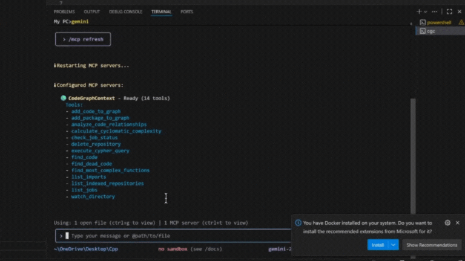

# PlatformContextGraph

**Code-to-cloud context graph for AI development, debugging, and re-architecture.**

<p align="center">
  <a href="LICENSE">
    
  </a>
  <a href="https://github.com/platformcontext/platform-context-graph/actions/workflows/test.yml">
    
  </a>
  <a href="docs/">
    
  </a>
  
  
  
  
</p>

PlatformContextGraph gives AI systems and engineers a fast, queryable map of source code, dependencies, infrastructure, workloads, and deployment topology. It can answer code-only questions, trace cloud resources back to repos and code, and power AI-assisted engineering with a shared graph model exposed through the CLI, MCP, and HTTP API.

Repository identity is remote-first when a git remote exists, so deployed PCG instances can return portable repository metadata and repo-relative file references instead of assuming the server checkout path exists on the caller's machine.

When Postgres is configured, PCG also keeps indexed file content and cached entity snippets for portable source retrieval and content search. Deployed API runtimes serve content from the content store directly and report unavailable content until the ingester has written it.

## Quick Navigation

- [Quick Start](#quick-start)
- [What It Does](#what-it-does)
- [Experience PCG](#experience-pcg)
- [Interfaces](#interfaces)
- [Deploy](#deploy)
- [Documentation](#documentation)
- [Acknowledgment](#acknowledgment)

## What It Does

- indexes code across repositories and languages
- maps Terraform, Helm, Kubernetes, Argo CD, Crossplane, and related deployment assets
- traces relationships from workloads and runtime resources back to infrastructure and code
- exposes the same core query model through CLI, MCP, and an OpenAPI-backed HTTP API
- retrieves source content through `repo_id + relative_path` and `entity_id` instead of raw server filesystem paths

## Experience PCG

### Index code and infrastructure



### Power AI workflows with graph context


## Quick Start

Install the CLI tool:

```bash
uv tool install platform-context-graph
```

Or run from source:

```bash
uv sync
uv run pcg --help
```

Index a repository:

```bash
pcg index .
```

Run a code-only query:

```bash
pcg analyze callers process_payment
```

Start MCP:

```bash
pcg mcp start
```

Start the combined HTTP API + MCP service:

```bash
pcg serve start --host 0.0.0.0 --port 8080
```

## Interfaces

### CLI

Use `pcg` locally for indexing, repository management, search, and graph-backed analysis.

### MCP

Connect PCG to AI development tools so natural-language questions resolve against real code and infrastructure context.

### HTTP API

Use the OpenAPI-backed API for service-to-service automation, internal tools, and agent frameworks that need a stable contract.

### Deployable Service

Run PCG as a networked service with a stateless API runtime, a stateful repository ingester, external Neo4j, and external Postgres.

## Deploy

Minimal Kubernetes manifests:

```bash
kubectl apply -k deploy/manifests/minimal
```

Helm:

```bash
helm install platform-context-graph ./deploy/helm/platform-context-graph
```

Public distribution targets:

- Docker image: `ghcr.io/platformcontext/platform-context-graph`
- OCI Helm chart: `oci://ghcr.io/platformcontext/charts/platform-context-graph`

The chart is designed for the production shape used in EKS:

- external Neo4j
- external Postgres for indexed content retrieval and search
- API `Deployment` for HTTP + MCP
- repository ingester `StatefulSet` with attached workspace storage
- repo rediscovery filtered by exact/regex repository rules over normalized `org/repo` identifiers
- flexible exposure through `ClusterIP`, `Ingress`, `HTTPRoute`, or `LoadBalancer`

For local end-to-end testing:

```bash
docker compose up --build
```

## Documentation

- Docs site source: [docs/](docs/)
- Quickstart: [docs/docs/getting-started/quickstart.md](docs/docs/getting-started/quickstart.md)
- MCP Guide: [docs/docs/guides/mcp-guide.md](docs/docs/guides/mcp-guide.md)
- HTTP API: [docs/docs/reference/http-api.md](docs/docs/reference/http-api.md)
- Deployment Overview: [docs/docs/deployment/overview.md](docs/docs/deployment/overview.md)

## Acknowledgment

PlatformContextGraph builds on the original [CodeGraphContext](https://github.com/CodeGraphContext/CodeGraphContext) project by [Shashank Shekhar Singh](https://github.com/Shashankss1205) and its contributors. Their work established the foundation this repository started from.

See [ACKNOWLEDGMENTS.md](ACKNOWLEDGMENTS.md) for the attribution note.
