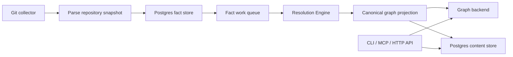

# PlatformContextGraph

**A self-hosted code-to-cloud context graph for engineering teams and AI systems.**

<p align="center">
  <a href="LICENSE">
    
  </a>
  <a href="https://github.com/platformcontext/platform-context-graph/actions/workflows/test.yml">
    
  </a>
  <a href="docs/">
    
  </a>
  
  
  
  
</p>

PlatformContextGraph (PCG) gives your team one living map across source code,
Terraform, Helm, Kubernetes, Argo CD, Crossplane, and runtime topology. It turns
the context that usually lives across repos, dashboards, and senior engineers'
heads into something your CLI, API, and AI assistants can query.

PCG is useful locally, but it shines when you deploy it to Kubernetes. Then the
same MCP server can serve every engineer in the company. Your assistants stop
guessing from one checkout and start asking a shared graph that knows code,
deployment paths, workloads, and infrastructure.

## Why Teams Use PCG

PCG is for the questions that do not fit inside one repository.

What that looks like in practice:

- **Software engineers**
  - "Who calls `process_payment` across all indexed repos?"
  - "What breaks if I change this shared client or interface?"
- **DevOps and platform engineers**
  - "What deploys this service, and which repos feed that deployment path?"
  - "What infrastructure does this workload depend on?"
- **SRE and on-call**
  - "What other workloads share this database or queue?"
  - "Is the backlog growing because of parsing, Postgres, or graph projection?"
- **AI-assisted development**
  - "Trace this cloud resource back to the code that defines it."
  - "Explain how these two services are connected."

What PCG brings together:

- **Company-wide MCP context:** deploy PCG once, then let every MCP-compatible
  assistant query the same graph.
- **Code-to-cloud tracing:** follow a function, workload, deployment, or cloud
  resource back to the repos that define it.
- **Blast-radius analysis:** see likely callers, dependencies, shared
  infrastructure, and environment differences before you merge.
- **Shared platform memory:** API, MCP, CLI, ingester, reducer, Postgres, and
  graph backend run as one service shape instead of one-off local scripts.
- **Real graph-backend choice:** NornicDB is the default first-class backend,
  and Neo4j is supported for teams that already run Neo4j or need its tooling.
  Both use PCG's shared Cypher/Bolt graph contract.
- **Operator visibility:** facts-first indexing, queues, status, metrics,
  traces, and logs give platform teams something they can run and debug.

Starter examples are collected in [Starter Prompts](docs/docs/guides/starter-prompts.md). The highest-value prompts explicitly ask PCG to scan all related repositories, deployment sources, and indexed documentation before answering.

PCG exposes the same graph through:

- a local CLI for indexing and analysis
- MCP for AI development tools
- an HTTP API for automation and internal platforms
- a deployable service shape for continuous indexing and shared use

## Quick Start

Pick the path that matches what you are trying to do.

| Goal | Start here |
| --- | --- |
| Run one workspace with local binaries | [Local Binaries](docs/docs/run-locally/local-binaries.md) |
| Run the full stack on your laptop | [Docker Compose](docs/docs/run-locally/docker-compose.md) |
| Connect an assistant to PCG | [Connect MCP](docs/docs/mcp/index.md) |
| Give the company a shared MCP graph | [Deploy to Kubernetes](docs/docs/deploy/kubernetes/index.md) |

For the fastest full-stack local run, use Docker Compose:

```bash
docker compose up --build
```

The default Compose stack runs NornicDB, Postgres, API, MCP server, ingester,
reducer, and bootstrap indexer. To run the same stack with Neo4j:

```bash
docker compose -f docker-compose.neo4j.yml up --build
```

Telemetry is opt-in for local developer and DevOps testing. Add the telemetry
overlay when you want an OpenTelemetry collector and Jaeger on your laptop:

```bash
docker compose -f docker-compose.yaml -f docker-compose.telemetry.yml up --build
```

For the CLI only, use Go's install command:

```bash
go install github.com/platformcontext/platform-context-graph/go/cmd/pcg@latest
```

For local owner development, install the full PCG-prefixed runtime binary set
from a checkout:

```bash
./scripts/install-local-binaries.sh
```

Then install the managed NornicDB sidecar and start a local workspace owner:

```bash
pcg install nornicdb
pcg graph start --workspace-root "$PWD"
```

PCG officially supports NornicDB and Neo4j for graph storage. NornicDB is the
default first-class backend. Neo4j is the first-class compatibility path for
teams with existing Neo4j operations, licenses, dashboards, or graph tooling.
Both backends run the same PCG graph model through the shared Cypher/Bolt
contract; backend-specific code stays in narrow wiring, schema, retry, and
dialect seams. Postgres stores relational state, facts, queues, status,
content, and recovery data.

## Where PCG Shines

The local workflows are great for development and proofs. The Kubernetes
deployment is where PCG becomes a shared platform.

Once PCG is running in-cluster, teams get:

- one MCP endpoint for company-wide AI tooling
- one API for internal automation and platform workflows
- continuous indexing instead of one person's local snapshot
- shared graph truth for code, deploy paths, workloads, and infrastructure
- a graph backend choice: run the default NornicDB path or choose Neo4j when
  your platform already standardizes on it
- operator-grade health checks, telemetry, and recovery state

That turns PCG from "a useful local graph" into a source of context your whole
engineering org can use.

## How It Works

PCG now uses a facts-first indexing flow for deployed Git ingestion.



In practice, that means:

1. the ingester discovers repositories and parses a snapshot
2. repository, file, and entity facts are written to Postgres
3. the resolution-engine claims the queued work
4. canonical graph, relationships, workloads, and platform edges are projected
5. API, MCP, and CLI analysis surfaces read the resulting graph and content

## Runtime Model

The deployed platform has five long-running runtimes plus two one-shot helpers:

| Runtime | What it owns | Default command |
| --- | --- | --- |
| DB Migrate | Postgres + graph schema DDL before the long-running workloads start | `/usr/local/bin/pcg-bootstrap-data-plane` |
| API | HTTP API, graph and content reads, admin endpoints | `pcg api start --host 0.0.0.0 --port 8080` |
| MCP Server | MCP transport plus mounted query routes | `pcg mcp start` |
| Ingester | repo sync, workspace ownership, parsing, fact emission | `/usr/local/bin/pcg-ingester` |
| Workflow Coordinator | trigger intake, claims, completeness, and dark-mode control-plane validation | `/usr/local/bin/pcg-workflow-coordinator` |
| Resolution Engine | queue draining, fact loading, projection, retries, recovery | `/usr/local/bin/pcg-reducer` |
| Bootstrap Index | initial one-shot indexing before steady-state sync | `/usr/local/bin/pcg-bootstrap-index` |

The Workflow Coordinator is gated behind the `workflow-coordinator` Docker
Compose profile and is off in the default local stack.

See [Service Runtimes](docs/docs/deployment/service-runtimes.md) for the
complete runtime contract.

## Observability

PCG ships with first-class observability for operators and performance work:

- OTLP metrics and traces
- JSON logs
- direct Prometheus-format `/metrics` endpoints per runtime
- optional Kubernetes `ServiceMonitor` resources for API, MCP, ingester,
  workflow-coordinator, and resolution-engine

In local Compose runs, you can inspect the runtime scrape endpoints directly:

- API: `http://localhost:19464/metrics`
- Ingester: `http://localhost:19465/metrics`
- Resolution Engine: `http://localhost:19466/metrics`
- MCP Server: `http://localhost:19468/metrics`
- Workflow Coordinator: `http://localhost:19469/metrics` (enabled via compose profile)

See:

- [Telemetry Overview](docs/docs/reference/telemetry/index.md)
- [Telemetry Metrics](docs/docs/reference/telemetry/metrics.md)
- [Docker Compose](docs/docs/deployment/docker-compose.md)
- [Helm Deployment](docs/docs/deployment/helm.md)

## What You Can Ask

Examples:

- "Who calls `process_payment` across all indexed repos?"
- "What infrastructure does this service depend on?"
- "Trace this resource back to the code that defines it."
- "What breaks if I change this Terraform module?"
- "How does prod differ from staging for this workload?"

Role-based prompt sets and follow-up patterns live in
[Starter Prompts](docs/docs/guides/starter-prompts.md).

## Quick Navigation

- [Run locally](docs/docs/run-locally/index.md): local binaries or Docker Compose
- [Use PCG](docs/docs/use/index.md): index repos and ask code or infrastructure questions
- [Connect MCP](docs/docs/mcp/index.md): wire PCG into AI tools
- [Deploy to Kubernetes](docs/docs/deploy/kubernetes/index.md): run PCG for a team
- [Operate PCG](docs/docs/operate/index.md): health checks, telemetry, troubleshooting
- [Understand PCG](docs/docs/understand/index.md): architecture and graph model

## Documentation Paths

Start with the path that matches what you are doing:

- Start here:
  [Start Here](docs/docs/start-here.md)
- Local setup:
  [Run Locally](docs/docs/run-locally/index.md)
- AI tooling:
  [Connect MCP](docs/docs/mcp/index.md)
- Prompt cookbook:
  [Starter Prompts](docs/docs/guides/starter-prompts.md)
- Kubernetes:
  [Deploy to Kubernetes](docs/docs/deploy/kubernetes/index.md)
- Operations:
  [Operate PCG](docs/docs/operate/index.md)
- Architecture:
  [Understand PCG](docs/docs/understand/index.md)
- Verification:
  [Local Testing Runbook](docs/docs/reference/local-testing.md)

## Verification

Canonical Go test gates — run these before opening a pull request. The full
matrix lives in [Local Testing Runbook](docs/docs/reference/local-testing.md).

```bash
cd go && go test ./cmd/pcg ./cmd/api ./cmd/mcp-server ./internal/query ./internal/mcp -count=1
cd go && go test ./internal/parser ./internal/collector/discovery ./internal/content/shape ./internal/collector -count=1
cd go && go test ./internal/terraformschema ./internal/relationships -count=1
cd go && go test ./cmd/bootstrap-index ./cmd/ingester ./cmd/reducer ./internal/runtime ./internal/status ./internal/storage/postgres -count=1
uv run --with mkdocs --with mkdocs-material --with pymdown-extensions \
  mkdocs build --strict --clean --config-file docs/mkdocs.yml
```

## Project Notes

PCG is self-hosted and does not require outbound vendor telemetry. When
observability is enabled, it uses your configured OTLP and Prometheus targets.
