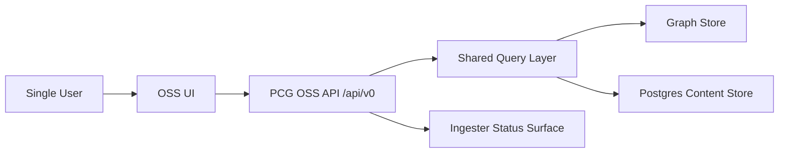

# OSS UI Overview

## Purpose

The OSS UI is the single-user local/self-hosted product surface for Platform
Context Graph. It is intentionally engine-focused and must remain independent
from enterprise concepts such as OIDC, organizations, workspaces, RBAC, and
audit.

## Architectural Position

- UI talks directly to the OSS PCG API.
- UI is a client of the existing `/api/v0/*` contract.
- UI may reuse ideas from the visualization server and VS Code extension, but it
  should converge on one coherent self-hosted product experience.

## Responsibilities

- search and resolve entities
- present repository, workload, service, and resource detail views
- surface trace, blast radius, impact, and environment compare results
- visualize graph relationships
- show ingestion and status information
- provide local saved query shortcuts

## Non-Responsibilities

- identity and login management
- tenant or workspace isolation
- access control
- audit
- source onboarding
- service-account management
- enterprise token management

## High-Level Shape

## Suggested Internal Modules

- app shell and routing
- search and resolve
- detail pages
- impact and trace
- graph visualization
- status and health
- local saved views and presets

## Relationship To Enterprise

The OSS UI is the functional base for the enterprise UI, not the enterprise UI
itself. Enterprise should learn from:

- page layout patterns
- search and drill-down flows
- graph and result visualization patterns

Enterprise should add separately:

- auth/session
- workspace model
- admin and onboarding flows
- governed multi-user behavior
