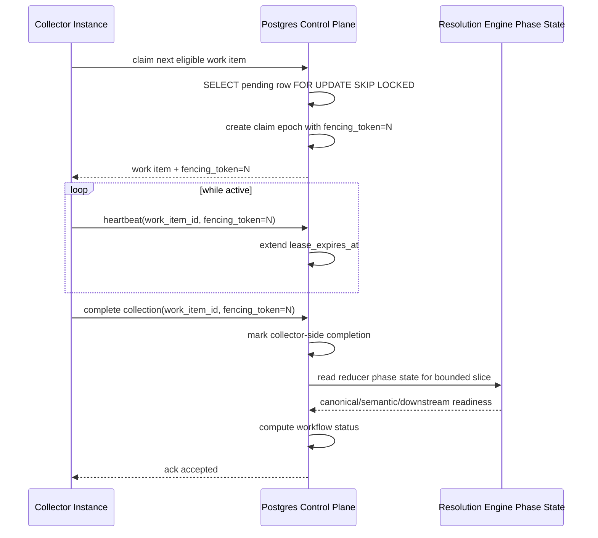
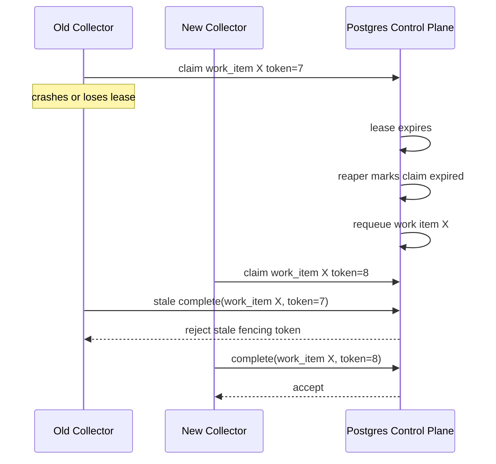

# ADR: Workflow Coordinator Claiming, Fencing, And Convergence Contract

**Date:** 2026-04-20
**Status:** Accepted
**Authors:** Allen Sanabria
**Deciders:** Platform Engineering
**Related:** `2026-04-20-workflow-coordinator-and-multi-collector-runtime-contract.md`

---

## Status Review (2026-05-03)

**Current disposition:** Accepted; coordinator claim contract implemented for
the guarded proof path.

Claim tables, fencing operations, claim issuance, first-class claim release,
weighted family fairness, exact-tuple reconciliation, and a claim-aware Git
collector runner now exist. Work items carry `source_system`,
`acceptance_unit_id`, and `source_run_id` with `scope_id` and `generation_id`.
Workflow reconciliation joins reducer-published phase truth on that exact tuple
before counting a phase as published for a work item.

The Postgres workflow-control migration now backfills those identity fields for
upgraded rows: `source_system` comes from `collector_kind`,
`acceptance_unit_id` comes from `scope_id`, and `source_run_id` comes from
`generation_id`. Rows that predate required generation identity are marked
terminal with `legacy_missing_generation_identity` instead of being claimed
under an invented active run.

Deployment promotion is still guarded. Compose has an explicit active proof
path, but Helm remains dark-only until the remote full-corpus proof, API/MCP
truth checks, and evidence validation are clean. Webhook intake/back-pressure
remains a separate follow-up because it is trigger intake, not the Git claim
contract.

## Context

The workflow coordinator ADR establishes the control-plane shape for a
multi-collector platform:

- a long-running `workflow-coordinator`
- separate collector families
- one shared `resolution-engine`
- bootstrap as an action rather than a permanent service identity

That ADR intentionally chooses the architecture. This companion ADR locks the
concurrency and completion contract that must exist **before** coordinator
claims own production work.

This is not optional design polish. It is a correctness gate.

The platform already has concrete evidence that phase ordering and completion
semantics cannot be left implicit:

- the `graph_projection_phase_state` contract exists because reducer work could
  not safely infer graph readiness from accepted generation alone
- `canonical_nodes_committed` and `semantic_nodes_committed` already model
  reducer-owned downstream truth for bounded slices
- previous workload materialization and second-pass convergence bugs came from
  treating "upstream work acknowledged" as if it meant "the system is done"

The coordinator must not repeat that class of error at the orchestration layer.

### Governing Priority Order

This ADR applies the repo-wide priority order directly:

1. **Accuracy first**
2. **Performance second**
3. **Reliability third**

That means:

- claim ownership must remain correct under expiry and retry
- stale workers must not be able to overwrite newer owners
- a run must not report complete before reducer convergence is actually true
- fairness and throughput optimization must not weaken ownership correctness

---

## Problem Statement

The platform needs an exact answer to these questions:

1. How is work claimed durably?
2. How does the system prevent split-brain when a lease expires?
3. How does a crashed collector release work without relying on process-local
   memory?
4. How does the system prevent one collector family backlog from starving
   another indefinitely?
5. How does the coordinator determine that a run is truly complete when
   collection, projection, and reducer convergence happen in different stages?

Without an explicit contract, the platform will drift into one or more unsafe
states:

- duplicate collection after lease expiry
- stale worker completion overwriting a newer owner
- unbounded requeue churn
- family starvation under skewed backlogs
- false "complete" signals while second-pass reducer work is still running

---

## Decision

### Adopt Durable Row-Backed Claims With Monotonic Fencing Tokens

The coordinator should use **durable Postgres-backed claim rows** as the
authoritative ownership contract.

It should not use process-local memory, optimistic in-memory ownership, or
advisory locks as the primary source of truth.

Each claim epoch must carry:

- `claim_id`
- `work_item_id`
- `collector_instance_id`
- `owner_id`
- `fencing_token`
- `claimed_at`
- `lease_expires_at`
- `last_heartbeat_at`

### Use `FOR UPDATE SKIP LOCKED`-Style Issuance For Claim Selection

The coordinator should issue claims through bounded row-backed selection using
Postgres row locking semantics.

The initial design should prefer:

- `SELECT ... FOR UPDATE SKIP LOCKED`
- bounded selection windows
- deterministic ordering
- explicit claim-row updates inside the same transaction

This keeps the contract durable, inspectable, and aligned with the platform’s
existing Postgres-centered control plane.

### Require Fenced Completion, Heartbeat, And Release

Every mutating claim operation must present the current fencing token:

- heartbeat
- completion
- failure
- release

If the token does not match the current durable owner record, the mutation must
be rejected as stale.

This is the core split-brain protection rule.

### Separate Claim Correctness From Fairness

The coordinator should model correctness and fairness independently.

Correctness decides:

- who owns work
- whether a lease is current
- whether a completion is valid

Fairness decides:

- which eligible queue or family gets the next claim opportunity
- how the system avoids indefinite starvation across families or instances

The platform should not bury fairness inside the basic claim row semantics.

### Compute Workflow Completeness From Reducer-Published Downstream Truth

The coordinator must not report a workflow run as complete merely because
collector work items have been acknowledged.

A run is complete only when both are true:

1. collector-side work for the run's bounded slice is complete
2. required downstream projector/reducer phases for that same bounded
   slice are complete, where "same bounded slice" means the FULL
   composite tuple
   `(scope_id, acceptance_unit_id, source_run_id, generation_id,
    keyspace, phase)` — not just `(scope_id, generation_id)`.

The reducer-owned phase state remains authoritative for downstream
convergence. Implementations that compute completeness by joining
`workflow_work_items` to `graph_projection_phase_state` MUST include
`acceptance_unit_id` and `source_run_id` in the join predicate.
This branch tightens `listWorkflowCollectorPhaseCountsQuery` in
`go/internal/storage/postgres/workflow_run_reconciliation.go` so it no longer
joins on only `scope_id` + `generation_id`. That removes the known
false-completion path for concurrent runs that share a scope and generation but
publish reducer truth for different acceptance units or source runs.

---

## Architecture

### Bounded Work Unit

The coordinator should claim bounded work items, not open-ended collector loops.

The minimum durable work identity must include:

- `run_id`
- `collector_instance_id`
- `scope_id`
- `source_system`
- `generation_id`
- `source_run_id`
- `acceptance_unit_id`

The last two (`source_run_id` + `acceptance_unit_id`) are required
because the reducer's canonical convergence truth — the
`graph_projection_phase_state` row — is keyed by
`(scope_id, acceptance_unit_id, source_run_id, generation_id, keyspace, phase)`
(see `go/internal/storage/postgres/graph_projection_phase_state.go`).
Any workflow-completion computation that joins only on
`(scope_id, generation_id)` can attribute another run's reducer
progress to this run, producing false-positive completion signals.
This was called out as a critical-truth bug in review: the
authoritative phase-state primary key MUST be represented 1:1 in the
work identity the coordinator fences against.

If the collector family requires a narrower bounded unit later, it may add
family-local sub-identity fields, but the global contract must still be able to
explain ownership at this level.

### Durable State Model

The control plane should persist at least these records:

#### `workflow_runs`

Owns:

- run identity
- trigger kind
- requested scope set
- status
- created and finished timestamps

#### `workflow_work_items`

Owns:

- one bounded slice of collector work
- collector instance identity
- scope and generation identity
- scheduling state
- fairness bucket metadata
- last completion outcome

#### `workflow_claims`

Owns:

- current or historical ownership epoch
- fencing token
- claim owner
- heartbeat timestamps
- expiry timestamps
- terminal claim result

Historical claim rows are useful because stale-owner incidents and requeue loops
must be diagnosable after the fact.

### Claim State Machine

The work-item lifecycle should be:

1. `pending`
2. `claimed`
3. one of:
   - `completed`
   - `failed_retryable`
   - `failed_terminal`
   - `expired`
4. if retryable or expired:
   - transition back to `pending` with a new claim epoch

The claim epoch lifecycle should be:

1. created with `fencing_token = N`
2. heartbeated while the owner is live
3. either:
   - completed successfully
   - released without failure
   - failed explicitly
   - expired and reaped

Released, expired, and reaped claims must remain queryable for audit and
debugging.

### Sequence: Normal Claim And Completion

### Sequence: Expiry, Reaping, And Stale Completion Rejection

---

## Concurrency Invariants

The following invariants are mandatory:

1. At most one non-expired claim epoch may own a work item at a time.
2. Every ownership change must increment the fencing token monotonically.
3. A stale owner must never be able to heartbeat, complete, fail, or release a
   claim after a newer fencing token exists.
4. Reaping must be derivable entirely from durable timestamps and durable claim
   state, not from process-local memory.
5. A work item may be re-queued only after the prior claim epoch is marked
   terminal or expired.
6. A run may not transition to `complete` while required downstream reducer
   phases remain incomplete for any bounded slice in the run.
7. Claim selection order must be deterministic within each fairness bucket.
8. Fairness policy may influence which queue is examined next, but it may not
   violate fencing or ownership correctness.

---

## Fairness Contract

The platform must prevent indefinite starvation across collector families.

The initial fairness model should be:

1. maintain per-family eligible queues
2. maintain deterministic oldest-first selection within each family
3. schedule family claim attempts using weighted round robin
4. allow per-family weights to be configured explicitly
5. cap consecutive claims for one family before another ready family must be
   reconsidered

This is intentionally simpler than a global priority market.

Why this is the right starting point:

- it keeps family starvation visible
- it avoids one global oldest-first queue being dominated by a single family’s
  deep backlog
- it remains operator-explainable

Fairness applies only across eligible families. If one family has no pending
work, it does not reserve claim slots.

### Family Fairness Versus Instance Fairness

The first hard requirement is family fairness.

Within a family, instance-level scheduling may remain simpler at first so long
as:

- one instance cannot permanently starve another enabled instance
- claim ownership remains visible per instance
- later shard-specific balancing can be added without changing the global claim
  contract

---

## Reducer Convergence And Workflow Completion

### Layered Completion Model

The workflow status model should be layered:

1. `collection_pending`
2. `collection_active`
3. `collection_complete`
4. `reducer_converging`
5. `complete`

The key rule is:

- `collection_complete` is not `complete`

### Downstream Truth Source

The coordinator should compute downstream completion from reducer-published
phase state, not from collector assumptions.

Current authoritative downstream readiness includes at least:

- `canonical_nodes_committed`
- `semantic_nodes_committed`
- any required downstream domain completion for the bounded slice, including
  second-pass domains such as deployment mapping and workload materialization

If the bounded slice for a run requires those downstream domains, the
coordinator must wait for them before reporting final completion.

### Sequence: Run Completion Decision

For each bounded slice in a run:

1. collector-side work is acknowledged
2. coordinator checks required downstream phase rows
3. if any required phase is missing:
   - slice remains `reducer_converging`
4. only when every required phase exists:
   - slice becomes `complete`
5. the run becomes `complete` only when every required slice is complete

This explicitly prevents the "second-pass still pending but run says complete"
class of bugs.

---

## Failure And Recovery Contract

### Retryable Failure

A retryable failure should:

- mark the claim epoch terminal as retryable
- increment retry counters on the work item
- return the work item to `pending`
- preserve bounded-slice identity

### Terminal Failure

A terminal failure should:

- mark the work item terminal
- keep the run incomplete or failed
- surface the failure through coordinator admin/status
- avoid silent auto-requeue loops

### Expiry And Reaping

The reaper should:

- scan for expired non-terminal claims
- mark the expired claim epoch terminal as `expired`
- requeue the associated work item idempotently
- increment an expiry counter visible to operators

The reaper must never delete evidence of expiry before operators can diagnose
it.

---

## Locking Strategy

The initial implementation should use:

- row-backed work-item and claim tables
- `FOR UPDATE SKIP LOCKED`-style bounded claim issuance
- explicit claim-row updates in the same transaction as issuance

This ADR does **not** make advisory locks the authoritative claim model.

Advisory locks may be considered later only if:

- the durable row state remains canonical
- they are used strictly as a local optimization
- they do not become required to explain ownership

This preserves operator truth and restart safety.

---

## Security And Abuse Boundaries

Concurrency design and security overlap in two places:

1. stale-owner protection
2. webhook flood behavior

The minimum security contract is:

- stale owners cannot mutate claims after fencing-token rollover
- webhook delivery identity must support replay rejection
- duplicate webhook deliveries must be idempotent at run-request creation time
- webhook flood pressure must degrade into bounded queued backlog, not
  unbounded claim thrash

---

## Explicit Non-Goals

This ADR does not:

1. define every future collector family’s internal shard model
2. change reducer-owned domain semantics
3. replace the existing reducer phase-state mechanism in this milestone
4. define final UI or dashboard layout
5. optimize for maximum throughput before correctness and fairness are proven

---

## Consequences

### Positive

- coordinator implementation gets a real correctness gate
- split-brain completion bugs become mechanically preventable
- fairness becomes explicit instead of accidental
- reducer-convergence truth remains authoritative
- operators gain auditable claim history rather than opaque background loops

### Negative

- the coordinator substrate is now a real concurrency system, not a simple job
  table
- more schema and telemetry work is required up front
- implementation must include reaper, heartbeat, fencing, and completion logic
  before production cutover

### Risks

- if fairness weights are chosen poorly, backlog latency can still skew badly
- if lease TTL is too short, healthy collectors may churn claims unnecessarily
- if lease TTL is too long, recovery from crashes will be slow

Those are tuning risks, not reasons to weaken the ownership contract.

---

## Recommendation

No workflow-coordinator implementation PR should land production claim
ownership unless it satisfies this ADR’s contract for:

- durable row-backed claims
- monotonic fencing tokens
- heartbeat and expiry
- explicit reaping
- family fairness
- reducer-driven completion semantics

This ADR is therefore the concurrency gate for the coordinator architecture,
not a post-implementation cleanup note.
