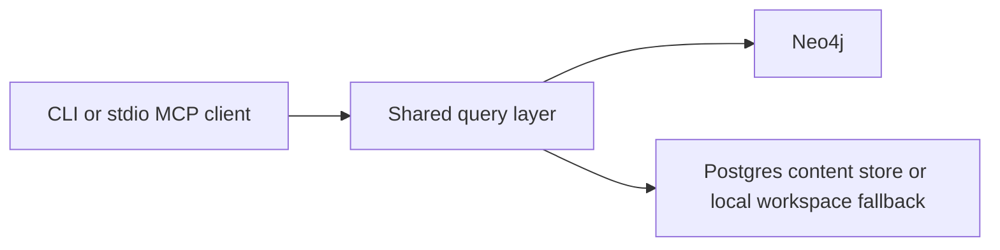
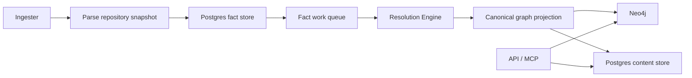
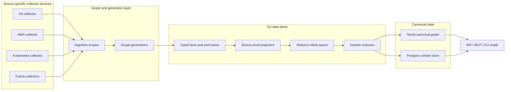
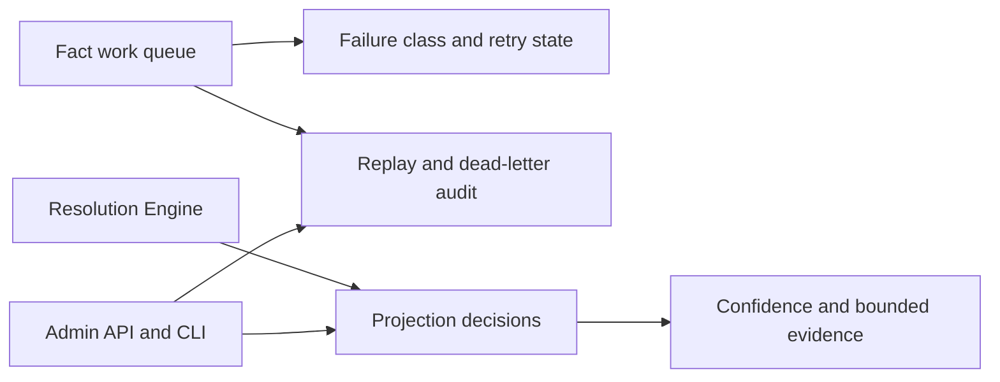

# System Architecture

PlatformContextGraph connects source code, infrastructure definitions, workload
topology, and graph-backed query surfaces in one model.

It runs in two practical modes:

- **local mode** for CLI and stdio MCP workflows
- **deployed mode** for the shared API, ingester, and resolution-engine

Phase 1 clarified package ownership, Phase 2 switched Git indexing to a
facts-first write path, and Phase 3 added durable recovery and explainability on
top of that runtime.

The current write-domain architecture keeps repo-local graph refresh parallel
while routing shared platform and dependency mutation through durable,
partitioned follow-up domains keyed by stable lock identifiers. That preserves
commit-worker throughput without letting concurrent writers fight over the same
dense shared nodes.

That runtime is the historical baseline for the current branch. The next
architecture phase keeps the same correctness goals, but it moves the write
path into a schema-first Go data plane built around scoped ingestion, snapshot
generations, source-local projectors, and shared reducers. The goal is to let
Git, AWS, Kubernetes, SQL, and future collectors all feed one canonical
knowledge graph without inheriting Git-shaped storage or finalization
assumptions. Each collector family owns its own service boundary and emits the
same shared fact contract, so the platform can scale by source instead of
forcing every update through one generic ingester.

The rewrite also favors incremental ingestion and reconciliation over full
re-indexing. Normal updates should touch the affected scope or shard, produce a
new generation, and reconcile only the changed unit of truth. Full rebuilds
remain available as explicit bootstrap or recovery operations.

For new source families, use the
[Collector Authoring Guide](guides/collector-authoring.md) as the guardrail for
where collector logic stops and projector or reducer ownership begins.

That split means steady-state health needs two different backlog views:

- the fact work queue tells you whether repository projection work is arriving,
  waiting, retrying, or dead-lettering
- the shared projection backlog tells you whether authoritative shared follow-up
  domains are draining after repo-local projection finishes

## Local Request Path

## Deployed Data Plane

## Target Data Plane

## Target Traversal Map

This is the required end-to-end view for one bounded work unit in the rewrite
architecture.

| Stage | Owner | Work unit | Boundary type | Retry owner | Primary health signals |
| --- | --- | --- | --- | --- | --- |
| Source observation | source-specific collector service | scope candidate or source shard | in-process | collector | collector latency, discovery backlog, source error rate |
| Scope assignment | source-specific collector service | `ingestion_scope` + `scope_generation` | durable write | collector | scope create/update rate, generation status, duplicate suppression |
| Fact emission | source-specific collector service | facts for one scope generation | durable write | collector | fact emit latency, fact count, Postgres pool saturation |
| Source-local projection | projector | one claimed scope generation | durable queue claim | projector | queue depth, oldest age, claim latency, projector duration |
| Reducer-intent emission | projector | reducer intents for one generation | durable write | projector | intent count, enqueue latency, pending intents by domain |
| Canonical reduction | reducer | one reducer intent | durable queue claim | reducer | reducer queue age, reducer duration, retry and dead-letter counts |
| Canonical persistence | reducer | one canonical write batch | durable write | reducer | canonical write latency, Neo4j/Postgres pool pressure, idempotent replay counts |
| Query and MCP reads | API / MCP | canonical graph or content read | request/response | API | request latency, query latency, error rate |

## Resiliency And Concurrency Model

The rewrite uses concurrency in two different ways.

### In-Process

Inside one service:

- use bounded worker pools for parser and normalization work
- use channels when they make producer, worker, cancellation, and result flow
  clearer
- separate CPU-bound and I/O-bound concurrency controls
- keep worker counts and queue capacities configurable

### Cross-Service

Across service boundaries:

- use durable queues and leases, not channels
- keep work units replayable and idempotent
- surface backlog, oldest age, retries, and failures in the operator view
- let backpressure slow producers before correctness degrades

This distinction is what lets PCG leverage multiple processors while still
remaining resilient under retries, partial failure, and large cloud or
Kubernetes inventories.

Every long-running service should also expose the shared admin contract:

- `GET` and `HEAD` `/healthz`
- `GET` and `HEAD` `/readyz`
- `GET` and `HEAD` `/admin/status`
- `/metrics` when the runtime exposes metrics

The status surface should come from the same report model whether the operator
is using the CLI or the HTTP endpoint.

## Deployed Control Plane

## Component Responsibilities

| Component | Responsibility |
| --- | --- |
| CLI | Local indexing, analysis, setup, and runtime management |
| MCP | AI-oriented query surface over the same shared model |
| HTTP API | OpenAPI-backed automation surface plus admin endpoints |
| Query layer | Shared read model used by CLI, MCP, and HTTP |
| Collectors | Source-specific discovery, normalization, and ingestion helpers |
| Parsers | Language and IaC parsing, capability specs, and SCIP helpers |
| Facts layer | Typed facts, Postgres fact storage, queue state, recovery state |
| Resolution | Fact-to-graph projection, workload/platform materialization, decisions |
| Graph layer | Canonical schema and persistence helpers for graph writes |
| Content store | Postgres-backed file and entity content cache |
| Observability | OTEL metrics, traces, and structured logs across runtimes |

## Facts-First Flow

1. The source-specific collector discovers a bounded scope and parses a source snapshot.
2. Repository, file, and entity facts are written to Postgres.
3. A fact work item is enqueued for that snapshot.
4. The resolution-engine, or the collector’s transitional inline commit path,
   claims the work item and loads the stored facts.
5. Repo-local projection refreshes repository, file, entity, relationship,
   workload, and repo-owned platform state in Neo4j.
6. Authoritative shared platform and dependency writes are emitted as durable
   follow-up domains and drained through partitioned workers keyed by stable
   lock domains.
7. The same projection flow dual-writes file and entity content into Postgres.
8. Query surfaces continue reading the canonical graph and content store.

The legacy Python snapshot/coordinator runtime stack has now been deleted from
the branch. The remaining conversion work is centered on parser-matrix
completion plus the last residual Python helper modules that still need Go or
deletion treatment outside the normal runtime hot path.

That is the current operating baseline. In the target
architecture:

- collectors own source discovery and raw normalization
- the Go data plane owns scoped facts, queueing, and snapshot generations
- source-local projectors own repository-, account-, or cluster-scoped graph
  materialization
- reducers own shared cross-source correlation
- the API, MCP, and CLI stay read-only over canonical state

The remaining Python parser and helper paths are temporary conversion debt
only. They are not the architectural landing zone for AWS, Kubernetes,
SQL/data, or any other future collector.

Status surfaces can report `awaiting_shared_projection` while authoritative
shared follow-up remains pending for an accepted repository generation.

The observability surface mirrors that split:

- `pcg_fact_queue_depth` and `pcg_fact_queue_oldest_age_seconds` describe the
  fact work queue
- `pcg_shared_projection_pending_intents` and
  `pcg_shared_projection_oldest_pending_age_seconds` describe authoritative
  shared follow-up backlog by projection domain

The current deterministic tuning harness gives us a safe interpretation model
for those gauges:

- move partition count first when shared backlog is accumulating, because
  better lock-domain spread lowers drain rounds before increasing per-round
  write volume
- use batch-limit increases second, once partitioning has already reduced drain
  rounds and the remaining backlog is tail work rather than lock contention

That keeps the architecture moving forward with parallelism while preserving the
phase-1 goal of reducing dense-node conflict on shared writes.

## Related Rewrite Records

The Go data-plane rewrite has a locked decision set that complements this public
architecture page:

- [Architecture Decision Records](adrs/index.md)
- [Go Data Plane in a Monorepo](adrs/2026-04-12-go-data-plane-monorepo.md)
- [Source-Specific Ingestors And Shared Fact Contract](adrs/2026-04-12-source-specific-ingestors-and-shared-fact-contract.md)
- [Scope-First Ingestion](adrs/2026-04-12-scope-first-ingestion.md)
- [Incremental Ingestion And Reconciliation](adrs/2026-04-12-incremental-ingestion-and-reconciliation.md)
- [Resolution Owns Cross-Domain Truth](adrs/2026-04-12-resolution-owns-cross-domain-truth.md)
- [Reducer Intent Architecture](adrs/2026-04-12-reducer-intent-architecture.md)
- [Service Admin And Observability Contract](adrs/2026-04-12-service-admin-and-observability-contract.md)

## Recovery And Explainability

Phase 3 keeps more operational meaning in Postgres instead of only in logs:

- work items store durable failure class, failure stage, and retry disposition
- replay actions are recorded as replay-event rows
- backfill requests are stored durably
- projection decisions store confidence, reasoning, and bounded evidence

That lets operators answer:

- what failed
- whether it was retryable or terminal
- what was replayed or dead-lettered
- why a relationship, workload, or platform inference was accepted

## Runtime Ownership

| Runtime | Owns |
| --- | --- |
| API | HTTP and MCP serving, graph reads, content reads, admin surface |
| Ingester | repo sync, parsing, fact emission, workspace ownership |
| Resolution Engine | queue draining, projection, retries, replay, recovery |
| Bootstrap Index | one-shot initial indexing in local/full-stack workflows |

Target-state ownership after the rewrite:

| Runtime | Owns |
| --- | --- |
| Collector services | Source-specific discovery, incremental refresh, and normalized fact emission |
| Go scope layer | Ingestion scopes, scope generations, and change-unit routing |
| Go projector services | Source-local graph materialization |
| Go reducer services | Cross-source canonical correlation and shared graph writes |
| API | HTTP and MCP serving, graph reads, content reads, admin surface |
| Bootstrap Index | One-shot initial indexing and replay orchestration |

### Current Implementation Status

The Go data plane owns the full write path for the following domains:

| Component | Go Status | Python Status |
| --- | --- | --- |
| Projector stages (entities, files, relationships, workloads) | Implemented | Pending deletion |
| Projection decision recording | Implemented | Pending deletion |
| Failure classification | Implemented | Pending deletion |
| Reducer: workload identity | Implemented | Pending deletion |
| Reducer: cloud asset resolution | Implemented | Pending deletion |
| Reducer: deployment mapping / platform materialization | Implemented | Pending deletion |
| Reducer: workload materialization | Implemented | Pending deletion |
| Shared projection (platform_infra, repo_dependency, workload_dependency) | Implemented | Pending deletion |
| Recovery (replay, refinalize) | Implemented | Deleted |
| Status request lifecycle (scan, reindex) | Implemented | Pending deletion |
| Native parser platform | Implemented (~85%) | Still active (collector bridge) |
| Native collector selection and snapshot | Pending (Chunk 2) | Still active |

The remaining migration work is native collector integration (Chunk 2) and
deletion of the 85+ Python write-plane modules that Go now owns.

The content store is owned by the projection path, not by the raw parser.
Source-specific collectors emit facts; the resolution-engine turns those facts
into canonical graph and content state.

In the rewritten data plane, the resolution-engine is the projection and
reduction runtime, not the place where parser, collector, or source-specific
logic keeps accumulating.

## Observability Model

Each primary runtime has a distinct telemetry surface:

- **API**: HTTP/MCP latency, error rate, graph query latency
- **Ingester**: repo queue wait, parse timing, fact emission timing, workspace
  pressure
- **Resolution Engine**: queue depth and age, claim latency, projection stage
  timing, retries, dead letters, decision volume, shared follow-up backlog
- **Facts layer**: fact-store and queue SQL latency, row volume, pool
  saturation, backlog

Operationally, use metrics first to decide whether the bottleneck is still in
the fact queue or has moved into shared follow-up. Then use traces to inspect
the slow path and logs to recover the exact repository, run, or generation
context.

Every runtime should report health, readiness, and status through the shared
admin contract so operators do not need a different probe model for each
service.

See:

- [Telemetry Overview](reference/telemetry/index.md)
- [Service Runtimes](deployment/service-runtimes.md)
- [Source Layout](reference/source-layout.md)
