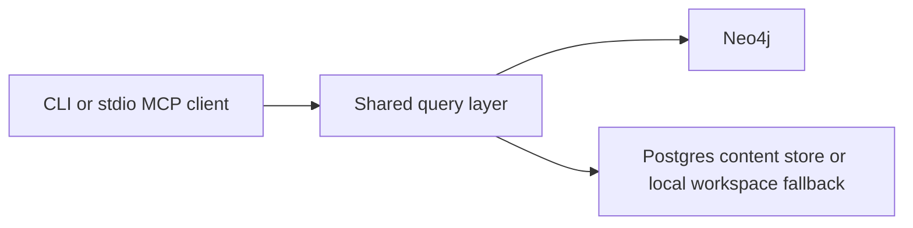
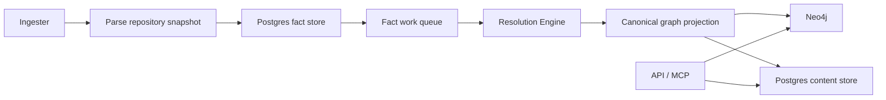
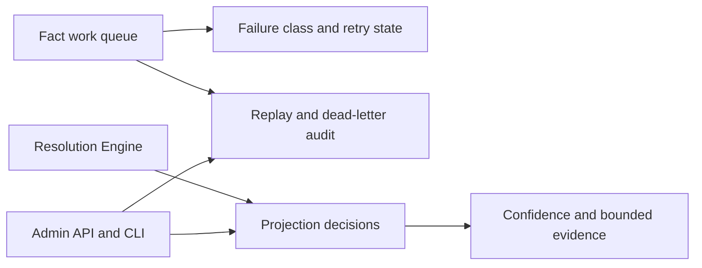

# System Architecture

PlatformContextGraph connects source code, infrastructure definitions, workload
topology, and graph-backed query surfaces in one model.

It runs in two practical modes:

- **local mode** for CLI and stdio MCP workflows
- **deployed mode** for the shared API, ingester, and resolution-engine

Phase 1 clarified package ownership, Phase 2 switched Git indexing to a
facts-first write path, and Phase 3 added durable recovery and explainability on
top of that runtime.

The current write-domain architecture keeps repo-local graph refresh parallel
while routing shared platform and dependency mutation through durable,
partitioned follow-up domains keyed by stable lock identifiers. That preserves
commit-worker throughput without letting concurrent writers fight over the same
dense shared nodes.

That split means steady-state health needs two different backlog views:

- the fact work queue tells you whether repository projection work is arriving,
  waiting, retrying, or dead-lettering
- the shared projection backlog tells you whether authoritative shared follow-up
  domains are draining after repo-local projection finishes

## Local Request Path

## Deployed Data Plane

## Deployed Control Plane

## Component Responsibilities

| Component | Responsibility |
| --- | --- |
| CLI | Local indexing, analysis, setup, and runtime management |
| MCP | AI-oriented query surface over the same shared model |
| HTTP API | OpenAPI-backed automation surface plus admin endpoints |
| Query layer | Shared read model used by CLI, MCP, and HTTP |
| Collectors | Source-specific discovery and ingestion helpers |
| Parsers | Language and IaC parsing, capability specs, and SCIP helpers |
| Facts layer | Typed facts, Postgres fact storage, queue state, recovery state |
| Resolution | Fact-to-graph projection, workload/platform materialization, decisions |
| Graph layer | Canonical schema and persistence helpers for graph writes |
| Content store | Postgres-backed file and entity content cache |
| Observability | OTEL metrics, traces, and structured logs across runtimes |

## Facts-First Flow

1. The ingester discovers repositories and parses a repository snapshot.
2. Repository, file, and entity facts are written to Postgres.
3. A fact work item is enqueued for that snapshot.
4. The resolution-engine, or the ingester’s inline facts-first commit path,
   claims the work item and loads the stored facts.
5. Repo-local projection refreshes repository, file, entity, relationship,
   workload, and repo-owned platform state in Neo4j.
6. Authoritative shared platform and dependency writes are emitted as durable
   follow-up domains and drained through partitioned workers keyed by stable
   lock domains.
7. The same projection flow dual-writes file and entity content into Postgres.
8. Query surfaces continue reading the canonical graph and content store.

For the current Git cutover, the indexing coordinator can still drive the same
resolution path in-process so one indexing run completes deterministically even
without a separate runtime hop.

Status surfaces can report `awaiting_shared_projection` while authoritative
shared follow-up remains pending for an accepted repository generation.

The observability surface mirrors that split:

- `pcg_fact_queue_depth` and `pcg_fact_queue_oldest_age_seconds` describe the
  fact work queue
- `pcg_shared_projection_pending_intents` and
  `pcg_shared_projection_oldest_pending_age_seconds` describe authoritative
  shared follow-up backlog by projection domain

## Recovery And Explainability

Phase 3 keeps more operational meaning in Postgres instead of only in logs:

- work items store durable failure class, failure stage, and retry disposition
- replay actions are recorded as replay-event rows
- backfill requests are stored durably
- projection decisions store confidence, reasoning, and bounded evidence

That lets operators answer:

- what failed
- whether it was retryable or terminal
- what was replayed or dead-lettered
- why a relationship, workload, or platform inference was accepted

## Runtime Ownership

| Runtime | Owns |
| --- | --- |
| API | HTTP and MCP serving, graph reads, content reads, admin surface |
| Ingester | repo sync, parsing, fact emission, workspace ownership |
| Resolution Engine | queue draining, projection, retries, replay, recovery |
| Bootstrap Index | one-shot initial indexing in local/full-stack workflows |

The content store is owned by the projection path, not by the raw parser. The
ingester emits facts; the resolution-engine turns those facts into canonical
graph and content state.

## Observability Model

Each primary runtime has a distinct telemetry surface:

- **API**: HTTP/MCP latency, error rate, graph query latency
- **Ingester**: repo queue wait, parse timing, fact emission timing, workspace
  pressure
- **Resolution Engine**: queue depth and age, claim latency, projection stage
  timing, retries, dead letters, decision volume, shared follow-up backlog
- **Facts layer**: fact-store and queue SQL latency, row volume, pool
  saturation, backlog

Operationally, use metrics first to decide whether the bottleneck is still in
the fact queue or has moved into shared follow-up. Then use traces to inspect
the slow path and logs to recover the exact repository, run, or generation
context.

See:

- [Telemetry Overview](reference/telemetry/index.md)
- [Service Runtimes](deployment/service-runtimes.md)
- [Source Layout](reference/source-layout.md)
