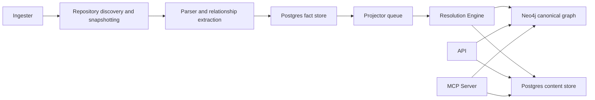
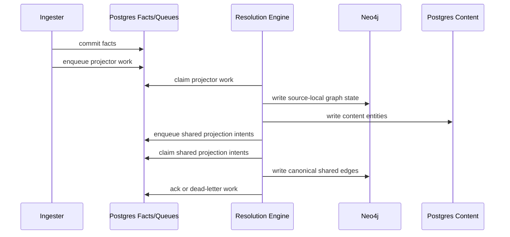
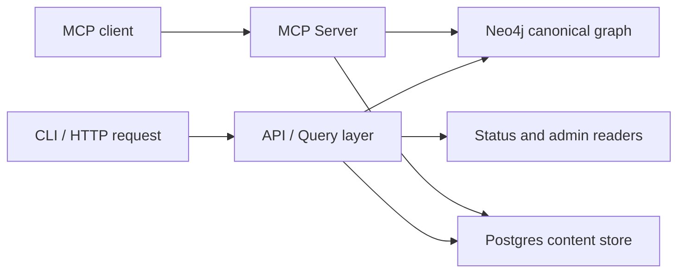

# System Architecture

PlatformContextGraph is a platform that turns repository content,
infrastructure definitions, deployment metadata, and runtime evidence into one
queryable graph.

Use this page for the current architecture only:

- which runtimes exist
- what each runtime owns
- how data moves from repository discovery to query answers
- which contracts are shared across services
- where to look for the operator view

For runtime commands and deployment shapes, use
[Service Runtimes](deployment/service-runtimes.md). For concrete operator
validation, use [Local Testing](reference/local-testing.md). For metrics,
traces, and logs, use [Telemetry Overview](reference/telemetry/index.md).

## Architecture At A Glance

PCG is split into a small number of clear service and storage boundaries:

- **API** serves HTTP query, admin, and status traffic.
- **MCP Server** serves MCP tool transport and mounts the read/query surface for
  MCP clients.
- **Ingester** discovers repositories, snapshots content, parses source and
  IaC, and writes durable facts.
- **Resolution Engine** drains queues, materializes canonical graph state, and
  owns replay and recovery.
- **Bootstrap Index** runs the same write path as a one-shot seeding flow.
- **Postgres** stores facts, queues, status, recovery state, and content.
- **Neo4j** stores canonical graph nodes and relationships.

The platform is intentionally facts-first:

1. collectors produce durable facts
2. source-local projection turns those facts into graph/content state
3. reducer-owned work handles shared and cross-domain truth
4. query surfaces read the canonical graph and content store

## Runtime Topology

## Service Boundaries

### API

The API owns:

- HTTP query routes
- OpenAPI surface
- public admin/query endpoints
- runtime health and metrics endpoints

The API does not own:

- repository sync
- parsing
- fact emission
- queue draining
- canonical write orchestration

### MCP Server

The MCP server owns:

- MCP SSE and JSON-RPC transport
- tool dispatch over the Go query/read surface
- MCP-specific health endpoint shape

The MCP server does not own:

- repository sync
- parsing
- fact emission
- queue draining
- the shared runtime admin/status mux used by API, ingester, and reducer

### Ingester

The ingester owns:

- repository selection and sync loops
- workspace and snapshot lifecycle
- parser execution
- content shaping inputs
- relationship evidence extraction
- fact emission into Postgres
- enqueueing source-local projection work

The ingester is the only long-running runtime that should hold the shared
workspace volume in deployed environments.

### Resolution Engine

The resolution engine owns:

- projector queue draining
- source-local graph and content projection
- shared projection intent processing
- canonical graph materialization
- replay, retry, dead-letter, and recovery behavior
- operator-facing repair and replay ownership

This runtime is where cross-repo and cross-domain truth is finalized.

### Bootstrap Index

Bootstrap Index is a one-shot helper that uses the same facts-first write path
to seed an empty or recovered environment. It is not a steady-state service and
should not be treated as one.

## Domain Ownership

The repository layout mirrors the service boundaries:

| Package area | Ownership |
| --- | --- |
| `go/internal/collector/` | Git discovery, snapshotting, parsing inputs, fact shaping |
| `go/internal/parser/` | parser registry, language engines, SCIP support |
| `go/internal/relationships/` | relationship evidence extraction and typed evidence families |
| `go/internal/projector/` | source-local projection stages |
| `go/internal/reducer/` | shared projection, canonical materialization, repair flows |
| `go/internal/query/` | HTTP handlers, OpenAPI, query/read surfaces |
| `go/internal/runtime/` | health, readiness, metrics, admin/status wiring |
| `go/internal/status/` | lifecycle and coverage/status reporting |
| `go/internal/telemetry/` | structured JSON logging, tracing, metrics |
| `go/internal/terraformschema/` | packaged Terraform provider schema assets and loaders |

For the full package map, use [Source Layout](reference/source-layout.md).

## Data And Queue Contracts

PCG separates durable state from in-process work:

- **Postgres facts** hold extracted repository truth and queue state.
- **Projector/reducer queues** provide durable claim, retry, and dead-letter
  ownership.
- **Neo4j** holds canonical graph entities and edges.
- **Postgres content store** holds entity and file content used by query and
  context APIs.

This split is deliberate:

- in-process worker pools handle bounded CPU and I/O concurrency
- durable queues handle retries, recovery, and cross-service coordination
- query surfaces stay read-only against canonical stores

## Inter-Service Workflow

### Write Path

### Read Path

## Operator Contract

The shared Go runtime admin contract now applies to the API, MCP server,
ingester, resolution engine, and local proof runtimes that mount
`go/internal/runtime`.

- `GET /healthz`
- `GET /readyz`
- `GET /admin/status`
- `/metrics`

The MCP server is a separate Go runtime and now mounts the shared admin mux
alongside its transport-specific endpoints. It also exposes:

- `GET /health`
- `GET /sse`
- `POST /mcp/message`
- `/api/*` passthrough routes for query handling

The point of the shared contract is consistency:

- operators should not need a different mental model per service
- the CLI and HTTP/admin surfaces should describe the same underlying runtime
  state
- live versus inferred state should be explicit

## Telemetry Contract

Telemetry is first-class, not an afterthought.

- Core long-running Go runtimes, including MCP, use structured JSON logging
  through the shared Go telemetry package.
- Metrics expose runtime, queue, and data-plane behavior.
- Traces connect request, ingestion, and reduction work across service
  boundaries.

MCP keeps its transport-specific `/health`, `/sse`, and `/mcp/message`
endpoints, but its operator/admin surface now follows the same shared Go
runtime contract as the API, ingester, and reducer.

The canonical docs are:

- [Telemetry Overview](reference/telemetry/index.md)
- [Logs](reference/telemetry/logs.md)
- [Metrics](reference/telemetry/metrics.md)
- [Traces](reference/telemetry/traces.md)

## Capability Ports: The Backend-Agnostic Seam

Query handlers depend on **capability ports**, not on concrete database
drivers. A capability port is a narrow Go interface that defines what a layer
can read or write without naming the backend that serves the data.

Two read ports exist today:

- `GraphQuery` — read-only graph traversal (`Run`, `RunSingle`). Implemented by
  the Neo4j adapter.
- `ContentStore` — relational content-query surface (file, entity, framework
  route, repository coverage). Implemented by the Postgres content adapter.

Handlers such as `CodeHandler`, `ImpactHandler`, `RepositoryHandler`,
`InfraHandler`, and `CompareHandler` reference these interfaces — never
`*Neo4jReader` or `*ContentReader` concrete types. Wiring is the only place
that binds concrete adapters to ports, which means a future graph backend only
needs a new adapter and a conformance-matrix pass to plug in.

The target set defined by the ADR also includes `FactStore`, `CodeSearch`,
`SymbolGraph`, `CallGraph`, and `GraphWrite`. Those are introduced as the
surface grows; the pattern is unchanged. See
[ADR 2026-04-20 — Desktop Mode](adrs/2026-04-20-embedded-local-backends-desktop-mode.md)
§5 for the target port list and the explicit rejection of an ORM-centric
abstraction.

Current graph adapters: Neo4j (default), NornicDB (under evaluation). Both
satisfy the same `GraphQuery` + `GraphWrite` ports. The active adapter is
chosen via `PCG_GRAPH_BACKEND={neo4j,nornicdb}` and surfaced in telemetry
as `graph_backend`. Schema bootstrap routes through the same backend axis:
Neo4j receives the shared production DDL, while NornicDB receives a narrow
schema-dialect translation for compatibility gaps such as composite node
identity constraints. Handler and reducer code do not branch on graph brand.
If NornicDB passes the full conformance matrix at laptop, Compose, and
production scale, PCG will deprecate Neo4j on a documented timeline. See
[ADR 2026-04-22](adrs/2026-04-22-nornicdb-graph-backend-candidate.md).

### Rule

- Handlers depend on ports, not brands.
- Backends are adapters behind ports.
- Swapping a backend is a wiring change plus a conformance pass.

## Conformance Gate For New Backends

No backend is described as supported because it "speaks Cypher." A backend is
supported only after it passes the machine-readable **capability matrix** at
`specs/capability-matrix.v1.yaml` for the intended runtime profile.

The matrix lists every capability — exact symbol lookup, transitive callers,
dead-code, blast-radius, etc. — with, per profile:

- `status` (`supported`, `unsupported`, `experimental`)
- `max_truth_level` (`exact`, `derived`, `fallback`, `unsupported`)
- `required_runtime` (`local_host`, `full_stack`, `deployed_services`)
- `p95_latency_ms` budget
- `max_scope_size`
- `verification` gate (Go test, integration test, compose E2E, or remote
  validation)

A Go contract test at `go/internal/query/contract_matrix_test.go` ensures the
matrix in Go code never drifts from the YAML.

See [Capability Conformance Spec](reference/capability-conformance-spec.md).

## Collector Extensibility And OCI Plugins

Collectors observe source truth and emit **versioned facts**. They do not
write canonical graph truth directly — that stays owned by the reducer and
graph-write layer.

The target distribution is OCI-packaged plugins so contributors can add new
collector families without patching the core runtime. The plugin seam has
three contracts:

- **Fact schema versioning** — every fact carries `fact_kind` + semver
  `schema_version`. Core fact kinds are owned by PCG; plugin fact kinds must
  use a namespaced form (reverse-DNS or equivalent). Incompatible schema
  versions fail closed. See
  [Fact Schema Versioning](reference/fact-schema-versioning.md).
- **Plugin trust model** — signature/provenance (Sigstore/Cosign), operator
  allowlist, explicit activation modes (`disabled`, `allowlist`, `strict`),
  revocation without disabling plugin support globally. See
  [Plugin Trust Model](reference/plugin-trust-model.md).
- **Plugin consumer contract** — a new fact kind is not useful until a
  reducer or query consumer understands it. Plugins declare the consumer
  contract they expect.

One consolidated user-facing reference lives at
[Fact Envelope Reference](reference/fact-envelope-reference.md).

Note: a separate workflow coordinator contract governs multi-collector
claiming, fencing, and convergence (tfstate + future collector kinds). Details
will land with ADRs `2026-04-20-workflow-coordinator-*` and
`2026-04-20-terraform-state-collector.md`.

## Runtime Profiles: Lightweight Local / Authoritative Local / Full Stack / Production

The same query model runs across four profiles. Each profile advertises the
same capability surface but with different truth levels.

| Profile | Shape | Authoritative graph | Purpose |
| --- | --- | --- | --- |
| `local_lightweight` | Single `pcg` binary with embedded Postgres | No | Developer-laptop code intelligence |
| `local_authoritative` | `pcg` binary + embedded Postgres + local graph backend sidecar installed via `pcg install nornicdb --from <path>` today; release-backed install before promotion | Yes | Laptop-scale transitive / call-chain / dead-code without Compose |
| `local_full_stack` | Docker Compose: Postgres, Neo4j (or NornicDB), ingester, reducer, API/MCP | Yes | Pre-merge validation, reducer convergence testing |
| `production` | Kubernetes / Helm split runtimes, shared Postgres and graph backend | Yes | Incident, refactor, blast-radius analysis at scale |

The graph backend is a separate axis from profile. Current adapters are
Neo4j (default) and NornicDB (evaluation candidate). See
[Graph Backend Installation](reference/graph-backend-installation.md),
[Graph Backend Operations](reference/graph-backend-operations.md), and
[ADR 2026-04-22](adrs/2026-04-22-nornicdb-graph-backend-candidate.md).

The local-authoritative NornicDB path is intentionally guarded while under
evaluation: canonical graph writes are sequential and timeout-bounded, and
the local content index is written before graph projection. That preserves
developer MCP code-search usefulness without changing the production Neo4j
grouped-write path. NornicDB grouped writes are available only through the
explicit conformance switch `PCG_NORNICDB_CANONICAL_GROUPED_WRITES=true`;
promotion requires proving the same rollback, timeout, and no-partial-write
invariants that Neo4j currently provides. The 2026-04-23 safety probe against
`/tmp/nornicdb-headless` (`v1.0.42-hotfix`) still reported rollback marker
count `1` on the Neo4j-driver path, so grouped NornicDB canonical writes remain
unpromoted.

Lightweight local mode **refuses** high-authority queries (transitive callers,
call-chain paths, dead code, blast radius, change surface) with a structured
`unsupported_capability` error. It does not silently downgrade them to
`fallback`. Users get a loud, actionable signal that the question belongs on
the full-stack or production profile.

Each profile's exact truth level per capability is defined by the capability
matrix. See [Capability Conformance Spec](reference/capability-conformance-spec.md),
[Truth Label Protocol](reference/truth-label-protocol.md), and
[Local Host Lifecycle](reference/local-host-lifecycle.md).

## Local And Deployed Shapes

PCG supports two practical execution shapes:

- **local** for CLI, MCP, and compose-backed proof flows
- **deployed** for API, ingester, and resolution-engine service operation

Those shapes reuse the same binaries and the same contracts. Deployment only
changes runtime shape, command, and configuration.

Use these docs together:

- [Deployment Overview](deployment/overview.md)
- [Docker Compose](deployment/docker-compose.md)
- [Helm](deployment/helm.md)
- [Service Runtimes](deployment/service-runtimes.md)

## Terraform Provider Schemas

Terraform provider schema assets are a runtime dependency of the current
relationship path, not optional reference material.

- assets live in `go/internal/terraformschema/schemas/*.json.gz`
- loaders live in `go/internal/terraformschema/`
- relationship extraction consumes them through
  `go/internal/relationships/`

That dependency must stay documented because it is part of how Terraform
resource classification and relationship evidence work.

## What This Page Does Not Try To Be

This page is intentionally not:

- a change diary
- a public ADR index
- a workstream backlog
- an incident postmortem collection

If documentation is about the platform as it runs today, it belongs in the
published architecture, workflow, deployment, testing, telemetry, or service
docs. Historical execution records should not be the primary way engineers or
operators learn how PCG works.

## Related Docs

- [Service Workflows](reference/service-workflows.md)
- [Service Runtimes](deployment/service-runtimes.md)
- [Source Layout](reference/source-layout.md)
- [Local Testing](reference/local-testing.md)
- [Relationship Mapping](reference/relationship-mapping.md)
- [HTTP API](reference/http-api.md)
