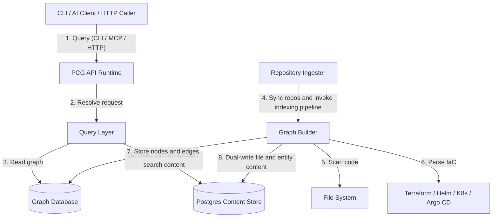

# System Architecture

PlatformContextGraph (PCG) is a code-to-cloud context graph that connects repositories, infrastructure definitions, runtime topology, and graph-backed query surfaces.

It runs in two modes: locally as a CLI and stdio MCP server, or as a deployed service that exposes HTTP API and MCP while continuously maintaining graph state.

## High-Level Diagram

## Components

| Component | Responsibility |
| :--- | :--- |
| **CLI** | Local command surface for indexing, search, analysis, setup, and runtime management. |
| **MCP Server** | JSON-RPC surface for AI development tools. |
| **HTTP API** | OpenAPI-backed surface for automation and service-to-service use. |
| **Query Layer** | Entity-first query model shared by CLI, MCP, and HTTP. |
| **Graph Builder** | Parses code and IaC into graph nodes and edges. |
| **Database Layer** | Graph storage. Neo4j is the canonical backend for deployed services. |
| **Content Store** | PostgreSQL-backed file and entity content cache for deployed API and MCP runtimes. |
| **Ingester Runtime** | Long-running repository ingestion, indexing, retry/backoff, and sync. |
| **Observability** | Shared OTEL instrumentation for API, MCP, and indexing runtime signals. |

## Interfaces

CLI, MCP, and HTTP API are the primary interfaces. All three share the same query layer — there is no separate UI frontend.

The docs site (built with MkDocs) is the public reference surface.

## Data Flow

### Indexing

`pcg index .` or the deployed ingester scans repositories, parses code and IaC, resolves relationships, and writes graph data to the database.

When the content store is configured, the same indexing pass also writes file content and entity snippets into Postgres.

In Kubernetes, the repository ingester owns repo sync, retries, and indexing. The API runtime serves independently.

### Querying

1. A user or agent asks a question.
2. CLI, MCP, or HTTP resolves the request into the shared query layer.
3. The query layer reads the graph and, when needed, the content store.
4. Deployed API and MCP runtimes read content from Postgres and report unavailable content until the ingester has populated it.

## Source Tree

The source package is organized by responsibility under `src/platform_context_graph/`:

- `api/` — HTTP wiring and routers
- `cli/` — Typer entrypoints, command packages, setup flows, and visualization helpers
- `mcp/` — MCP server, transport, tool registry, and handler wiring
- `content/` — Content-store models, dual-write helpers, Postgres provider, and workspace fallback
- `observability/` — OTEL bootstrap, runtime state, and metrics helpers
- `query/` — Shared read/query layer
- `runtime/` — Runtime role management, ingester, and status helpers
- `tools/` — Graph builder and parser implementations

See [Source Layout](reference/source-layout.md) for the full package map.

## Key Technologies

- **Language:** Python 3.10+
- **Parsing:** Tree-sitter plus infrastructure-specific parsers
- **Protocol:** Model Context Protocol (MCP)
- **HTTP:** FastAPI + OpenAPI
- **Database:** Neo4j
- **Content Store:** PostgreSQL
- **Packaging:** Docker, Helm, Argo CD
