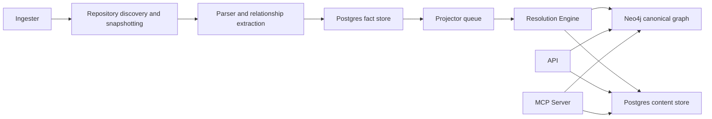
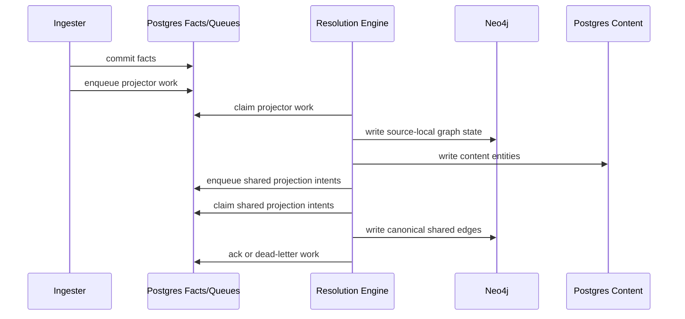
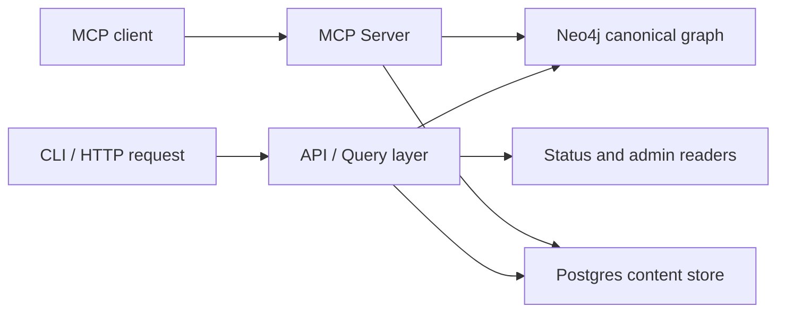

# System Architecture

PlatformContextGraph is a Go-owned platform that turns repository content,
infrastructure definitions, deployment metadata, and runtime evidence into one
queryable graph.

Use this page for the current architecture only:

- which runtimes exist
- what each runtime owns
- how data moves from repository discovery to query answers
- which contracts are shared across services
- where to look for the operator view

For runtime commands and deployment shapes, use
[Service Runtimes](deployment/service-runtimes.md). For concrete operator
validation, use [Local Testing](reference/local-testing.md). For metrics,
traces, and logs, use [Telemetry Overview](reference/telemetry/index.md).

## Architecture At A Glance

PCG is split into a small number of clear service and storage boundaries:

- **API** serves HTTP query, admin, and status traffic.
- **MCP Server** serves MCP tool transport and mounts the read/query surface for
  MCP clients.
- **Ingester** discovers repositories, snapshots content, parses source and
  IaC, and writes durable facts.
- **Resolution Engine** drains queues, materializes canonical graph state, and
  owns replay and recovery.
- **Bootstrap Index** runs the same write path as a one-shot seeding flow.
- **Postgres** stores facts, queues, status, recovery state, and content.
- **Neo4j** stores canonical graph nodes and relationships.

The platform is intentionally facts-first:

1. collectors produce durable facts
2. source-local projection turns those facts into graph/content state
3. reducer-owned work handles shared and cross-domain truth
4. query surfaces read the canonical graph and content store

## Runtime Topology

## Service Boundaries

### API

The API owns:

- HTTP query routes
- OpenAPI surface
- public admin/query endpoints
- runtime health and metrics endpoints

The API does not own:

- repository sync
- parsing
- fact emission
- queue draining
- canonical write orchestration

### MCP Server

The MCP server owns:

- MCP SSE and JSON-RPC transport
- tool dispatch over the Go query/read surface
- MCP-specific health endpoint shape

The MCP server does not own:

- repository sync
- parsing
- fact emission
- queue draining
- the shared runtime admin/status mux used by API, ingester, and reducer

### Ingester

The ingester owns:

- repository selection and sync loops
- workspace and snapshot lifecycle
- parser execution
- content shaping inputs
- relationship evidence extraction
- fact emission into Postgres
- enqueueing source-local projection work

The ingester is the only long-running runtime that should hold the shared
workspace volume in deployed environments.

### Resolution Engine

The resolution engine owns:

- projector queue draining
- source-local graph and content projection
- shared projection intent processing
- canonical graph materialization
- replay, retry, dead-letter, and recovery behavior
- operator-facing repair and replay ownership

This runtime is where cross-repo and cross-domain truth is finalized.

### Bootstrap Index

Bootstrap Index is a one-shot helper that uses the same facts-first write path
to seed an empty or recovered environment. It is not a steady-state service and
should not be treated as one.

## Domain Ownership

The repository layout mirrors the service boundaries:

| Package area | Ownership |
| --- | --- |
| `go/internal/collector/` | Git discovery, snapshotting, parsing inputs, fact shaping |
| `go/internal/parser/` | parser registry, language engines, SCIP support |
| `go/internal/relationships/` | relationship evidence extraction and typed evidence families |
| `go/internal/projector/` | source-local projection stages |
| `go/internal/reducer/` | shared projection, canonical materialization, repair flows |
| `go/internal/query/` | HTTP handlers, OpenAPI, query/read surfaces |
| `go/internal/runtime/` | health, readiness, metrics, admin/status wiring |
| `go/internal/status/` | lifecycle and coverage/status reporting |
| `go/internal/telemetry/` | structured JSON logging, tracing, metrics |
| `go/internal/terraformschema/` | packaged Terraform provider schema assets and loaders |

For the full package map, use [Source Layout](reference/source-layout.md).

## Data And Queue Contracts

PCG separates durable state from in-process work:

- **Postgres facts** hold extracted repository truth and queue state.
- **Projector/reducer queues** provide durable claim, retry, and dead-letter
  ownership.
- **Neo4j** holds canonical graph entities and edges.
- **Postgres content store** holds entity and file content used by query and
  context APIs.

This split is deliberate:

- in-process worker pools handle bounded CPU and I/O concurrency
- durable queues handle retries, recovery, and cross-service coordination
- query surfaces stay read-only against canonical stores

## Inter-Service Workflow

### Write Path

### Read Path

## Operator Contract

The shared Go runtime admin contract currently applies to the API, ingester,
resolution engine, and local proof runtimes that mount `go/internal/runtime`.

- `GET /healthz`
- `GET /readyz`
- `GET /admin/status`
- `/metrics`

The MCP server is a separate Go runtime, but it does not yet mount that same
admin mux. Today it exposes its own:

- `GET /health`
- `GET /sse`
- `POST /mcp/message`
- `/api/*` passthrough routes for query handling

The point of the shared contract is consistency:

- operators should not need a different mental model per service
- the CLI and HTTP/admin surfaces should describe the same underlying runtime
  state
- live versus inferred state should be explicit

## Telemetry Contract

Telemetry is first-class, not an afterthought.

- Core long-running data-plane runtimes use structured JSON logging through the
  shared Go telemetry package.
- Metrics expose runtime, queue, and data-plane behavior.
- Traces connect request, ingestion, and reduction work across service
  boundaries.

The MCP runtime is Go-owned and starts with a JSON logger, but it still has a
small amount of plain startup logging in its wiring path. Treat that as
remaining telemetry hardening, not as evidence of Python ownership.

The canonical docs are:

- [Telemetry Overview](reference/telemetry/index.md)
- [Logs](reference/telemetry/logs.md)
- [Metrics](reference/telemetry/metrics.md)
- [Traces](reference/telemetry/traces.md)

## Local And Deployed Shapes

PCG supports two practical execution shapes:

- **local** for CLI, MCP, and compose-backed proof flows
- **deployed** for API, ingester, and resolution-engine service operation

Those shapes reuse the same binaries and the same contracts. Deployment only
changes runtime shape, command, and configuration.

Use these docs together:

- [Deployment Overview](deployment/overview.md)
- [Docker Compose](deployment/docker-compose.md)
- [Helm](deployment/helm.md)
- [Service Runtimes](deployment/service-runtimes.md)

## Terraform Provider Schemas

Terraform provider schema assets are a runtime dependency of the Go-owned
relationship path, not historical baggage.

- assets live in `go/internal/terraformschema/schemas/*.json.gz`
- loaders live in `go/internal/terraformschema/`
- relationship extraction consumes them through
  `go/internal/relationships/`

That dependency must stay documented because it is part of how Terraform
resource classification and relationship evidence work.

## What This Page Does Not Try To Be

This page is intentionally not:

- a migration diary
- a historical ADR index
- a workstream backlog
- an incident postmortem collection

If documentation is about the platform as it runs today, it belongs in the
published architecture, workflow, deployment, testing, telemetry, or service
docs. Historical execution records should not be the primary way engineers or
operators learn how PCG works.

## Related Docs

- [Service Workflows](reference/service-workflows.md)
- [Service Runtimes](deployment/service-runtimes.md)
- [Source Layout](reference/source-layout.md)
- [Local Testing](reference/local-testing.md)
- [Relationship Mapping](reference/relationship-mapping.md)
- [HTTP API](reference/http-api.md)
