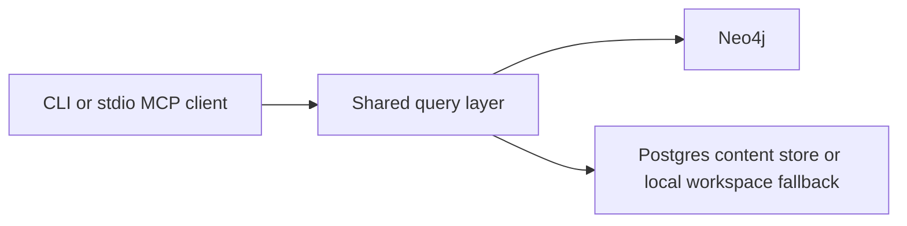
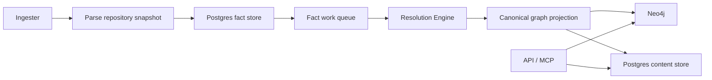
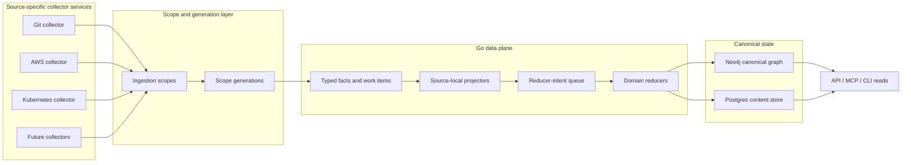
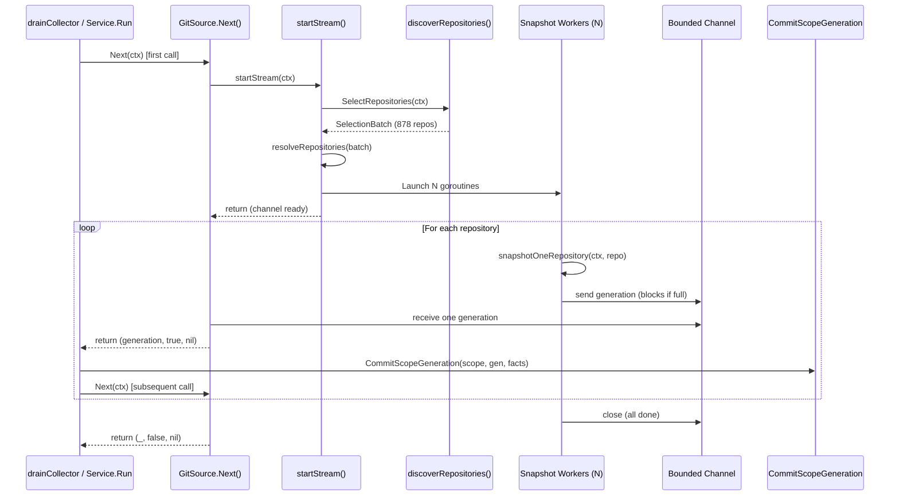
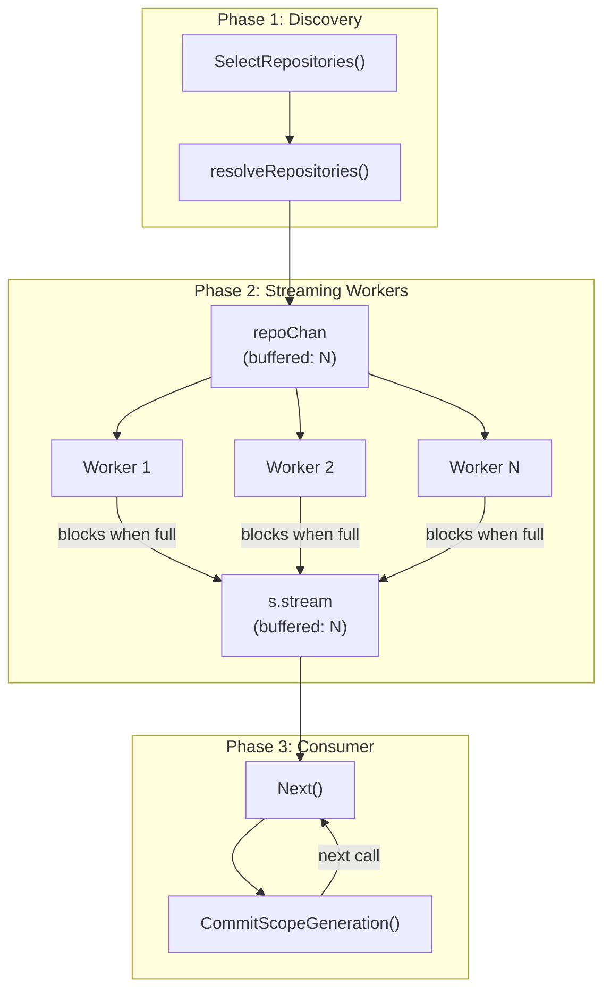
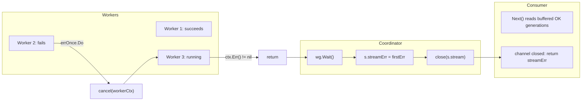
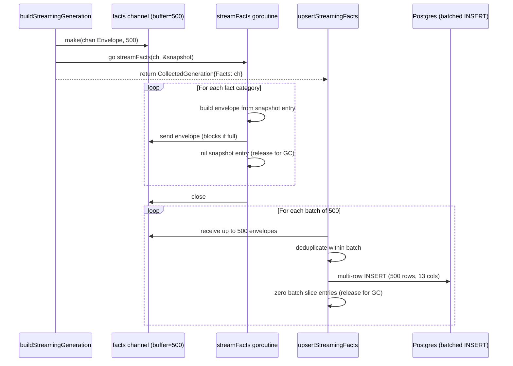
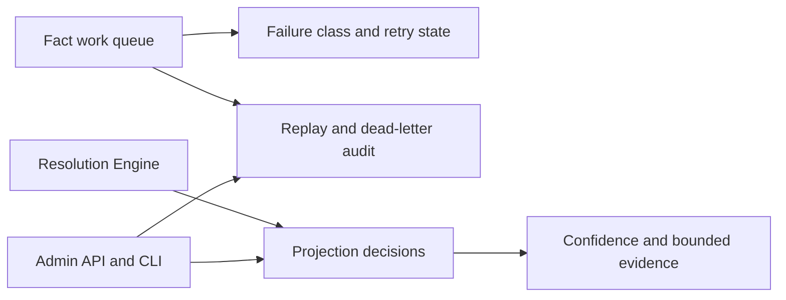

# System Architecture

PlatformContextGraph connects source code, infrastructure definitions, workload
topology, and graph-backed query surfaces in one model.

It runs in two practical modes:

- **local mode** for CLI and stdio MCP workflows
- **deployed mode** for the shared API, ingester, and resolution-engine

Phase 1 clarified package ownership, Phase 2 switched Git indexing to a
facts-first write path, and Phase 3 added durable recovery and explainability on
top of that runtime.

The current write-domain architecture keeps repo-local graph refresh parallel
while routing shared platform and dependency mutation through durable,
partitioned follow-up domains keyed by stable lock identifiers. That preserves
commit-worker throughput without letting concurrent writers fight over the same
dense shared nodes.

That runtime is now the active baseline for this branch. The normal platform
path runs as a schema-first Go data plane built around scoped ingestion,
snapshot generations, source-local projectors, and shared reducers. The goal
is to let Git, AWS, Kubernetes, SQL, and future collectors all feed one
canonical knowledge graph without inheriting Git-shaped storage or
finalization assumptions. Each collector family owns its own service boundary
and emits the same shared fact contract, so the platform can scale by source
instead of forcing every update through one generic ingester.

The rewrite also favors incremental ingestion and reconciliation over full
re-indexing. Normal updates should touch the affected scope or shard, produce a
new generation, and reconcile only the changed unit of truth. Full rebuilds
remain available as explicit bootstrap or recovery operations.

For new source families, use the
[Collector Authoring Guide](guides/collector-authoring.md) as the guardrail for
where collector logic stops and projector or reducer ownership begins.

That split means steady-state health needs two different backlog views:

- the fact work queue tells you whether repository projection work is arriving,
  waiting, retrying, or dead-lettering
- the shared projection backlog tells you whether authoritative shared follow-up
  domains are draining after repo-local projection finishes

## Local Request Path



## Deployed Data Plane



## Target Data Plane



## Target Traversal Map

This is the required end-to-end view for one bounded work unit in the rewrite
architecture.

| Stage | Owner | Work unit | Boundary type | Retry owner | Primary health signals |
| --- | --- | --- | --- | --- | --- |
| Source observation | source-specific collector service | scope candidate or source shard | in-process | collector | collector latency, discovery backlog, source error rate |
| Scope assignment | source-specific collector service | `ingestion_scope` + `scope_generation` | durable write | collector | scope create/update rate, generation status, duplicate suppression |
| Fact emission | source-specific collector service | facts for one scope generation | durable write | collector | fact emit latency, fact count, Postgres pool saturation |
| Source-local projection | projector | one claimed scope generation | durable queue claim | projector | queue depth, oldest age, claim latency, projector duration |
| Reducer-intent emission | projector | reducer intents for one generation | durable write | projector | intent count, enqueue latency, pending intents by domain |
| Canonical reduction | reducer | one reducer intent | durable queue claim | reducer | reducer queue age, reducer duration, retry and dead-letter counts |
| Canonical persistence | reducer | one canonical write batch | durable write | reducer | canonical write latency, Neo4j/Postgres pool pressure, idempotent replay counts |
| Query and MCP reads | API / MCP | canonical graph or content read | request/response | API | request latency, query latency, error rate |

## Resiliency And Concurrency Model

The rewrite uses concurrency in two different ways.

### In-Process

Inside one service:

- use bounded worker pools for parser and normalization work
- use channels when they make producer, worker, cancellation, and result flow
  clearer
- separate CPU-bound and I/O-bound concurrency controls
- keep worker counts and queue capacities configurable

### Cross-Service

Across service boundaries:

- use durable queues and leases, not channels
- keep work units replayable and idempotent
- surface backlog, oldest age, retries, and failures in the operator view
- let backpressure slow producers before correctness degrades

This distinction is what lets PCG leverage multiple processors while still
remaining resilient under retries, partial failure, and large cloud or
Kubernetes inventories.

Every long-running service should also expose the shared admin contract:

- `GET` and `HEAD` `/healthz`
- `GET` and `HEAD` `/readyz`
- `GET` and `HEAD` `/admin/status`
- `/metrics` when the runtime exposes metrics

The status surface should come from the same report model whether the operator
is using the CLI or the HTTP endpoint.

## Streaming Collector Architecture

The Git collector uses a channel-based streaming architecture to bound memory
during large-scale indexing. Instead of accumulating all repository snapshots
in memory before committing, the collector streams generations through a
bounded channel so the consumer can commit each one to Postgres before the
next arrives.

### Streaming Lifecycle



### Worker Pool And Backpressure



### Memory Bound

With `PCG_SNAPSHOT_WORKERS=8` and channel buffer = 8:

- At most 8 generations buffered + 8 in-flight = 16 repo generations
- Each generation holds facts for one repository (~130MB worst case)
- Peak memory: ~2GB vs ~115GB without streaming (878 repos x 130MB)
- Consumer commits to Postgres before reading next, keeping pressure low

### Error Propagation



### Telemetry Contract

| Signal | Name | Attributes | Phase |
| --- | --- | --- | --- |
| Span | `collector.stream` | `component`, `repository_count`, `snapshot_workers`, `repos_completed`, `duration_seconds` | emission |
| Span | `scope.assign` | `collector_kind`, `source_system` | discovery |
| Span | `fact.emit` | per-repository (child of stream) | emission |
| Histogram | `pcg_dp_repo_snapshot_duration_seconds` | `scope_id` | emission |
| Histogram | `pcg_dp_collector_observe_duration_seconds` | `collector_kind`, `component` | emission |
| Counter | `pcg_dp_repos_snapshotted_total` | `status=succeeded\|failed` | emission |
| Counter | `pcg_dp_facts_emitted_total` | `collector_kind`, `source_system`, `scope_id` | emission |
| Log | `collector stream started` | `repository_count`, `snapshot_workers`, `component` | emission |
| Log | `collector snapshot completed` | `repo_path`, `file_count`, `fact_count`, `worker_id` | emission |
| Log | `collector stream completed` | `repos_completed`, `repos_total`, `snapshot_workers`, `duration_seconds` | emission |

### Configuration

| Env Var | Default | Description |
| --- | --- | --- |
| `PCG_SNAPSHOT_WORKERS` | min(NumCPU, 4) | Concurrent repo snapshot workers |
| `PCG_FILESYSTEM_DIRECT` | false | Read repos in-place without copying |

## Streaming Fact Persistence

Within each repository generation, facts are streamed through a buffered
channel directly to Postgres in batched multi-row INSERTs. This is the inner
streaming layer — distinct from the outer collector streaming that delivers
one generation at a time.

### Problem

A single repository can produce 295,000+ facts. Each content fact carries the
raw file body as `content_body` in its payload. Accumulating all facts in
memory before writing means the ingester must hold every file body for every
repo simultaneously — several gigabytes for large repos, 60+ GiB across 878
repos.

### Design



### Progressive Memory Release

The streaming path releases memory at three points:

1. **Producer side** (`streamFacts`): After each fact envelope is sent to the
   channel, the corresponding snapshot entry is set to `nil` or its zero value.
   This releases the `ContentFileSnapshot.Body` (raw file source) for GC
   immediately, not after all facts are built.

2. **Consumer side** (`upsertStreamingFacts`): After each 500-fact batch is
   committed to Postgres, the batch slice entries are zeroed. This releases
   the `Payload` maps (which contain `content_body` strings) for GC before
   the next batch arrives.

3. **Goroutine lifecycle**: The channel is closed by the producer when all
   facts are emitted. All error paths in the consumer call `drainFacts()` to
   read and discard remaining channel entries, preventing the producer
   goroutine from blocking forever on a full channel.

### Memory Impact

| Scenario | Without streaming | With streaming |
| --- | --- | --- |
| 295k-fact repo (commit phase) | ~3 GiB (all payloads in memory) | ~10 MiB (500 payloads in memory) |
| 878 repos total (2 workers) | 60+ GiB peak RSS | 6-12 GiB peak RSS |
| Per-batch live memory | O(all facts per repo) | O(batch size = 500) |

### Batched Multi-Row INSERT

Facts are written to Postgres using multi-row INSERT statements. Each batch
inserts up to 500 rows with 13 columns per row (6,500 parameters), well under
the Postgres limit of 65,535. This reduces 295k facts from 295k round trips
to ~590 queries.

```text
INSERT INTO fact_records (
    fact_id, scope_id, generation_id, fact_kind, stable_fact_key,
    source_system, source_fact_key, source_uri, source_record_id,
    observed_at, ingested_at, is_tombstone, payload
) VALUES ($1..$13), ($14..$26), ... ($6488..$6500)
ON CONFLICT (fact_id) DO UPDATE SET ...
```

Per-batch deduplication by `fact_id` prevents Postgres SQLSTATE 21000 errors
on `ON CONFLICT DO UPDATE` when the same key appears twice in a single
multi-row INSERT. Cross-batch duplicates are handled naturally by Postgres
(later batch overwrites earlier).

### JSONB Sanitization

Fact payloads are sanitized before INSERT to handle two Postgres JSONB
restrictions:

- `\u0000` escape sequences are stripped (Postgres rejects SQLSTATE 22P05)
- Raw control bytes `0x00-0x1F` (except tab, newline, carriage return) are
  stripped (Postgres rejects SQLSTATE 22P02)

Source code payloads may contain these bytes when repositories include binary
files or non-UTF-8 content. A fast-path check avoids allocation for clean
payloads (the common case).

### Goroutine Leak Prevention

Every error path that abandons the fact channel must drain it to unblock the
producer goroutine:

| Error path | Drain call |
| --- | --- |
| Validation failure (scope/generation mismatch) | `drainFacts(factStream)` before return |
| Freshness skip (unchanged generation) | `drainFacts(factStream)` before return |
| Transaction begin failure | `drainFacts(factStream)` before return |
| Transaction rollback | `drainFacts(factStream)` in deferred cleanup |
| Nil channel (no facts) | `upsertStreamingFacts` returns nil immediately |

### Configuration

| Parameter | Value | Description |
| --- | --- | --- |
| Channel buffer | 500 | Matches Postgres batch size for natural backpressure |
| Batch size | 500 rows | 6,500 parameters per query |
| Columns per row | 13 | fact_id through payload |
| Deduplication | Per-batch | Last occurrence of each fact_id wins |

### Key Files

| File | Role |
| --- | --- |
| `go/internal/collector/git_fact_builder.go` | `buildStreamingGeneration`, `streamFacts` — producer |
| `go/internal/storage/postgres/facts.go` | `upsertStreamingFacts`, `upsertFactBatch` — consumer |
| `go/internal/storage/postgres/ingestion.go` | `CommitScopeGeneration`, `drainFacts` — transaction boundary |
| `go/internal/collector/service.go` | `CollectedGeneration` type, `FactsFromSlice` test helper |

## Dynamic Memory Limit (GOMEMLIMIT)

Go data plane binaries automatically configure `GOMEMLIMIT` at startup based
on the container's available memory. This prevents OOM kills by keeping the GC
aggressive relative to the actual container size, while allowing full use of
available memory on larger instances.

### Priority Chain

| Priority | Source | Example |
| --- | --- | --- |
| 1 (highest) | `GOMEMLIMIT` env var | `GOMEMLIMIT=8GiB` — operator override |
| 2 | Container cgroup limit x 70% | 32 GiB container -> 22.4 GiB GOMEMLIMIT |
| 3 (lowest) | Go default (no limit) | Bare metal dev, no container |

The 70% ratio leaves 30% headroom for non-heap allocations: goroutine stacks,
mmap'd files, kernel page cache, and the Go runtime itself. The floor is 512
MiB — GOMEMLIMIT is never set below this regardless of the container size.

### MADV_DONTNEED

All binaries unconditionally set `GODEBUG=madvdontneed=1` at startup. This
forces the Go runtime to release freed heap pages to the OS immediately via
`madvise(MADV_DONTNEED)` instead of the default `MADV_FREE` which marks pages
as reusable but keeps them in RSS. Without this setting, `docker stats` reports
inflated RSS that never drops, and the kernel OOM killer may target the
container based on pages that are actually free.

### Cgroup Detection

The binary reads the container memory limit from Linux cgroups:

- **cgroups v2**: `/sys/fs/cgroup/memory.max` (returns `max` when unlimited)
- **cgroups v1**: `/sys/fs/cgroup/memory/memory.limit_in_bytes` (returns a
  huge number >2^62 when unlimited)

On macOS or bare metal without cgroup filesystems, detection returns 0 and
GOMEMLIMIT is left at the Go default.

### Expected Memory Budget

| Machine | Workers | GOMEMLIMIT (70%) | Peak RSS (expected) | Headroom |
| --- | --- | --- | --- | --- |
| 8 GiB | 2 | 5.6 GiB | ~6-7 GiB | ~1 GiB |
| 16 GiB | 2 | 11.2 GiB | ~8-12 GiB | ~4 GiB |
| 32 GiB | 4 | 22.4 GiB | ~12-20 GiB | ~12 GiB |
| 64 GiB | 4 | 44.8 GiB | ~15-25 GiB | ~39 GiB |

### Key Files

| File | Role |
| --- | --- |
| `go/internal/runtime/memlimit.go` | `ConfigureMemoryLimit`, cgroup detection, MADV_DONTNEED |
| `go/cmd/bootstrap-index/main.go` | Calls `ConfigureMemoryLimit` at startup |
| `go/cmd/ingester/main.go` | Calls `ConfigureMemoryLimit` at startup |

## Deployed Control Plane



## Component Responsibilities

| Component | Responsibility |
| --- | --- |
| CLI | Local indexing, analysis, setup, and runtime management |
| MCP | AI-oriented query surface over the same shared model |
| HTTP API | OpenAPI-backed automation surface plus admin endpoints |
| Query layer | Shared read model used by CLI, MCP, and HTTP |
| Collectors | Source-specific discovery, normalization, and ingestion helpers |
| Parsers | Language and IaC parsing, capability specs, and SCIP helpers |
| Facts layer | Typed facts, Postgres fact storage, queue state, recovery state |
| Resolution | Fact-to-graph projection, workload/platform materialization, decisions |
| Graph layer | Canonical schema and persistence helpers for graph writes |
| Content store | Postgres-backed file and entity content cache |
| Observability | OTEL metrics, traces, and structured logs across runtimes |

## Facts-First Flow

1. The source-specific collector discovers a bounded scope and parses a source snapshot.
2. Repository, file, and entity facts are written to Postgres.
3. A fact work item is enqueued for that snapshot.
4. The resolution-engine, or the collector’s transitional inline commit path,
   claims the work item and loads the stored facts.
5. Repo-local projection refreshes repository, file, entity, relationship,
   workload, and repo-owned platform state in Neo4j.
6. Authoritative shared platform and dependency writes are emitted as durable
   follow-up domains and drained through partitioned workers keyed by stable
   lock domains.
7. The same projection flow dual-writes file and entity content into Postgres.
8. Query surfaces continue reading the canonical graph and content store.

The legacy Python snapshot/coordinator runtime stack has now been deleted from
the branch. That is the operating baseline for this architecture:

- collectors own source discovery and raw normalization
- the Go data plane owns scoped facts, queueing, and snapshot generations
- source-local projectors own repository-, account-, or cluster-scoped graph
  materialization
- reducers own shared cross-source correlation
- the API, MCP, and CLI stay read-only over canonical state

Status surfaces can report `awaiting_shared_projection` while authoritative
shared follow-up remains pending for an accepted repository generation.

The observability surface mirrors that split:

- `pcg_fact_queue_depth` and `pcg_fact_queue_oldest_age_seconds` describe the
  fact work queue
- `pcg_shared_projection_pending_intents` and
  `pcg_shared_projection_oldest_pending_age_seconds` describe authoritative
  shared follow-up backlog by projection domain

The current deterministic tuning harness gives us a safe interpretation model
for those gauges:

- move partition count first when shared backlog is accumulating, because
  better lock-domain spread lowers drain rounds before increasing per-round
  write volume
- use batch-limit increases second, once partitioning has already reduced drain
  rounds and the remaining backlog is tail work rather than lock contention

That keeps the architecture moving forward with parallelism while preserving the
phase-1 goal of reducing dense-node conflict on shared writes.

## Related Rewrite Records

The Go data-plane rewrite has a locked decision set that complements this public
architecture page:

- [Architecture Decision Records](adrs/index.md)
- [Go Data Plane in a Monorepo](adrs/2026-04-12-go-data-plane-monorepo.md)
- [Source-Specific Ingestors And Shared Fact Contract](adrs/2026-04-12-source-specific-ingestors-and-shared-fact-contract.md)
- [Scope-First Ingestion](adrs/2026-04-12-scope-first-ingestion.md)
- [Incremental Ingestion And Reconciliation](adrs/2026-04-12-incremental-ingestion-and-reconciliation.md)
- [Resolution Owns Cross-Domain Truth](adrs/2026-04-12-resolution-owns-cross-domain-truth.md)
- [Reducer Intent Architecture](adrs/2026-04-12-reducer-intent-architecture.md)
- [Service Admin And Observability Contract](adrs/2026-04-12-service-admin-and-observability-contract.md)

## Recovery And Explainability

Phase 3 keeps more operational meaning in Postgres instead of only in logs:

- work items store durable failure class, failure stage, and retry disposition
- replay actions are recorded as replay-event rows
- backfill requests are stored durably
- projection decisions store confidence, reasoning, and bounded evidence

That lets operators answer:

- what failed
- whether it was retryable or terminal
- what was replayed or dead-lettered
- why a relationship, workload, or platform inference was accepted

## Runtime Ownership

| Runtime | Owns |
| --- | --- |
| API | HTTP and MCP serving, graph reads, content reads, admin surface |
| Ingester | repo sync, parsing, fact emission, workspace ownership |
| Resolution Engine | queue draining, projection, retries, replay, recovery |
| Bootstrap Index | one-shot initial indexing in local/full-stack workflows |

Target-state ownership after the rewrite:

| Runtime | Owns |
| --- | --- |
| Collector services | Source-specific discovery, incremental refresh, and normalized fact emission |
| Go scope layer | Ingestion scopes, scope generations, and change-unit routing |
| Go projector services | Source-local graph materialization |
| Go reducer services | Cross-source canonical correlation and shared graph writes |
| API | HTTP and MCP serving, graph reads, content reads, admin surface |
| Bootstrap Index | One-shot initial indexing and replay orchestration |

### Current Implementation Status

The Go data plane now owns normal platform operation end to end.

| Component | Current state | Remaining work |
| --- | --- | --- |
| Runtime services (API, ingester, reducer, bootstrap) | Go-owned and deployed from `go/cmd/` | none for ownership |
| Projector stages (entities, files, relationships, workloads) | Go-owned | feature-parity closure only |
| Projection decision recording | Go-owned | validate parity breadth |
| Failure classification | Go-owned | validate parity breadth |
| Reducer domains (workload identity, cloud assets, deployment mapping, workload materialization) | Go-owned | feature-parity closure only |
| Shared projection (platform, repo dependency, workload dependency) | Go-owned | feature-parity closure only |
| Recovery and refinalize | Go-owned | broaden replay and recovery proof as needed |
| Status request lifecycle (scan, reindex, repair visibility) | Go-owned | close remaining operator-surface gaps |
| Parser runtime ownership | Go-owned | none for ownership |
| Parser feature parity | Partial across several language families | close graph/query-surface and end-to-end gaps |
| Deployment assets (Dockerfile, Compose, Helm) | Go-owned | keep docs and validation current |

There is no normal-path Python runtime left in the branch. The remaining work
is parity closure, not runtime cutover.

The biggest open buckets are:

- parser and graph-surface parity for several language families
- a few operator-surface gaps in the Go API and CLI contract
- end-to-end validation breadth for features that already parse in Go

The content store is owned by the projection path, not by the raw parser.
Source-specific collectors emit facts; the resolution-engine turns those facts
into canonical graph and content state.

In the rewritten data plane, the resolution-engine is the projection and
reduction runtime, not the place where parser, collector, or source-specific
logic keeps accumulating.

## Observability Model

Each primary runtime has a distinct telemetry surface:

- **API**: HTTP/MCP latency, error rate, graph query latency
- **Ingester**: repo queue wait, parse timing, fact emission timing, workspace
  pressure
- **Resolution Engine**: queue depth and age, claim latency, projection stage
  timing, retries, dead letters, decision volume, shared follow-up backlog
- **Facts layer**: fact-store and queue SQL latency, row volume, pool
  saturation, backlog

Operationally, use metrics first to decide whether the bottleneck is still in
the fact queue or has moved into shared follow-up. Then use traces to inspect
the slow path and logs to recover the exact repository, run, or generation
context.

Every runtime should report health, readiness, and status through the shared
admin contract so operators do not need a different probe model for each
service.

See:

- [Telemetry Overview](reference/telemetry/index.md)
- [Service Runtimes](deployment/service-runtimes.md)
- [Source Layout](reference/source-layout.md)
