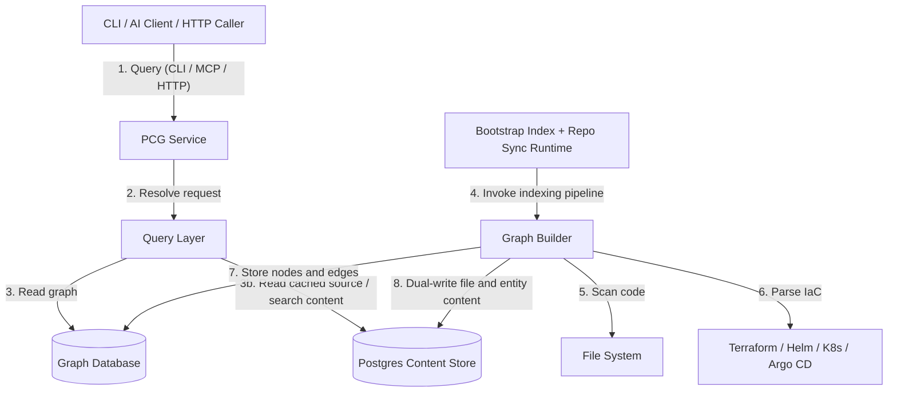

# System Architecture

PlatformContextGraph (PCG) is a **code-to-cloud context graph** that connects repositories, infrastructure definitions, runtime topology, and graph-backed query surfaces.

It can run locally as a CLI and stdio MCP server, or as a deployable service that exposes HTTP API and MCP while continuously maintaining graph state.

## High-Level Diagram

## 1. The Core

The core lives in `src/platform_context_graph`. It is a Python application organized around a shared query model.

| Component | Responsibility |
| :--- | :--- |
| **CLI** | Local command surface for indexing, search, analysis, setup, and runtime management. |
| **MCP Server** | JSON-RPC surface for AI development tools. |
| **HTTP API** | OpenAPI-backed surface for automation and service-to-service use. |
| **Query Layer** | Canonical entity-first query model shared by MCP and HTTP. |
| **Graph Builder** | Indexer that parses code, IaC, and related deployment assets into graph nodes and edges. |
| **Database Layer** | Graph storage, with Neo4j as the canonical deployable-service backend. |
| **Content Store** | PostgreSQL-backed file and entity content cache with workspace fallback for source retrieval. |
| **Runtime Sync / Index** | Bootstrap indexing plus long-running repo sync and re-index behavior in the deployable-service path. |
| **Observability** | Shared OTEL instrumentation for API, MCP, and indexing runtime signals. |

## 2. Public Site and UI

PCG does **not** currently ship a separate marketing site or rich application frontend. The primary user interfaces are:

1. **CLI**
2. **AI chat clients connected over MCP**
3. **HTTP API consumers**
4. **The docs-first public site**

## 3. Data Flow

1. **Indexing**
   - `pcg index .` or the deployable-service runtime scans repositories, parses code and IaC, resolves relationships, and writes graph data to the database.
   - When the content store is configured, the same indexing pass also writes file content and entity snippets into Postgres.
   - In Kubernetes, bootstrap indexing and repo sync are deployment-managed through the runtime containers rather than mutable HTTP control endpoints.
2. **Querying**
   - a user or agent asks a question
   - CLI, MCP, or HTTP resolves the request into the shared query layer
   - the query layer reads the graph and, when needed, the content provider layer
   - the server prefers Postgres for content search and cached reads, then falls back to the shared workspace when the server already has the checkout

## 4. Source Tree Shape

The source package is intentionally organized for contributor readability.

- `api/`: HTTP wiring and routers
- `cli/`: Typer entrypoints, command packages, setup flows, and visualization helpers
- `mcp/`: MCP server, transport, tool registry, and handler wiring
- `content/`: content-store models, dual-write helpers, Postgres provider, and workspace fallback
- `observability/`: OTEL bootstrap, runtime state, and metrics helpers
- `query/`: shared read/query layer
- `runtime/`: repo sync and bootstrap indexing helpers
- `tools/`: graph builder and parser implementations

See [Source Layout](reference/source-layout.md) for the contributor-oriented package map.

## 5. Key Technologies

*   **Language:** Python 3.10+
*   **Parsing:** Tree-sitter plus infrastructure/domain-specific parsers
*   **Protocol:** Model Context Protocol (MCP)
*   **HTTP:** FastAPI + OpenAPI
*   **Database:** Neo4j for the deployable-service path
*   **Packaging:** Docker, Helm, Argo CD examples
