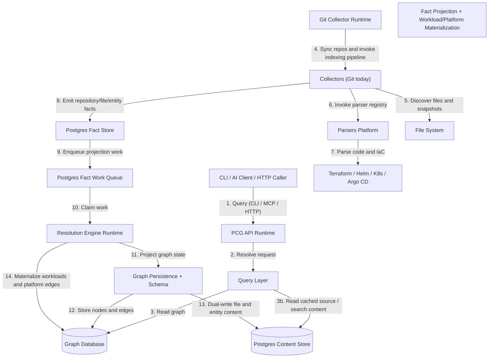

# System Architecture

PlatformContextGraph (PCG) is a code-to-cloud context graph that connects repositories, infrastructure definitions, runtime topology, and graph-backed query surfaces.

It runs in two modes: locally as a CLI and stdio MCP server, or as a deployed service that exposes HTTP API and MCP while continuously maintaining graph state.

Internally, Phase 1 reorganized the monorepo around canonical package boundaries
instead of treating `tools/` as the default home for indexing logic. Phase 2
switches Git indexing to a facts-first write path:

- the Git collector parses repositories and emits durable facts into Postgres
- the fact work queue coordinates projection work
- the Resolution Engine owns canonical graph projection
- query surfaces continue reading the canonical graph and content store

For the current Git cutover, the same Resolution Engine projection path can be
driven in-process by the indexing coordinator so one indexing run still
completes deterministically without depending on a separate runtime hop.

## High-Level Diagram

## Components

| Component | Responsibility |
| :--- | :--- |
| **CLI** | Local command surface for indexing, search, analysis, setup, and runtime management. |
| **MCP Server** | JSON-RPC surface for AI development tools. |
| **HTTP API** | OpenAPI-backed surface for automation and service-to-service use. |
| **Query Layer** | Entity-first query model shared by CLI, MCP, and HTTP. |
| **Collectors** | Source-specific discovery and indexing support. Git is the current canonical collector family and now stops at fact emission instead of owning final graph writes. |
| **Facts Layer** | Typed fact models, durable Postgres-backed fact storage, and the fact work queue. |
| **Parsers** | Parser registry, language parsers, raw-text handling, capability specs, and SCIP parser/runtime helpers. |
| **Graph Layer** | Canonical schema plus graph persistence helpers for files, entities, inheritance, and call relationships. |
| **Resolution** | Resolution Engine orchestration plus fact-to-graph projection, workload materialization, and platform inference. |
| **Database Layer** | Graph storage. Neo4j is the canonical backend for deployed services. |
| **Content Store** | PostgreSQL-backed file and entity content cache for deployed API and MCP runtimes. |
| **Git Collector Runtime** | Long-running repository sync, parse execution, fact emission, and retry/backoff. |
| **Resolution Engine Runtime** | Background or in-process projection of queued facts into the canonical graph. |
| **Observability** | Shared OTEL instrumentation for API, MCP, Git collector, facts queue, and Resolution Engine signals. |

## Interfaces

CLI, MCP, and HTTP API are the primary interfaces. All three share the same query layer — there is no separate UI frontend.

The docs site (built with MkDocs) is the public reference surface.

## Data Flow

### Indexing

`pcg index .` or the deployed Git collector scans repositories, parses code and
IaC, emits repository/file/entity facts into Postgres, and then projects the
canonical graph from those facts.

When the content store is configured, the same indexing pass also writes file content and entity snippets into Postgres.

In Kubernetes, the Git collector owns repo sync, retries, discovery, parsing,
and fact emission. The Resolution Engine owns graph projection. The API runtime
serves independently.

### Facts-First Git Flow

1. The Git collector discovers repositories and parses a repository snapshot.
2. The collector persists repository, file, and parsed-entity facts in Postgres.
3. The collector enqueues one fact projection work item for that repository snapshot.
4. The Resolution Engine claims the work item and loads the stored facts.
5. During indexing cutover, the coordinator can also drive that same work-item
   projection path in-process so one run still completes end-to-end without a
   separate service hop.
6. The Resolution Engine projection path writes repository, file, entity, relationship,
   workload, and platform graph state.
7. Query surfaces continue reading the canonical graph and content store as before.

### Service Telemetry

Each primary runtime now has a clear OTEL surface:

- **API runtime**: HTTP and MCP request spans, durations, and error counters
- **Git collector**: repository queue wait, parse, fact emission, commit/projection, per-repo write timings, Postgres fact-store operation telemetry, and fact-store pool saturation telemetry
- **Resolution Engine**: work-item claim latency, empty-poll outcomes, idle-sleep timing, active-worker gauge, retry age, dead-letter telemetry, fact load spans, per-stage projection timings, stage output counts, and stage failure/error-class counters
- **Facts layer**: Postgres fact-store and fact-queue spans, durations, operation counters, row-volume counters, pool size/availability/waiting telemetry, and queue backlog gauges
- **Fact work queue**: independently sampled queue depth and oldest-item age by work type and status for backlog tracking and autoscaling decisions

These signals are designed to support on-call debugging, backlog monitoring,
performance tuning, and future scale decisions without adding repository or
work-item identifiers to metric labels.

See also:

- [Telemetry Overview](reference/telemetry/index.md)
- [Telemetry Metrics](reference/telemetry/metrics.md)
- [Telemetry Traces](reference/telemetry/traces.md)
- [Telemetry Logs](reference/telemetry/logs.md)

### Querying

1. A user or agent asks a question.
2. CLI, MCP, or HTTP resolves the request into the shared query layer.
3. The query layer reads the graph and, when needed, the content store.
4. Deployed API and MCP runtimes read content from Postgres and report unavailable content until the ingester has populated it.

## Source Tree

The source package is organized by responsibility under `src/platform_context_graph/`:

- `app/` — service-role entrypoints
- `collectors/` — source-specific collection logic
- `facts/` — typed fact models, Postgres storage, queue state, and source-specific fact emission
- `graph/` — canonical graph schema and persistence helpers
- `parsers/` — parser registry, raw-text support, parser capabilities, and SCIP
- `platform/` — shared platform/runtime primitives such as dependency rules, package resolution, and automation-family inference
- `query/` — shared read/query layer
- `resolution/` — Resolution Engine orchestration plus fact projection and materialization helpers
- `runtime/` — runtime role management, ingester, and status helpers
- `tools/` — `GraphBuilder` facade plus the remaining tool-facing query and linking surfaces

See [Source Layout](reference/source-layout.md) for the full package map.

## Key Technologies

- **Language:** Python 3.10+
- **Parsing:** Tree-sitter plus infrastructure-specific parsers
- **Protocol:** Model Context Protocol (MCP)
- **HTTP:** FastAPI + OpenAPI
- **Database:** Neo4j
- **Content Store:** PostgreSQL
- **Packaging:** Docker, Helm, Argo CD
