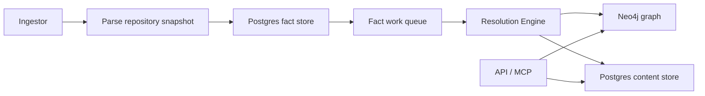

# Deployment Overview

PlatformContextGraph supports both a local full-stack workflow and a deployed
split-service workflow. The supported production shape is a three-runtime
deployment:

- **API** for HTTP and MCP
- **Ingestor** for repository sync, parsing, and fact emission
- **Resolution Engine** for queued projection and recovery workflows

Both the ingestor and resolution-engine use the same facts-first data flow and
write into external Neo4j and external Postgres.

## Choose A Deployment Path

| Path | Best for | What you get |
| --- | --- | --- |
| [Docker Compose](docker-compose.md) | local full-stack testing | Neo4j, Postgres, OTEL collector, Jaeger, bootstrap-index, API, ingestor, and resolution-engine |
| [Helm](helm.md) | supported Kubernetes deployment | split API, ingestor, and resolution-engine workloads with optional ServiceMonitor support |
| [Argo CD](argocd.md) | GitOps-managed Kubernetes deployment | Helm-based deployment through GitOps overlays |
| [Minimal Manifests](manifests.md) | smallest raw manifest example | a single-runtime API example, not the full split-service production shape |

## Deployed Runtime Flow

## Platform Differences

| Surface | Docker Compose | Helm / Argo CD | Minimal Manifests |
| --- | --- | --- | --- |
| Runtime shape | full local stack | supported production shape | single-runtime example |
| API | yes | yes | yes |
| Ingestor | yes | yes | no |
| Resolution Engine | yes | yes | no |
| Bootstrap Index | yes, one-shot service | manual or operator-run activity | no |
| Shared repo workspace | bind-mounted local fixture or host path | ingestor-only PVC | statefulset-local only |
| Direct `/metrics` ports | yes | optional | not packaged |
| Kubernetes `ServiceMonitor` | no | optional | no |

## Production Defaults

The intended production shape assumes:

- external Neo4j
- external Postgres
- attached workspace storage only on the ingestor
- API and resolution-engine remaining stateless
- OTLP and JSON-log observability enabled
- optional direct scrape endpoints and `ServiceMonitor` resources per runtime

Use [Service Runtimes](service-runtimes.md) for the operator contract and
[Helm](helm.md) for the exact deployment values.
