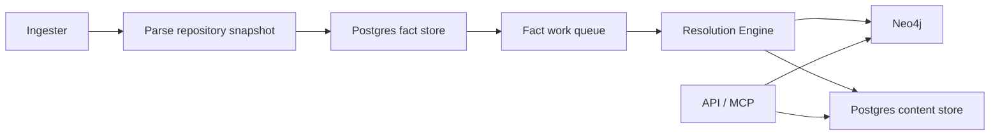
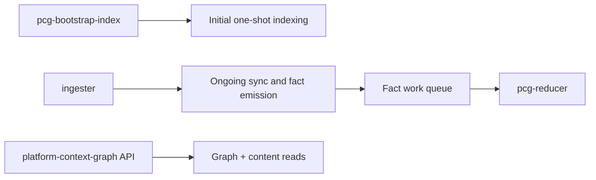

# Service Runtimes

Use this page when you need the operator view of PlatformContextGraph:

- which services exist
- what each service owns
- which command starts each service
- which service should be tuned or scaled
- where metrics are exposed
- where `ServiceMonitor` applies

Every long-running runtime should also follow one operator principle:

- the service should expose a familiar admin/status story through the shared
  report seam
- the same service should be inspectable through CLI now and API/admin
  transport once mounted
- the exact counters may differ by runtime, but the operator experience should
  not

For the Go rewrite, that contract is the same for every long-running service:

- `/healthz` and `/readyz` describe process health and readiness
- `/metrics` exposes runtime and backlog signals
- `/admin/status` renders the shared status/report shape
- the CLI and HTTP/admin views should render the same underlying report
- live-versus-inferred state must be explicit in both views

Current branch caveat:

- the platform is still not fully Go-owned end to end
- `collector-git`, `ingester`, and `bootstrap-index` now use Go-owned
  repository selection, repo sync, per-repo snapshot collection, and content
  shaping on the normal Git runtime path
- local `pcg index`, `pcg workspace index`, `pcg watch`, MCP
  `add_code_to_graph`, MCP `watch_directory`, and `pcg ecosystem index/update`
  now all launch the Go `bootstrap-index` runtime for normal local refresh and
  bootstrap behavior instead of the legacy Python parser/coordinator path
- when `SCIP_INDEXER=true`, the Go collector now owns SCIP language detection,
  external `scip-*` indexer execution, protobuf reduction, and Go tree-sitter
  supplementation on the collector path instead of bouncing through Python
- the legacy Python snapshot/coordinator runtime stack has been deleted from
  the branch
- the remaining cutover debt is now outside the normal collector hot path:
  parser-matrix completion plus the last Python helper, finalization,
  recovery, and admin ownership removals
- no new ingestor family should start until the Python finalization/recovery
  ownership is gone and the parser cutover is proven end to end

## Runtime Contract

| Runtime | Owns | Default command | Storage access | Metrics exposure | Kubernetes shape |
| --- | --- | --- | --- | --- | --- |
| API | HTTP API, MCP, query reads, admin endpoints | `pcg serve start --host 0.0.0.0 --port 8080` | graph + content reads only | direct `/metrics`, optional `ServiceMonitor` | `Deployment` |
| Ingester | repo sync, parsing, fact emission, workspace ownership | `/usr/local/bin/pcg-ingester` | workspace PVC + Postgres + Neo4j | direct `/metrics`, optional `ServiceMonitor` | `StatefulSet` |
| Resolution Engine | queue draining, projection, retries, replay, recovery | `/usr/local/bin/pcg-reducer` | Postgres + Neo4j | direct `/metrics`, optional `ServiceMonitor` | `Deployment` |
| Bootstrap Index | one-shot initial indexing | `/usr/local/bin/pcg-bootstrap-index` | workspace + Postgres + Neo4j | direct `/metrics` in Compose | one-shot local helper |

## Health, Status, And Completeness

- `/healthz` and `/readyz` answer process health and readiness only.
- `/admin/status` reports the live runtime stage, backlog, and failure state.
- `GET /api/v0/index-status` and `GET /api/v0/index-runs/{run_id}` answer
  checkpointed indexing completeness for a path or recorded run.
- `GET /api/v0/index-runs/{run_id}/coverage` narrows the completeness view to
  the repository rows that still need attention.
- A service can be healthy while indexing is incomplete. Operators should use
  completeness routes before assuming a full run has finished.
- `bootstrap-index` remains a one-shot helper for empty or recovered
  environments, not a steady-state health target.

## Git Cutover Runtime Status

The rewrite branch also has three local proof runtimes that exercise the Go
data plane directly.

They are not yet separate deployed Kubernetes workloads in the public chart,
but they do follow the same shared admin contract:

- `collector-git`: `go run ./cmd/collector-git`
- `projector`: `go run ./cmd/projector`
- `reducer`: `go run ./cmd/reducer`

`collector-git` owns cycle orchestration, source-mode repository selection,
repo sync, durable fact commit, per-repo snapshot collection, content shaping,
the optional SCIP collector path, and the shared admin surface in Go.

The remaining cutover work is no longer a selector or snapshot bridge problem.
It is now centered on parser-matrix completion plus the separate Python-owned
runtime/finalization seams that are slated for deletion before merge. The merge
target is full Go service ownership, not a maintained dual-path runtime.

## Admin Contract

For the Go rewrite path, every long-running service should converge on the same
operator/admin contract:

- one shared status/report seam
- one CLI surface for local and on-host inspection
- one reusable HTTP/admin adapter that can be mounted by a runtime without
  redefining the report shape
- one API/admin surface when the transport is mounted
- explicit live-versus-inferred labeling
- stage, backlog, success, and failure summaries in a familiar shape

This is intentionally a platform rule, not a one-off `admin-status` feature.
Operators should not need a different mental model for collector, projector,
reducer, or future background services.

Current rewrite status:

- `go/internal/status/` owns the shared reader/report seam
- `go/cmd/admin-status/` renders that report through the local CLI
- `go/internal/status/http.go` provides the reusable HTTP transport adapter
- `go/internal/runtime/admin.go` provides the shared runtime probe and admin
  route mount for `/healthz`, `/readyz`, optional `/metrics`, and optional
  `/admin/status`
- hosted Go runtimes can now compose that shared admin server into their
  lifecycle without bespoke HTTP bootstrap code
- `collector-git`, `projector`, and `reducer` all mount that shared admin
  surface in their local proof lanes
- the collector proof lane now uses native Go selection, repo sync, snapshot
  collection, content shaping, and optional SCIP execution/parsing; the
  deleted `source_python_bridge.go` entrypoint shims are no longer part of the
  branch, and the remaining non-Go ownership is now centered on parser-matrix
  completion plus Python runtime and recovery/finalization seams

## Incremental Refresh And Reconciliation

PCG should refresh incrementally by default and reconcile instead of forcing a
full re-index whenever possible.

- the `ingester` should reconcile only the scopes and generations that changed
- the `resolution-engine` should drain queued follow-up work and shared
  corrections from durable state
- `bootstrap-index` remains the one-shot escape hatch for empty environments or
  operator recovery
- future collector services should follow the same scope/generation contract
  rather than inventing a second freshness model

This means operators should use status, queue age, and generation state before
choosing to restart or reindex. A full re-index is a recovery tool, not the
normal freshness path.

## Naming Note

The public runtime name remains `ingester`.

Operators should still scale, monitor, and troubleshoot the `ingester`
runtime, but the deployed process is now the dedicated Go binary
`/usr/local/bin/pcg-ingester` instead of a Python CLI shim.

## Deployed Flow

## Local Full-Stack Flow

## API

### Responsibilities

- serve HTTP and MCP requests
- read canonical graph state from Neo4j
- read file and entity content from Postgres
- serve operator/admin endpoints

### Does not own

- repository sync
- parsing
- fact emission
- queued projection work

### Deployments

- Compose service: `platform-context-graph`
- Helm template: `deploy/helm/platform-context-graph/templates/deployment.yaml`
- IaC chart template: `chart/templates/deployment.yaml`

### Signals to watch

- request latency and error rate
- MCP/tool latency
- content read latency
- graph query latency

Scale the API when request traffic rises. Do not scale it to fix queue backlog.

## Ingester

### Responsibilities

- discover and sync repositories
- own the shared workspace in Kubernetes
- parse repository snapshots
- emit facts into Postgres
- hand off durable projection work to the Go-owned write plane

### Why it stays stateful

The ingester is the only long-running runtime that should mount the workspace
PVC in Kubernetes.

### Deployments

- Compose service: `ingester`
- Helm template: `deploy/helm/platform-context-graph/templates/statefulset.yaml`
- IaC chart template: `chart/templates/statefulset.yaml`

### Signals to watch

- repository queue wait
- parse duration
- fact emission duration
- fact-store SQL latency
- workspace disk pressure

Scale or tune the ingester when parsing is the bottleneck or workspace pressure
is rising.

## Resolution Engine

### Responsibilities

- claim fact work items
- load facts from Postgres
- project repository, file, entity, relationship, workload, and platform state
- persist projection decisions and bounded evidence
- manage retry, replay, dead-letter, and recovery workflows

### Deployments

- Compose service: `resolution-engine`
- Helm template:
  `deploy/helm/platform-context-graph/templates/deployment-resolution-engine.yaml`
- IaC chart template: `chart/templates/deployment-resolution-engine.yaml`

### Signals to watch

- queue depth and queue age
- claim latency
- per-stage projection duration
- per-stage output counts
- retry and dead-letter pressure
- Postgres queue and fact-store saturation

Scale the resolution-engine when queue age rises and workers remain busy. If
queue age rises together with Postgres contention, fix database pressure before
adding more workers.

## Bootstrap Index

Bootstrap indexing is a one-shot operator activity, not a long-running
Kubernetes workload in the public Helm chart.

Use it when you want to:

- materialize an initial repository set quickly
- reduce cold-start time on a brand-new environment
- validate end-to-end indexing against a known repository set

Today it is packaged directly in Docker Compose and can also be run manually as
a direct process. Treat repeated restarts or long-running bootstrap activity as
an incident.

## Metrics And ServiceMonitor

### Local Compose

Compose exposes direct runtime scrape endpoints you can curl:

- API: `http://localhost:19464/metrics`
- Ingester: `http://localhost:19465/metrics`
- Resolution Engine: `http://localhost:19466/metrics`

### Kubernetes

Helm can expose the same runtime metrics over dedicated ports and can also
render `ServiceMonitor` resources for:

- API
- Ingester
- Resolution Engine

`ServiceMonitor` does not apply to the bootstrap helper because it is not a
steady-state Kubernetes service in the public chart.

## Operator Defaults

- treat API, ingester, and resolution-engine as separate scaling units
- keep the workspace mounted only on the ingester in Kubernetes
- use direct `/metrics` endpoints for local verification
- use `ServiceMonitor` only for the long-running Kubernetes runtimes
- treat the local proof runtimes as milestone-validation tools until later
  rewrite milestones promote them into steady-state deployed shapes
- treat the shared admin/status report as the first place to look for live,
  inferred, backlog, and failure state
- prefer incremental scope refresh and reconciliation over platform-wide
  re-indexing
- use the [Telemetry Overview](../reference/telemetry/index.md) to decide which
  signal to inspect first
- use the [Local Testing Runbook](../reference/local-testing.md) before calling
  a change ready
