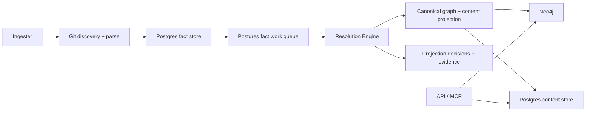

# Service Runtimes

PlatformContextGraph runs as a three-service platform with one shared image and
one shared facts-first data flow.

Use this page when you need to answer:

- What services exist in the deployed platform?
- What does each service own?
- What command starts each service?
- How are the services built and deployed?
- Which service should be tuned or scaled first?

## Runtime Map

| Runtime | Primary responsibility | CLI command | Code entrypoint | K8s shape |
| --- | --- | --- | --- | --- |
| **API** | Serve HTTP API and MCP, read canonical graph and content | `pcg serve start --host 0.0.0.0 --port 8080` | `platform_context_graph.cli.main:start_service` | `Deployment` |
| **Ingester** | Sync repositories, run Git collector, emit facts, drive indexing | `pcg internal repo-sync-loop` | `platform_context_graph.runtime.ingester:run_repo_sync_loop` | `StatefulSet` |
| **Resolution Engine** | Claim fact work items, resolve/project graph state | `pcg internal resolution-engine` | `platform_context_graph.resolution.orchestration.runtime:start_resolution_engine` | `Deployment` |
| **Bootstrap Index** | One-shot initial sync/index pass before steady-state loops | `pcg internal bootstrap-index` | `platform_context_graph.cli.main:run_bootstrap_index` | Compose one-shot / init-style runtime |

## Shared Build Contract

All runtimes are built from the same repository and the same Docker image:

```bash
docker build -t platform-context-graph:dev -f Dockerfile .
```

What changes between runtimes is the command and environment, not the image:

- Compose uses the same image with different `command:` values.
- Helm uses the same image repository and tag across API, ingester, and
  resolution-engine.
- Argo CD deploys the Helm chart that renders those workload-specific commands.

## End-To-End Flow



## API Runtime

### What it owns

- HTTP API
- MCP-over-HTTP / combined service surface
- graph-backed query flows
- content-store reads
- admin endpoints

### What it does not own

- repository sync
- parsing
- fact emission
- queued projection work

### Entry command

```bash
pcg serve start --host 0.0.0.0 --port 8080
```

### Deployments

- Compose service: `platform-context-graph`
- Helm template: `deploy/helm/platform-context-graph/templates/deployment.yaml`
- IaC chart template: `chart/templates/deployment.yaml`

### Signals to watch

- request latency and error rate
- MCP/tool latency
- graph query latency
- content read latency

Scale the API when request traffic rises. Do not scale it to fix backlog in the
facts queue.

## Ingester Runtime

### What it owns

- repository discovery and sync
- workspace maintenance
- Git collector execution
- file parsing and snapshot creation
- fact emission into Postgres
- one indexing run’s inline projection path during cutover

### Why it stays stateful

The ingester owns the shared repository workspace and should be the only runtime
with the workspace PVC mounted in Kubernetes.

### Entry commands

Steady-state loop:

```bash
pcg internal repo-sync-loop
```

One-shot bootstrap:

```bash
pcg internal bootstrap-index
```

### Deployments

- Compose services: `bootstrap-index`, `repo-sync`
- Helm template: `deploy/helm/platform-context-graph/templates/statefulset.yaml`
- IaC chart template: `chart/templates/statefulset.yaml`

### Signals to watch

- repository queue wait
- parse duration
- fact emission duration
- fact store SQL latency
- inline projection timing
- workspace disk pressure

Scale or tune the ingester when parse throughput is the bottleneck. Do not scale
it when the queue is growing because the Resolution Engine is saturated.

## Resolution Engine Runtime

### What it owns

- fact work-item claiming
- queue backlog draining
- fact loading from Postgres
- graph projection
- workload and platform materialization
- projection decision persistence and bounded evidence recording
- retries, dead-letter handling, and replay path
- operator recovery visibility for replay-event and backfill-driven workflows

### Entry command

```bash
pcg internal resolution-engine
```

### Deployments

- Compose service: `resolution-engine`
- Helm template:
  `deploy/helm/platform-context-graph/templates/deployment-resolution-engine.yaml`
- IaC chart template: `chart/templates/deployment-resolution-engine.yaml`

### Signals to watch

- queue depth
- queue oldest age
- claim latency
- active workers
- per-stage projection duration
- per-stage output count
- projection decision volume and confidence-band drift
- retry and dead-letter pressure
- Postgres queue/fact-store pool saturation

Scale the Resolution Engine when queue age rises and workers stay busy. If claim
latency or Postgres pool contention rises at the same time, fix database pressure
before scaling workers blindly.

## Bootstrap Index Runtime

Bootstrap indexing is not a long-running service, but operators still need to
understand it because it is part of the deployment story.

It exists to:

- materialize the initial repository set
- seed graph/content state
- reduce “cold empty graph” time after deploy

It should finish and exit. If it stays running or restarts repeatedly, treat that
as a deployment incident.

## Build And Run Each Runtime Locally

Build once:

```bash
docker build -t platform-context-graph:dev -f Dockerfile .
```

Run with Compose:

```bash
docker compose up --build
```

Run as direct local processes against an existing stack:

```bash
PYTHONPATH=src uv run pcg serve start --host 0.0.0.0 --port 8080
PYTHONPATH=src uv run pcg internal repo-sync-loop
PYTHONPATH=src uv run pcg internal resolution-engine
PYTHONPATH=src uv run pcg internal bootstrap-index
```

## Operator Defaults

- Treat **API**, **Ingester**, and **Resolution Engine** as separate scaling units.
- Treat **Bootstrap Index** as a one-shot deployment activity, not a steady-state
  workload.
- Use the [Telemetry Overview](../reference/telemetry/index.md) to decide which
  signal to inspect first.
- Use the [Local Testing Runbook](../reference/local-testing.md) before calling a
  change ready.
