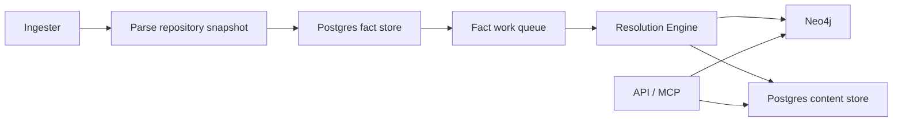
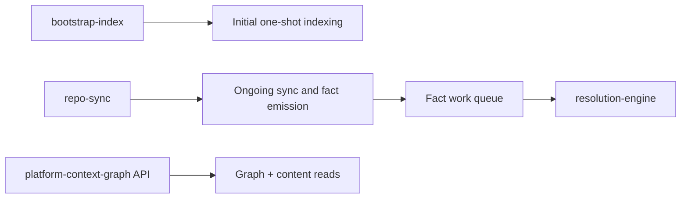

# Service Runtimes

Use this page when you need the operator view of PlatformContextGraph:

- which services exist
- what each service owns
- which command starts each service
- which service should be tuned or scaled
- where metrics are exposed
- where `ServiceMonitor` applies

## Runtime Contract

| Runtime | Owns | Default command | Storage access | Metrics exposure | Kubernetes shape |
| --- | --- | --- | --- | --- | --- |
| API | HTTP API, MCP, query reads, admin endpoints | `pcg serve start --host 0.0.0.0 --port 8080` | graph + content reads only | direct `/metrics`, optional `ServiceMonitor` | `Deployment` |
| Ingester | repo sync, parsing, fact emission, workspace ownership | `pcg internal repo-sync-loop` | workspace PVC + Postgres + Neo4j | direct `/metrics`, optional `ServiceMonitor` | `StatefulSet` |
| Resolution Engine | queue draining, projection, retries, replay, recovery | `pcg internal resolution-engine` | Postgres + Neo4j | direct `/metrics`, optional `ServiceMonitor` | `Deployment` |
| Bootstrap Index | one-shot initial indexing | `pcg internal bootstrap-index` | workspace + Postgres + Neo4j | direct `/metrics` in Compose | one-shot local helper |

## Deployed Flow

## Local Full-Stack Flow

## API

### Responsibilities

- serve HTTP and MCP requests
- read canonical graph state from Neo4j
- read file and entity content from Postgres
- serve operator/admin endpoints

### Does not own

- repository sync
- parsing
- fact emission
- queued projection work

### Deployments

- Compose service: `platform-context-graph`
- Helm template: `deploy/helm/platform-context-graph/templates/deployment.yaml`
- IaC chart template: `chart/templates/deployment.yaml`

### Signals to watch

- request latency and error rate
- MCP/tool latency
- content read latency
- graph query latency

Scale the API when request traffic rises. Do not scale it to fix queue backlog.

## Ingester

### Responsibilities

- discover and sync repositories
- own the shared workspace in Kubernetes
- parse repository snapshots
- emit facts into Postgres
- drive deterministic inline projection during indexing cutover

### Why it stays stateful

The ingester is the only long-running runtime that should mount the workspace
PVC in Kubernetes.

### Deployments

- Compose service: `repo-sync`
- Helm template: `deploy/helm/platform-context-graph/templates/statefulset.yaml`
- IaC chart template: `chart/templates/statefulset.yaml`

### Signals to watch

- repository queue wait
- parse duration
- fact emission duration
- fact-store SQL latency
- workspace disk pressure

Scale or tune the ingester when parsing is the bottleneck or workspace pressure
is rising.

## Resolution Engine

### Responsibilities

- claim fact work items
- load facts from Postgres
- project repository, file, entity, relationship, workload, and platform state
- persist projection decisions and bounded evidence
- manage retry, replay, dead-letter, and recovery workflows

### Deployments

- Compose service: `resolution-engine`
- Helm template:
  `deploy/helm/platform-context-graph/templates/deployment-resolution-engine.yaml`
- IaC chart template: `chart/templates/deployment-resolution-engine.yaml`

### Signals to watch

- queue depth and queue age
- claim latency
- per-stage projection duration
- per-stage output counts
- retry and dead-letter pressure
- Postgres queue and fact-store saturation

Scale the resolution-engine when queue age rises and workers remain busy. If
queue age rises together with Postgres contention, fix database pressure before
adding more workers.

## Bootstrap Index

Bootstrap indexing is a one-shot operator activity, not a long-running
Kubernetes workload in the public Helm chart.

Use it when you want to:

- materialize an initial repository set quickly
- reduce cold-start time on a brand-new environment
- validate end-to-end indexing against a known repository set

Today it is packaged directly in Docker Compose and can also be run manually as
a direct process. Treat repeated restarts or long-running bootstrap activity as
an incident.

## Metrics And ServiceMonitor

### Local Compose

Compose exposes direct runtime scrape endpoints you can curl:

- API: `http://localhost:19464/metrics`
- Ingester: `http://localhost:19465/metrics`
- Resolution Engine: `http://localhost:19466/metrics`

### Kubernetes

Helm can expose the same runtime metrics over dedicated ports and can also
render `ServiceMonitor` resources for:

- API
- Ingester
- Resolution Engine

`ServiceMonitor` does not apply to the bootstrap helper because it is not a
steady-state Kubernetes service in the public chart.

## Operator Defaults

- treat API, ingester, and resolution-engine as separate scaling units
- keep the workspace mounted only on the ingester in Kubernetes
- use direct `/metrics` endpoints for local verification
- use `ServiceMonitor` only for the long-running Kubernetes runtimes
- use the [Telemetry Overview](../reference/telemetry/index.md) to decide which
  signal to inspect first
- use the [Local Testing Runbook](../reference/local-testing.md) before calling
  a change ready
