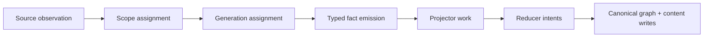

# Collector Authoring Guide

Use this guide when adding a new collector family such as AWS, Kubernetes,
SQL/data systems, or another source that should feed the shared PCG data plane.
The current parser/runtime stack is implemented in the checked-in services, so
new collector work should start from the current service and parser boundaries
documented here rather than introducing alternate runtime seams.

The goal is not to teach one collector how to fit the current Git path. The
goal is to make every new ingestor follow the same platform contract so the
system can grow without core rewrites.

## Non-Negotiable Rules

- One collector family owns one source-truth boundary.
- Collectors observe and normalize source truth; they do not own canonical
  graph correlation.
- Source-local projection belongs to projector logic, not to the API and not to
  ad hoc finalization hooks.
- Cross-source or cross-domain correlation belongs to reducers.
- Parser discovery, parser selection, and content shaping belong to the
  collector/parser platform boundary, not to finalization hooks or API repair
  code.
- New collectors must reuse the shared admin, telemetry, logging, and
  configurability contract.
- Do not add post-commit sidecar repair hooks or alternate runtime ownership
  for normal-path production behavior.

If a design needs bespoke post-commit or repair behavior outside the shared Go
runtime, it is almost certainly landing in the wrong place.

## The Collector Contract

Every new collector should be able to explain one bounded work unit end to end:

The collector itself owns only the first four stages:

- source observation
- scope assignment
- generation assignment
- typed fact emission

Everything after that should reuse platform-owned projection and reduction
contracts.

## What A Collector Must Define

Before implementation starts, lock these decisions:

1. Source truth
   What system is authoritative for this collector: Git, cloud APIs,
   Kubernetes API, warehouse metadata, query history, or something else?
2. Scope model
   What is the bounded unit of ingestion: repository, account, region, cluster,
   workspace, dataset, or another durable shard?
3. Generation model
   What counts as one authoritative snapshot replacement for that scope?
4. Fact model
   Which typed facts are emitted before any projector or reducer work begins?
5. Failure model
   Which failures are retryable, terminal, rate-limit driven, or source-auth
   related?
6. Operator model
   Which health, backlog, concurrency, and pool-tuning signals must be visible
   to operators?

If those six points are still fuzzy, the collector is not ready for
implementation.

## Runtime Requirements

Every collector runtime should be operable in the same way as the rest of the
platform.

Required capabilities:

- CLI entrypoint for local development and controlled replay
- `/healthz` and `/readyz` semantics for process health and readiness
- `/admin/status` or the shared status seam when the runtime mounts HTTP admin
- `/metrics` with service, queue, retry, and pool-pressure signals
- structured JSON logs with trace and correlation fields
- configurable database pools, worker counts, queue depths, and runtime limits

For deployed services, prefer environment or chart/config-driven tuning over
hard-coded values.

## Implementation Sequence

Follow this order so the collector lands on stable boundaries:

1. Update the published architecture or workflow docs if the source changes a
   runtime or ownership rule.
2. Define scope and generation identity.
3. Define typed fact payloads and validation rules.
4. Implement source observation and normalization.
5. Emit facts into the durable store.
6. Reuse projector and reducer contracts for downstream work.
7. Add telemetry, traces, logs, and admin/status surfacing.
8. Add local and cloud validation gates.
9. Update docs before calling the slice complete.

Do not reverse that order by starting with answer shaping, graph mutations, or
temporary repair hooks.

## Verification Gates

At minimum, a new collector should ship with:

- unit tests for normalization, identity, and fact serialization
- replay or fixture-backed integration tests for one full scope generation
- projector or reducer integration tests when the collector changes downstream
  materialization
- telemetry and logging verification for the new runtime
- local operator runbook updates
- cloud validation steps that prove the collector can run independently

The release gate should never depend on live production credentials.

## Required Documentation Updates

When a collector lands, update these repo-hosted docs in the same milestone:

- [System Architecture](../architecture.md)
- [Source Layout](../reference/source-layout.md)
- [Relationship Mapping](../reference/relationship-mapping.md) when the new
  source changes traversal or canonical relationship meaning
- [Local Testing Runbook](../reference/local-testing.md)
- [Cloud Validation Runbook](../reference/cloud-validation.md)
- [Telemetry Overview](../reference/telemetry/index.md)
- any current deployment, workflow, or service-level reference docs that
  explain how operators run or validate the collector today

Future workers should be able to onboard to the collector from docs alone
without guessing which service owns truth.

## Anti-Patterns

Avoid these patterns even if they look faster in the short term:

- writing canonical graph edges directly from the collector because the reducer
  does not exist yet
- encoding source-specific meaning in generic fallback fields
- using full re-index as the normal freshness path
- hiding source gaps or partial coverage behind optimistic status output
- creating a second admin or metrics shape that only one collector uses
- reintroducing compatibility shims or alternate runtime paths for new
  production behavior

Those patterns all increase coupling and make the next collector harder to add.
