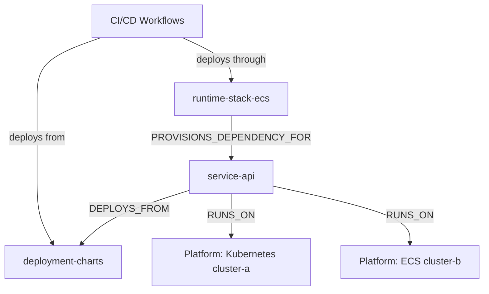
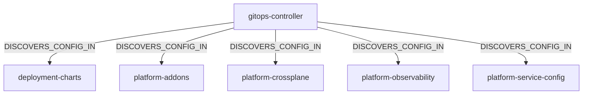
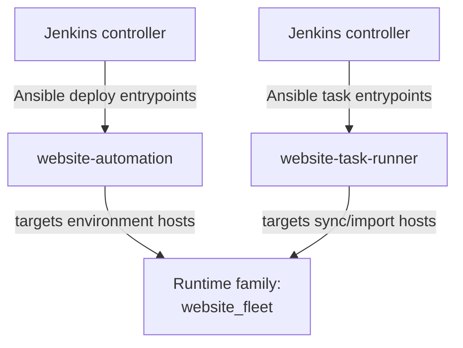
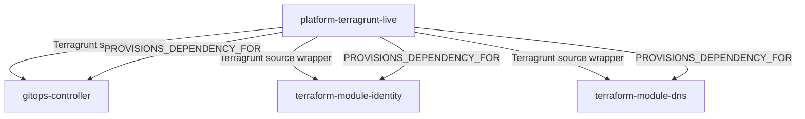

# Relationship Graph Examples

These diagrams show the kinds of deployment and dependency paths PlatformContextGraph can explain once a repository corpus is indexed.

They are intentionally sanitized for public documentation, but each pattern below is based on real end-to-end acceptance runs against mixed code, infrastructure, GitOps, Terraform, Terragrunt, Jenkins, and Ansible repos.

If you want the underlying semantics behind these examples, start with the [Relationship Mapping reference](../reference/relationship-mapping.md).

## Why These Examples Matter

The hard part is usually not finding one file. It is connecting the full path:

- which repo owns the service
- which repo holds the deployment config
- which platform it actually runs on
- which infra repo provisions it
- which controller or automation flow moves it there

These examples show the shapes PCG can reconstruct from that evidence.

## Service With Dual Runtime Paths

One service can legitimately have more than one deployment path. PCG should preserve that instead of flattening everything into one generic dependency.

Read this as:

- the service deploys from a charts or manifest repo onto Kubernetes
- the same service also has a Terraform-driven ECS path
- the infra stack provisions dependency context for the service

## GitOps Control Plane Discovery

Control-plane repos are often about configuration discovery, not direct service ownership. PCG keeps that distinction explicit.

Read this as:

- the GitOps repo acts as a control plane
- it discovers deployment configuration in multiple config repos
- this is different from saying it directly owns the application runtime

## Jenkins And Ansible Automation Path

Not every deployment estate is GitHub Actions plus Kubernetes. PCG can also surface controller-driven automation paths such as Jenkins invoking Ansible against a website fleet.

Read this as:

- Jenkins acts as the controller
- Ansible playbooks and task entrypoints express the automation path
- runtime-family hints identify the target as a website-fleet style platform

## Terragrunt And Terraform Module Source Chains

Terragrunt orchestration repos can encode important upstream relationships even when the service repo itself never references those module repos directly.

Read this as:

- Terragrunt source blocks can reveal upstream controller and module dependencies
- those source chains enrich the repo-level provisioning story
- PCG can surface both the raw source-chain evidence and the higher-level dependency meaning

## How To Use These In Practice

For day-to-day analysis:

1. Start with the top-level `story` in `get_repo_summary` or `trace_deployment_chain`.
2. Use `deployment_overview` to inspect grouped supporting context.
3. Drop to detailed relationship fields only when you need exact source repos, artifacts, or paths.

That order keeps the answer readable while preserving the evidence needed for debugging or review.
