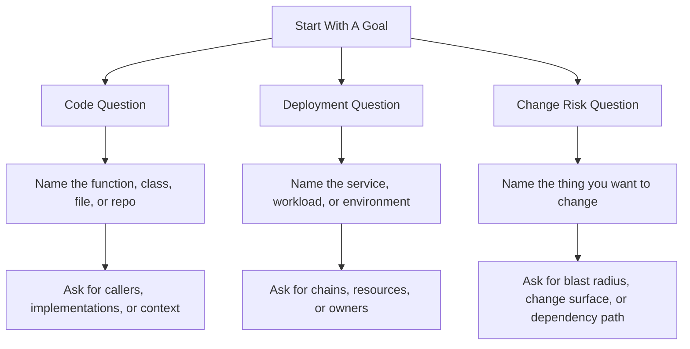

# Starter Prompts

Use these prompts when you want fast, high-signal answers from PlatformContextGraph through MCP, the API, or a graph-aware assistant.

Start with the shortest prompt that matches your goal. If you need a narrower answer, add the environment, workload, repository, or resource name.

The highest-value PCG prompts usually do one extra thing: they tell PCG to
scan all related repositories, deployment sources, and indexed documentation
before answering. That is where PCG shines compared with repo-local assistants.

## Start Here

### Cross-repo framing

Use this framing when you want PCG to work as a code-to-cloud system, not just
as a single-repo search tool:

- "Scan all related repositories, deployment sources, and indexed documentation involved in `<service>` in `<environment>`, then explain it."
- "Using all linked repos and runtime context, build the story for `<service>`."
- "Across every repository that contributes to `<service>`, trace the GitOps and runtime path."

Good substitutions:

- service or workload name
- environment such as `ops-qa`, `staging`, or `prod`
- doc shape such as story, runbook, explainer, onboarding guide, or investigation guide

### Software engineering

- "Who calls `process_payment` across all indexed repos?"
- "Show me the most complex functions in `payments-service`."
- "What code is dead in `api-gateway`?"
- "Find the implementation of `PaymentProvider` across indexed repos."
- "Explain the dependency path between `checkout-service` and `shared-auth-lib`."

### SRE and incident response

- "Trace the full deployment chain for `platformcontextgraph` in `ops-qa`."
- "What is the blast radius if `platformcontextgraph-postgresql` is degraded in `ops-qa`?"
- "Show me every workload that depends on this queue."
- "Trace this resource back to the code and repository that define it."
- "Compare `prod` and `staging` for `checkout-service` and show what changed."

### Platform engineering

- "Show me which repos and manifests define the `platformcontextgraph` deployment in `ops-qa`."
- "Trace `platformcontextgraph` from Helm values to Kubernetes resources."
- "What repositories influence the image tag and runtime settings for this service?"
- "Explain how the API, ingester, and resolution-engine are split across code and deployment config."
- "Show me the code-to-cloud path for changing resource limits on `platformcontextgraph-resolution-engine`."

### Repo sync and ingest debugging

- "Find the code paths responsible for repo sync authentication and explain how GitHub App auth is resolved."
- "Who calls the repo-sync Git helpers, and where is the Git subprocess environment built?"
- "Show me the blast radius of changing repo-sync auth behavior in the ingester."
- "Find all code involved in clone, fetch, default-branch resolution, and workspace locking."
- "Explain the dependency path between the ingester runtime and GitHub App credentials."

### Documentation and support

- "Explain this service to a new engineer, then cite the repos, manifests, and files that matter most."
- "Generate an architecture and deployment explainer for `platformcontextgraph` in `env-qa`."
- "Create a support runbook for `sample-service-api` in `production`, including the fastest places to investigate request, auth, config, and deploy issues."
- "Show me the source and docs evidence behind this explanation."
- "Trace this service from ArgoCD values layers to rendered Kubernetes resources, then tell me which files I should read first."

### Cross-repo documentation and GitOps

- "Scan all related repositories, deployment sources, and indexed documentation involved in `platformcontextgraph` in `ops-qa`, then give me a complete service story."
- "Using all linked repositories, deployment sources, and indexed documentation, create an on-call runbook for `platformcontextgraph` in `ops-qa`."
- "Across every repository that contributes to `platformcontextgraph`, trace it from ArgoCD ownership to values layers to rendered Kubernetes resources."
- "Generate documentation for `platformcontextgraph` after scanning all involved repositories, deployment sources, and indexed documentation."
- "Build a platform-engineering explainer for `platformcontextgraph` using graph context plus stored content across all linked repos."
- "Using all related repos and runtime dependencies, tell me the fastest places to investigate auth, database, repo-sync, and deployment failures for `platformcontextgraph`."

## Prompt Patterns

### To understand code

Use:

- "Who calls `<function>`?"
- "What does `<service>` depend on?"
- "Where is `<symbol>` implemented?"
- "Show me the most complex functions in `<repo>`."

Best additions:

- repository name
- exact symbol name
- environment, if the answer depends on deployment state

### To understand deployments

Use:

- "Trace the deployment chain for `<service>`."
- "What infrastructure does `<workload>` depend on?"
- "Trace `<resource>` back to code."
- "Show me the repos and manifests that define `<service>` in `<env>`."
- "Trace `<service>` from ArgoCD values to rendered Kubernetes resources in `<env>`."

Best additions:

- environment name such as `ops-qa`, `staging`, or `prod`
- workload or service name
- resource name or canonical id

### To assess change risk

Use:

- "What breaks if I change `<service>`?"
- "What is the blast radius of modifying `<module>`?"
- "What change surface is affected if I update `<resource>`?"
- "Explain why `<repo A>` and `<repo B>` are connected."

Best additions:

- exact target you plan to change
- target environment
- whether you want direct or transitive impact

### To generate documentation

Use:

- "Explain `<service>` to a new engineer."
- "Generate an architecture or deployment explainer for `<service>`."
- "Create a support runbook for `<service>` in `<env>`."
- "Show me the source and docs evidence behind this explanation."

Best additions:

- audience such as support, onboarding, service owner, or platform engineering
- environment
- whether you want exact files, manifests, docs, or runtime resources cited
- whether PCG should scan all related repos and deployment sources first

### To use PCG's cross-repo strength

Use:

- "Scan all related repositories, deployment sources, and indexed documentation involved in `<service>`."
- "Using all linked repositories and runtime context, explain `<service>`."
- "Across every repository that contributes to `<service>`, trace the GitOps path in `<env>`."
- "Create a `<runbook|explainer|story>` for `<service>` after scanning all related repos."

Best additions:

- exact service or workload name
- environment
- audience
- output shape such as story, support guide, onboarding doc, or deployment explainer

## Better Answers Fast

- Ask for one thing at a time first. Start with the workload, repo, or resource you care about.
- Add the environment when the answer could differ between `prod`, `stage`, or `ops-qa`.
- Use exact names when you have them. Exact repo, workload, and resource names usually produce better results than broad descriptions.
- Ask for evidence when you want proof. Prompts like "show the repos, manifests, and resources involved" steer the answer toward traceable output.
- When the answer spans code, deployment, and runtime, explicitly ask PCG to scan all related repositories first.
- For documentation prompts, let PCG tell the story first and ask for exact files second. That keeps the answer concise and portable.
- Follow up in layers. Start with "trace the deployment chain," then ask "what repos define those resources?" and then "what breaks if I change this?"

## Good Follow-Ups

- "Now narrow that to `ops-qa`."
- "Show only the repos and files involved."
- "Explain the highest-confidence dependency path."
- "What is shared versus dedicated in that dependency set?"
- "Which part of that path is most likely to break first?"

## When To Use The MCP Cookbook

This page is for natural-language prompts you can use immediately.

If you want the exact MCP tool names, argument shapes, and JSON examples behind those prompts, go to the [MCP Cookbook](../reference/mcp-cookbook.md).
