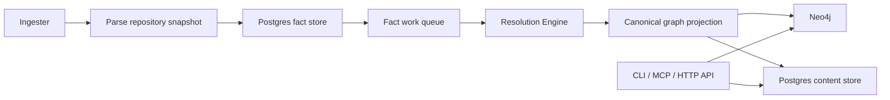

# PlatformContextGraph

**Code-to-cloud context graph for engineers, operators, and AI systems.**

PlatformContextGraph gives you one queryable model across repositories,
infrastructure, workloads, and deployment topology. Use it to answer code
questions, trace infrastructure back to source, inspect shared dependencies, and
run AI tooling against real system context instead of partial local state.

[Quickstart](getting-started/quickstart.md){ .md-button .md-button--primary }
[Deployment Overview](deployment/overview.md){ .md-button }
[MCP Guide](guides/mcp-guide.md){ .md-button }
[HTTP API](reference/http-api.md){ .md-button }

## Why Teams Reach For PCG

- **Engineers** use it to trace callers, dependencies, and cross-repo impact.
- **Platform and DevOps teams** use it to connect code, deploy paths, and
  infrastructure ownership.
- **SRE and on-call** use it to inspect shared resources, queue pressure, and
  deployment relationships during incidents.
- **AI tooling** uses it through MCP and HTTP to answer questions against the
  real system, not just one checkout.

Examples:

- "Who calls `process_payment` across all indexed repos?"
- "What deploys this service into QA and prod?"
- "Which workloads share this database?"
- "Trace this resource back to the code that defines it."

## Get Started

## Choose Your Path

### Try PCG locally

Use the CLI when you want to index one repository quickly and ask questions
immediately.

- [Installation](getting-started/installation.md)
- [Quickstart](getting-started/quickstart.md)
- [CLI Reference](reference/cli-reference.md)

### Connect an AI client

Use MCP when you want an assistant to ask graph-backed questions over your code
and infrastructure.

- [MCP Guide](guides/mcp-guide.md)
- [MCP Reference](reference/mcp-reference.md)
- [MCP Cookbook](reference/mcp-cookbook.md)

### Run the platform

Use the deployment docs when you want the shared multi-service runtime with
continuous indexing, queue-backed projection, and operator observability.

- [Deployment Overview](deployment/overview.md)
- [Service Runtimes](deployment/service-runtimes.md)
- [Docker Compose](deployment/docker-compose.md)
- [Helm](deployment/helm.md)
- [Argo CD](deployment/argocd.md)

### Understand the model

Use the concept and architecture docs when you want to understand the internal
workflow, graph model, and runtime boundaries.

- [How It Works](concepts/how-it-works.md)
- [Graph Model](concepts/graph-model.md)
- [System Architecture](architecture.md)
- [Telemetry Overview](reference/telemetry/index.md)

## Runtime Flow

## What PCG Does Well

- **Cross-repository analysis**: callers, callees, dead code, and complexity
  across large repository sets.
- **Code-to-cloud tracing**: start from a workload, deployment object, or cloud
  resource and trace back to the defining code.
- **Impact analysis**: estimate blast radius and shared infrastructure impact
  before you merge or deploy.
- **Shared operator model**: API, ingester, and resolution-engine use one
  coherent facts-first workflow and one observability story.

## Keep Going

- [Use Cases](use-cases.md)
- [Relationship Graph Examples](guides/relationship-graphs.md)
- [Local Testing Runbook](reference/local-testing.md)
- [Troubleshooting](reference/troubleshooting.md)
