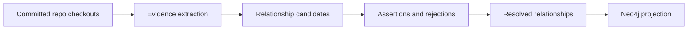

# Relationship Mapping

PlatformContextGraph resolves repository-to-repository relationships in four stages:

1. Ingest repositories and persist repo-scoped graph and content state.
2. Collect relationship evidence from graph state and raw infrastructure files.
3. Resolve that evidence into canonical relationships.
4. Project the resolved relationships back into Neo4j for queries.

This page documents how the mapping works today, why some relationships are typed instead of flattened into `DEPENDS_ON`, and how to add new mappings for additional tools.

## Pipeline

Repository relationship mapping is intentionally a post-index step. We wait until the repos in scope have been indexed and committed before we correlate them.



Current implementation:

- checkout identities come from `relationships/execution.py`
- evidence facts are emitted by `relationships/execution.py` and `relationships/file_evidence.py`
- resolution happens in `relationships/resolver.py`
- generations, assertions, and resolved rows are persisted through `relationships/postgres.py` and `relationships/postgres_generation.py`
- the active resolved generation is projected back into Neo4j by `relationships/execution.py`

Postgres is the canonical store for evidence, candidates, assertions, and resolved generations. Neo4j is the read model used by the existing query surfaces.

## Current Evidence Sources

PCG currently combines graph-derived evidence with raw file-based evidence.

| Source | Signals | Relationship type today |
| :--- | :--- | :--- |
| Existing graph edges | `Workload-[:DEPENDS_ON]->Workload`, plus a narrow allowlist of explicit cross-repo edges such as `USES_MODULE` | `DEPENDS_ON`, `PROVISIONS_DEPENDENCY_FOR` |
| Terraform / Terragrunt files | `app_repo`, `app_name`, `api_configuration`, Cloud Map names, config paths, GitHub repo references | `PROVISIONS_DEPENDENCY_FOR` |
| Helm charts and values | chart repository references, values references, chart dependency references | `DEPLOYS_FROM` |
| Kustomize files | `resources`, Helm chart blocks, image references | `DEPLOYS_FROM` |
| ArgoCD ApplicationSets | Git generators that discover `config.yaml` or similar environment config in another repo, plus deploy-source repos referenced by the discovered config | `DISCOVERS_CONFIG_IN`, `DEPLOYS_FROM` |

Evidence is stored as `RelationshipEvidenceFact` rows with:

- `evidence_kind`
- `relationship_type`
- `source_repo_id`
- `target_repo_id`
- `confidence`
- `rationale`
- `details`

The `details` payload should contain the specific file path, matched value, extractor name, and any other context needed to explain the mapping later.

## Relationship Semantics

The resolver does not treat every repo-to-repo link the same way.

### `DEPENDS_ON`

Use `DEPENDS_ON` as a compatibility summary edge or when the source repo materially relies on the target repo and there is not a more specific semantic available yet.

Good current examples:

- a repo-level dependency inferred from workload-to-workload runtime dependencies

In the current implementation, typed canonical relationships also emit a derived compatibility `DEPENDS_ON` edge so existing repo-level dependency queries still work without flattening away the more specific relationship.

### `DISCOVERS_CONFIG_IN`

Use `DISCOVERS_CONFIG_IN` when the source repo is a control-plane or orchestration repo that scans another repo for deployable configuration.

Good current example:

- `iac-eks-argocd -> iac-eks-observability`

That edge means ArgoCD in `iac-eks-argocd` discovers environment configuration in `iac-eks-observability`. It does not mean those repos have a generic application dependency in the same sense as a service depending on a library or a Terraform stack depending on an app repo.

### `DEPLOYS_FROM`

Use `DEPLOYS_FROM` when the source repo or deployable subject is deployed from the manifests, charts, overlays, or release artifacts owned by the target repo.

Examples we expect to support:

- `api-node-bw-home -> helm-charts`
- `api-node-whisper -> helm-charts`
- `service-runtime -> service-manifests`

`DEPLOYS_FROM` and `DISCOVERS_CONFIG_IN` are related but not interchangeable:

- `DISCOVERS_CONFIG_IN` answers where the control plane looks for discovery or environment inputs
- `DEPLOYS_FROM` answers which repo supplies the deployable manifests, charts, or release artifacts for the source repo or workload

Some systems may legitimately emit both in the same deployment chain, but not necessarily for the same repo pair.

### Typed edges beat generic edges

If the resolver sees both:

- a typed edge such as `DISCOVERS_CONFIG_IN`
- and a generic `DEPENDS_ON`

for the same `(source_repo_id, target_repo_id)` pair, it keeps the typed edge and suppresses the generic inferred one. This prevents coarse graph hints from overwriting a better semantic mapping.

After canonical typed resolution, the resolver derives a compatibility `DEPENDS_ON` edge for the dependency direction implied by the typed relationship unless that generic edge was explicitly rejected.

## Typed Relationship Vocabulary

Only some of these types are implemented today. The rest are the preferred vocabulary for future mappings so we can extend the model without flattening everything back to `DEPENDS_ON`.

| Relationship type | Status | Use it when | Example |
| :--- | :--- | :--- | :--- |
| `DEPENDS_ON` | Implemented as compatibility and fallback | the source materially relies on the target and no more specific type is reliable yet, or existing query surfaces still need a summary edge | `api-node-search -> api-node-forex` |
| `DISCOVERS_CONFIG_IN` | Implemented | a control-plane repo scans another repo for deployable config or environment-specific overlays | `iac-eks-argocd -> iac-eks-observability` |
| `DEPLOYS_FROM` | Implemented | the source repo or deployable subject is deployed from manifests, charts, or release artifacts sourced from the target repo | `api-node-bw-home -> helm-charts` |
| `PROVISIONS_PLATFORM` | Implemented on the graph/workload side | the source provisions the runtime platform used by downstream services | Terraform stack provisions ECS or EKS |
| `RUNS_ON` | Implemented on the graph/workload side | the source service or deployment target runs on the platform owned by the target | `workload-instance:api-node-search:bg-qa -> platform:kubernetes:bg-qa` |
| `PROVISIONS_DEPENDENCY_FOR` | Implemented for Terraform/Terragrunt repo mapping | the source provisions AWS or platform resources that a target workload depends on, but does not deploy the workload itself | `terraform-stack-external-search -> api-node-external-search` |

Start with the most specific truthful type. If the available evidence does not justify the more specific type, use `DEPENDS_ON` and capture that limitation in the rationale and follow-up notes.

## Direction Matters

When you add a mapping, write the edge so the source is the repo or subject whose behavior is being explained.

Examples:

- ArgoCD repo discovers config in another repo:
  `iac-eks-argocd -[:DISCOVERS_CONFIG_IN]-> iac-eks-observability`
- Service repo deploys from Helm manifests or charts owned by another repo:
  `api-node-whisper -[:DEPLOYS_FROM]-> helm-charts`
- Service repo deploys from Kustomize overlays or manifests owned by another repo:
  `api-node-bw-home -[:DEPLOYS_FROM]-> helm-charts`
- Terraform stack points at an app repo:
  `terraform-stack-whisper -[:PROVISIONS_DEPENDENCY_FOR]-> api-node-whisper`

Do not write `DEPLOYS_FROM` from the control plane unless the control-plane repository itself is the deployed subject.

## How To Add A New Mapping

Use this process for every new tool or deployment pattern.

### 1. Choose the semantic relationship first

Before writing code, answer:

- what is the source repo doing
- what is the target repo providing
- is the source discovering config, deploying artifacts, provisioning runtime, or depending on runtime resources

Prefer a typed relationship when the tool semantics are clear. Fall back to `DEPENDS_ON` only when a more specific type would be misleading or premature.

A good shortcut is:

- if the source scans another repo for overlays, config, or discovery inputs, prefer `DISCOVERS_CONFIG_IN`
- if the source repo or deployable subject is deployed from manifests, charts, or release artifacts owned by another repo, prefer `DEPLOYS_FROM`
- if the source creates platform or runtime infrastructure, prefer `PROVISIONS_PLATFORM` or `PROVISIONS_DEPENDENCY_FOR`
- if none of those is well supported by the evidence yet, use `DEPENDS_ON`

### 2. Decide where the evidence should come from

Use raw file extractors when the signal lives in checked-in configuration and is not already modeled well in the graph.

Current examples:

- Terraform and Terragrunt values
- Helm `Chart.yaml` and `values*.yaml`
- Kustomize `kustomization.yaml`
- ArgoCD `ApplicationSet` generators

Use graph-derived evidence when the signal already exists as reliable graph state.

### 3. Emit a `RelationshipEvidenceFact`

For raw file mappings, add a focused helper in `src/platform_context_graph/relationships/file_evidence.py` and call it from `discover_checkout_file_evidence(...)`.

For graph-derived mappings, extend `discover_repository_dependency_evidence(...)` in `src/platform_context_graph/relationships/execution.py`.

Each emitted evidence fact must include:

- a stable `evidence_kind`
- the chosen `relationship_type`
- a confidence score
- a plain-language rationale
- `details` with file path, matched token, extractor name, and any tool-specific context

### 4. Preserve explainability

Every relationship should be explainable from stored evidence. If a human cannot inspect the evidence preview and understand why the edge exists, the mapping is too opaque.

### 5. Add observability with the mapping

Every extractor must keep the shared observability conventions:

- JSON logging only
- stable `event_name`
- mapping-specific dimensions under `extra_keys`
- OTEL spans around the extractor itself

Current relationship events include:

- `relationships.discover_file_evidence.completed`
- `relationships.discover_evidence.completed`
- `relationships.persist_generation.completed`
- `relationships.project.completed`
- `relationships.resolve.completed`
- `relationships.resolve.failed`

Current span families include:

- `pcg.relationships.discover_evidence`
- `pcg.relationships.discover_evidence.terraform`
- `pcg.relationships.discover_evidence.helm`
- `pcg.relationships.discover_evidence.kustomize`
- `pcg.relationships.discover_evidence.file`
- `pcg.relationships.resolve_repository_dependencies`
- `pcg.relationships.project`

Platform graph materialization also emits graph-side runtime semantics through `graph_builder_workloads.py`. In this slice, `Platform` stays graph-internal rather than being pushed through the Postgres repo-to-repo resolver.

Keep custom log fields under `extra_keys`, for example:

- `run_id`
- `generation_id`
- `scope`
- `repo_count`
- `evidence_count`
- `<tool>_evidence_count`

### 6. Add tests before trusting the mapping

At minimum:

- unit tests for the extractor or graph evidence logic
- resolver tests for relationship-type behavior
- a fixture or corpus validation that proves the positive cases match
- a negative case that proves unrelated repos stay unrelated

### 7. Validate against a mixed corpus

A useful validation corpus should include:

- obvious matches
- non-obvious matches where repo names do not line up
- control-plane chains such as ArgoCD -> config repo -> Helm repo -> service repo
- intentionally unrelated repos

## Adding Future Tool Mappings

The extension model is meant to support more than Terraform and ArgoCD.

### GitHub Actions

Potential signals:

- workflow `uses` blocks
- checked-out repository refs
- deploy steps that reference Helm charts, Kustomize overlays, or repo-owned manifests
- image build and publish jobs tied to specific repos

Likely relationship choices:

- `DISCOVERS_CONFIG_IN` when workflows scan another repo for environment config
- `DEPLOYS_FROM` when workflows clearly deploy manifests, charts, or release artifacts sourced from another repo
- `DEPENDS_ON` only when the relationship is genuinely generic

### FluxCD

Potential signals:

- `GitRepository`
- `Kustomization`
- `HelmRelease`
- `HelmRepository`

Likely relationship choices:

- `DISCOVERS_CONFIG_IN` when Flux watches another repo for deployment config
- `DEPLOYS_FROM` when a Flux object clearly deploys from a target Git or Helm source
- `DEPENDS_ON` when the best currently supported semantic is a generic repo dependency

### Terragrunt

Potential signals:

- `terraform` source blocks
- `dependency` blocks
- shared input values that point at application repos, modules, or platform repos

Terragrunt often acts as a coordination layer above Terraform. If the semantics are clear enough, prefer typed relationships instead of flattening everything into `DEPENDS_ON`.

## Review Checklist For New Mappings

Before merging a new mapping, confirm:

- the relationship direction matches the real control flow
- the chosen relationship type is more accurate than `DEPENDS_ON`, or `DEPENDS_ON` is genuinely the right fallback
- evidence details are specific enough to explain the match later
- logs are JSON and follow the shared envelope
- spans and log correlation fields are present
- unrelated repos remain unmatched
- typed edges do not get collapsed back into generic edges for the same implied dependency pair

## Example Multi-Chain

One real pattern from the local test corpus looks like this:

```text
iac-eks-argocd
  DISCOVERS_CONFIG_IN -> iac-eks-observability
  DISCOVERS_CONFIG_IN -> helm-charts

api-node-bw-home
  DEPLOYS_FROM -> helm-charts

api-node-external-search
  DEPLOYS_FROM -> helm-charts

api-node-whisper
  DEPLOYS_FROM -> helm-charts
```

That chain is more useful than a flattened graph of generic dependencies because it preserves the control-plane meaning of the ArgoCD repo while still keeping downstream service relationships queryable.
