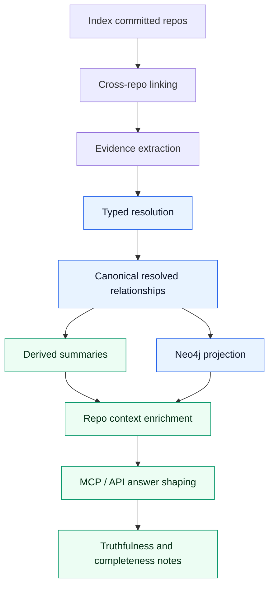
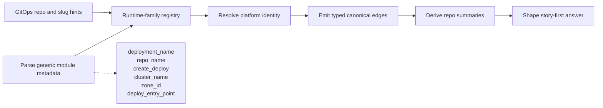
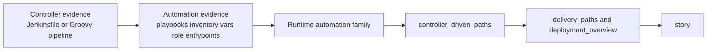

# Relationship Mapping

PlatformContextGraph resolves repository-to-repository relationships in a dynamic, evidence-backed flow. The important part is not just what edges exist, but when each stage runs, which stage owns truth, and which results are only derived summaries for answering questions.

If you want public, example-driven diagrams of the relationship shapes this produces, see the [Relationship Graph Examples guide](../guides/relationship-graphs.md).
If you want the logging, tracing, and verification companion for this flow, see
[Relationship Mapping Observability](relationship-mapping-observability.md).

The rule of thumb is:

- index first
- link repos across checkout boundaries
- extract evidence from graph state and raw files
- resolve typed relationships with precedence rules
- derive summaries for repository context
- shape the final MCP/API answer from those summaries
- explain truthfulness and completeness explicitly when evidence is partial

## Ownership By Stage

One of the easiest ways to introduce bugs in dynamic mappings is to let one stage do the job of another. The table below is the guardrail.

| Stage | Owns | Allowed to emit | Must not do |
| :--- | :--- | :--- | :--- |
| Index | parsed files, graph entities, raw properties | graph state | infer cross-repo truth from partial data |
| Cross-repo linking | repo identity and reference normalization | candidate repo links | invent semantic relationship types |
| Evidence extraction | explainable facts from graph or files | evidence facts with `evidence_kind`, rationale, confidence | collapse meaning to `DEPENDS_ON` for convenience |
| Typed resolution | canonical meaning and precedence | typed canonical edges and compatibility derivations | shape user-facing prose |
| Repo-context enrichment | nearby supporting context | deployment artifacts, workflow summaries, consumer summaries | override canonical truth |
| MCP/API answer shaping | concise explanation | `story`, `deployment_overview`, notes | invent new edges or hide completeness gaps |

If a change feels ambiguous, start by asking which stage actually owns the decision. That usually reveals the right place to implement it.

## End-To-End Flow



## Traversal Rules

The repo-to-file traversal rule is now explicit:

- use `REPO_CONTAINS` for flat `Repository -> File` lookups
- use `CONTAINS*` only when you genuinely need directory ancestry, file-descendant entities, or arbitrary descendant traversal

That distinction matters because a lot of dynamic mapping work starts from repo-local files:

- Terraform and Terragrunt evidence often starts as `Repository -> File -> TerraformModule`
- Terragrunt helper-path provenance can also stay attached to `TerragruntConfig` metadata first, then surface on the query path as truthful config-discovery relationships such as `include`, `read_terragrunt_config`, `find_in_parent_folders`, and repo-local config assets
- GitOps and workflow evidence often starts as `Repository -> File -> K8sResource` or `Repository -> File -> workflow/config entity`
- MCP and query hot paths often need file counts, entrypoint scans, or content discovery without walking the directory tree

The safe pattern is:

```text
Repository -[:REPO_CONTAINS]-> File -[:CONTAINS*]-> entity
```

The unsafe pattern for flat lookups is:

```text
Repository -[:CONTAINS*]-> File
```

Keep `CONTAINS*` when the query is actually about the tree, not just about locating files inside a repo.

## Contract-First Relationship Verbs

The historical Python relationship pipeline and fixture corpus were organized
around verb coverage, not parser checklists. The Go branch needs to keep that
same contract explicit.

These verbs define the relationship-parity bar on this branch:

- `PROVISIONS_DEPENDENCY_FOR`
- `PROVISIONS_PLATFORM`
- `RUNS_ON`
- `DEPLOYS_FROM`
- `DISCOVERS_CONFIG_IN`
- `DEPENDS_ON`
- `DEFINES`
- `INSTANCE_OF`
- `USES_MODULE`

Not every verb lives at the same layer:

- repository-scoped canonical relationships include `DEPLOYS_FROM`,
  `DISCOVERS_CONFIG_IN`, `PROVISIONS_DEPENDENCY_FOR`,
  `PROVISIONS_PLATFORM`, `RUNS_ON`, `USES_MODULE`, and compatibility
  `DEPENDS_ON`
- runtime topology also depends on graph structure such as
  `Repository -[:DEFINES]-> Workload`,
  `Workload <-[:INSTANCE_OF]- WorkloadInstance`, and
  `WorkloadInstance -[:RUNS_ON]-> Platform`
- deployment-path answers may additionally expose derived
  `DEPLOYMENT_SOURCE` context when they are backed by lower-layer canonical
  evidence, but that remains read-side detail rather than a current canonical
  relationship type

A family is not done because a parser emitted metadata. It is done only when
the right verb survives persistence, projection, and query-visible proof.

## Story-First Answer Contract

MCP and HTTP responses now intentionally expose a top-level `story` field on `get_repo_summary` and `trace_deployment_chain`.

Use it this way:

1. read `story` first for the concise answer
2. read `deployment_overview` next for grouped supporting context
3. read the detailed fields only when you need exact evidence rows, file paths, or artifact lists

That keeps answer shaping consistent:

- `story` is the short narrative
- `deployment_overview` is the grouped summary data
- raw fields are the evidence-heavy drill-down surface

Do not make the caller reconstruct the main narrative from `delivery_paths`, `consumer_repositories`, `hostnames`, and `deployment_artifacts` unless they explicitly need that level of detail.

### 1. Index

PCG starts with committed checkouts and the graph state created by indexing. Relationship mapping is intentionally post-index. We do not try to infer cross-repo truth from half-indexed repositories.

### 2. Cross-repo linking

The mapping code builds stable checkout identities, then matches repo references, paths, chart URLs, workflow refs, and related repo names against the local corpus. This is where a file-level token becomes a candidate cross-repo link.

### 3. Evidence extraction

Evidence comes from two places:

- graph-derived signals that already exist in the modeled graph
- raw file extractors that read checked-in infrastructure or workflow config

Each evidence fact stores the relationship type, confidence, rationale, and details needed to explain the match later.

### 4. Typed resolution

The resolver deduplicates evidence, applies assertions and rejections, and chooses the most truthful relationship type available. This is where precedence matters.

Canonical relationship types today are:

- `DEPENDS_ON`
- `DISCOVERS_CONFIG_IN`
- `DEPLOYS_FROM`
- `PROVISIONS_DEPENDENCY_FOR`
- `USES_MODULE`
- `RUNS_ON`

Typed relationships are canonical. Downstream graph materialization and query layers also use related runtime edges such as `PROVISIONS_PLATFORM`, `DEFINES`, `INSTANCE_OF`, and `DEPLOYMENT_SOURCE`, but those are not currently resolver-owned relationship types on this branch.

### Resolution Precedence Order

When multiple signals compete, resolve in this order:

1. explicit assertions and rejections
2. typed relationships with direct tool-semantic evidence
3. typed relationships with weaker heuristic evidence
4. downstream compatibility shaping when a consumer still needs a generic `DEPENDS_ON` view
5. generic fallback only if no stronger truthful type exists

This is the main rule that keeps the graph from becoming a pile of vague `DEPENDS_ON` edges.

### 5. Derived summaries

After resolution, repository context enrichment builds derived summaries from
the resolved relationships plus normal read-path artifact extraction. These
summaries are for answering questions, not for redefining canonical truth.

The current derived summaries include:

- `deployment_artifacts`
- `delivery_workflows`
- `delivery_paths`
- `consumers`
- `shared_config_paths`
- `relationship_overview`
- `deployment_overview`
- `story`

### 6. Repo context enrichment

The query layer uses the resolved relationships to look up related repositories
and collect supporting context. This is where deployment artifacts are
assembled from related repos and read-side artifact extraction such as
Kustomize policy-document config paths, Terragrunt dependency `config_path`
values, and Compose runtime hints.

Repository-level platform counts and stories should follow the canonical
runtime shape:

- `Repository -[:DEFINES]-> Workload`
- `Workload <-[:INSTANCE_OF]- WorkloadInstance`
- `WorkloadInstance -[:RUNS_ON]-> Platform`

Do not count platforms from a direct `Repository -[:RUNS_ON]-> Platform` hop in
new query work. That shortcut undercounts once canonical runtime ownership
stays on workload instances.

### 7. MCP / API answer shaping

The query surfaces do not invent new canonical relationships. They choose how to present the already-resolved evidence, derived summaries, and limitations.

### 8. Truthfulness and completeness notes

If evidence is incomplete, ambiguous, or corpus-specific, the answer should say so. Do not upgrade a weak signal into a strong semantic edge just to make the output look cleaner.

## Canonical Versus Derived

Canonical relationships live in the relationship store and are projected into Neo4j for queries. Derived data lives on the read side and is built from canonical relationships plus nearby repo content.

That distinction matters:

- canonical relationships answer "what was actually observed and resolved"
- derived summaries answer "what related context should be shown to the user"

Do not flatten every mapping into `DEPENDS_ON`. The more specific typed edge is what keeps the graph truthful.

### Why Direction Matters

Write the edge in the direction of the behavior being explained.

- `gitops-control-plane -[:DISCOVERS_CONFIG_IN]-> platform-observability`
- `payments-api -[:DEPLOYS_FROM]-> helm-charts`
- `terraform-stack-search -[:PROVISIONS_DEPENDENCY_FOR]-> search-api`

If the source is the control plane, keep the control-plane source on the left. If the source is the deployed workload or service, keep that workload on the left.

### Shared Infrastructure Must Stay First-Class

The old relationship guides were explicit that shared infrastructure is core
PCG behavior, not optional enrichment. Do not flatten shared runtime and
network repositories into a generic dependency bucket just because the story
gets shorter.

The Go graph needs to keep these distinctions visible:

- repos that provision platforms versus repos that provision application
  dependencies
- dual runtime paths for the same logical service during migration
- workload-level dependencies expressed through canonical `DEPENDS_ON` and
  the workload-instance runtime chain, not a separate `WORKLOAD_DEPENDS_ON`
  relationship type
- controller-driven delivery context that explains how a workload reaches a
  runtime without inventing stronger canonical edges than the evidence
  supports

### Typed Precedence

When the same pair can be described by both a typed relationship and a generic `DEPENDS_ON`, the typed edge wins. The resolver suppresses the weaker generic candidate for the same implied pair, while any compatibility `DEPENDS_ON` view remains a downstream concern rather than a current resolver guarantee on this branch.

The Go reducer and canonical Neo4j writer now preserve that typed meaning end
to end for repository-scoped relationship families such as:

- `DEPLOYS_FROM`
- `DISCOVERS_CONFIG_IN`
- `PROVISIONS_DEPENDENCY_FOR`
- `RUNS_ON`

That keeps the graph:

- more precise
- more queryable
- less likely to overwrite a stronger semantic with a weaker one

## Current Tool Families

The current mapping and enrichment flow understands these families:

| Family | What it reads | What it is used for |
| :--- | :--- | :--- |
| Terraform | `app_repo`, `app_name`, `api_configuration`, Cloud Map names, config paths, GitHub references, platform metadata | `PROVISIONS_DEPENDENCY_FOR` on the resolver path plus downstream platform/runtime context such as `PROVISIONS_PLATFORM` where the materialized graph proves it |
| Terragrunt | Terraform source blocks, dependency blocks, shared inputs, wrapper config, local config assets | Same semantic family as Terraform; parser output keeps `read_terragrunt_config()` opaque, while the read path now surfaces `dependency.config_path`, `read_terragrunt_config`, `include`, `file`, `templatefile`, `*.tfvars`, and local module-source assets plus `terraform.source` on the normal `TerraformModule` surface. When those helper/config paths are explicitly repo-bearing, the canonical Go evidence path now also promotes them as `DISCOVERS_CONFIG_IN` with helper-kind details instead of collapsing them into read-side-only provenance. |
| GitHub Actions | reusable workflow calls, checkout targets, deploy steps, command gating | Reusable workflow refs, explicit cross-repo checkout, and explicit repo-bearing workflow inputs such as `automation-repo` and `workflow_input_repository` emit canonical repo evidence on both the relationship and query paths from source or metadata. Repo-local workflow files under `.github/workflows/*` also surface as read-side `workflow_artifacts` in repository context and story delivery paths, and those workflow artifacts now preserve reusable-workflow repositories, explicit workflow-input repositories, and run-command counts on the Go read path. Local `uses: ./.github/workflows/...` calls still stay non-canonical unless the workflow also carries explicit repo-bearing evidence. Broader workflow delivery-path promotion and richer command-gating semantics beyond those explicit cases remain active parity work on this branch |
| Jenkins / Groovy | Jenkinsfile metadata, stage and command hints, reusable pipeline metadata | Explicit shared-library refs, including `library(...)` step forms, and explicit GitHub repository URLs emit canonical repo evidence. Those canonical facts also preserve the parser-proven controller metadata bundle in evidence details, including entry points, pipeline calls, shell commands, Ansible playbook hints, and config/pre-deploy flags. The Go query path surfaces those controller-artifact summaries directly, and the real `ansible_jenkins_automation` fixture now locks that controller lane down with parser, relationship, and query proof |
| Ansible | playbooks, inventories, `group_vars`, `host_vars`, targeted roles, task entrypoints | The Go path classifies inventories, vars, playbooks, role roots, and task entrypoints explicitly, and playbook content that truthfully resolves against the repo catalog emits canonical role-reference evidence. Jenkins-driven controller artifacts plus repository deployment/story shaping also carry adjacent Ansible inventories, vars, and task entrypoints instead of dropping them on the floor. Root-level playbooks such as `deploy.yml` now participate in canonical role-reference discovery when their content truthfully resolves to a repo, and the same fixture corpus locks that behavior down |
| Docker / Compose | Dockerfile build/runtime hints, Compose services, image wiring, env/config links, dependency hints | Docker Compose build contexts, including shorthand `build: ../repo`, and image refs now emit canonical deploy-source evidence in focused relationship proof, explicit `depends_on` service names now emit canonical dependency evidence when they resolve truthfully through the repo catalog, Dockerfile source labels such as `org.opencontainers.image.source` now emit truthful canonical `DEPLOYS_FROM` evidence, and the Go read side surfaces runtime artifact summaries for both Compose services and Dockerfile stages. The relationship-platform compose proof verifies the live Go runtime for the current Compose deploy-source lane, `depends_on` signals, and the real `service-worker-jobs/Dockerfile` runtime artifact lane, while focused relationship tests keep `build`-context and `image:` evidence pinned independently. Plain Docker base images and `COPY --from` stage aliases remain bounded read-side signals rather than fake repo edges. Broader controller/runtime promotion remains active parity work on this branch |
| ArgoCD | ApplicationSet discovery targets, deploy-source repo URLs, destination clusters | `DISCOVERS_CONFIG_IN`, `DEPLOYS_FROM`, and `RUNS_ON` |
| Helm | chart metadata, values files, chart dependency references | `DEPLOYS_FROM` |
| Kustomize | `resources`, base references, Helm blocks, image references, overlays | `DEPLOYS_FROM` |
| Platform / runtime context | workload and platform modeling resolved through mixed entity ids | downstream graph/materialization edges such as `PROVISIONS_PLATFORM` and `RUNS_ON`, with repository query surfaces now also partitioning typed relationship summaries into controller-driven, workflow-driven, and IaC-driven buckets when the evidence supports it. The controller-driven bucket now covers ArgoCD, Jenkins, and Ansible evidence families instead of flattening Jenkins and Ansible into generic IaC summaries. |

The important constraint is not the tool name itself. The important constraint is whether the tool gives you a truthful, explainable source of repository or platform meaning.

### Mixed-Source Repositories

The Go read path now treats mixed-source repositories as first-class, not as a
single inferred repo type.

That matters for repositories like `iac-eks-argocd` or self-service repos that
legitimately contain several families at once:

- Argo CD Applications and ApplicationSets
- Kustomize overlays
- Helm values or chart references
- Terraform or Terragrunt modules
- Dockerfiles or Docker Compose manifests
- GitHub Actions workflows

Current truth on this branch:

- content-backed infrastructure summaries surface multiple infrastructure
  families at once when the repo contains them
- Docker and GitHub Actions are also surfaced as artifact families from the
  content store, even when they are still evidence-driven rather than
  first-class config entities in the repository context list
- repository context, repository story, and semantic overview now report mixed
  infrastructure/artifact families instead of flattening the repo to one
  deployment surface

Do not downcast a mixed repo to “Terraform repo”, “Argo CD repo”, or “service
repo” if the indexed content proves more than one family is present.

Terraform provider-schema support is now Go-owned on this branch:

The normal Postgres ingestion boundary now proves that runtime ownership in
practice: repository facts are loaded back into a catalog, Terraform fact
batches are matched against that catalog, and evidence rows are persisted to
`relationship_evidence_facts` in the same transaction as the fact commit.

- schema loading, identity-key inference, category classification, and
  schema-driven generic Terraform evidence live in Go under
  `go/internal/terraformschema` and `go/internal/relationships`
- the packaged schema assets live under
  `go/internal/terraformschema/schemas/*.json.gz`
- Python no longer owns any part of the Terraform relationship runtime
  boundary on this branch

## Terraform-Managed Runtime Variants

Terraform-managed runtime summaries need to stay broader than ECS, even when ECS is the first concrete example in our corpus. The parser and summary layers should capture generic deployment-oriented module attributes first, then let the mapping and answer-shaping layers decide whether those attributes describe ECS, Fargate, Elastic Beanstalk, Kubernetes, or another provider/runtime combination.

Today the `TerraformModule` entity exposes portable attributes such as:

- `deployment_name`
- `repo_name`
- `create_deploy`
- `cluster_name`
- `zone_id`
- `deploy_entry_point`

Those attributes are intentionally not ECS-only. They are a generic contract for Terraform module blocks that describe deployable workloads or runtime variants.

Use that contract in this order:

1. parse the module attributes as-is from Terraform or Terragrunt-managed HCL
2. preserve them on the `TerraformModule` entity
3. resolve canonical platform relationships separately
4. derive repo-context summaries such as `service_variants` from the enriched module metadata
5. only then explain ECS-specific, Fargate-specific, or provider-specific meaning in the answer layer

This keeps the parser portable and makes it safe for contributors to add future runtime families without rewriting the semantic contract.

The runtime-specific decision point now lives in a shared Terraform runtime-family registry. That registry owns family-scoped signals such as:

- cluster resource types
- cluster module source patterns
- service module source patterns
- non-cluster support module patterns
- repo-name and slug hints used by GitOps control-plane repositories

ECS and EKS are the first registered families. Future families such as Fargate or Elastic Beanstalk should extend that registry instead of introducing ad hoc checks in multiple layers.

That registry is intentionally shared across more than one stage:

- Terraform evidence extraction uses it to decide which module sources imply `RUNS_ON`
- infrastructure platform inference uses it to decide which repos `PROVISIONS_PLATFORM`
- GitOps platform inference uses it to interpret repo names and slugs before falling back to generic Kubernetes controller hints

### ECS As The First Example, Not The Final Shape

ECS currently uses these attributes to explain variants like direct CodeDeploy-backed services and background jobs. The same pattern should be used for future Terraform-managed deployment targets:

- Fargate or ECS variants can reuse `cluster_name`, `repo_name`, and `create_deploy`
- Elastic Beanstalk style modules can still use `deployment_name` and `deploy_entry_point`
- non-AWS runtimes can map their platform identifiers into the same canonical relationship flow, then optionally surface provider-specific details in the read-side summary

If a future runtime needs new module attributes, add them as generic deployment metadata first, document them here, and only then teach the answer-shaping layer how to describe them.

## Generic Runtime Extension Pattern

The runtime extension pattern should work whether the target is ECS, Fargate, Elastic Beanstalk, Kubernetes, or another cloud/runtime combination.

The sequence is:



The rule is:

- parser layer captures portable deployment concepts
- resolver layer decides canonical relationship meaning
- answer layer explains provider-specific meaning

That means:

- ECS can use `cluster_name`, `repo_name`, and `create_deploy`
- Fargate can reuse the same fields if the module still models a deployable service variant
- Elastic Beanstalk can rely on `deployment_name` and `deploy_entry_point`
- another cloud can still map into `Platform.kind`, `Platform.provider`, `PROVISIONS_PLATFORM`, and `RUNS_ON`

Do not create an ECS-only parser contract just because ECS is the first rich example.

### What To Add For A New Runtime

When a contributor adds support for another Terraform-managed runtime family, the change order should be:

1. extend the shared runtime-family registry with the new family signals
2. add generic parser attributes only if the runtime needs new portable deployment metadata
3. keep provider-specific interpretation out of the parser
4. resolve canonical platform relationships from those attributes plus surrounding infra evidence
5. add read-side summaries only after the canonical relationship meaning is correct
6. update the `story` shaping only after the lower layers are stable

If the feature skips straight to answer shaping, it will drift.

## Deployment Artifacts

Deployment artifacts are the derived pieces of repository context that help answer "what deploys from here?" after the canonical mapping has been resolved.

They are assembled from related repositories and normal read-path artifact
extraction, not invented from a single repo in isolation.

Examples include:

- Helm chart references and chart sources
- image repositories and tags
- service ports and gateway hints
- Kustomize resources, base references, and patches
- shared config paths across multiple deployment sources
- consumer-only repositories that call or reference the service without deploying it
- workflow refs that help explain the delivery path

Use deployment artifacts to enrich answers and summaries. Do not treat them as a replacement for the underlying relationship edge.

## Fixture-Corpus Proof Shape

The historical fixture corpus is still the best truth test for this branch. It
proves the relationship workflow across service repos, Helm/Kustomize deploy
repos, ArgoCD delivery repos, controller-driven automation repos, and shared
infrastructure/runtime Terraform repos.

The minimum proof shape is:

1. extract evidence from the right family
2. resolve the correct verb
3. persist it through the relationship store
4. project the active generation into Neo4j
5. surface the same meaning through query, story, and trace outputs

The remaining open corpus families on this branch are:

- broader Terraform and Terragrunt config-asset extraction beyond the current
  Kustomize policy-document, Terragrunt `dependency.config_path`, Terragrunt
  `read_terragrunt_config()` / `include`, local `file()` / `templatefile()`,
  `*.tfvars` / `*.tfvars.json`, and local module-source read paths,
  plus shared-infra runtime-chain proof
- broader GitHub Actions delivery-path evidence beyond reusable workflows, explicit checkout, explicit repo-bearing workflow inputs, and the now-proven read-side run-command surfacing
- broader Docker / Docker Compose deployment/runtime evidence beyond the now-proven Compose build-context, explicit `depends_on`, image-ref, and read-side runtime artifact surfacing

For each family, ask the same questions:

- which verb should this family prove
- which stage owns that decision
- what query, story, or trace proves it after projection

### Shared Config And Consumer Summaries

Two derived summaries are especially easy to overuse:

- `shared_config_paths`
- `consumer_repositories`

They should help answer:

- which repos appear to share config families with this service
- which repos reference or call this service without deploying it

They should not be used to invent deployment or provisioning relationships by themselves.

On this branch, `shared_config_paths` is now fed by the Go normal read path
from related repositories rather than a deleted Python bridge. The current
Go-backed sources are:

- Kustomize-reachable policy documents that reference SSM parameter families
- Terragrunt `dependency.config_path` values
- Terragrunt `read_terragrunt_config(...)` and `include` / `find_in_parent_folders(...)`
  config references, including the default no-argument
  `find_in_parent_folders()` form that resolves the parent `terragrunt.hcl`
- local Terraform and Terragrunt `file(...)` / `templatefile(...)` config
  assets when the path is repo-local and not a remote module source
- Terraform `*.tfvars` and `*.tfvars.json` files on the normal HCL path
- local Terraform `module.source = "./..."` style module-asset paths when the
  source is repo-local and not a registry or remote module ref

The same Go read path now also preserves per-repo config provenance in
`deployment_overview.delivery_paths` and `deployment_overview.topology_story`
even when a path appears in only one repository. That means Terragrunt
includes, dependency config paths, local `file()` / `templatefile()` assets,
and other repo-local config rows no longer disappear unless another repo
shares the same path.

The compose-backed relationship verification now also exercises
`POST /api/v0/impact/trace-deployment-chain` on the live fixture stack so the
runtime-chain story is proven from the HTTP surface, not only from repository
context summaries.

Broader Terraform and Terragrunt helper forms remain a separate parity lane
for any path that cannot be proven exactly from the checked-in source.

### Story Ordering

The top-level repository `story` is intentionally assembled in a fixed order so users get the highest-signal narrative first:

1. public entrypoints
2. API surface
3. deployment path
4. ingress or service-port cues
5. shared config families
6. consumer-only repositories
7. completeness or limitation notes

That order matters. For example, shared config hints should not appear before the deployment path, and consumer-only repos should not crowd out ingress or platform context.

`deployment_story` itself has an internal preference order:

- direct controller and runtime delivery paths first
- repo-local config provenance next
- shared config family lines after the direct provenance they summarize

The Go repository `direct_story` no longer strips shared-config family lines
out of the first-glance narrative. If a repository has both direct delivery
evidence and shared config families, the direct story now keeps both in order
instead of hiding the shared-config portion behind a secondary field.

1. workflow- and delivery-path-derived deployment lines
2. reusable-workflow handoff plus canonical deploy/provision/runtime context when explicit command rows are missing
3. controller-driven automation lines built from Jenkins or other controllers plus Ansible-style automation evidence
4. controller/runtime fallback lines built from deployment controllers, runtime platforms, and service variants

The reusable-workflow tier matters for repos that hand off deployment to a centralized automation repository. In that case PCG may still emit truthful `delivery_paths` when all of these are already known:

- the repo references a reusable workflow or automation repository
- canonical repo relationships already show deployment sources such as `DEPLOYS_FROM`
- canonical repo relationships already show provisioning sources such as `PROVISIONS_DEPENDENCY_FOR`
- runtime platforms already show where the workload runs

The controller-driven automation tier is for estates where deployment meaning is carried more by controllers and automation entrypoints than by GitHub Actions delivery rows. Jenkins and Ansible are the first example, but the pattern should stay generic:

- controller evidence identifies who starts the automation
- automation evidence identifies what runs, where it targets, and which runtime family it implies
- the resulting path is surfaced as read-side context and story shaping, not as a new canonical relationship family

Only after those three tiers fail should PCG fall back to controller/runtime summaries such as Terraform, CodeDeploy, or service-variant evidence.

### Controller-Driven Automation Extension Pattern

Controller-driven automation should follow the same staged ownership model as the Terraform runtime-family work:



Rules:

- controller extraction should stay tool-semantic and portable
- automation extraction should focus on high-signal surfaces first
- runtime-family inference should stay centralized
- answer shaping should consume the normalized path, not raw repo-specific heuristics

Do not collapse controller-driven automation directly into canonical `DEPLOYS_FROM` or `PROVISIONS_DEPENDENCY_FOR` edges unless the underlying canonical evidence really exists.

## Safe Extension

When adding a new mapping family, follow this order:

1. Decide the semantic relationship first.
2. Choose the best evidence source.
3. Emit explainable evidence with stable metadata.
4. Preserve typed precedence in the resolver.
5. Decide whether the new family should also feed repo-context enrichment.
6. Add positive and negative tests.
7. Validate on a mixed corpus, not just a single synthetic repo pair.

## Dynamic Mapping Checklist

Before merging a new mapping family or runtime interpretation, verify all of these:

1. The parser change is still generic and open-source portable.
2. The new evidence rows are explainable with file paths or graph sources.
3. The resolver precedence is explicit and tested.
4. The direction of the canonical edge matches the actual actor and target.
5. Compatibility `DEPENDS_ON` is derived only after the typed meaning is correct.
6. Repo-context enrichment uses the canonical edge instead of bypassing it.
7. MCP/API `story` gets clearer, not noisier.
8. Partial coverage still produces a truthful note instead of a confident omission.

### Pick The Semantic First

Ask what the source is doing:

- discovering config
- deploying from artifacts
- provisioning runtime resources
- depending on runtime resources

Then choose the most specific truthful type. Fall back to `DEPENDS_ON` only when a more specific type would be misleading or unsupported.

### Keep Evidence Explainable

Every evidence fact should carry:

- a stable `evidence_kind`
- the chosen `relationship_type`
- a confidence score
- a plain-language rationale
- file path or graph source details
- the extractor or family name

If someone cannot inspect the evidence and understand why the edge exists, the mapping is too opaque.

### Preserve Portable Semantics

Keep canonical rules portable and open-source friendly.

- Avoid company-specific repository naming rules as canonical truth.
- Avoid hidden local knowledge that only works in one corpus.
- If a heuristic is useful but narrow, keep it explainable and treat it as a heuristic, not a universal law.

## Operational Companion

Keep the ownership and precedence rules in this document as the canonical
design reference. Use
[Relationship Mapping Observability](relationship-mapping-observability.md)
when you need:

- the logging and tracing families for relationship mapping
- the required verification expectations
- example multi-hop relationship chains for operator debugging
