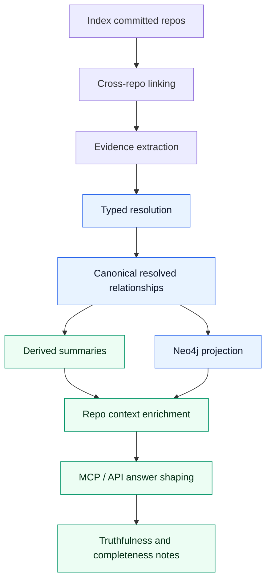

# Relationship Mapping

PlatformContextGraph resolves repository-to-repository relationships in a dynamic, evidence-backed flow. The important part is not just what edges exist, but when each stage runs, which stage owns truth, and which results are only derived summaries for answering questions.

The rule of thumb is:

- index first
- link repos across checkout boundaries
- extract evidence from graph state and raw files
- resolve typed relationships with precedence rules
- derive summaries for repository context
- shape the final MCP/API answer from those summaries
- explain truthfulness and completeness explicitly when evidence is partial

## End-To-End Flow



### 1. Index

PCG starts with committed checkouts and the graph state created by indexing. Relationship mapping is intentionally post-index. We do not try to infer cross-repo truth from half-indexed repositories.

### 2. Cross-repo linking

The mapping code builds stable checkout identities, then matches repo references, paths, chart URLs, workflow refs, and related repo names against the local corpus. This is where a file-level token becomes a candidate cross-repo link.

### 3. Evidence extraction

Evidence comes from two places:

- graph-derived signals that already exist in the modeled graph
- raw file extractors that read checked-in infrastructure or workflow config

Each evidence fact stores the relationship type, confidence, rationale, and details needed to explain the match later.

### 4. Typed resolution

The resolver deduplicates evidence, applies assertions and rejections, and chooses the most truthful relationship type available. This is where precedence matters.

Canonical relationship types today are:

- `DEPENDS_ON`
- `DISCOVERS_CONFIG_IN`
- `DEPLOYS_FROM`
- `PROVISIONS_DEPENDENCY_FOR`

- `PROVISIONS_PLATFORM`
- `RUNS_ON`

Typed relationships are canonical. A compatibility `DEPENDS_ON` edge may be derived later so older query surfaces still work, but the typed edge is the actual statement of meaning.

### 5. Derived summaries

After resolution, repository context enrichment builds derived summaries from the resolved relationships and related config repositories. These summaries are for answering questions, not for redefining canonical truth.

The current derived summaries include:

- `deployment_artifacts`
- `delivery_workflows`
- `delivery_paths`
- `consumer_repositories`
- `shared_config_paths`
- hostnames
- API surface hints

### 6. Repo context enrichment

The query layer uses the resolved relationships to look up related repositories and collect supporting context. This is where deployment artifacts are assembled from related repos and values-style files.

### 7. MCP / API answer shaping

The query surfaces do not invent new canonical relationships. They choose how to present the already-resolved evidence, derived summaries, and limitations.

### 8. Truthfulness and completeness notes

If evidence is incomplete, ambiguous, or corpus-specific, the answer should say so. Do not upgrade a weak signal into a strong semantic edge just to make the output look cleaner.

## Canonical Versus Derived

Canonical relationships live in the relationship store and are projected into Neo4j for queries. Derived data lives on the read side and is built from canonical relationships plus nearby repo content.

That distinction matters:

- canonical relationships answer "what was actually observed and resolved"
- derived summaries answer "what related context should be shown to the user"

Do not flatten every mapping into `DEPENDS_ON`. The more specific typed edge is what keeps the graph truthful.

### Why Direction Matters

Write the edge in the direction of the behavior being explained.

- `iac-eks-argocd -[:DISCOVERS_CONFIG_IN]-> iac-eks-observability`
- `api-node-whisper -[:DEPLOYS_FROM]-> helm-charts`
- `terraform-stack-external-search -[:PROVISIONS_DEPENDENCY_FOR]-> api-node-external-search`

If the source is the control plane, keep the control-plane source on the left. If the source is the deployed workload or service, keep that workload on the left.

### Typed Precedence

When the same pair can be described by both a typed relationship and a generic `DEPENDS_ON`, the typed edge wins. The resolver suppresses the generic candidate for the same implied pair, then may derive a compatibility `DEPENDS_ON` edge from the typed result unless that generic edge was explicitly rejected.

That keeps the graph:

- more precise
- more queryable
- less likely to overwrite a stronger semantic with a weaker one

## Current Tool Families

The current mapping and enrichment flow understands these families:

| Family | What it reads | What it is used for |
| :--- | :--- | :--- |
| Terraform | `app_repo`, `app_name`, `api_configuration`, Cloud Map names, config paths, GitHub references, platform metadata | `PROVISIONS_DEPENDENCY_FOR` and platform/runtime context |
| Terragrunt | Terraform source blocks, dependency blocks, shared inputs, wrapper config | Same semantic family as Terraform, with the same emphasis on truthful direction |
| GitHub Actions | reusable workflow calls, checkout targets, deploy steps, command gating | Delivery-path summaries and future deploy-source mappings when the repo link is explicit |
| Jenkins / Groovy | Jenkinsfile metadata, stage and command hints, reusable pipeline metadata | Delivery-path summaries and automation context |
| ArgoCD | ApplicationSet discovery targets, deploy-source repo URLs, destination clusters | `DISCOVERS_CONFIG_IN`, `DEPLOYS_FROM`, and `RUNS_ON` |
| Helm | chart metadata, values files, chart dependency references | `DEPLOYS_FROM` |
| Kustomize | `resources`, Helm blocks, image references, overlays | `DEPLOYS_FROM` |
| Platform / runtime context | workload and platform modeling resolved through mixed entity ids | `PROVISIONS_PLATFORM` and `RUNS_ON` |

The important constraint is not the tool name itself. The important constraint is whether the tool gives you a truthful, explainable source of repository or platform meaning.

## Deployment Artifacts

Deployment artifacts are the derived pieces of repository context that help answer "what deploys from here?" after the canonical mapping has been resolved.

They are assembled from related repositories and values-style config, not invented from a single repo in isolation.

Examples include:

- Helm chart references and chart sources
- image repositories and tags
- service ports and gateway hints
- Kustomize resources and patches
- shared config paths across multiple deployment sources
- consumer-only repositories that call or reference the service without deploying it
- workflow refs that help explain the delivery path

Use deployment artifacts to enrich answers and summaries. Do not treat them as a replacement for the underlying relationship edge.

## Safe Extension

When adding a new mapping family, follow this order:

1. Decide the semantic relationship first.
2. Choose the best evidence source.
3. Emit explainable evidence with stable metadata.
4. Preserve typed precedence in the resolver.
5. Decide whether the new family should also feed repo-context enrichment.
6. Add positive and negative tests.
7. Validate on a mixed corpus, not just a single synthetic repo pair.

### Pick The Semantic First

Ask what the source is doing:

- discovering config
- deploying from artifacts
- provisioning runtime resources
- depending on runtime resources

Then choose the most specific truthful type. Fall back to `DEPENDS_ON` only when a more specific type would be misleading or unsupported.

### Keep Evidence Explainable

Every evidence fact should carry:

- a stable `evidence_kind`
- the chosen `relationship_type`
- a confidence score
- a plain-language rationale
- file path or graph source details
- the extractor or family name

If someone cannot inspect the evidence and understand why the edge exists, the mapping is too opaque.

### Preserve Portable Semantics

Keep canonical rules portable and open-source friendly.

- Avoid company-specific repository naming rules as canonical truth.
- Avoid hidden local knowledge that only works in one corpus.
- If a heuristic is useful but narrow, keep it explainable and treat it as a heuristic, not a universal law.

## Observability And Verification

Relationship mapping uses the shared observability contract.

### Logging

Logs must stay JSON on stdout.

- keep stable machine-readable `event_name` values
- keep custom dimensions under `extra_keys`
- keep trace and correlation fields intact
- do not add ad hoc top-level log keys

Current relationship events include:

- `relationships.discover_file_evidence.completed`
- `relationships.discover_gitops_evidence.completed`
- `relationships.discover_evidence.completed`
- `relationships.persist_generation.completed`
- `relationships.project.completed`
- `relationships.resolve.completed`
- `relationships.resolve.failed`

### OTEL

Use OTEL spans around the extractor family and the overall resolve/project phases.

Current span families include:

- `pcg.relationships.discover_evidence`
- `pcg.relationships.discover_evidence.file`
- `pcg.relationships.discover_evidence.terraform`
- `pcg.relationships.discover_evidence.helm`
- `pcg.relationships.discover_evidence.kustomize`
- `pcg.relationships.discover_evidence.gitops`
- `pcg.relationships.discover_evidence.argocd`
- `pcg.relationships.resolve_repository_dependencies`
- `pcg.relationships.project`

### Required Tests

Every new mapping family should come with:

- unit tests for the extractor
- unit tests for resolver precedence or coexistence
- a negative test that proves unrelated repos stay unrelated
- a mixed-corpus validation run when the family changes answer shape

For this slice, the important relationship tests are in:

- `tests/unit/relationships/test_file_evidence.py`
- `tests/unit/relationships/test_resolver.py`

## Example Multi-Chain

One useful pattern from the local corpus is:

```text
iac-eks-argocd
  DISCOVERS_CONFIG_IN -> iac-eks-observability
  DISCOVERS_CONFIG_IN -> helm-charts

api-node-bw-home
  DEPLOYS_FROM -> helm-charts

api-node-external-search
  DEPLOYS_FROM -> helm-charts

api-node-whisper
  DEPLOYS_FROM -> helm-charts
```

That is more truthful than flattening everything into a generic dependency chain. It preserves the control-plane meaning of the ArgoCD repo while keeping downstream deployment answers queryable.
