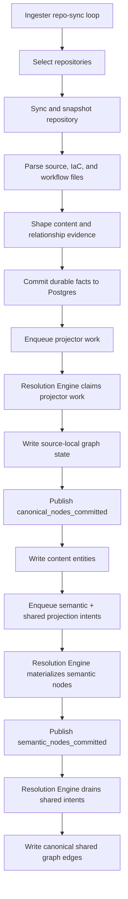
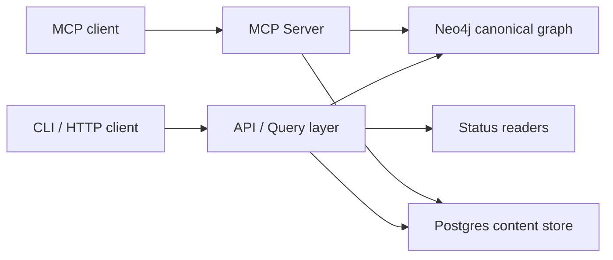
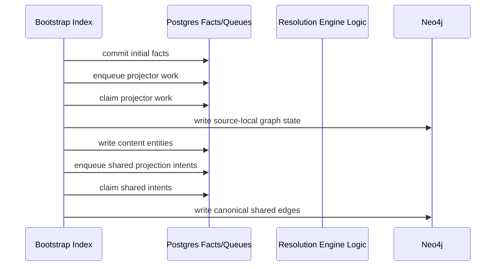
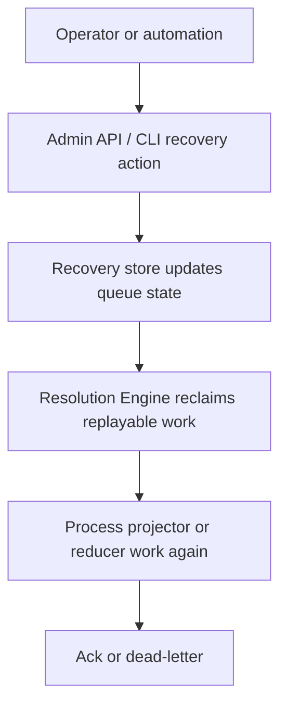
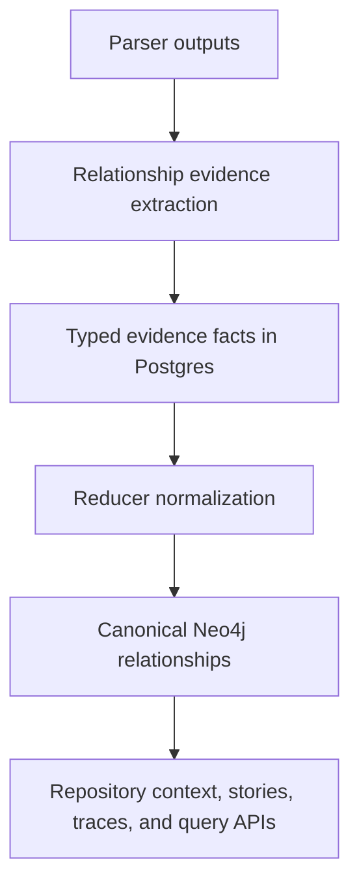
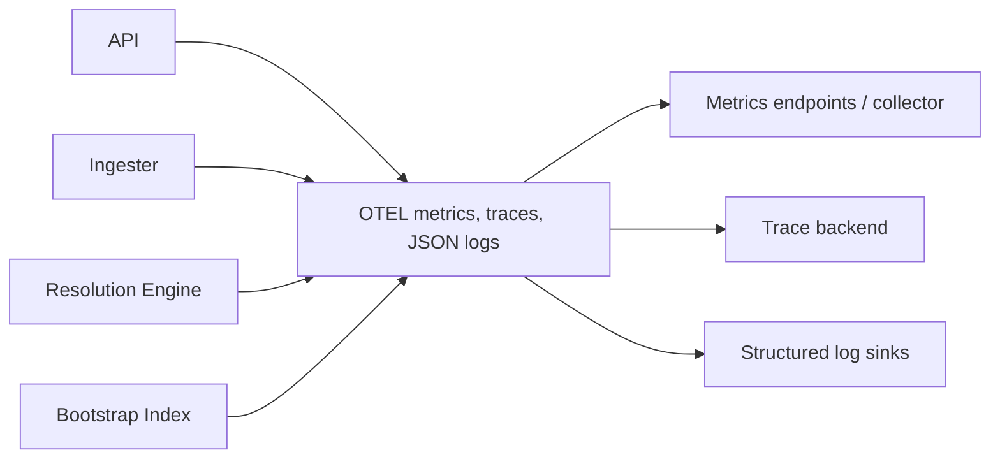

# Service Workflows

Use this page for the inter-service workflows that make up the normal platform
path.

This is the current-state companion to [System Architecture](../architecture.md)
and [Service Runtimes](../deployment/service-runtimes.md). It explains how the
services cooperate, where work becomes durable, and where operators should look
when something slows down or fails.

## Workflow Index

- write path from repository discovery to canonical graph state
- query path from API/MCP request to result
- bootstrap workflow
- replay and recovery workflow
- operator checkpoints for each flow

## 1. Continuous Ingestion Workflow

This is the normal long-running path.

### Ownership Notes

- The ingester owns discovery, sync, snapshotting, parsing, and fact emission.
- The resolution engine owns both projector queue draining and reducer-owned
  shared projection.
- The projector publishes bounded canonical readiness, semantic-entity
  materialization publishes bounded semantic readiness, and reducer-owned edge
  domains wait on that readiness before writing shared Neo4j edges.
- No normal-path Python runtime participates in this workflow.

### Operator Checkpoints

- Is the ingester discovering and syncing repositories?
- Are facts committing to Postgres?
- Is projector work queue depth rising or draining?
- Are shared projection intents draining?
- Are Neo4j and content-store writes succeeding?

Start with:

- [Runtime status](../reference/runtime-admin-api.md)
- [Telemetry overview](../reference/telemetry/index.md)
- [Local testing runbook](../reference/local-testing.md)

### Graph Projection Readiness Workflow

The bounded graph-write phases are now explicit in the Go runtime:

1. projector writes canonical nodes for one bounded acceptance slice
2. projector publishes `canonical_nodes_committed`
3. semantic-entity materialization writes semantic nodes for that same slice
4. reducer publishes `semantic_nodes_committed`
5. shared edge domains such as `code_calls`, `sql_relationships`, and
   `inheritance_edges` only proceed when semantic readiness exists

The durable readiness state is stored in Postgres
`graph_projection_phase_state`. There is currently no dedicated public admin
endpoint for per-slice phase rows; operators infer readiness behavior from
queue/backlog state, reducer logs, and the targeted Go tests for this path.

## 2. Query Workflow

The read path is intentionally simpler than the write path.

### Read Rules

- Query surfaces read canonical graph and content state.
- The API does not parse repositories or drain queues.
- The MCP server is a separate Go runtime that serves MCP transport and uses
  the same canonical graph and content backends for read operations.
- Admin and status reads use the same Go-owned runtime/reporting model as the
  operator surface.

### What To Check When Reads Look Wrong

1. Is the data missing from Neo4j or the content store?
2. Did projector work finish?
3. Did shared projection finish?
4. Is the query surface reading the right canonical entity or relationship
   family?

## 3. Bootstrap Workflow

Bootstrap is the one-shot environment seeding flow.

### Why It Matters

Bootstrap uses the same facts-first data plane as steady-state ingestion. It is
not a second architecture and should not drift into one.

### Typical Use Cases

- first-time environment bring-up
- recovery after schema or storage replacement
- controlled reseed of a test environment

## 4. Replay And Recovery Workflow

Replay and recovery are owned by the Go runtime and Postgres-backed queue
contracts.

### Recovery Rules

- replay targets durable queue rows, not in-memory state
- dead-letter state is explicit
- `failed` rows from older queue states are supported for recovery where documented
- repair and replay remain reducer/runtime ownership, not API-owned write logic

### Operational Signals

- queue depth
- oldest queue age
- dead-letter counts
- replay counters
- failure-class logs

## 5. Runtime And Deployment Workflow

The deployable platform has three long-running runtimes and one one-shot helper:

- API
- MCP Server
- Ingester
- Resolution Engine
- Bootstrap Index

Compose, Helm, and local CLI all reuse the same binaries. The differences are:

- command
- environment
- process shape
- volume mounts
- health checks

Use:

- [Service Runtimes](../deployment/service-runtimes.md)
- [Docker Compose](../deployment/docker-compose.md)
- [Helm](../deployment/helm.md)

## 6. Relationship And IaC Workflow

Relationship mapping is not a sidecar feature. It is embedded into the normal
write path.

### Includes

- Terraform and Terragrunt source and config provenance
- Kubernetes, Helm, Kustomize, and ArgoCD deploy-source relationships
- GitHub Actions, Jenkins/Groovy, Ansible, Docker, and Docker Compose evidence
- Terraform provider-schema-backed classification

### Documentation Anchors

- [Relationship Mapping](../reference/relationship-mapping.md)
- [Relationship Mapping Observability](../reference/relationship-mapping-observability.md)

## 7. Telemetry Workflow

Telemetry follows the same service boundaries as the runtime.

### Required Operator View

- API, MCP, ingester, reducer, and bootstrap runtimes emit structured JSON
  logs through the shared Go telemetry package
- metrics expose queue, runtime, and data-plane health
- traces connect ingestion, projection, and query timing
- `/admin/status` gives the fastest service-level state summary
- MCP keeps its distinct transport routes while also mounting the shared admin
  surface

## 8. Local Validation Workflow

When validating locally, use the repo’s actual compose and runtime contracts.

### Important rules

- use real absolute host paths for Compose mounts
- do not use symlinked source roots
- on macOS, do not rely on `/tmp` host roots because Docker resolves through
  `/private/tmp`
- run the smallest targeted tests first, then the compose/deployment/docs gates

The source of truth is:

- [Local Testing](../reference/local-testing.md)

## 9. Troubleshooting By Workflow Stage

| Symptom | Start here | Then check |
| --- | --- | --- |
| No new repository data | ingester `/admin/status` and ingester logs | repository selection, sync errors, parse failures |
| Facts written but no graph update | projector queue metrics and reducer status | projector claim latency, Neo4j writes, content writes |
| Shared infra or deployment traces missing | shared projection backlog and reducer logs | relationship evidence facts, reducer normalization, canonical edge writes |
| API answers stale or incomplete | API status plus reducer backlog | Neo4j/content-store state, repository coverage/status |
| Replay did not recover work | recovery metrics and status | dead-letter rows, failure class, replay selection |

## Related Docs

- [System Architecture](../architecture.md)
- [Service Runtimes](../deployment/service-runtimes.md)
- [Local Testing](../reference/local-testing.md)
- [Telemetry Overview](../reference/telemetry/index.md)
- [Runtime Admin API](../reference/runtime-admin-api.md)
