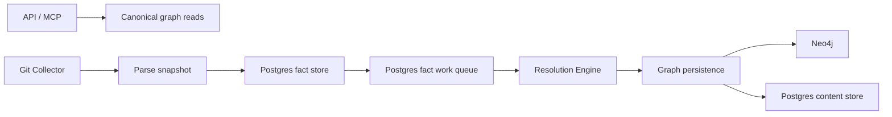

# Telemetry Overview

PlatformContextGraph uses three primary signal types:

- **Metrics** for rate, latency, backlog, concurrency, and capacity trends
- **Traces** for request and pipeline timing across service boundaries
- **Logs** for high-context event breadcrumbs and incident forensics

Use this section when you need to answer:

- Is the system healthy right now?
- Where is time going in the Git-to-graph pipeline?
- Is backlog growing because of parse speed, queue pressure, Postgres, or Neo4j?
- What should we scale first?
- What exact trace or log line explains a production incident?

## Service Flow

## How To Use The Signals

- Start with **metrics** when you need to detect regressions, backlog growth, or saturation.
- Jump to **traces** when you need to understand latency shape or cross-service timing.
- Use **logs** when you need exact repo/run/work-item context, error text, or operator breadcrumbs.

## By Service

### API and MCP

- Metrics answer request rate, latency, and error-rate questions.
- Traces show slow queries and transport-level timing.
- Logs carry request, correlation, and exception details.

### Git Collector

- Metrics answer parse throughput, queue wait, snapshot backlog, fact emission rate, and commit timing questions.
- Traces show repository parse, fact emission, and inline projection timing.
- Logs explain discovery choices, slow files, queue waits, and per-repo progress.

### Fact Store and Fact Work Queue

- Metrics answer SQL operation rate, latency, queue backlog depth, queue age, retry churn, dead-letter pressure, and connection-pool saturation questions.
- Traces show individual `fact_store` and `fact_queue` operations.
- Logs capture snapshot emission, inline projection lease/failure, dead-letter replay, and work-item lifecycle breadcrumbs.

### Resolution Engine

- Metrics answer claim latency, worker activity, work-item outcomes, stage durations, stage output volume, stage failures by error class, and retry/dead-letter age.
- Traces show the lifetime of one projection attempt from claim through graph projection.
- Logs capture work-item completion, retry, dead-letter, and per-stage failure context with work-item identifiers.

### Graph and Content Persistence

- Metrics answer graph batch size, graph batch latency, Neo4j query latency, and content-provider behavior.
- Traces show commit chunk timing, content dual-write timing, and individual Neo4j query spans.
- Logs explain chunk fallback, per-file write failures, and content dual-write failures.

## Operator Starting Points

- **Capacity planning:** start with the [Metrics](metrics.md) page.
- **Latency debugging:** start with the [Traces](traces.md) page.
- **Incident forensics:** start with the [Logs](logs.md) page.
