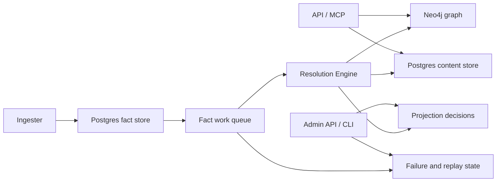

# Telemetry Overview

PlatformContextGraph uses three signal types:

- **Metrics** for rate, latency, backlog, concurrency, and capacity trends
- **Traces** for request and pipeline timing across service boundaries
- **Logs** for high-context event breadcrumbs and incident forensics

Use this page to choose where to look first.

## Start Here

| If you are debugging | Start with | Then check |
| --- | --- | --- |
| API is slow or erroring | API metrics | API traces and logs |
| backlog is growing | queue depth and queue age metrics | resolution-engine traces and queue logs |
| shared follow-up looks stuck | shared-projection backlog metrics | resolution-engine traces and shared-projection logs |
| one repository is slow | ingester metrics | ingester traces and resolution-engine stage timings |
| graph writes are slow | resolution metrics | Neo4j traces and graph persistence logs |
| content reads are missing or slow | API metrics and content metrics | content traces and logs |
| replay or dead-letter behavior looks wrong | recovery metrics | recovery traces and admin/replay logs |

## Runtime And Control-Plane Flow

## How To Use The Signals

- Start with **metrics** when you need to detect regression, saturation, or
  backlog growth.
- Move to **traces** when you need to understand where time went across a
  request or projection.
- Use **logs** when you need exact repository, run, or work-item context.

For shared-write debugging specifically:

- Start with `pcg_shared_projection_pending_intents` and
  `pcg_shared_projection_oldest_pending_age_seconds` to see whether
  authoritative platform or dependency follow-up is actually building up.
- Use `pcg_fact_queue_depth` and `pcg_fact_queue_oldest_age_seconds` alongside
  the shared-projection gauges rather than instead of them. Fact queue growth
  and shared follow-up growth answer different questions.
- Pivot to traces when backlog exists but is not draining. Pivot to logs when
  you need the exact repository, run, generation, or partition owner involved.

## By Runtime

### API

- Metrics answer request rate, latency, and error-rate questions.
- Traces show request and query timing.
- Logs carry correlation fields and failure details.

### Ingester

- Metrics answer repo queue wait, parse throughput, fact emission timing, and
  workspace pressure.
- Traces show parse, fact emission, and inline projection timing.
- Logs explain discovery choices, slow files, and per-repo progress.

### Facts Layer

- Metrics answer fact-store latency, queue backlog depth, queue age, retry
  churn, dead-letter pressure, and connection-pool saturation.
- Traces show individual fact-store and fact-queue operations.
- Logs capture snapshot emission, inline lease behavior, replay, and work-item
  lifecycle breadcrumbs.

### Resolution Engine

- Metrics answer claim latency, worker activity, stage duration, stage output
  volume, stage failures, dead-letter pressure, and shared authoritative
  follow-up backlog.
- Traces show one projection attempt from claim to graph write.
- Logs capture work-item completion, retry, dead-letter, and per-stage failure
  context.

Shared-write-specific gauges:

- `pcg_shared_projection_pending_intents` reports how many uncompleted shared
  projection intents exist per `pcg.projection_domain`.
- `pcg_shared_projection_oldest_pending_age_seconds` reports the age of the
  oldest uncompleted shared projection intent per `pcg.projection_domain`.

These gauges are intentionally domain-scoped and do not carry repository
identity. Use traces and logs when you need repository-level detail.

## Rollout Validation For Shared-Write Changes

When validating shared-write runtime changes in staging or production:

1. Start with `pcg_fact_queue_depth`, `pcg_fact_queue_oldest_age_seconds`,
   `pcg_shared_projection_pending_intents`, and
   `pcg_shared_projection_oldest_pending_age_seconds`.
2. Confirm backlog trends are flat-to-down, not simply that pods are up.
3. If shared backlog remains non-zero, inspect traces for the affected
   projection domain before assuming the fact queue is the bottleneck.
4. Use logs last to extract exact repository, source run, generation, or lease
   owner context for the stuck or slow path.

## Prometheus And ServiceMonitor

- In Docker Compose, validate runtime metrics by curling the direct `/metrics`
  endpoints.
- In Kubernetes, Helm can expose dedicated metrics ports and render
  `ServiceMonitor` resources for the API, ingester, and resolution-engine.
- Bootstrap indexing is a local or operator-run one-shot activity, not a
  steady-state `ServiceMonitor` target in the public chart.

## Where To Go Next

- [Metrics](metrics.md) for exact metric names and how to use them
- [Traces](traces.md) for span names and latency debugging
- [Logs](logs.md) for event breadcrumbs and incident forensics
- [Baseline Performance](../baseline-performance.md) for large-run tuning
