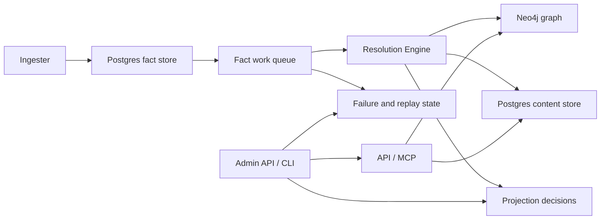

# Telemetry Overview

PlatformContextGraph uses three signal types:

- **Metrics** for rate, latency, backlog, concurrency, and capacity trends
- **Traces** for request and pipeline timing across service boundaries
- **Logs** for high-context event breadcrumbs and incident forensics

Use this page to choose where to look first.

Operator/admin status is part of the telemetry contract, not a separate debug
path. If a service exposes `/admin/status`, treat that report as the fastest
way to understand what stage is running, how much work is queued, and whether
the reported state is live or inferred.

## Start Here

| If you are debugging | Start with | Then check |
| --- | --- | --- |
| API is slow or erroring | API metrics | API traces and logs |
| backlog is growing | queue depth and queue age metrics | resolution-engine traces and queue logs |
| shared follow-up looks stuck | shared-projection backlog metrics | resolution-engine traces and shared-projection logs |
| one repository is slow | ingester metrics | ingester traces and resolution-engine stage timings |
| graph writes are slow | resolution metrics | Neo4j traces and graph persistence logs |
| content reads are missing or slow | API metrics and content metrics | content traces and logs |
| replay or dead-letter behavior looks wrong | recovery metrics | recovery traces and admin recovery logs |

## Health Versus Completeness

- `/health` or `/healthz` proves the process is alive and initialized.
- `GET /api/v0/status/index` and `GET /api/v0/index-status` prove the latest
  checkpointed completeness view exposed by the Go API.
- `/admin/status` proves the live stage, backlog, and failure view for a
  runtime.
- `POST /admin/refinalize` and `POST /admin/replay` are the Go-owned recovery
  controls on the ingester runtime.
- A service can be healthy while indexing is incomplete. Use all three views
  when you are deciding whether to restart, reindex, or wait.

## Runtime And Control-Plane Flow



## How To Use The Signals

- Start with **metrics** when you need to detect regression, saturation, or
  backlog growth.
- Move to **traces** when you need to understand where time went across a
  request or projection.
- Use **logs** when you need exact repository, run, or work-item context.
- Use the shared admin/status report when you want a quick read on stage,
  backlog, live-versus-inferred state, and failure classification.

## Incremental Refresh And Reconciliation Signals

The current Go-owned runtime uses incremental refresh and reconciliation, not
full re-indexing, as the normal freshness model.

Watch these signals together:

- scope and generation status for what changed
- work-queue depth and age for what still needs to be reconciled
- projection decisions for what has been accepted or deferred
- retry and dead-letter state for what needs operator attention

If a repository, scope, or collector appears stale, start with the admin/status
surface and queue/generation metrics before assuming a full rebuild is needed.

For shared-write debugging specifically:

- Start with `pcg_shared_projection_pending_intents` and
  `pcg_shared_projection_oldest_pending_age_seconds` to see whether
  authoritative platform or dependency follow-up is actually building up.
- Use `pcg_dp_queue_depth` and `pcg_dp_queue_oldest_age_seconds` alongside
  the shared-projection gauges rather than instead of them. Fact queue growth
  and shared follow-up growth answer different questions.
- Pivot to traces when backlog exists but is not draining. Pivot to logs when
  you need the exact repository, run, generation, or partition owner involved.
- The runtime status surface now carries `shared_projection_tuning` whenever
  shared backlog is present, so operators can see the current recommended
  partition/batch setting from `get_ingester_status` before opening the
  separate admin tuning report.

## By Runtime

### API

- Metrics answer request rate, latency, and error-rate questions.
- Traces show request and query timing.
- Logs carry correlation fields and failure details.

### Ingester

- Metrics answer repo queue wait, parse throughput, fact emission timing, and
  workspace pressure.
- Traces show parse, fact emission, inline projection timing, and parser
  selection.
- Logs explain discovery choices, slow files, parser snapshot collection, and
  per-repo progress.

### Facts Layer

- Metrics answer fact-store latency, queue backlog depth, queue age, retry
  churn, dead-letter pressure, and connection-pool saturation.
- Traces show individual fact-store and fact-queue operations.
- Logs capture snapshot emission, queue/retry behavior, recovery actions, and
  work-item lifecycle breadcrumbs as structured JSON. On the Go path,
  `event_name` is optional; phase-scoped `slog` fields such as
  `pipeline_phase`, `scope_id`, and `failure_class` are the stable filters.

### Resolution Engine

- Metrics answer claim latency, worker activity, stage duration, stage output
  volume, stage failures, dead-letter pressure, and shared authoritative
  follow-up backlog.
- Traces show one projection attempt from claim to graph write.
- Logs capture work-item completion, retry, dead-letter, and per-stage failure
  context.

### Admin / CLI Status

- The admin/status report answers stage, backlog, health, and live-versus-
  inferred questions in one place.
- It should mirror the service runtime shape so operators do not need a
  different mental model for collector, projector, reducer, or future Go
  services.
- Use the report before restarting a service or forcing a broader re-index.
- The normal runtime path is Go-owned end to end.
- The remaining migration work is Go-owned parity hardening rather than Python
  retirement work: broader workflow/controller relationship proof, the
  remaining broader IaC helper-built path-expression reduction, and the
  telemetry proof that makes those flows operable.

Shared-write-specific gauges:

- `pcg_shared_projection_pending_intents` reports how many uncompleted shared
  projection intents exist per `pcg.projection_domain`.
- `pcg_shared_projection_oldest_pending_age_seconds` reports the age of the
  oldest uncompleted shared projection intent per `pcg.projection_domain`.

These gauges are intentionally domain-scoped and do not carry repository
identity. Use traces and logs when you need repository-level detail.

## Rollout Validation For Shared-Write Changes

When validating shared-write runtime changes in staging or production:

1. Start with `pcg_dp_queue_depth`, `pcg_dp_queue_oldest_age_seconds`,
   `pcg_shared_projection_pending_intents`, and
   `pcg_shared_projection_oldest_pending_age_seconds`.
2. Confirm backlog trends are flat-to-down, not simply that pods are up.
3. If shared backlog remains non-zero, inspect traces for the affected
   projection domain before assuming the fact queue is the bottleneck.
4. Use logs last to extract exact repository, source run, generation, or lease
   owner context for the stuck or slow path.

## Tuning Guidance For Shared-Write Backlog

The deterministic shared-write load harness currently shows this balanced
dependency scenario:

| Partition count | Batch limit | Drain rounds | Mean processed per round |
| --- | --- | --- | --- |
| 1 | 1 | 16 | 2.0 |
| 2 | 1 | 8 | 4.0 |
| 4 | 1 | 5 | 6.4 |
| 4 | 2 | 2 | 16.0 |

Interpretation:

- Increasing partition count produces the first major drain-round reduction by
  spreading stable lock domains across more workers.
- Once partitioning is already helping, a modest batch increase can remove the
  remaining tail rounds quickly.
- Batch increases should come after partition increases, not before them, so we
  avoid hiding a partitioning bottleneck behind larger per-round writes.

Recommended staging order:

1. Increase partition count and watch
   `pcg_shared_projection_pending_intents` plus
   `pcg_shared_projection_oldest_pending_age_seconds`.
2. Confirm fact queue metrics stay flat-to-down at the same time:
   `pcg_dp_queue_depth` and `pcg_dp_queue_oldest_age_seconds`.
3. Only then try a modest batch-limit increase if backlog still drains in too
   many rounds after partitioning is healthy.

If partition count goes up but oldest pending age still rises, traces should be
the next stop before turning batch size further.

## Go Data Plane Telemetry Reference

The Go data plane emits OTEL metrics, traces, and structured JSON logs via the
`go/internal/telemetry` package. All OTEL metric names use the `pcg_dp_` prefix
to differentiate from the Python `pcg_` namespace. Hand-rolled `pcg_runtime_*`
status gauges are preserved alongside the new OTEL metrics on the same `/metrics`
endpoint via a composite handler.

The long-running Go entrypoints and the one-shot bootstrap-data-plane helper
all use the same JSON logger wiring. The service name and runtime role labels
are what operators should use to separate API, ingester, reducer, and bootstrap
log streams.

### Metrics

#### Counters

| Metric | Description | Dimensions |
| --- | --- | --- |
| `pcg_dp_facts_emitted_total` | Total facts emitted by collector | `scope_id`, `source_system`, `collector_kind` |
| `pcg_dp_facts_committed_total` | Total facts committed to store | `scope_id`, `source_system` |
| `pcg_dp_projections_completed_total` | Total projection cycles completed | `scope_id`, status (`succeeded`/`failed`) |
| `pcg_dp_reducer_intents_enqueued_total` | Total reducer intents enqueued | `domain` |
| `pcg_dp_reducer_executions_total` | Total reducer intent executions | `domain`, status (`succeeded`/`failed`) |
| `pcg_dp_canonical_writes_total` | Total canonical graph write batches | `domain` |
| `pcg_dp_shared_projection_cycles_total` | Total shared projection partition cycles | `domain`, `partition_key` |
| `pcg_dp_repos_snapshotted_total` | Total repositories snapshotted | status (`succeeded`/`failed`/`skipped`) |
| `pcg_dp_files_parsed_total` | Total files parsed | status (`succeeded`/`failed`/`skipped`) |
| `pcg_dp_fact_batches_committed_total` | Total fact batches committed to Postgres during streaming ingestion | `scope_id`, `source_system` |

#### Histograms

| Metric | Description | Unit | Custom buckets |
| --- | --- | --- | --- |
| `pcg_dp_collector_observe_duration_seconds` | Collector observe cycle duration | s | 0.01 .. 60 |
| `pcg_dp_scope_assign_duration_seconds` | Scope assignment duration | s | default |
| `pcg_dp_fact_emit_duration_seconds` | Fact emission duration | s | default |
| `pcg_dp_projector_run_duration_seconds` | Projector run cycle duration | s | 0.1 .. 120 |
| `pcg_dp_projector_stage_duration_seconds` | Projector stage duration | s | default |
| `pcg_dp_reducer_run_duration_seconds` | Reducer intent execution duration | s | default |
| `pcg_dp_canonical_write_duration_seconds` | Canonical graph write duration | s | default |
| `pcg_dp_queue_claim_duration_seconds` | Queue work item claim duration | s | default |
| `pcg_dp_postgres_query_duration_seconds` | Postgres query duration | s | 0.001 .. 2.5 |
| `pcg_dp_neo4j_query_duration_seconds` | Neo4j query duration | s | default |
| `pcg_dp_repo_snapshot_duration_seconds` | Per-repository snapshot duration | s | 0.1 .. 300 |
| `pcg_dp_file_parse_duration_seconds` | Per-file parse duration | s | 0.001 .. 2.5 |
| `pcg_dp_generation_fact_count` | Fact count per scope generation | count | 10, 50, 100, 500, 1k, 5k, 10k, 50k, 100k, 300k |

#### Observable Gauges

| Metric | Description | Unit | Dimensions |
| --- | --- | --- | --- |
| `pcg_dp_gomemlimit_bytes` | Configured GOMEMLIMIT in bytes, reported at startup | By | `service_name` |
| `pcg_dp_queue_depth` | Current queue depth by queue and status | count | `queue`, `status` |
| `pcg_dp_queue_oldest_age_seconds` | Age of oldest queue item | s | `queue` |
| `pcg_dp_worker_pool_active` | Current active worker count per pool | count | `pool` |

#### Projector Stage Dimensions

The `pcg_dp_projector_stage_duration_seconds` histogram carries a `stage` attribute:

| Stage | Description |
| --- | --- |
| `build_projection` | Fact-to-record transformation |
| `graph_write` | Neo4j canonical graph write |
| `content_write` | Postgres content store write |
| `intent_enqueue` | Reducer intent queue write |

### Metric Dimension Keys

| Key | Description |
| --- | --- |
| `scope_id` | Ingestion scope identifier |
| `scope_kind` | Scope type (e.g. repository) |
| `source_system` | Origin system (e.g. git) |
| `generation_id` | Scope generation identifier |
| `collector_kind` | Collector type (e.g. git) |
| `domain` | Reducer or projection domain |
| `partition_key` | Shared projection partition |
| `stage` | Projector stage (build_projection, graph_write, content_write, intent_enqueue) |
| `status` | Operation outcome (succeeded/failed) |
| `queue` | Queue name for claim duration (projector/reducer) |
| `worker_id` | Worker goroutine identifier (in structured logs) |

### Span Names

#### Pipeline spans

| Span | Where | Description |
| --- | --- | --- |
| `collector.observe` | Ingester collector loop | One collect + commit cycle |
| `scope.assign` | Collector repo discovery | Repository selection and scope assignment |
| `fact.emit` | Collector per-repo snapshot | File parse, snapshot, content extraction per repo |
| `projector.run` | Ingester projector loop | One claim + project + ack cycle |
| `reducer_intent.enqueue` | Projector runtime | Enqueuing reducer intents after projection |
| `reducer.run` | Reducer main loop | One claim + execute + ack cycle |
| `canonical.write` | Projector runtime / Reducer shared projection | Graph and content writes to Neo4j |

#### Dependency service spans

| Span | Where | Description |
| --- | --- | --- |
| `postgres.exec` | Instrumented Postgres wrapper | Every `ExecContext` call (writes) |
| `postgres.query` | Instrumented Postgres wrapper | Every `QueryContext` call (reads) |
| `neo4j.execute` | Instrumented Neo4j wrapper | Every Cypher statement execution |

These dependency spans are child spans of the pipeline spans above, creating
end-to-end traces from collection through parsing through projection through
reduction, including every database call along the way.

### Structured Log Keys

All Go data plane services emit JSON logs via `log/slog` with a custom
`TraceHandler` that injects `trace_id` and `span_id` from the active OTEL span
context. Base attributes (`service_name`, `service_namespace`) are set at logger
creation. The following keys appear in structured log events:

| Key | Description |
| --- | --- |
| `scope_id` | Ingestion scope identifier |
| `scope_kind` | Scope type |
| `source_system` | Origin system |
| `generation_id` | Scope generation identifier |
| `collector_kind` | Collector type |
| `domain` | Reducer or projection domain |
| `partition_key` | Shared projection partition |
| `request_id` | Request correlation ID |
| `failure_class` | Failure classification (terminal/retryable) |
| `refresh_skipped` | Whether incremental refresh was skipped |
| `pipeline_phase` | Pipeline phase: discovery, parsing, emission, projection, reduction, shared |
| `trace_id` | OTEL trace ID (injected by TraceHandler) |
| `span_id` | OTEL span ID (injected by TraceHandler) |

The `pipeline_phase` key enables filtering logs by stage when tracing
end-to-end. Every structured log event from a service loop carries exactly
one phase value, so `jq 'select(.pipeline_phase == "projection")'` isolates
projector-specific events across all services.

### OTEL Provider Configuration

The Go data plane configures OTEL SDK providers at startup in each `cmd/`
entrypoint. Configuration is environment-driven:

| Env var | Effect |
| --- | --- |
| `OTEL_EXPORTER_OTLP_ENDPOINT` | When set, enables OTLP gRPC trace and metric export. When empty, uses noop exporters (safe for local dev). |
| `OTEL_SERVICE_NAME` | Overrides the service name resource attribute (defaults to the binary name). |

The Prometheus exporter is always active regardless of OTLP configuration,
serving on the existing `/metrics` endpoint alongside `pcg_runtime_*` gauges.

### Grafana Dashboards

Pre-built dashboard JSON definitions are in `docs/dashboards/`:

| Dashboard | File | Panels |
| --- | --- | --- |
| Ingester | `ingester.json` | Collection rate, projection P95, queue depth, claim latency |
| Reducer | `reducer.json` | Execution by domain, shared projection, canonical writes, errors |
| Overview | `overview.json` | End-to-end throughput, latency waterfall, queue depths |

Import into Grafana via **Dashboards > Import > Upload JSON**. All dashboards
use `$service` and `$namespace` template variables matching Helm ServiceMonitor
labels.

## Streaming Ingestion And Memory Telemetry

The Go data plane streams facts through buffered channels and commits them in
batched multi-row INSERTs to bound memory during large-scale indexing. The
following metrics exist specifically to give operators visibility into this
streaming persistence path and the memory management that supports it.

### Why These Metrics Exist

Without streaming telemetry, operators cannot distinguish between:

- a generation that is slow because it has 295k facts vs one that is stuck
- memory pressure caused by one outlier repo vs systemic GC misconfiguration
- a GOMEMLIMIT that is too low (thrashing GC) vs too high (OOM risk)

These metrics close those gaps.

### Fact Batch Commits (`pcg_dp_fact_batches_committed_total`)

**What it tells you:** How many 500-row INSERT batches have been committed to
Postgres. Each batch corresponds to one multi-row INSERT statement that wrote
up to 500 fact records.

**How to use it:**

- **Throughput monitoring**: Rate of batch commits shows how fast facts are
  flowing to Postgres. A drop indicates Postgres contention, slow I/O, or
  a blocked producer goroutine.
- **Correlation with snapshot duration**: Compare batch commit rate against
  `pcg_dp_repo_snapshot_duration_seconds` to identify whether the bottleneck
  is parsing (producer) or persistence (consumer).
- **Batch count per generation**: Divide total batches by total generations to
  understand average repo size. A sudden spike means a new large repo was
  added to the fleet.

### Generation Fact Count (`pcg_dp_generation_fact_count`)

**What it tells you:** The distribution of fact counts per scope generation.
Buckets range from 10 to 300,000 to capture the full range from tiny config
repos to monorepos.

**How to use it:**

- **Outlier detection**: Repos in the 100k+ buckets are memory-intensive
  outlier repos. If these appear unexpectedly, investigate whether a new repo
  was added or an existing repo grew significantly.
- **Capacity planning**: The histogram shape tells you whether the fleet is
  dominated by small repos (most facts in the 10-500 bucket) or has a long
  tail of large repos. This informs worker count and GOMEMLIMIT tuning.
- **Regression detection**: If the median fact count per repo shifts
  significantly between deployments, a parser change may be emitting
  duplicate or missing facts.

### GOMEMLIMIT Gauge (`pcg_dp_gomemlimit_bytes`)

**What it tells you:** The GOMEMLIMIT value that the binary configured at
startup, in bytes. This is the soft memory ceiling that triggers aggressive
GC before the OOM killer fires.

**How to use it:**

- **Correlate with RSS**: Compare `pcg_dp_gomemlimit_bytes` with container
  RSS from `container_memory_working_set_bytes` (cAdvisor) or `docker stats`.
  If RSS consistently approaches GOMEMLIMIT, the container needs more memory
  or fewer workers.
- **Verify cgroup detection**: If the gauge reads 0, the binary did not detect
  a container memory limit — either it is running on bare metal or the cgroup
  filesystem is not mounted. Check startup logs for the `source` field.
- **Cross-service comparison**: The gauge carries `service_name` so you can
  confirm that bootstrap-index, ingester, and other binaries all have
  appropriate limits for their workload profile.

### Operator Decision Tree

```text
Is it OOMing?
  YES -> Check pcg_dp_gomemlimit_bytes
         Is it 0? -> Binary didn't detect cgroup limit. Set GOMEMLIMIT env var.
         Is it close to container limit? -> Ratio is too high or container is too small.
         Is RSS much higher than GOMEMLIMIT? -> Non-heap memory (stacks, mmap). Increase container.

Is ingestion slow?
  YES -> Check pcg_dp_fact_batches_committed_total rate
         Dropping? -> Postgres contention. Check pcg_dp_postgres_query_duration_seconds.
         Steady but slow? -> Check pcg_dp_generation_fact_count for outlier repos.
         Zero? -> Producer goroutine may be stuck. Check pcg_dp_repo_snapshot_duration_seconds.

Are facts missing after ingestion?
  YES -> Check pcg_dp_generation_fact_count vs expected
         Lower than expected? -> Parser may be skipping files. Check pcg_dp_files_parsed_total.
         Higher than expected? -> Duplicate emission. Check deduplication in batch commits.
```

## Prometheus And ServiceMonitor

- In Docker Compose, validate runtime metrics by curling the direct `/metrics`
  endpoints.
- In Kubernetes, Helm can expose dedicated metrics ports and render
  `ServiceMonitor` resources for the API, ingester, and resolution-engine.
- Bootstrap indexing is a local or operator-run one-shot activity, not a
  steady-state `ServiceMonitor` target in the public chart.
- Incremental refresh and reconciliation should be observed through queue age,
  generation status, and the admin/status surface rather than through a
  platform-wide re-index trigger.

## Where To Go Next

- [Metrics](metrics.md) for exact metric names and how to use them
- [Traces](traces.md) for span names and latency debugging
- [Logs](logs.md) for event breadcrumbs and incident forensics
- [Cross-Service Correlation](cross-service-correlation.md) for stitching traces across the pipeline
- [Cloud Validation Runbook](../cloud-validation.md) for hosted proof and
  operator validation
