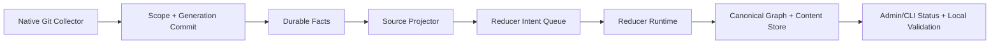

# Milestone 1: Native Git Cutover And Operability

This document is the executable milestone plan for the first whole-system
rewrite milestone.

It uses the milestone operating model so work can be delegated by subsystem and
reported by architectural outcome instead of by tiny internal slices.

## Summary

Milestone 1 delivers a **native Git write path** with end-to-end operability.

The target outcome is:

- Git collection no longer depends on the Python compatibility bridge for core
  correctness
- native facts flow through projector, content, and reducer boundaries cleanly
- operator/admin status surfaces explain what collector, projector, and reducer
  are doing live
- local validation proves the full data path before any future image build

This milestone is the proof that the Go data plane is a real runtime substrate,
not just a set of internal packages.

## Architectural Outcome

At the end of this milestone, one bounded Git-backed proof path should be
native, observable, and locally provable:

## Scope

### In Scope

- native Git collector fact emission
- parsed file payload and content-entity fact emission
- projector handling for native content-entity facts
- content dual-write correctness for `content_files` and `content_entities`
- proof-domain validation for a native Git-backed path
- shared operator/admin status visibility for long-running Go services
- deterministic local validation for the milestone

### Out Of Scope

- AWS feature work
- Kubernetes collector feature work
- broader read-plane and MCP feature expansion
- new product features unrelated to the rewrite
- live cloud cutover for more than the bounded proof path

## Workstreams

### Workstream A: Contract And Architecture Lock

Purpose:
Lock the milestone contracts so parallel work does not fork the source-boundary,
projector, persistence, or admin story.

Owned paths:

- `docs/superpowers/specs/2026-04-12-go-data-plane-rewrite-prd.md`
- `docs/superpowers/plans/2026-04-12-go-data-plane-rewrite-sow.md`
- `docs/superpowers/plans/2026-04-12-go-data-plane-doc-set-index.md`
- milestone and execution docs for this branch
- relevant ADRs under `docs/docs/adrs/`

Deliverables:

- frozen milestone plan
- locked workstream ownership
- agent and wave model for implementation
- updated flow documentation when data traversal changes

Acceptance criteria:

- implementation workers can proceed without guessing where logic belongs
- the operator/admin story is part of the milestone, not deferred work
- every remaining work item maps to a workstream

Effort:

- `Medium`

### Workstream B: Native Collector

Purpose:
Remove the Python compatibility bridge as the authority for Git fact shaping.

Owned paths:

- `go/internal/collector/`
- `go/internal/compatibility/pythonbridge/`
- `go/cmd/collector-git/`
- bridge retirement or bridge narrowing docs as needed

Deliverables:

- native Git fact emission
- parsed file payload support
- explicit content-entity fact emission
- durable source-boundary validation

Acceptance criteria:

- collector correctness no longer depends on Python bridge logic
- fact payloads are typed and replay-safe
- native collector output is accepted by the projector without compatibility hacks

Effort:

- `Large`

### Workstream C: Projection And Persistence

Purpose:
Ensure native facts project correctly into graph and content stores and can
drive reducers without content drift or replay bugs.

Owned paths:

- `go/internal/projector/`
- `go/internal/content/`
- `go/internal/graph/`
- `go/internal/storage/postgres/`

Deliverables:

- projector support for native content-entity facts
- canonical content-entity identity parity
- file and entity dual-write correctness
- tombstone and replacement semantics
- proof-domain persistence coverage

Acceptance criteria:

- `content_entities` are persisted from native facts
- entity-only facts do not masquerade as file-content rows
- replay and delete semantics are deterministic
- the canonical write path is locally provable

Effort:

- `Large`

### Workstream D: Operability And Admin Surface

Purpose:
Give every long-running service a first-class operator story during the
rewrite, not after it.

Owned paths:

- `go/internal/status/`
- `go/internal/runtime/`
- `go/internal/app/`
- service-specific status wiring in `go/cmd/*`
- related runtime docs and OpenAPI/admin docs

Deliverables:

- shared status/report seam
- mounted HTTP/admin status surface
- consistent probe/admin semantics
- service progress, backlog, and health visibility

Acceptance criteria:

- an operator can answer what each service is doing right now
- live versus inferred status is explicit
- collector, projector, and reducer share one recognizable status model

Effort:

- `Medium`

### Workstream E: End-To-End Validation

Purpose:
Prove the milestone locally and keep it reproducible before any image build or
cloud proof.

Owned paths:

- focused Go tests
- fixture and proof harness updates
- local runbooks
- milestone validation docs

Deliverables:

- deterministic local validation commands
- proof-domain end-to-end validation
- regression checks for content, projector, and bridge boundaries

Acceptance criteria:

- local validation can prove the milestone on demand
- no slice is called complete without a runnable proof command
- remaining cloud proof work is explicit rather than implied

Effort:

- `Medium`

## Subagent Assignment Model

Recommended staffing for this milestone:

- Main agent:
  architecture review, integration, final verification, commit/push, backlog reporting
- Worker 1:
  Workstream A when docs change materially, otherwise supports Workstream D
- Worker 2:
  Workstream B
- Worker 3:
  Workstream C
- Worker 4:
  Workstream D and Workstream E

The main agent should not delegate the architecture decisions that freeze the
source-boundary or projector contracts.

## Dependency Waves

### Wave 0: Milestone lock

Required outputs:

- milestone plan accepted
- write scopes defined
- acceptance criteria locked

### Wave 1: Native data path

Parallel work allowed:

- Workstream B
- Workstream C

Blocking output:

- native fact contract accepted
- projector and persistence path can consume the new fact contract

### Wave 2: Operability and validation

Parallel work allowed:

- Workstream D
- Workstream E

Blocking output:

- admin/status story reflects real runtime progress
- local validation proves the whole flow

### Wave 3: Integration and report

Required outputs:

- milestone-local validation passes
- docs reflect reality
- remaining backlog is restated by workstream and effort

## Validation

Minimum local gate for this milestone:

- `PYTHONPATH=src uv run --with pytest python -m pytest tests/unit/compatibility/test_go_collector_bridge.py -q`
- `PYTHONPATH=src uv run --with pytest python -m pytest tests/unit/content/test_ingest.py -k "portable_file_and_entity_identity or derives_infra_source_cache_from_file_text or assigns_uids_to_sql_entities" -q`
- `PYTHONPATH=src uv run --with ruff ruff check src/platform_context_graph/runtime/ingester/go_collector_bridge.py src/platform_context_graph/runtime/ingester/go_collector_bridge_facts.py tests/unit/compatibility/test_go_collector_bridge.py`
- `go test ./internal/content ./internal/projector ./internal/storage/postgres ./internal/compatibility/pythonbridge`
- `git diff --check`

Milestone-complete validation should also include:

- local stack runtime proof
- collector, projector, and reducer admin/status checks
- proof-domain end-to-end run through the real local stores

## Current Status

### Completed

- rewrite doc set, ADR set, and service-boundary docs are in place
- shared hosted status-server helper landed
- admin/OpenAPI contract hardening landed
- deployment/runtime connection tuning exposure landed
- truthful runtime status claims landed
- compatibility bridge now emits richer file facts and explicit
  `content_entity` facts
- Go projector and content writer now persist `content_entities`
  correctly from bridge facts
- narrowed Python snapshot bridge now transports repo parse snapshots and content
  entries without owning final fact envelopes
- `collector-git` now uses a native Go `GitSource` that builds scope,
  generation, repository, file, content, content-entity, and
  `shared_followup` facts

### In Flight

- local runtime proof for the native `collector-git` path

### Remaining

#### Workstream A

- keep milestone docs updated after each major commit
- ensure later milestone plans reuse this same operating model

Remaining effort:

- `Small`

#### Workstream B

- replace Python snapshot transport with native Go repo selection and parse
  execution
- retire the legacy fact-shaped Python bridge after the runtime proof path is
  established
- prove native collector output in the real local runtime loop

Remaining effort:

- `Medium`

#### Workstream C

- run the full local end-to-end proof through the actual runtime stack
- confirm replacement semantics when files change across generations
- extend proof coverage beyond the current focused content-entity slice

Remaining effort:

- `Medium`

#### Workstream D

- expand status/admin surfaces into a fuller operator story
- add deeper per-stage counters and backlog visibility
- make progress reporting more obviously live across services

Remaining effort:

- `Medium`

#### Workstream E

- formalize the real local runtime validation runbook for Milestone 1
- run the milestone against the local stack, not just focused package tests
- define the cloud proof checklist for the bounded proof domain

Remaining effort:

- `Medium`

## Exit Criteria

Milestone 1 is complete only when all of the following are true:

- Git collector correctness is native for the bounded proof path
- projector and persistence paths are using native facts cleanly
- operator/admin status surfaces are usable across long-running services
- local validation proves the whole path end to end
- remaining bridge behavior, if any, is explicitly transitional and documented
