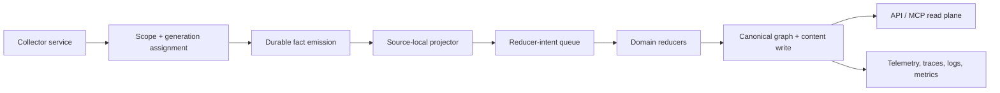

# Go Data Plane Rewrite Statement Of Work

> **For agentic workers:** this is a locked execution document for a long-running branch. Do not add product features during this rewrite unless the work is explicitly called out here as a dependency or a proof step. Prefer subtask isolation, test-first changes, and small reversible commits over broad incidental cleanup.

**Branch policy:** one long-lived rewrite branch, one active worktree, no feature branching inside the rewrite, no direct commits to `main`, and no parallel feature work until the rewrite milestones are complete and merged.

**Purpose:** replace the current Python-heavy write path with a schema-first Go data plane that can scale to Git, SQL, AWS, Kubernetes, and future collectors without turning PCG into a procedural beast.

**Non-goals:** new user-facing features, collector feature expansion, cloud provider integrations beyond the proof gates in this document, and any redesign that bypasses the canonical scope/generation/fact/reducer flow described below.

**Primary design constraint:** accuracy first, then performance, then stability, then scalability. Telemetry, tracing, and logging are not add-ons; they are acceptance criteria.

**Concurrency rule:** use channels and goroutines where they improve bounded in-process work, but keep cross-service handoffs durable, replayable, and operator-visible.

## Companion Execution Documents

Use these documents together with this SOW before parallel implementation begins:

- [Rewrite Documentation Index](2026-04-12-go-data-plane-doc-set-index.md)
- [Service Boundaries And Ownership](2026-04-12-go-data-plane-service-boundaries-and-ownership.md)
- [Contract Freeze Plan](2026-04-12-go-data-plane-contract-freeze-plan.md)
- [Milestone Operating Model](2026-04-12-go-data-plane-milestone-operating-model.md)
- [Milestone 1: Native Git Cutover And Operability](2026-04-12-go-data-plane-milestone-01-native-git-cutover.md)
- [Parallel Execution Plan](2026-04-12-go-data-plane-parallel-execution-plan.md)
- [Validation And Cutover Plan](2026-04-12-go-data-plane-validation-and-cutover-plan.md)
- [ADR Index](../../docs/adrs/index.md)

---

## Locked Architecture

The rewrite must converge on this flow:

The intended service boundaries are:

- collectors observe and normalize source truth
- scopes and generations define the durable ingestion contract
- facts are persisted as the replayable input layer
- source-local projection runs in the data plane, not in the API
- reducers own cross-source and cross-domain correlation
- the API and MCP plane read canonical resolved truth by default

The rewrite is successful only when the system can support separate collector services without requiring a full re-index for every repo or cloud resource change.

Every material architecture change must also update a repo-hosted end-to-end traversal map that shows how a bounded work unit crosses collector, projector, reducer, and canonical write stages.

---

## Milestone 0: Lock The Rewrite Contract

### Deliverable 0.1: Architecture PRD and execution discipline

The branch must begin with a locked architecture package that includes:

- the rewrite PRD
- this statement of work
- a flow diagram for the full data path
- ADRs for contract shape, language choice, scope identity, reducer ownership, and read/write boundaries
- explicit no-new-features language for the duration of the rewrite

Exit criteria:

- the architecture is written clearly enough that future workers do not need to guess the service boundaries
- the branch policy is unambiguous about what is in scope and what is forbidden
- the rewrite can be resumed after pauses without re-litigating the design

### Deliverable 0.2: Frozen contract map

Before implementation begins, freeze the first contract set:

- scope identity
- generation identity
- fact payload shape
- work-item payload shape
- reducer-intent payload shape
- telemetry event names
- trace/span naming
- log key naming

Contract freeze rule:

- if a contract changes after freeze, it must be versioned
- if a change is only a convenience, it waits until after the rewrite milestone is proven
- if a change affects a downstream consumer, it must be called out as a compatibility decision, not silently patched

Exit criteria:

- the branch has one documented source of truth for every core contract
- no new contract shape is introduced without an explicit versioning note

---

## Milestone 1: Build The Go Data Plane Substrate

### Scope

Implement the new data plane in Go with schema-first contracts. The Go data plane owns:

- collectors
- scope and generation management
- fact persistence
- source-local projection
- reducer-intent emission
- domain reducers
- canonical graph/content writes
- data-plane telemetry, tracing, and logging

The data plane must not depend on Python runtime behavior for core write-path correctness.

### Deliverables

- versioned Protobuf contracts, ideally generated through Buf
- Go service entrypoints for the future collector/reducer/runtime boundaries
- storage adapters for facts, queues, and canonical writes
- explicit nullable field handling and validation at the edges
- deterministic local test harnesses for contract and flow verification
- instrumentation for queue depth, backlog age, claim latency, projection latency, reducer latency, failure classification, and retry behavior
- configurable worker-pool, channel-capacity, lease, and database-pool tuning
  for each long-running service
- documented end-to-end traversal maps for the bounded work units used by the
  first proof domains

### Exit criteria

- the new Go runtime can accept a bounded snapshot and emit facts without runtime shape errors
- the new write path is typed end to end
- every write-path mutation is observable through metrics, traces, and structured logs
- the data plane can be reasoned about as a service, not as a set of procedural callbacks
- the concurrency and backpressure behavior is documented, bounded, and
  configurable

### Proof required before progressing

- one existing repo-based workload or domain is moved onto the new substrate
- the moved path is exercised locally and, when appropriate, in the cloud test instance
- telemetry shows the complete path from ingest to canonical write

---

## Milestone 2: Replace Repo-Shaped Ingestion With Scope-First Ingestion

### Scope

Move the durable ingestion contract away from repository-first assumptions and toward a first-class scope model.

The durable model must represent:

- `ingestion_scope`
- `scope_generation`
- `source_system`
- `scope_kind`
- `scope_id`
- `parent_scope_id`
- `generation_id`
- `collector_kind`
- `partition_key`
- `observed_at`
- `ingested_at`
- `status`

### Deliverables

- scope records and generation records in the durable store
- facts and work items that reference scopes and generations instead of pretending every source is a repository
- scope hierarchy support for repo, account, region, cluster, stack, workspace, and shard-like boundaries
- generator-safe replay semantics for authoritative snapshot replacements

### Exit criteria

- the platform can represent Git, SQL, and non-Git sources without schema contortions
- scope identity is durable and queryable
- generations are authoritative snapshot boundaries by default
- event-based acceleration remains a hint, not the source of truth

### What must be proven before AWS/Kubernetes work starts

- scope-first identity works for at least one repo-based source
- scope generation replacement works without re-indexing the whole platform
- deletes, retractions, and stale generations are handled correctly
- the system can explain what changed at the scope boundary

---

## Milestone 3: Canonical Truth Layers And Reducer Ownership

### Scope

Establish the layered truth model required for code, IaC, cloud, Kubernetes, CI/CD, ETL, and data systems:

- source declaration
- applied declaration
- observed resource
- canonical resolved asset

Reducer ownership must be explicit. Shared correlation work belongs to reducers, not to incidental finalize hooks.

### Deliverables

- a documented canonical identity strategy for cloud and workload entities
- reducer domains for workload identity, cloud asset resolution, deployment mapping, data lineage, ownership, and governance
- a clear distinction between declared truth, applied truth, and observed truth
- canonical-first query/MCP behavior with explicit evidence and inspection modes

### Exit criteria

- the platform can explain unmanaged, drifted, observed-only, and declared-only assets
- reducers can be scheduled and retried independently of source-local projection
- the canonical graph is the default read target

### Proof required before AWS/Kubernetes work starts

- at least one cross-source correlation domain works end to end
- the reducer boundary is explicit and observable
- source-local truth and canonical truth are both explainable

---

## Milestone 4: Retire The Procedural Write Beast

### Scope

The legacy write path must be reduced until it is no longer the primary integration seam for new work.

This means:

- no new logic should be added to ad hoc finalize paths
- `GraphBuilder`-style orchestration must not become the landing zone for future collectors
- write behavior must be expressed through explicit contracts and service boundaries

### Deliverables

- a clean transition path away from the current Python-heavy finalize chain
- migration notes for anything still temporarily bridged
- tests proving that new behavior uses the new contracts rather than expanding the old procedural chain

### Exit criteria

- the remaining legacy path is narrow, documented, and intentionally transitional
- new work no longer requires guessing which finalize stage owns a behavior
- the codebase has one obvious path for new collector and reducer work

---

## Milestone 5: Documentation And Operator Guidance

### Required documents

The rewrite branch must maintain documentation as a first-class artifact. At minimum:

- locked architecture PRD
- this SOW
- service boundary documentation
- data plane flow diagrams
- end-to-end traversal maps with retry and boundary notes
- contract definitions
- migration notes
- local validation runbooks
- cloud validation runbooks
- telemetry/tracing/logging guidance
- collector onboarding guidance

### Documentation rules

- every major milestone must update the relevant docs before it is considered complete
- every contract freeze point must be documented in the repo
- every proof step must have reproducible commands
- every new service boundary must be described in operational language, not only code terms
- every flow change must update the traversal map for that work unit

Exit criteria:

- a future worker can follow the docs without guessing the rewrite intent
- operators can understand what to run, what to watch, and what success looks like
- the docs explain why the rewrite exists and what it is protecting

---

## Validation Strategy

### Local validation

Local validation is mandatory for every milestone. Minimum expectations:

- unit tests for contracts, identity, scope handling, queue semantics, and reducer behavior
- integration tests for canonical write flow and cross-source correlation
- deterministic replay tests for snapshot replacement and idempotency
- docs build checks for any document changes
- file length and diff sanity checks for touched code

Use the local runbook as the default starting point:

- `docs/docs/reference/local-testing.md`
- `docs/docs/deployment/service-runtimes.md`
- `docs/docs/reference/telemetry/index.md`

### Cloud validation

The branch may use the available cloud test instance for end-to-end verification, but only after the local gates are green.

Cloud validation must prove:

- separate collectors can run independently
- the new data plane scales without full re-indexes on every change
- telemetry, tracing, and logging remain coherent under real runtime conditions
- the API and MCP plane continue to read canonical truth correctly

### Quality gates

The branch is not ready unless the following are true:

- accuracy checks pass for core facts, scopes, and canonical relationships
- performance is acceptable under the expected ingest shape
- stability is proven through retries, replay, and recovery paths
- scalability is demonstrated by partitioned work rather than a single procedural bottleneck
- telemetry, tracing, and logging identify the active scope, generation, domain, and failure mode

---

## Telemetry, Tracing, And Logging Gates

### Telemetry gates

Every important data-plane action must emit measurable signals for:

- queue depth
- queue age
- claim latency
- projection latency
- reducer latency
- retry count
- dead-letter count
- stale generation count
- backlog by domain
- scope processing duration

### Tracing gates

Trace spans must make the flow obvious:

- collector span
- scope assignment span
- fact emission span
- source-local projection span
- reducer-intent span
- reducer execution span
- canonical write span

### Logging gates

Structured logs must include enough context to diagnose failures without rummaging through code:

- `scope_id`
- `scope_kind`
- `source_system`
- `generation_id`
- `collector_kind`
- `domain`
- `partition_key`
- `request_id` or equivalent correlation identifier
- failure classification

Exit criteria:

- a failed run can be diagnosed from logs, metrics, and traces together
- no major write-path event is opaque

---

## Branch Policy

This rewrite branch is a protected execution branch, not an experimentation branch.

Rules:

- no new product features
- no collector feature expansion beyond what is necessary for the rewrite proofs
- no hidden parallel path that keeps the old procedural model alive as the default
- no direct commits to `main`
- no PRs that mix rewrite substrate work with unrelated cleanup
- no code changes that are not tied to a milestone, proof step, or necessary bridge

If a change is not part of the rewrite contract, it waits.

Exit criteria:

- the branch remains understandable after long pauses
- workers can pick up the same branch without re-litigating scope
- the rewrite does not drift into unrelated feature delivery

---

## Risks

### Risk: Dual-path drift

If the old and new write paths coexist too long, the old path will continue to attract “small” fixes and the rewrite will stall.

Mitigation:

- freeze the legacy path as soon as the new contracts are proven
- keep the migration scope explicit
- do not add new features to the old seam

### Risk: Contract churn

If scope, generation, fact, or reducer contracts keep changing, downstream work will slow down.

Mitigation:

- freeze contracts early
- version changes deliberately
- keep the change surface visible in docs

### Risk: Telemetry blind spots

If the rewrite lands without strong observability, operators will not trust it.

Mitigation:

- make telemetry, tracing, and logging part of the acceptance criteria
- validate observability locally and in the cloud test instance

### Risk: Performance regressions

If the rewrite becomes only a correctness exercise, it may not scale.

Mitigation:

- measure queue and reducer behavior under local load
- prove partitioned work and bounded snapshots before adding cloud collectors

### Risk: Over-modeling

If scope and generation become dumping grounds, the platform will become harder to understand instead of easier.

Mitigation:

- keep the scope model focused on ownership, lifecycle, hierarchy, and replay
- do not use the scope tables as a second graph database

---

## Dependencies

The rewrite depends on:

- the current runtime and local testing guidance already documented in the repo
- a stable long-running branch with no concurrent feature work
- disciplined contract ownership
- local and cloud validation access
- strong test coverage for the data plane
- explicit agreement that the rewrite is allowed to replace the current write path instead of preserving it indefinitely

Optional but valuable dependencies:

- one existing repo-based domain to use as the proof migration
- one non-trivial cross-source domain to validate reducer ownership
- a cloud test instance for end-to-end verification after local proof

---

## Acceptance Criteria

The rewrite can be called successful only if all of the following are true:

1. The Go data plane exists as the authoritative write substrate.
2. Scope-first ingestion is the durable contract.
3. Generations represent authoritative snapshot boundaries.
4. Facts, work items, and reducer intents are versioned and typed.
5. Source-local projection and cross-source reduction are separated cleanly.
6. The API and MCP plane read canonical truth by default.
7. Telemetry, tracing, and logging are good enough to diagnose failures without guesswork.
8. Local validation is deterministic and repeatable.
9. Cloud validation proves the architecture beyond a single laptop-sized workload.
10. AWS/Kubernetes collector work does not begin until the data-plane substrate, contract freeze, and one migration proof are complete.

---

## Definition Of Done For The Rewrite Branch

The branch is done when:

- the new data plane replaces the old write path for the proven domain
- the docs explain the architecture, flow, and operator behavior clearly
- the acceptance criteria above are met
- the branch can be merged without preserving a second hidden write architecture
- the next collector family can be added without redesigning the substrate again
