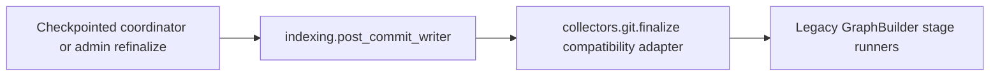

# Go Data Plane Service Boundaries And Ownership

This document defines the target repository layout, service boundaries, and
ownership rules for the Go data-plane rewrite.

The goal is to let multiple workers move in parallel without repeatedly
touching the same paths or re-litigating where new code belongs.

## Target Repository Layout

The rewrite will introduce a dedicated Go subtree and a root-level schema
contract layer:

```text
buf.yaml
buf.gen.yaml
proto/platform_context_graph/data_plane/v1/
go/
  go.mod
  cmd/
    collector-git/
    collector-aws/
    collector-kubernetes/
    projector/
    reducer/
  gen/
    proto/
  internal/
    app/
    parser/
    runtime/
    scope/
    facts/
    collector/
    queue/
    projector/
    reducer/
    graph/
    content/
      shape/
    storage/
      postgres/
      neo4j/
    telemetry/
schema/
  data-plane/
    postgres/
```

## Boundary Rules

- `proto/` owns schema contracts and generated compatibility inputs.
- `go/cmd/` owns service entrypoints only.
- `go/internal/runtime/` owns shared process bootstrap, config, lifecycle, and
  dependency wiring, including the shared probe/admin route mount.
- `go/internal/parser/` owns parser metadata, parser capability boundaries, and
  the eventual native parse execution surface.
- `go/internal/collector/` owns source-specific collection orchestration.
  Narrow file-selection and repo-grouping helpers belong under
  `go/internal/collector/discovery/`, not in runtime bootstrap or storage
  adapters.
- `go/internal/scope/` owns scope and generation semantics.
- `go/internal/facts/` owns fact envelopes and normalization helpers.
- `go/internal/queue/` owns durable work-item and reducer-intent queue
  semantics.
- `go/internal/projector/` owns source-local projection only.
- `go/internal/reducer/` owns cross-source and cross-scope reconciliation only.
  Reducer domains must carry an explicit truth-layer contract for the canonical
  kind they own; they must not rely on ad hoc string conventions.
  Milestone 3 proves this boundary with typed workload-identity and
  cloud-asset-resolution reducers plus reducer-owned canonical fact writes.
- `go/internal/graph/` and `go/internal/content/` own canonical write adapters,
  not source parsing or reducer policy.
- `go/internal/content/shape/` owns translation from normalized parser payloads
  into canonical content materialization inputs; it is part of the source-local
  write path, not a read-side concern.
- `go/internal/status/` owns the storage-agnostic operator-status reader/report
  seam shared by CLI now and HTTP/admin handlers later.
- `go/internal/storage/postgres/` may implement the status reader against SQL,
  but it must not absorb report projection, rendering, or future transport
  concerns.
- `go/internal/compatibility/pythonbridge/` is temporary removal-debt only.
  During the remaining conversion it is the only allowed home for bridge code,
  but the branch is not complete until that package is deleted.

## Legacy Post-Commit Bridge

While the GraphBuilder family still owns a small recovery-only relationship
surface, the remaining Python bridge must stay explicit and narrow until it is
fully removed:



Rules for this bridge:

- new collector or reducer behavior must not be added to
  `collectors/git/finalize.py`
- `indexing/post_commit_writer.py` is the only allowed contract point for the
  remaining Python post-commit seam
- callers may consume structured stage timings and details from the bridge, but
  they must not read `GraphBuilder` attributes as an implicit side channel
- the bridge exists only for checkpointed finalization recovery and admin/CLI
  refinalize flows until equivalent Go-owned ownership is proven

## Reserved Areas

These areas should stay stable during early implementation:

- existing Python read-plane packages
- existing MCP query surfaces, except for narrow compatibility work
- unrelated parser and feature work

## Parallel Ownership Guidance

| Workstream | Primary paths |
| --- | --- |
| Contracts | `buf*.yaml`, `proto/`, `go/gen/proto/` |
| Runtime bootstrap | `go/go.mod`, `go/cmd/`, `go/internal/app/`, `go/internal/runtime/`, `go/internal/telemetry/` |
| Scope and generation | `go/internal/scope/`, `schema/data-plane/postgres/` |
| Facts and queue | `go/internal/facts/`, `go/internal/queue/`, `go/internal/storage/postgres/` |
| Operator status | `go/internal/status/`, `go/cmd/admin-status/`, storage-specific readers under `go/internal/storage/` |
| Projector | `go/internal/projector/`, `go/internal/graph/`, `go/internal/content/` |
| Reducer | `go/internal/reducer/`, reducer-domain packages under `go/internal/reducer/` |
| Compatibility bridge | `go/internal/compatibility/pythonbridge/` and minimal touched bridge points in Python until deletion |
| Validation | tests, fixtures, runbooks, and documentation updates tied to the active slice |

## Ownership Rules

- A worker may edit outside their owned paths only for narrow integration glue.
- Shared files such as generated code, root config, or top-level docs should be
  coordinated and landed in small commits.
- No worker should place collector-specific logic in shared graph or reducer
  packages.
- No worker should add new long-lived code to legacy finalize paths without an
  explicit cutover exception.
- Operator-status work should prepare `go/internal/status` as the shared
  reader/report seam before any future API/admin transport is added, not create
  a second transport-specific status path.
- Runtime bootstrap work should keep `go/internal/runtime/admin.go` as the
  shared home for probe and admin route mounting rather than letting each
  service create bespoke `healthz`, `readyz`, `/metrics`, or `/admin/status`
  route wiring.

## Collector Authoring Contract

Every new ingestor should follow the same bounded framework:

1. define the collector-owned `scope` and `generation` boundary
2. emit durable `facts` keyed to that boundary
3. let the source-local `projector` materialize only source-owned truth for the
   same boundary
4. let `reducers` own cross-source and canonical correlation asynchronously

Unknown reducer domains should fail closed at the projector or durable
reducer-queue boundary instead of being accepted into the platform as
best-effort shared work.

This contract is intentionally the same for Git, AWS, Kubernetes, ETL, and
future collectors. A new ingestor should not need a custom finalize stage, a
second queue shape, or a special-case storage path just to join the platform.

If a collector cannot be explained in those four steps, its design should be
challenged before implementation begins.

## Handoff Requirement

Every slice must leave behind:

- updated docs for any changed boundary
- a clear validation command
- a note on whether the change is final architecture or temporary bridge code
