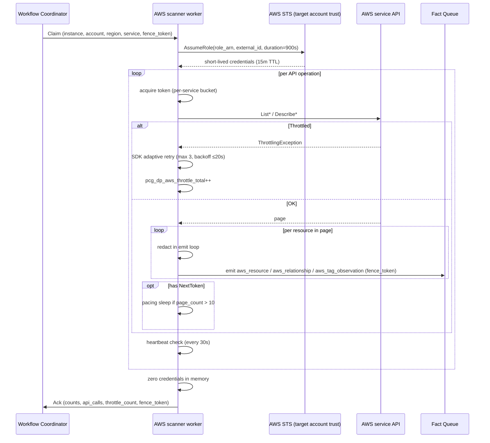
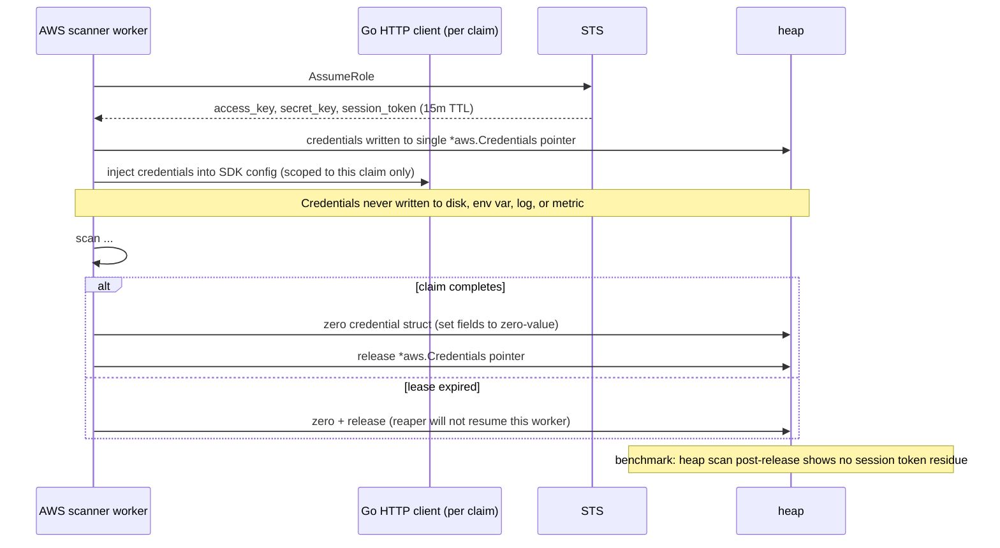
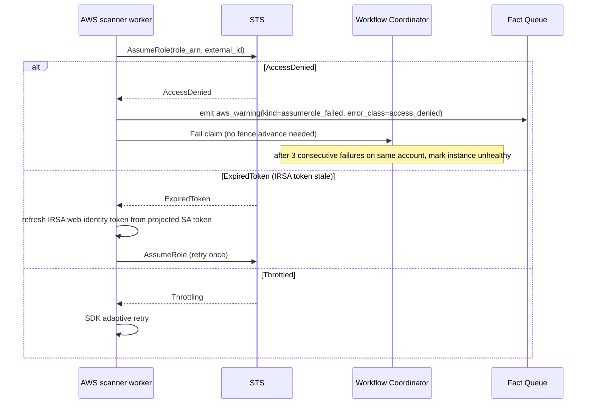
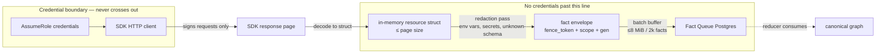

# Architecture Workflow Plan: AWS Cloud Scanner Collector

**Date:** 2026-04-20
**Status:** Draft (gate still open — awaits review sign-offs)
**Authors:** pcg-platform
**Reviewers required:** Principal engineer, Principal SRE, Security
**Related:**

- ADR: `docs/docs/adrs/2026-04-20-aws-cloud-scanner-collector.md`
- Gate issue: `platformcontext/platform-context-graph#104`

All numeric proposals marked `[PROPOSED]`. Reviewers may reject any value and
force revision before gate closes.

---

## Purpose

Architecture workflow for the AWS cloud scanner. Must be approved **before
any implementation work begins** on issues #110–#115 (aws/A–F) and every
child #116–#122.

ADR captures decisions. This plan captures **how those decisions hold under
throttling, credential rotation, partial-run recovery, multi-account scale,
and SDK schema drift, with telemetry strong enough to diagnose at 3 AM**.

Git-collector mistake not repeated: concurrency, memory, telemetry designed
before code. Gate issue #104 lists every prerequisite.

---

## 1. Sequence Diagrams

### 1.1 Happy-path claim per `(account, region, service)`



### 1.2 Partial-run resume (budget exhausted)

```mermaid
sequenceDiagram
    participant W as AWS scanner worker
    participant WC as Workflow Coordinator
    participant CP as pagination_checkpoints table
    participant FQ as Fact Queue

    W->>W: api_call_count reaches 10000
    W->>W: detect budget_exhausted on current page
    W->>FQ: flush pending batch (fence_token=42)
    W->>CP: UPSERT(claim_key, next_token, resources_seen, fence_token=42)
    W->>FQ: emit aws_warning(kind=budget_exhausted, next_interval_resume=true)
    W->>WC: Ack partial (fence_token=42, resumable=true)
    Note over WC: coordinator retains checkpoint row; next cycle reclaims same key
    WC->>W: next cycle — Claim (same account/region/service, fence_token=43)
    W->>CP: SELECT checkpoint WHERE claim_key=...
    CP-->>W: next_token, resources_seen
    W->>API: resume pagination from next_token
```

### 1.3 Credential lifecycle



### 1.4 AssumeRole failure



### 1.5 Lease expiry mid-pagination

```mermaid
sequenceDiagram
    participant W1 as Worker A
    participant WC as Workflow Coordinator
    participant W2 as Worker B (reaper)
    participant CP as pagination_checkpoints
    participant FQ as Fact Queue

    W1->>WC: claim(fence=42)
    W1->>W1: paginate, stall on 60s API call
    WC->>WC: lease expired (>90s since heartbeat)
    WC->>WC: advance fence to 43
    W2->>WC: claim(fence=43)
    W2->>CP: read checkpoint
    W2->>W2: resume + emit
    W2->>FQ: emit (fence=43) ✓ accepted
    W1->>FQ: emit (fence=42) ✗ rejected (stale fence)
    W1->>W1: zero credentials; exit
```

---

## 2. Data Flow Diagram



Memory footprint per stage (per worker):

| Stage | Bytes resident | Lifetime |
|---|---|---|
| A SDK response | ≤8 MiB | per page |
| B resource struct | ≤16 MiB | per page peak (Route53 ListResourceRecordSets) |
| C fact envelopes | ≤4 MiB | per page window |
| D batch buffer | ≤8 MiB | per batch flush |
| F credentials | ~2 KiB | per active claim |

Credential boundary: credentials live only in the `*aws.Credentials` struct
and HTTP client. Never cross into fact payloads, spans, logs, metrics, or
checkpoint rows.

---

## 3. Concurrency Model

### 3.1 Worker pool shape

- [PROPOSED] Pool default: **16 workers per pod**
  - Justification: 16 × 48 MiB peak = 768 MiB peak; under 1 GiB GOMEMLIMIT.
  - Workers are service-kind agnostic; coordinator decides claim assignment.
- One claim per worker (no multiplexing).
- Goroutine topology per worker:
  - 1 × **claim loop** (blocks on coordinator assign)
  - 1 × **heartbeat loop** (30s tick)
  - 1 × **service scan** (inline in claim loop; pagination + decode)
  - 1 × **emit loop** (batches facts to queue)
- Credential cache lifetime: **per-claim only**. Zeroed on claim end.

### 3.2 Claim granularity

`claim_key = (collector_instance_id, account_id, region, service_kind)`

Maps 1:1 to AWS throttle boundary. Coordinator fencing guarantees at most
one active scan per `(account, region, service)`.

- [PROPOSED] Lease duration: **900s** (matches STS default 15m)
- [PROPOSED] Heartbeat interval: **30s**
- Fence token: monotonic int64; propagated into every fact envelope, every
  checkpoint UPSERT, every ack RPC.

### 3.3 Rate limiting

Three layers:

1. **AWS SDK v2 adaptive retry mode** on every client (max attempts = 3,
   max backoff = 20s).
2. **Per-service token buckets** (in-memory per pod, keyed by service):
   bucket size = sustained TPS; fills at that rate; workers `Acquire(1)`
   before every API call.
3. **Per-account concurrency cap** (semaphore keyed by `account_id`):
   maximum simultaneous claims per account = **4** across services.

[PROPOSED] Bucket sizes (sustained TPS per service per pod):

| Service | Bucket | Source |
|---|---|---|
| iam | 5 | AWS quota: `List*` 20 TPS global; 5/pod leaves headroom for multi-pod |
| ecr | 10 | AWS quota: Describe 10 TPS region |
| ecs | 10 | `DescribeServices` 40 TPS region; conservative |
| eks | 5 | Describe 10 TPS region; reserve half |
| elbv2 | 10 | Describe 25 TPS region |
| lambda | 5 | `ListFunctions` 15 TPS; reserve for `GetFunction` loop |
| route53 | 5 | `ListResourceRecordSets` 5 TPS (tightest constraint) |
| ec2 | 5 | Describe 100 TPS region; low to reserve headroom |

Per-account cap implementation: Go semaphore (`golang.org/x/sync/semaphore`)
keyed by account_id; acquired on claim accept, released on claim ack.
Coordinator-enforced as defense-in-depth via claim admission check.

### 3.4 Lock ordering proof

Locks:

1. **Coordinator claim row** (Postgres row lock, per claim)
2. **Pagination checkpoint row** (Postgres row lock, per claim_key)
3. **Fact queue INSERT** (Postgres tx, per batch)
4. **Heartbeat row** (Postgres row lock, per claim)
5. **Per-service token bucket** (in-process mutex inside `rate.Limiter`)
6. **Per-account semaphore** (in-process)
7. **Credentials cache** (in-process mutex, per-claim; no cross-claim sharing)

Ordering:
- Claim admission: #6 (account sem) → #1 (claim row) → #2 (checkpoint row)
- Scan loop: #5 (token bucket) → SDK call → #3 (fact queue tx) per batch
- Heartbeat loop: #4 only
- Release: #1 released → #6 released

No cycle:
- #5 is local, released before any Postgres tx
- #3 and #4 operate on separate rows
- #6 is coarser than #1 and always acquired first; released last
- Credentials cache is per-claim instance; never shared across goroutines
  outside the owning worker

Deadlock-free by construction.

### 3.5 Goroutine Choreography (concrete)

Per worker, on claim accept:

```go
claimCtx, claimCancel := context.WithCancel(coordinatorCtx)
pageCh      := make(chan *sdkPage, 2)    // pages are large; tight bound
resourceCh  := make(chan ResourceFact, 128)
batchCh     := make(chan []Fact, 4)
errCh       := make(chan error, 4)
creds       := sync.Pointer[aws.Credentials]{} // atomic swap on refresh
```

Goroutines (6 total per active claim):

| G | Role | Inputs | Outputs | Exit condition |
|---|---|---|---|---|
| G1 | scan | SDK paginator + per-service token bucket | `*sdkPage` on `pageCh`; increments `api_calls_used` | budget exceeded, claimCtx cancel, EOF → checkpoint write + `close(pageCh)` |
| G2 | decode+redact | reads `pageCh` | pushes `ResourceFact` on `resourceCh` | `pageCh` closed → `close(resourceCh)` |
| G3 | batch | reads `resourceCh` | sends `[]Fact` on `batchCh` (2k OR 500ms) | `resourceCh` closed → final flush → `close(batchCh)` |
| G4 | emit | reads `batchCh` | COMMIT tx per batch; error to `errCh` | `batchCh` closed → final ack |
| G5 | heartbeat | 30s ticker | UPDATE heartbeat row | claimCtx done |
| G6 | credential watcher | timer fires at `sts_ttl - 60s` | AssumeRole; atomic `creds.Store` | claimCtx done |

Single-writer/single-reader per channel. Ordering preserved per service (SDK paginator is sequential; G2/G3/G4 are sequential consumers).

### 3.6 Channel Sizing & Backpressure Propagation

Buffer sizes are small to propagate pressure upstream:

- `pageCh=2`: ≤ 16 MiB pending pages. If emit is slow → batch blocks → decode blocks reading `resourceCh` → pageCh fills → scan goroutine blocks BEFORE next `rate.Limiter.Wait()` → **no wasted API budget**.
- `resourceCh=128`: ~512 KiB pending facts (128 × ~4 KiB).
- `batchCh=4`: ≤ 32 MiB pending emits.

**Token bucket interaction:** G1 calls `bucket.Wait(claimCtx)` before each SDK op. If `pageCh` is full, G1's send blocks — but G1 has NOT yet taken a token. Token only taken at next loop iteration after `pageCh` drains. Pressure pushes back to the bucket naturally; bucket never leaks tokens on backpressure.

No unbounded channels. No goroutine leaks. No lost facts.

### 3.7 Context Cancellation Tree

```
serviceCtx (process lifetime)
  └── coordinatorCtx
        └── claimCtx (per claim, cancelled on ack/reap/budget/error)
              ├── scanCtx (inherits; SDK calls use middleware.WithContext)
              ├── decodeCtx
              ├── batchCtx
              ├── emitCtx (COMMIT tx)
              ├── heartbeatCtx (WithTimeout 5s per UPDATE)
              └── credentialCtx (STS AssumeRole WithTimeout 10s)
```

Cancel triggers:
- Heartbeat UPDATE fails → `claimCancel()`
- Budget exhausted → G1 writes checkpoint → closes `pageCh` → natural drain — **no** claimCancel (allows in-flight emits to commit)
- Fatal emit error → `claimCancel()`
- Coordinator reap → `coordinatorCtx` cancelled
- Lease expiry → worker sees fence mismatch on next emit; `claimCancel()`

**Important:** credential refresh does NOT cancel claimCtx — it swaps credentials atomically without disrupting in-flight SDK calls (see §3.9).

### 3.8 AWS SDK v2 Middleware Stack

Per-client middleware ordering (top → bottom on outbound; reverse on inbound):

1. `Initialize` — user-agent, request ID
2. `Serialize` — marshal to HTTP request
3. `Build` — signing metadata
4. **`Retry`** — `aws.RetryModeAdaptive`, `MaxAttempts=3`, `MaxBackoffDelay=20s` (SDK native)
5. **Custom rate-limit middleware** — registered with `middleware.After(retry.ClientRateLimiter)` so it fires AFTER retry decides to issue a call (retry-generated calls consume tokens)
6. `Signer` — SigV4 with credentials from `aws.CredentialsCache`
7. `Finalize` — HTTP RoundTrip
8. `Deserialize` — parse response

Rate limit placement rationale (critical):
- Bucket **above** retry would let retried calls bypass the bucket → burst → throttle cascade.
- Bucket **inside** retry (between decide-to-retry and issue) → each retry takes a token → correctly paced.
- SDK's own adaptive retry has an internal bucket; ours is a second layer protecting against cross-client bursts within the same pod.

Reference: `github.com/aws/aws-sdk-go-v2/aws/retry` + `middleware.Stack.Finalize.Add(rateLimitMW, middleware.After)` with name `"RateLimit"` placed after `"Retry"`.

### 3.9 Credential Refresh Race

Scenario: claim lease = 900s; STS credentials TTL = 900s; scan takes 800s and triggers refresh.

Protocol (G6 credential watcher):

```go
// Fires at TTL - 60s (i.e., 14m in)
if claimRemainingSeconds < 60 { return } // claim ending; skip refresh

newCreds, err := sts.AssumeRole(credentialCtx, ...) // 10s timeout
if err != nil {
    emit warning(kind=credential_refresh_failed)
    // continue with old creds; SDK will retry on ExpiredToken
    return
}
oldPtr := creds.Swap(&newCreds)    // atomic
zeroBytes(oldPtr)                  // explicit zero
```

SDK integration: `aws.CredentialsCache` wraps our swappable provider. Provider's `Retrieve(ctx)` returns `*creds.Load()` — always returns current pointer. Cache TTL set to 30s so cache picks up swap within 30s; in-flight requests that receive `ExpiredToken` auto-retry via the retry middleware, which re-signs with fresh credentials on the next attempt.

**Race window:** in-flight request signed with old creds, lands at AWS after swap, gets `ExpiredToken` → retry → re-sign with new creds → succeeds. One wasted call maximum per refresh.

**Failure handling:** refresh fails → warning emitted; claim continues with old creds until expiry; next request hits `ExpiredToken`; if coordinator lease still has >60s, G6 retries refresh; else G1 writes checkpoint and yields claim.

### 3.10 Checkpoint Schema

```sql
CREATE TABLE collector_pagination_checkpoints (
  claim_key        TEXT PRIMARY KEY,           -- 'instance/account/region/service'
  fence_token      BIGINT NOT NULL,            -- fence at write time
  next_token       TEXT,                       -- AWS NextToken (nullable: not mid-page)
  scan_state       JSONB NOT NULL,             -- {"operation": "ListFunctions", "page_index": 47}
  resources_seen   BIGINT NOT NULL DEFAULT 0,
  api_calls_used   INT NOT NULL DEFAULT 0,
  budget_ceiling   INT NOT NULL,               -- snapshot of ceiling at write (for resume validation)
  updated_at       TIMESTAMPTZ NOT NULL DEFAULT now()
);
CREATE INDEX ON collector_pagination_checkpoints (updated_at);
```

Write protocol:
- Single writer: the worker holding the claim. No contention.
- UPSERT on `claim_key`; `fence_token` must advance monotonically (constraint: `fence_token >= EXCLUDED.fence_token`) — rejects stale writes from reaped workers.

Resume protocol (next claim on same key):
- New worker reads: `SELECT * WHERE claim_key=$1 AND fence_token<=$2` (`$2` = new fence).
- Validates `budget_ceiling` matches current config — if changed, discards checkpoint (config shift = clean start).
- Replays `scan_state.operation` + `next_token` to resume pagination.

TTL: janitor job deletes rows `updated_at < now() - interval '7 days'`.

### 3.11 Partial-Run Ack Protocol

```go
type AWSClaimAck struct {
    FenceToken          int64
    ApiCallsUsed        int
    ThrottleCount       int
    ResourcesEmitted    int
    Warnings            []WarningSummary
    CheckpointPersisted bool   // true if yielded with checkpoint row
    AckReason           string // "complete" | "partial_budget" | "partial_lease" | "partial_throttle" | "partial_queue_pressure"
    CredRefreshCount    int    // for SRE visibility
}
```

Coordinator validation:
- `FenceToken != activeFence` → reject; worker was reaped; its emits already blocked by queue fence constraint.
- `CheckpointPersisted=true, AckReason=partial_*` → mark claim batch partial; re-queue `claim_key` at next scheduled interval (NOT immediate — respects cadence + back-off).
- `CheckpointPersisted=false, AckReason=complete` → remove any stale checkpoint row; advance claim state to `completed`.
- `ThrottleCount > threshold` → coordinator increases interval for `(account, service)` by 2× until a clean run.

### 3.12 Token Bucket Under Burst

`golang.org/x/time/rate.Limiter` = token bucket.
- Rate `r` tokens/sec = sustained TPS from §3.3 table.
- Burst `b` = `r` (1s burst capacity).

Worst-case cold start: 16 workers simultaneously pick claims for the same service → 16 `Wait(ctx)` calls on same limiter.
- First `b` calls return immediately.
- Remaining queue FIFO, served at rate `r`.
- `Wait(ctx)` honors cancel → if claim cancels mid-wait, returns `ctx.Err()` without consuming token.

**Fairness:** `rate.Limiter` uses FIFO queue for waiters. No starvation.

**Across pods:** buckets are per-pod. N pods × bucket → effective rate = N × r. Multi-pod deployments must tune per-pod `r` = `quota / N_pods`. Runtime knob: `PCG_AWS_BUCKET_SCALE_FACTOR` (default 1.0; set to `1/N` when multi-pod).

---

## 4. Memory Budget Table

`[PROPOSED]` values. Validated by fixture in §9.

| Layer | Steady | Peak | Hard Ceiling | Justification |
|---|---|---|---|---|
| Per worker baseline | 24 MiB | 32 MiB | 40 MiB | 8 SDK clients × ~2 MiB + http pool |
| Per claim peak | 32 MiB | 48 MiB | 64 MiB | largest single `Describe*` page + redact + emit |
| Credentials cache | negligible | ~2 KiB × active claims | 128 KiB | ≤64 active claims/pod bound |
| Per-service token bucket | negligible | <1 KiB | 8 KiB | 8 buckets × state |
| Per-account semaphore | negligible | <1 KiB × accounts | 16 KiB | ≤200 accounts bound |
| Fact batch buffer | 4 MiB | 8 MiB | 12 MiB | ~2k facts × ~4 KiB |
| Pool total (16 workers × 1 active claim) | 512 MiB | 768 MiB | 896 MiB | sum of worker peaks + overhead |

- **GOMEMLIMIT target per pod: 1 GiB** (~12% headroom over hard ceiling).
- **OOM behavior**: soft back-off at 85% — pause new claim pickup, drain
  in-flight, re-enter ready when below 70%.
- Observable gauge `pcg_dp_gomemlimit_bytes` reports configured limit.

---

## 5. Throughput Math

### 5.1 Worst-case inventory

- N accounts: launch target **50**; scale target **200+**
- 4 regions per account average
- 8 services at launch

→ 50 × 4 × 8 = **1600 claim units per scan cycle**. Not all active at once;
coordinator fairness + per-account cap (4) spread them.

### 5.2 API call budgets per service

References:
- AWS Service Quotas: <https://docs.aws.amazon.com/general/latest/gr/aws_service_limits.html>
- EC2 throttling: <https://docs.aws.amazon.com/AWSEC2/latest/APIReference/throttling.html>

| Service | Operations | Per-account quota notes |
|---|---|---|
| EC2 | `DescribeVpcs`, `DescribeSubnets`, `DescribeSecurityGroups`, `DescribeNetworkInterfaces`, `DescribeInstances` | Per-region, Describe ~100 TPS; we use 5 |
| ECS | `ListClusters`, `DescribeClusters`, `ListServices`, `DescribeServices`, `ListTaskDefinitions`, `DescribeTaskDefinition` | DescribeServices 40 TPS |
| Lambda | `ListFunctions` (paginated, 50/page), `GetFunction`, `ListAliases` | ListFunctions 15 TPS; GetFunction 15 TPS |
| ELBv2 | `DescribeLoadBalancers`, `DescribeListeners`, `DescribeTargetGroups`, `DescribeRules` | 25 TPS region |
| Route53 | `ListHostedZones`, `ListResourceRecordSets` (100/page) | 5 TPS account-global (HARD LIMIT) |
| IAM | `ListRoles`, `ListPolicies`, `ListInstanceProfiles`, `ListAttachedRolePolicies` | 20 TPS global |
| ECR | `DescribeRepositories`, `DescribeImages` | 10 TPS region |
| EKS | `ListClusters`, `DescribeCluster`, `ListNodegroups`, `DescribeNodegroup` | 10 TPS region |

### 5.3 Refresh cadence

[PROPOSED] Default intervals:

| Service | Interval | Reason |
|---|---|---|
| iam | 6h | Low churn; global |
| route53 | 1h | Expensive ListResourceRecordSets |
| ec2 | 30m | Baseline |
| ecs | 30m | Baseline |
| eks | 30m | Baseline |
| elbv2 | 30m | Baseline |
| lambda | 30m | Baseline |
| ecr | 1h | Image inventory drift slow |

Budget ceiling per claim: **10k API calls**. Exceeded → checkpoint + yield.

Worst-case per-claim bound (account with 10k Lambda functions, ListFunctions
50/page + GetFunction each): 200 ListFunctions + 10000 GetFunction = 10200 →
checkpoint at 10k, resume next cycle.

### 5.4 Backpressure

- Fact queue depth > 50k: claim loop pauses pickup.
- SDK throttle rate > 10%/min: extend lease once, yield claim on next
  paging boundary with `warning(kind=throttle_pressure_yield)`.
- Per-account semaphore saturated: claim admission blocks; coordinator
  routes to other accounts.

---

## 6. Telemetry Specification (FROZEN BEFORE CODE)

### 6.1 Metrics

| Metric | Type | Labels | Buckets |
|---|---|---|---|
| `pcg_dp_aws_api_calls_total` | counter | `service`, `account`, `region`, `operation` (bounded enum) | — |
| `pcg_dp_aws_api_errors_total` | counter | `service`, `account`, `region`, `error_class` (enum, 10 values) | — |
| `pcg_dp_aws_throttle_total` | counter | `service`, `account`, `region` | — |
| `pcg_dp_aws_scan_duration_seconds` | histogram | `service`, `account`, `region` | `[1, 5, 15, 60, 300, 900, 1800, 3600]` |
| `pcg_dp_aws_claim_concurrency` | gauge | `account` | — |
| `pcg_dp_aws_resources_emitted_total` | counter | `service`, `account`, `region`, `resource_type` | — |
| `pcg_dp_aws_relationships_emitted_total` | counter | `service`, `account`, `region` | — |
| `pcg_dp_aws_tag_observations_emitted_total` | counter | `service`, `account`, `region` | — |
| `pcg_dp_aws_budget_exhausted_total` | counter | `service`, `account`, `region` | — |
| `pcg_dp_aws_assumerole_failed_total` | counter | `account`, `error_class` | — |
| `pcg_dp_aws_unchanged_resources_total` | counter | `service`, `account`, `region` | — |
| `pcg_dp_aws_pagination_pacing_events_total` | counter | `service` | — |
| `pcg_dp_aws_pagination_checkpoint_resumed_total` | counter | `service` | — |
| `pcg_dp_aws_redactions_applied_total` | counter | `reason` ∈ {`env_var`,`secret_field`,`unknown_schema`} | — |
| `pcg_dp_aws_credential_cache_size` | gauge | — | must stay ≈ active claims |

Cardinality caps:
- `service` ∈ {iam, ecr, ecs, eks, elbv2, lambda, route53, ec2} (8)
- `region` bounded to AWS regions (~30)
- `account` raw account_id in metrics (bounded to launch ≤50, scale ≤200;
  beyond 500 the metric series explode — alert at ≥400)
- `operation` bounded enum per service (explicit list in contract.go)
- `resource_type` bounded enum (published per service; ~80 total launch)
- `error_class` enum: `throttle`, `access_denied`, `expired_token`,
  `not_found`, `timeout`, `service_not_available`, `checkpoint_invalid`,
  `rate_exceeded`, `unknown_schema`, `other`

Account alias dimension: published on **spans and logs only**, not on
metric labels (account alias is high-churn string).

### 6.2 Spans

| Span | Required attributes |
|---|---|
| `aws.collector.claim.process` | `scope_id`, `generation_id`, `account_id`, `account_alias`, `region`, `service_kind`, `collector_instance_id`, `fence_token` |
| `aws.credentials.assume_role` | `account_id`, `role_arn_hash` (sha256), `external_id_set` (bool), `credential_ttl_seconds` |
| `aws.service.scan` | `service_kind`, `api_calls`, `resources_emitted`, `throttle_count` |
| `aws.service.pagination.page` | `service_kind`, `page_index`, `items_in_page` |
| `aws.fact.emit_batch` | `batch_size`, `fact_kinds_mix` (JSON string) |

Child structure under `claim.process`:
- `credentials.assume_role` (1× at start)
- `service.scan` (1×)
- `service.pagination.page` (N× per page)
- `fact.emit_batch` (M× per batch flush)

Span events:
- `aws.throttle` — `{service, operation, retry_count}`
- `aws.partial_run_yield` — `{reason, next_token_present}`
- `aws.credentials.refreshed` — `{reason}`

### 6.3 Structured log keys

Required:
- `scope_id`, `generation_id`, `account_id`, `region`, `service_kind`
- `collector_instance_id`, `fence_token`
- `failure_class` on error paths

Forbidden:
- environment variable values (Lambda, ECS task defs)
- secret field values
- tag values (metrics + facts only)
- full AWS response bodies
- any credential material (access key, secret key, session token) — ever
- raw `role_arn` (use `role_arn_hash`)

Log level policy:
- **INFO**: claim start/end, assume-role success, checkpoint resume
- **WARN**: throttle_pressure_yield, budget_exhausted, assumerole_failed
  (first occurrence), unknown_schema, region_disabled
- **ERROR**: AssumeRole sustained failure (3×), lease expiry, credential
  leak detection (heap scan failing post-release)

Sampling:
- `pagination.page` events: sampled at 1 per 100 pages when `page_index > 100`
- `throttle` span events: 100% (always)
- Per-resource emit logs: NEVER emitted (metrics only)

---

## 7. Failure Mode Matrix

| Failure | Detection Signal | Recovery Path | Operator Action |
|---|---|---|---|
| API throttled | `throttle_total` + span event | Adaptive retry 3×; sustained → yield claim with partial-run | Dashboard shows throttle; tune interval or request quota |
| AssumeRole failed (AccessDenied) | `assumerole_failed_total{error_class=access_denied}` + warning fact | Fail claim; 3 consecutive → mark instance unhealthy | Rotate role, verify external ID, verify IRSA trust |
| AssumeRole throttled | `assumerole_failed_total{error_class=throttle}` | Adaptive retry | Check STS quota (default 100 TPS/account) |
| Credentials expired mid-scan | span event + `api_errors_total{error_class=expired_token}` | Refresh via new AssumeRole if lease allows; else yield | Investigate scan duration vs STS TTL |
| IRSA token stale | `api_errors_total{error_class=irsa_stale}` | Re-read projected SA token; re-AssumeRole | K8s projection audit |
| Budget exhausted | `budget_exhausted_total` + warning fact | Checkpoint pagination; next run resumes | Review budget vs inventory size |
| Unknown resource schema | `redactions_applied_total{reason=unknown_schema}` spike + warning | Conservative redaction | File issue; update SDK; extend schema pack |
| Pagination checkpoint corruption | `api_errors_total{error_class=checkpoint_invalid}` + warning | Discard checkpoint; restart page 0 | Investigate coordinator state |
| Fact queue saturated | queue depth gauge | Yield claim with partial-run | Scale reducer or tune batch size |
| Lease expiry mid-scan | `claim_expired_total` (coordinator) | Reap; fencing rejects stale emits | Investigate scan duration vs lease |
| Account disabled or role deleted | `assumerole_failed_total` sustained | Circuit-break instance | Disable collector instance |
| Worker OOM | `pcg_dp_gomemlimit_bytes` breach | Soft back-off | Incident; tune ceiling |
| Region disabled for service | `api_errors_total{error_class=service_not_available}` | Mark (service,region) skipped; emit warning once | Adjust region list |
| Lambda reserved concurrency change mid-scan | `api_errors_total{operation=GetFunction,error_class=throttle}` | Adaptive retry; sustained → yield | Investigate concurrent workloads |
| EKS API version deprecated | `api_errors_total{error_class=deprecated_api}` + warning | Skip operation; emit warning | Upgrade SDK |
| Route53 5 TPS hard limit | sustained `throttle_total{service=route53}` | Extend interval automatically; emit info | Consider splitting scan by zone |

---

## 8. Concurrency Review Checklist

Shared state:
- Per-service token buckets (per-pod, per-service)
- Per-account semaphore (per-pod, per-account_id)
- Credential cache (per-claim, not cross-claim)
- Pagination checkpoint rows (Postgres, per claim_key)
- Fact queue (Postgres, global)
- Coordinator claim rows (Postgres)

Proofs:
- [x] Claim fencing prevents dual-writer on same `(account, region, service)` — fence token unique + monotonic; queue constraint rejects stale
- [x] Per-account concurrency cap prevents control-plane hammering — semaphore width 4, enforced both in-process and coordinator admission
- [x] Token bucket refill correct under goroutine contention — `golang.org/x/time/rate.Limiter` is thread-safe
- [x] Credential cache never leaks across claims — per-claim struct, zeroed on release, benchmark verified
- [x] Lock ordering cycle-free (see §3.4)
- [x] Heartbeat + scan cannot deadlock (separate Postgres rows; heartbeat never touches queue)

Sign-offs:

- [ ] Principal engineer: _name_, _date_
- [ ] Principal SRE: _name_, _date_

---

## 9. Accuracy Checkpoints (Tests Required Before Merge)

- [ ] Fixture: mocked 1k ECS services across 10 clusters — all emitted, no dupes
- [ ] Fixture: Lambda with sensitive env vars — hashed in fact; never in logs/metrics
- [ ] Fixture: ECS task def with `secrets` section — ARNs preserved, values never materialized
- [ ] Fixture: throttled API — adaptive retry works; counter increments; scan completes or yields
- [ ] Fixture: AssumeRole AccessDenied — warning emitted, instance marked unhealthy after 3
- [ ] Fixture: pagination checkpoint resume — second run picks up mid-page and completes
- [ ] Fixture: unknown resource type — conservative redaction + warning, no panic
- [ ] Fixture: Route53 hosted zone with 10k records — pagination paces, no OOM
- [ ] Fixture: credentials expired at page 47 — refresh succeeds; scan completes
- [ ] Fixture: heap scan post-claim-release — no session token bytes resident
- [ ] Fixture: region disabled — warning emitted once, subsequent cycles skip
- [ ] Fixture: budget_exhausted at call 10000 — checkpoint stored; resume works
- [ ] Integration: two workers racing same `(account, region, service)` — fence-token mismatch rejects the loser
- [ ] Integration: 50 accounts × 4 regions × 8 services — coordinator fairness spreads load; no account exceeds concurrency cap
- [ ] Integration: real-account smoke in `ops-qa` account before `ops-prod`

Fixture strategy: mocked SDK responses via `aws.ConfigLoader` with test
endpoint resolver. Recorded fixtures committed under
`go/internal/collector/aws/testdata/`.

---

## 10. Security Review Checklist

- [ ] IAM policy templates per service (read-only proven; no `*:Put*`,
      `*:Delete*`, `*:Update*`, `*:Modify*`, `*:Create*`)
- [ ] Runtime guard rejecting configs that request write permissions (boot-time simulate)
- [ ] External ID required in every trust policy; rejected if absent
- [ ] IRSA principal locked to scanner service account (`pcg-aws-scanner`)
- [ ] Credential zeroing verified (benchmark: heap scan post-release shows no session token residue)
- [ ] Redaction library (`go/internal/redact`, gate #123) covers:
  - Lambda `Environment.Variables`
  - ECS `containerDefinitions[].environment`
  - ECS `containerDefinitions[].secrets` (ARN preserved, value never resolved)
  - EKS cluster config envelopes with user-provided strings
  - RDS master password if ever returned (defensive)
  - Route53 TXT record values (optional redact flag; default preserve for correlation)
- [ ] Logs audit: no credential material, no sensitive attribute values, no tag values
- [ ] Metrics audit: no account-specific high-cardinality label leak beyond `account_id`
- [ ] Role assumption audit trail: every AssumeRole logs `account_id`,
      `role_arn_hash`, `external_id_set` — never the external ID itself

Sign-off:

- [ ] Security: _name_, _date_

---

## 11. Open Questions — Resolution Proposals

| Question | Proposal |
|---|---|
| Memory ceiling | `GOMEMLIMIT=1 GiB` per pod; soft back-off at 85% |
| Budget ceiling per claim | 10k API calls; exceed → checkpoint + yield |
| `account` label cardinality | Raw `account_id` in metrics (bounded ≤500, alert ≥400); alias in spans/logs only |
| Credential refresh strategy | Re-AssumeRole within same claim if lease still valid and STS TTL < 60s remaining |
| Per-service default intervals | See §5.3 table (30m baseline, 6h IAM, 1h Route53 + ECR) |
| Pagination checkpoint storage | Separate table `collector_pagination_checkpoints` keyed by `(claim_key, fence_token)` |
| Lease duration / heartbeat | 900s / 30s (matches STS default) |
| Per-account concurrency cap | 4 simultaneous claims |
| Token bucket per service | See §3.3 table (derived from AWS quotas) |
| Route53 special handling | 1h interval default; budget includes `ListResourceRecordSets` = 1 call per zone |

Reviewers may challenge any row; mark accepted in sign-off comment.

---

## 12. Gate Closure Checklist

All below checked, reviewed, sign-offs recorded before #104 closes and
implementation may begin.

- [x] Section 1 diagrams complete (5 diagrams: happy, partial-run, creds, assumerole-fail, lease-expiry)
- [x] Section 2 data flow complete
- [x] Section 3 concurrency model complete + lock ordering proof
- [x] Section 4 memory budget filled (pending fixture validation)
- [x] Section 5 throughput math filled with AWS quota references
- [x] Section 6 telemetry spec frozen (buckets + labels + cardinality caps)
- [x] Section 7 failure matrix complete (16 rows)
- [ ] Section 8 concurrency review signed off
- [ ] Section 9 accuracy checkpoints have test fixtures committed
- [ ] Section 10 security review signed off (this is not optional — credentials)
- [x] Section 11 open questions resolved (proposal table)
- [ ] Principal engineer sign-off
- [ ] Principal SRE sign-off
- [ ] Security sign-off

Only after every box is checked does #104 close. Only after #104 closes may
any aws/* PR merge.
