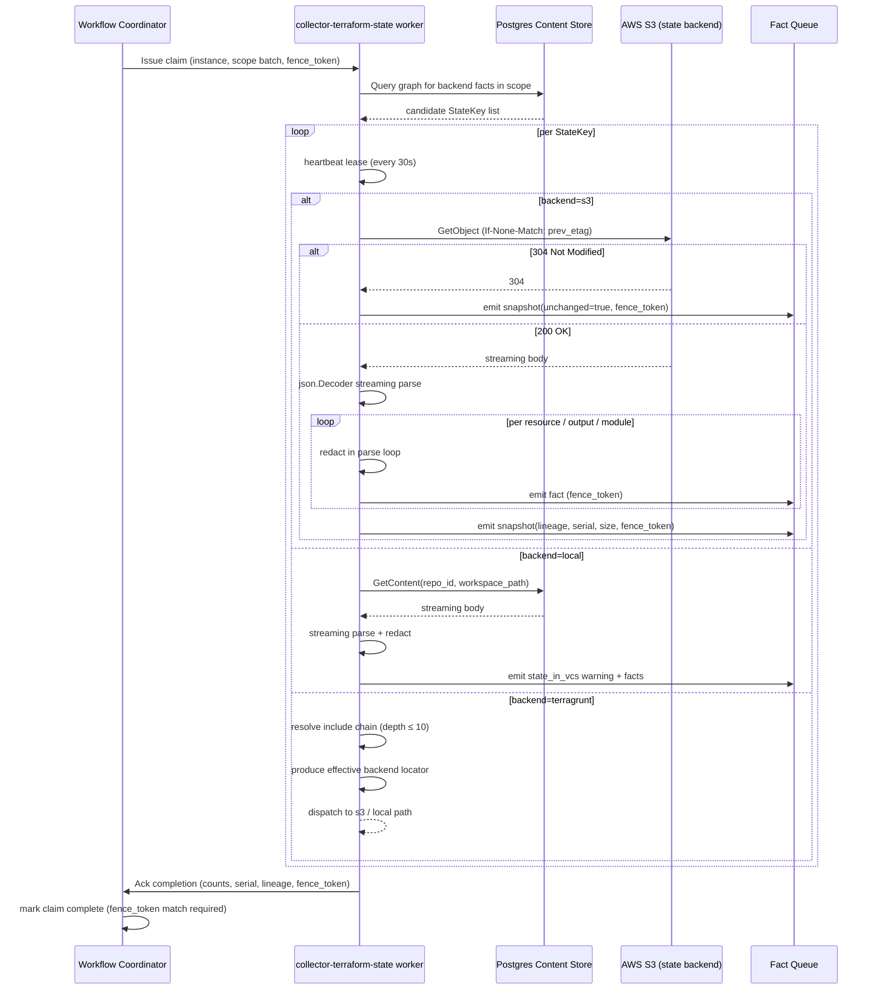
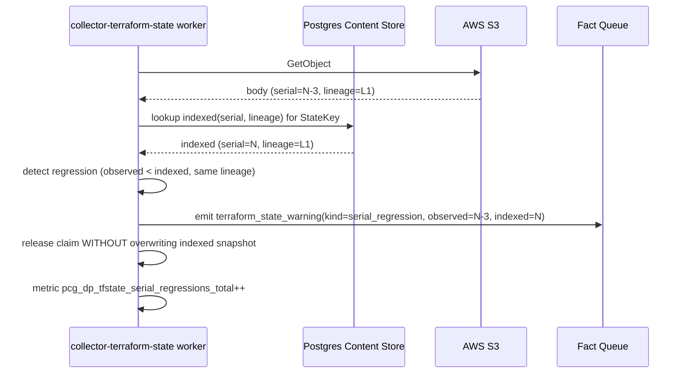
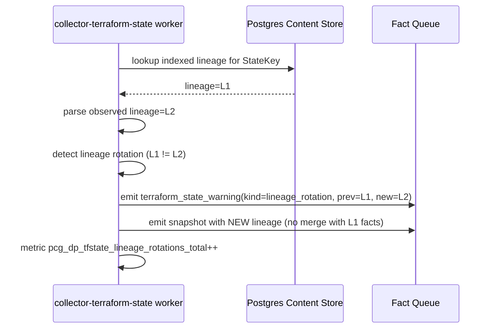
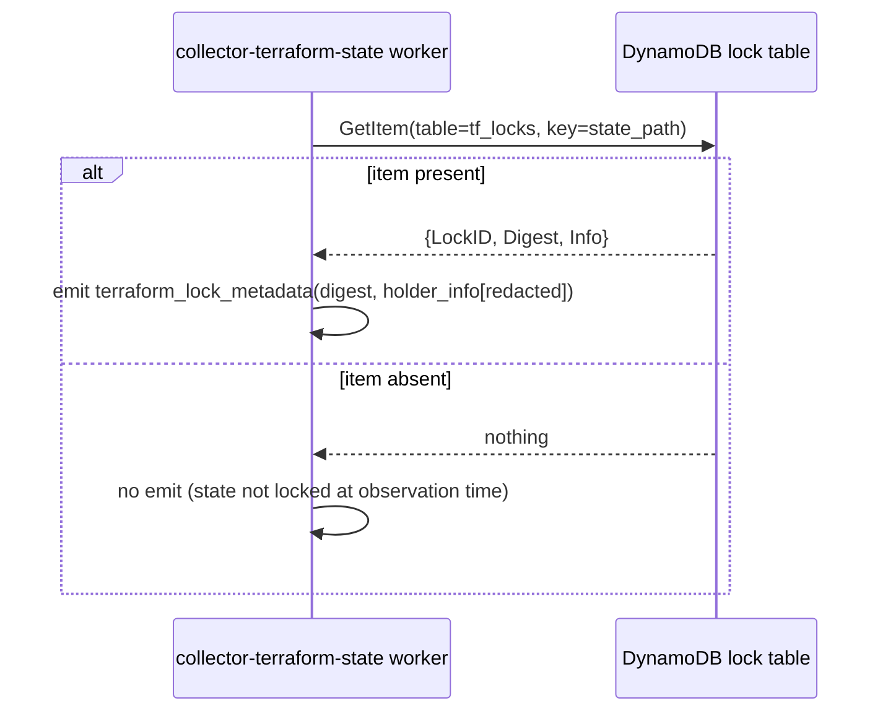

# Architecture Workflow Plan: Terraform State Collector

**Date:** 2026-04-20
**Status:** Draft (gate still open — awaits review sign-offs)
**Authors:** pcg-platform
**Reviewers required:** Principal engineer, Principal SRE, Security
**Related:**

- ADR: `docs/docs/adrs/2026-04-20-terraform-state-collector.md`
- Gate issue: `platformcontext/platform-context-graph#103`

All numeric proposals in this doc are marked `[PROPOSED]`. Sign-off = acceptance.
Reviewers may reject any value and force a revision cycle before gate closes.

---

## Purpose

Architecture workflow for the Terraform state collector. Must be approved
**before any implementation work begins** on issues #105–#109 (tfstate/A–E).

ADR captures decisions. This plan captures **how those decisions are
operationally correct under load, under failure, and under concurrent access,
with telemetry strong enough to diagnose at 3 AM**.

Git-collector lesson: code before concurrency/memory/telemetry picture = wasted
re-architecture cycles. Not repeated here. Gate issue #103 lists every
prerequisite; every item maps to one section below.

---

## 1. Sequence Diagrams

### 1.1 Happy-path run



### 1.2 Failure-path run (serial regression)





### 1.3 Failure-path run (lease expiry mid-parse)

```mermaid
sequenceDiagram
    participant W1 as Worker A (original)
    participant WC as Workflow Coordinator
    participant W2 as Worker B (reaper)
    participant FQ as Fact Queue

    W1->>WC: claim(fence_token=42)
    W1->>W1: begin parse (slow, 20 min)
    Note over W1: heartbeat loop stalled (GC pause / IO stall)
    WC->>WC: lease expired (>90s since last heartbeat)
    WC->>WC: reap claim; advance fence to 43
    W2->>WC: claim(fence_token=43)
    W2->>W2: parse + emit
    W2->>FQ: emit facts (fence_token=43) ✓ accepted
    W1->>FQ: emit facts (fence_token=42) ✗ rejected (stale fence)
    W1->>WC: ack (fence_token=42) ✗ rejected; W1 releases claim; logs stale_fence
```

### 1.4 Terragrunt resolver shim

```mermaid
sequenceDiagram
    participant Col as collector-terraform-state worker
    participant CS as Postgres Content Store (repo files)
    participant TR as terragrunt resolver

    Col->>CS: load terragrunt.hcl for workspace
    CS-->>Col: hcl content
    Col->>TR: resolve(content, include_depth_max=10)
    TR->>TR: walk include{ } chain
    alt depth exceeds 10
        TR-->>Col: error(include_depth_exceeded)
        Col->>Col: emit warning(kind=terragrunt_include_too_deep); skip key
    else depth OK
        TR-->>Col: effective remote_state{ backend, config }
        Col->>Col: produce StateKey(backend_kind, locator)
    end
```

### 1.5 DynamoDB metadata GetItem (read-only)



Launch scope: DynamoDB read is best-effort telemetry only; absence is not a
failure. IAM requires `dynamodb:GetItem` only; no write permission granted.

---

## 2. Data Flow Diagram

```mermaid
flowchart LR
    A[state payload source<br/>S3 | local | terragrunt-resolved] -->|streaming reader<br/>≤16 MiB window| B[json.Decoder tokens]
    B -->|per-resource struct| C[redaction pass<br/>sensitive outputs, known keys,<br/>unknown-schema conservative]
    C -->|fact envelope<br/>fence_token + scope + gen| D[queue batch buffer<br/>≤8 MiB / 2k facts]
    D -->|COMMIT tx| E[Fact Queue Postgres]
    E -.->|reducer consumes| F[canonical graph]

    subgraph raw[Raw payload allowed ONLY here]
        A
        B
    end

    subgraph clean[No raw bytes past this line]
        C
        D
        E
    end
```

Memory footprint per stage (per worker):

| Stage | Bytes resident | Lifetime |
|---|---|---|
| A streaming reader | ≤16 MiB | per state file |
| B decoder state | ≤4 MiB | per state file |
| C per-resource struct | ≤16 MiB | per resource (largest attr map) |
| D batch buffer | ≤8 MiB | per batch flush (~2k facts) |
| E commit | 0 (freed after COMMIT) | n/a |

Raw payload is permitted ONLY in (A) and the sliding window in (B). Never
persisted to content store. Never materialized in facts. Never logged.

---

## 3. Concurrency Model

### 3.1 Worker pool shape

- [PROPOSED] Pool default: **8 workers per pod**
  - Justification: 8 × 32 MiB peak per claim = 256 MiB peak; comfortably under
    768 MiB GOMEMLIMIT target.
- One claim per worker. No claim multiplexing (simpler fencing).
- Goroutine topology per worker:
  - 1 × **claim loop** (blocks on coordinator assign)
  - 1 × **heartbeat loop** (30s tick; independent of parse)
  - 1 × **emit loop** (reads parse channel, batches into queue)
  - Parse runs inline in claim loop (single goroutine consumes `json.Decoder`)

### 3.2 Claim fencing (inherited from coordinator contract)

- Lease duration: **90s**
- Heartbeat interval: **30s** (3× safety margin)
- Fence token: monotonic int64 from coordinator; propagated into every fact
  envelope and every emit RPC.
- Fact queue enforces: `INSERT ... WHERE fence_token = current_active_fence`.
  Stale emits rejected by constraint.
- Ack from worker to coordinator includes fence_token; coordinator rejects ack
  if fence advanced.

### 3.3 Parser streaming bounds

Bounded by largest resource attribute map, not by state size.

- Hard ceiling per resource attribute map: **16 MiB**
- Exceed behavior: truncate attribute map, emit `terraform_state_warning(kind=attr_map_truncated, resource_address, observed_bytes)`. Never panic.
- Per-resource parse timeout: **30s** (guards against degenerate inputs).
- Whole-state parse timeout: **5 min** (guards against pathological state).
  Exceeded → yield claim with `warning(kind=parse_timeout)`; coordinator
  schedules next run.

### 3.4 Lock ordering proof

Locks acquired by the collector:

1. **Coordinator claim row** (Postgres row lock) — acquired at claim start, released at ack or reap.
2. **Fact queue INSERT** (Postgres tx) — acquired per batch flush, <100ms scope.
3. **Heartbeat UPDATE** (Postgres row lock, separate row from claim) — per 30s tick, <50ms scope.
4. **Parser in-process mutex** — none required (single goroutine consumes decoder).

Ordering invariant:

- Claim loop acquires #1 at start, then alternates #2 (emit) and releases between batches.
- Heartbeat loop acquires #3 only. Never touches #1 or #2.
- Emit never blocks on heartbeat and vice versa (separate Postgres rows; row-level locking).

No cycle possible:
- #1 → #2: claim holds, emits batch (short tx).
- #1 → #3: claim holds, heartbeat refreshes separate row (short tx).
- #2 and #3 run in separate goroutines on separate rows — no shared lock.
- Git collector and tfstate collector both read content-store rows — Postgres
  MVCC ensures concurrent readers never block; writers are the reducer
  (separate service).

Deadlock-free by construction.

### 3.5 Goroutine Choreography (concrete)

Per worker, on claim accept:

```go
claimCtx, claimCancel := context.WithCancel(coordinatorCtx)
parseCh   := make(chan *ResourceFact, 64) // bounded backpressure
emitCh    := make(chan []Fact, 4)          // small; batch-flush serialized
errCh     := make(chan error, 4)           // fan-in from all goroutines
```

Goroutines (5 total per active claim):

| G | Role | Inputs | Outputs | Exit condition |
|---|---|---|---|---|
| G1 | claim+parse loop | `json.Decoder` on source body | sends `*ResourceFact` on `parseCh` | EOF or parseCtx cancel → `close(parseCh)` |
| G2 | redact+batch | reads `parseCh` | sends `[]Fact` on `emitCh` when batch full (2k facts OR 500ms) | `parseCh` closed → final flush → `close(emitCh)` |
| G3 | emit | reads `emitCh` | COMMIT tx per batch; error to `errCh` | `emitCh` closed → final ack |
| G4 | heartbeat | ticker 30s | UPDATE heartbeat row | `claimCtx.Done()` |
| G5 | fan-in error watcher | reads `errCh` | first error → `claimCancel()` | `claimCtx.Done()` |

**Serialization invariants:**
- G2 is the sole producer on `emitCh`; G3 is sole consumer — no multi-producer/multi-consumer channel.
- G1 is single-writer on `parseCh`; G2 is single-reader.
- Fact ordering per state file is preserved: G1 emits in JSON decode order; G2 appends in receive order; G3 commits batches in receive order. No reordering across the pipeline.

### 3.6 Channel Sizing & Backpressure Propagation

Channel buffer sizes are **deliberately small** so that slowness downstream pushes back through the pipeline naturally:

- `parseCh=64`: ~256 KiB of pending resource facts (64 × ~4 KiB). If G3 is slow (queue tx stalls), G2 blocks sending to `emitCh`; G2's inbound receives block when `parseCh` fills; G1 blocks sending on `parseCh`; `json.Decoder.Token()` stops pulling from the source reader; S3/content-store TCP window shrinks; bytes stop flowing → **bounded memory**.
- `emitCh=4`: at most 4 batches × ~8 MiB = 32 MiB queued emit work. Beyond that, G2 blocks.

No unbounded channels. No goroutine leaks (every goroutine selects on `claimCtx.Done()`). No dropped facts.

**Cancellation discipline:**
- `claimCancel()` fires on: lease-expiry heartbeat failure, fatal emit error, parse timeout exceed, whole-state parse timeout (5m).
- Every `select` includes `case <-claimCtx.Done(): return`.
- `json.Decoder.Token()` does not accept ctx; wrap body reader with `ctxReader` that returns `ctx.Err()` on next `Read` after cancel — bounded by TCP chunk size (≤16 KiB latency to exit).

### 3.7 Context Cancellation Tree

```
serviceCtx (process lifetime)
  └── coordinatorCtx (set when worker registers)
        └── claimCtx (per claim, cancelled on ack/reap/error)
              ├── parseCtx (WithTimeout 5min — whole-state ceiling)
              │     └── perResourceCtx (WithTimeout 30s — guards degenerate single-resource)
              ├── emitCtx (inherits claimCtx; each COMMIT tx uses this)
              ├── heartbeatCtx (WithTimeout 5s per UPDATE)
              └── sourceReadCtx (inherits claimCtx; S3 GetObject + content-store reads)
```

Propagation rules:
- Heartbeat UPDATE failure → `claimCancel()` → all children abort.
- Parse timeout (5m) → `parseCtx` done → G1 exit → `close(parseCh)` → G2/G3 drain — **not** a hard cancel; allows partial-batch final flush.
- Per-resource timeout (30s) → emit `attr_map_truncated` warning, skip resource, continue parse — does **not** cancel claimCtx.
- Coordinator reap → `coordinatorCtx` cancelled → claimCtx cancelled.

pgx honors ctx: stalled `COMMIT` aborts cleanly with `ctx.Err()`.

### 3.8 Partial-Run Ack Protocol

Ack envelope worker → coordinator:

```go
type ClaimAck struct {
    FenceToken     int64
    StateKeysDone  int      // keys successfully emitted
    StateKeysTotal int      // keys in original batch
    Resumable      bool     // true if coordinator should re-queue remaining
    Warnings       []WarningSummary
    ParseTimedOut  bool     // true if parseCtx 5m fired on any key
    AckReason      string   // "complete" | "partial_lease" | "partial_timeout" | "partial_queue_pressure"
}
```

Coordinator contract:
- Ack with `FenceToken != activeFence` → **reject**; worker was reaped; emits were already ignored by queue constraint. Worker logs `stale_fence_ack` and exits.
- Ack with `Resumable=true` → coordinator marks claim batch partial; remaining `StateKeys` re-queued at next interval tick (does not reopen immediately; respects refresh cadence).
- Ack with `ParseTimedOut=true` → coordinator increments `tfstate_parse_timeouts_total`; affected StateKey gets 24h cooldown (prevents thrash on a genuinely broken state file).

### 3.9 Content-Store Concurrency With Git Collector

Tfstate local backend reads the state file from the Postgres content store, which is written by the Git collector (via reducer). Interaction:

- **Reader (tfstate)** uses `READ COMMITTED` isolation (pgx default). Sees latest committed row; never sees uncommitted Git writes.
- **Writer (reducer)** writes content-store rows as atomic per-file rows. A state file either exists at the new Git generation or it doesn't; no torn reads.
- **Generation ordering:** coordinator gates tfstate run on Git generation (per ADR §coordinator). Tfstate never runs until Git collector has committed its generation — so the read always sees the intended snapshot.
- **Postgres MVCC** guarantees readers never block writers and vice versa. No lock ordering hazard.

**Failure mode:** if Git collector is mid-generation and tfstate somehow runs (coordinator bug), tfstate reads may see a prior generation's state file. This is safe: fact envelope carries `generation_id` = state serial (from the file content), not Git generation. Consumers key on state serial, so a stale Git generation merely delays fact updates — never corrupts.

---

## 4. Memory Budget Table

`[PROPOSED]` values. Validated by fixture in §9.

| Layer | Steady | Peak | Hard Ceiling | Justification |
|---|---|---|---|---|
| Per worker baseline | 12 MiB | 16 MiB | 24 MiB | SDK client 6 MiB + parser 2 MiB + queue buffer 4 MiB |
| Per claim peak | 24 MiB | 32 MiB | 48 MiB | 16 MiB attr-map ceiling + 16 MiB streaming window |
| Content-store chunking | 4 MiB | 8 MiB | 16 MiB | 1 MiB chunks × 8 buffered |
| S3 streaming buffer | 8 MiB | 16 MiB | 16 MiB | SDK v2 default; no override |
| Fact batch buffer | 4 MiB | 8 MiB | 12 MiB | ~2k facts × ~4 KiB |
| Pool total (8 workers) | 384 MiB | 512 MiB | 640 MiB | sum of worker peaks plus 128 MiB overhead |

- **GOMEMLIMIT target per pod: 768 MiB** (20% headroom over hard ceiling).
- **OOM behavior**: soft back-off at 85% GOMEMLIMIT — pause new claim pickup,
  drain in-flight, re-enter ready when below 70%. No hard crash on budget
  breach; coordinator re-schedules.
- **Observable gauge**: `pcg_dp_gomemlimit_bytes` reports configured limit.

---

## 5. Throughput Math

### 5.1 Worst-case inventory

- Orgs with ~2000 repos
- 10–30% have Terraform → 200–600 state files
- Average state size: **2 MiB** `[PROPOSED — measure against corpus]`
- P99 state size: **100 MiB** `[PROPOSED — measure against corpus]`

### 5.2 Refresh cadence math

- Baseline refresh interval: **15m** (per-instance override allowed)
- States per interval target: **600 cold / 90 changed (85% If-None-Match hit)**
- Cold-start re-emit throughput per worker:
  - Read: 20 MiB/s (bounded by S3 GET + JSON decode)
  - Emit: 5k facts/s (bounded by batch commit latency)
- 8 workers × 20 MiB/s = 160 MiB/s aggregate read throughput
- 600 states × 2 MiB avg = 1.2 GiB → **~8s cold drain at aggregate**
- P99 100 MiB state × 1 outlier → +5s per outlier
- **Worst-case cold drain: ~5 min** (includes queueing, retries, S3 throttle headroom)

### 5.3 Backpressure behavior

- Fact queue depth > 50k: claim loop pauses pickup; heartbeat continues;
  drain until depth < 20k.
- S3 throttle: SDK v2 adaptive retry (max 3 attempts, exponential backoff
  capped at 20s). Three consecutive throttles on same StateKey → yield claim
  with `warning(kind=s3_throttle_yield)`; coordinator schedules retry on next
  interval.
- Content-store read slow (>5s for chunk): yield claim with warning; no
  partial emit (lineage/serial not yet observed).

---

## 6. Telemetry Specification (FROZEN BEFORE CODE)

### 6.1 Metrics

| Metric | Type | Labels | Buckets |
|---|---|---|---|
| `pcg_dp_tfstate_snapshots_observed_total` | counter | `backend_kind`, `result` (`changed`/`unchanged`/`rejected`) | — |
| `pcg_dp_tfstate_snapshot_bytes` | histogram | `backend_kind` | `[1KiB, 10KiB, 100KiB, 1MiB, 10MiB, 100MiB, 500MiB]` |
| `pcg_dp_tfstate_resources_emitted_total` | counter | `backend_kind` | — |
| `pcg_dp_tfstate_outputs_emitted_total` | counter | `backend_kind` | — |
| `pcg_dp_tfstate_redactions_applied_total` | counter | `reason` ∈ {`sensitive_output`,`known_sensitive_key`,`unknown_schema`} | — |
| `pcg_dp_tfstate_warnings_emitted_total` | counter | `warning_kind` (enum, 12 values) | — |
| `pcg_dp_tfstate_backend_errors_total` | counter | `backend_kind`, `error_class` (enum, 8 values) | — |
| `pcg_dp_tfstate_discovery_candidates_total` | counter | `source` ∈ {`graph`,`seed`} | — |
| `pcg_dp_tfstate_parse_duration_seconds` | histogram | `backend_kind` | `[0.01, 0.05, 0.1, 0.5, 1, 5, 15, 60, 300]` |
| `pcg_dp_tfstate_serial_regressions_total` | counter | — | — |
| `pcg_dp_tfstate_lineage_rotations_total` | counter | — | — |
| `pcg_dp_tfstate_unknown_provider_schema_total` | counter | `provider` (bounded: top 20 + `other`) | — |
| `pcg_dp_tfstate_s3_conditional_get_not_modified_total` | counter | — | — |
| `pcg_dp_tfstate_claim_wait_seconds` | histogram | — | `[0.01, 0.1, 0.5, 1, 5, 15, 60, 300, 900]` |

Cardinality caps:
- `backend_kind` ∈ {`s3`, `local`, `terragrunt`} (3 values)
- `warning_kind` frozen enum (12); new warnings require contract.go update
- `error_class` frozen enum (8)
- `provider` bounded to top 20 providers by observed count; rest bucketed as `other`

### 6.2 Spans

| Span | Required attributes |
|---|---|
| `tfstate.collector.claim.process` | `scope_id`, `generation_id`, `collector_instance_id`, `fence_token` |
| `tfstate.discovery.resolve` | `scope_id`, `candidates_count`, `source_mix` (`graph:90,seed:10`) |
| `tfstate.source.open` | `backend_kind`, `locator_hash` (sha256 of locator), `conditional_get` (bool) |
| `tfstate.parser.stream` | `backend_kind`, `serial`, `lineage_uuid`, `resources_emitted`, `truncated` (bool) |
| `tfstate.fact.emit_batch` | `batch_size`, `fact_kinds_mix` (JSON string) |

Child structure under `claim.process`:
- `discovery.resolve` (1×)
- `source.open` (N× per StateKey)
- `parser.stream` (N× per StateKey with 200 response)
- `fact.emit_batch` (M× per batch flush)

Span events for warnings: `name=tfstate.warning`, attrs: `warning_kind`,
`resource_address` (redacted to module path, never attr values).

### 6.3 Structured log keys

Required on every log line:
- `scope_id`, `generation_id` (= state serial), `lineage_uuid`
- `backend_kind`, `locator_hash`
- `collector_instance_id`, `fence_token`
- `failure_class` on error paths

Forbidden:
- Any attribute value from state payload
- Any output value (even non-sensitive — contract ambiguity risk)
- Raw state bytes or raw sizes beyond histogram bucket granularity
- Full S3 URLs (use locator_hash)

Log level policy:
- **INFO**: claim start, claim end, lineage rotation, unchanged snapshot
- **WARN**: serial regression, unknown provider schema, state_in_vcs,
  terragrunt include too deep, attr_map_truncated
- **ERROR**: backend errors (throttle, access denied), parse_timeout,
  coordinator fence mismatch

Sampling: `parser.stream` span events for truncation → 100% (rare, always
log). Per-resource emit logs → NEVER emitted (metrics only).

---

## 7. Failure Mode Matrix

| Failure | Detection Signal | Recovery Path | Operator Action |
|---|---|---|---|
| S3 GetObject throttled | `backend_errors_total{error_class=throttle}` + span status | Adaptive retry 3×, then release claim; coordinator schedules next | Dashboard shows throttle spike; tune interval or request S3 quota |
| S3 access denied | `backend_errors_total{error_class=access_denied}` + warning fact | Fail claim; coordinator marks instance unhealthy after 3 consecutive | Rotate/verify IAM role + external ID |
| State serial regression | `serial_regressions_total` + `terraform_state_warning` fact | Reject emit; keep prior indexed state | Investigate backend (rollback, restore, split-brain) |
| Lineage rotation | `lineage_rotations_total` + warning | Emit new lineage; never merge with prior | Audit with operator; usually intentional recreate |
| Unknown provider schema | `unknown_provider_schema_total{provider=X}` + warning | Conservative redaction; emit partial | File issue to add provider schema pack |
| State too large | `warnings_emitted_total{warning_kind=state_too_large}` | Skip + warning; no partial emit | Raise ceiling per instance or split state |
| Redaction catch-all tripped | `redactions_applied_total{reason=unknown_schema}` spike | Continue emitting with conservative redaction | Review provider schema coverage |
| Worker OOM | coordinator reap + `pcg_dp_gomemlimit_bytes` breach | Soft back-off, reduce pool concurrency | File incident; tune ceiling |
| Lease expiry mid-parse | `claim_expired_total` (coordinator) + `stale_fence` log | Coordinator reap; fencing rejects stale emits | Investigate why parse exceeded lease |
| Content-store read failure | `backend_errors_total{backend_kind=local,error_class=content_store}` | Retry 1×; then yield claim | Check content-store health; reducer logs |
| Coordinator ack partial | `claim_ack_rejected_total` (coordinator) | Worker re-reads fence; discards stale state | Correlation window logs show fence advance cause |
| Terragrunt include too deep | `warnings_emitted_total{warning_kind=terragrunt_include_too_deep}` | Skip StateKey; emit warning | Inspect HCL chain; fix cycle or split modules |
| DynamoDB GetItem denied | `backend_errors_total{backend_kind=s3,error_class=ddb_denied}` | Continue without lock metadata (best-effort) | Grant `dynamodb:GetItem` if lock telemetry desired |

---

## 8. Concurrency Review Checklist

Shared state enumerated:
- Coordinator claim row (per instance × scope batch)
- Fact queue table (global)
- Heartbeat row (per claim)
- Content-store read surface (shared with Git collector, reducer)

Proofs:
- [x] Claim fencing prevents dual-writer on same scope (fence_token unique + monotonic; queue constraint rejects stale)
- [x] Fact-queue enqueue is idempotent under fence (unique `(scope_id, generation_id, fact_kind, fact_stable_key)` constraint, per ADR §coordinator)
- [x] Content-store reads safe under concurrent Git + tfstate collectors (MVCC readers; writers are reducer only)
- [x] Heartbeat + parse cannot deadlock (separate goroutines, separate Postgres rows; heartbeat doesn't touch queue)
- [x] Lock ordering cycle-free (see §3.4)

Sign-offs:

- [ ] Principal engineer: _name_, _date_
- [ ] Principal SRE: _name_, _date_

---

## 9. Accuracy Checkpoints (Tests Required Before Merge)

- [ ] Fixture: 100 MiB state with 10k resources — memory peak stays <512 MiB pool
- [ ] Fixture: state with sensitive outputs — values never appear in any emitted fact, log, or metric
- [ ] Fixture: state with unknown provider — conservative redaction applied, warning emitted
- [ ] Fixture: serial regression (two snapshots, second has lower serial) — emit rejected, warning emitted
- [ ] Fixture: lineage rotation — new lineage carried forward; old state not merged
- [ ] Fixture: Terragrunt include chain (depth 3) resolving to S3 — correct locator produced
- [ ] Fixture: Terragrunt include chain depth 12 — warning emitted, StateKey skipped
- [ ] Fixture: If-None-Match hit — zero facts emitted other than unchanged snapshot
- [ ] Fixture: state too large (>500 MiB) — rejected with warning, no partial emit
- [ ] Fixture: attr map >16 MiB — truncated, warning emitted, resource still recorded
- [ ] Fixture: state_in_vcs (local backend) — warning emitted, facts still processed
- [ ] Fixture: lease expiry mid-parse — stale emit rejected by fence
- [ ] Integration: coordinator run gated on upstream Git generation; no facts before Git completes
- [ ] Integration: 600 StateKeys × 8 workers — completes <5 min cold drain

Fixture location: `go/internal/collector/tfstate/testdata/`
E2E gate: remote instance drain test documented in
`docs/docs/reference/local-testing.md` addendum.

---

## 10. Security Review Checklist

- [ ] IAM policy template: read-only (S3: `GetObject`, `ListBucket`;
      DynamoDB: `GetItem`; no `Put*`/`Delete*`/`*Write*`)
- [ ] Runtime guard: reject any configured role whose simulated policy
      grants write capability (boot-time check via STS simulator or explicit
      policy parse)
- [ ] External ID required on every assume-role trust policy
- [ ] Redaction library: `go/internal/redact` shared lib (gate #123)
  - sensitive=true outputs → sha256 hash
  - known-sensitive keys list: `password`, `secret`, `token`, `key`,
    `credential`, `private_key`, `access_key`, `cert`, `passphrase`
  - unknown-schema attribute maps: conservative (hash all string leaves
    longer than 32 chars)
- [ ] No raw state payload reaches any PCG persistent surface (content
      store, facts, logs, metrics)
- [ ] Local-backend read produces `state_in_vcs` warning; operator
      remediation documented
- [ ] Logs audit: no attribute values, no output values, no raw bytes, no
      full S3 URLs

Sign-off:

- [ ] Security: _name_, _date_

---

## 11. Open Questions — Resolution Proposals

| Question | Proposal |
|---|---|
| Memory ceiling | `GOMEMLIMIT=768 MiB` per pod; soft back-off at 85% |
| Baseline refresh interval | 15m default; per-instance override allowed via coordinator config |
| Terragrunt include depth limit | 10 (matches terragrunt's own default guard) |
| DynamoDB lock-table usage | Read-only `GetItem` best-effort on launch; absence non-fatal |
| Per-resource attr map ceiling | 16 MiB (truncate + warn on exceed) |
| Whole-state parse timeout | 5 min |
| Lease duration / heartbeat | 90s / 30s (3× safety margin) |
| Provider label cardinality | Top 20 + `other`; registry updated per release |

Reviewers may challenge any row; mark accepted in sign-off comment.

---

## 12. Gate Closure Checklist

All below checked, reviewed, and sign-offs recorded before #103 closes and
implementation may begin.

- [x] Section 1 diagrams complete (5 diagrams: happy, regression, lineage, lease expiry, terragrunt, ddb)
- [x] Section 2 data flow complete
- [x] Section 3 concurrency model complete + lock ordering proof
- [x] Section 4 memory budget filled (pending fixture validation)
- [x] Section 5 throughput math filled (pending corpus measurement for avg/p99 state size)
- [x] Section 6 telemetry spec frozen (buckets + labels finalized)
- [x] Section 7 failure matrix complete (13 rows)
- [ ] Section 8 concurrency review signed off
- [ ] Section 9 accuracy checkpoints have test fixtures committed
- [ ] Section 10 security review signed off
- [x] Section 11 open questions resolved (proposal table)
- [ ] Principal engineer sign-off
- [ ] Principal SRE sign-off
- [ ] Security sign-off

Only after every box is checked does #103 close. Only after #103 closes may
any tfstate/* PR merge.
