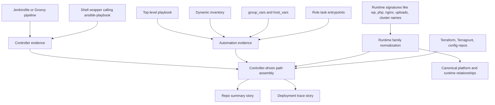

# Generic Jenkins and Ansible Automation Paths

## Summary

This slice extends PlatformContextGraph so it can explain delivery paths that
are driven by automation controllers such as Jenkins and executed through
Ansible, without baking in one company's repository names or environment
conventions.

The immediate motivation is the MWS repository family, where the local evidence
shows a monolithic WordPress website fleet operated through Jenkins-triggered
Ansible workflows, with Terraform stacks alongside the automation. The design
must generalize beyond MWS and beyond AWS so future contributors can support
other controller-driven deployment patterns with the same staged mapping model.

The design keeps the existing typed relationship vocabulary and story-first MCP
outputs. It adds a generic controller-driven automation enrichment layer and a
targeted evidence model for high-signal Jenkins and Ansible artifacts.

## Problems

### Controller-driven automation is only partially visible

PlatformContextGraph now explains GitHub Actions, ArgoCD, Helm, Kustomize,
Terraform, and Terragrunt much better than before. Jenkins and Ansible are only
partially represented:

- Groovy parsing focuses on Jenkins entry points and pipeline hints
- Ansible content is indexed and searchable, but not yet assembled into a
  portable deployment story
- hosted MCP can see raw MWS clues such as `website_import`,
  `server-dmmwebsites`, and Ansible configuration, but it does not elevate them
  into a coherent end-to-end narrative

### The raw MWS evidence is strong but the product story is weak

The local repositories show a clear operating model:

- [README.md](/Users/allen/repos/ansible-automate/automate-mws/README.md#L9)
  says `automate-mws` sets up MWS environments locally and in AWS
- [README.md](/Users/allen/repos/ansible-automate/automate-mws/README.md#L116)
  points at a Jenkins job used to upload website import data to S3
- [mws.yml](/Users/allen/repos/ansible-automate/automate-mws/mws.yml#L24)
  installs `nginx`, `php`, and `memcached`, and
  [later](/Users/allen/repos/ansible-automate/automate-mws/mws.yml#L34)
  deploys `portal-websites`
- [000_shared_vars.yml](/Users/allen/repos/ansible-automate/automate-mws/importer/environments/000_shared_vars.yml#L3)
  defines WordPress paths, uploads, and per-environment website host suffixes
- [main.yml](/Users/allen/repos/ansible-automate/automate-mws/importer/roles/website_import/tasks/main.yml#L53)
  runs `wp` commands to check, create, import, and rewrite WordPress databases
- [README.md](/Users/allen/repos/ansible-automate/automate-mws-import-tasks/README.md#L1)
  explicitly says it is an Ansible repo used in Jenkins
- [jenkins.groovy](/Users/allen/repos/ansible-automate/automate-mws/importer/roles/websites_list/jenkins.groovy#L1)
  is a Jenkins Groovy script that fetches website inventory from S3

This is enough to conclude that the MWS family is not an ECS/EKS-style service
deployment path. It is a controller-driven website-platform workflow. The
product should be able to say that clearly.

### We need a generic model, not an MWS special case

The desired model must work for:

- Jenkins plus Ansible website fleets
- Jenkins plus Ansible service provisioning
- future controller-driven paths in other companies
- future runtime families such as Fargate or Elastic Beanstalk
- future clouds and hybrid environments

The design cannot depend on:

- repository names like `automate-mws`
- environment names like `bg-prod`
- company-specific bucket names or host naming conventions

### Ansible is too broad to treat uniformly

Ansible contains many file classes:

- playbooks
- roles
- handlers
- templates
- `group_vars`
- `host_vars`
- dynamic inventory
- shell wrappers

Not all of these carry equal delivery meaning. If we invest evenly everywhere,
we will spend too much effort parsing low-value detail and still fail to explain
the core path.

## Goals

- model Jenkins plus Ansible as a generic controller-driven automation path
- keep the relationship vocabulary generic and portable
- prioritize high-signal Ansible and Jenkins artifacts first
- support runtime-family interpretation without hard-coding MWS assumptions
- surface controller-driven automation in repo summaries and deployment traces
- document the extension order so future contributors can add more runtimes and
  controller families safely

## Non-Goals

- fully executing Ansible, Jinja, or Groovy
- reproducing Ansible variable precedence exactly
- building a complete task-by-task Jenkins or Ansible execution simulator
- introducing new provider-specific canonical entity families in this slice
- replacing the existing GitHub Actions, Terraform, or GitOps paths

## Design Principles

### Keep the model staged

The controller-driven automation path must follow the same staged mapping model
used elsewhere in this branch:

1. parse and index files
2. link cross-repo references
3. extract raw evidence
4. derive canonical typed relationships where justified
5. enrich read-side stories and summaries

No stage should silently perform the job of a later stage.

### Extract tool semantics, not naming heuristics

The system should rely on evidence such as:

- Jenkins pipeline structure and shell commands
- references to `ansible-playbook`
- playbook hosts, roles, and tags
- dynamic inventory behavior
- `group_vars` and `host_vars` that describe runtime targets
- WordPress, PHP, Nginx, Apache, or other runtime signatures

The system should not infer a controller-driven path just because a repo name
contains a word like `mws` or `portal`.

### Prefer targeted depth over uniform depth

The design should prioritize the surfaces most likely to answer deployment and
runtime questions:

- first tier:
  - Jenkinsfiles and Groovy pipeline entrypoints
  - shell wrappers that invoke automation
  - top-level Ansible playbooks such as `deploy.yml` or `sync_websites.yml`
  - dynamic inventory scripts
- second tier:
  - `group_vars`
  - `host_vars`
  - role `tasks/main.yml`
  - role defaults and vars
- third tier:
  - handlers
  - templates
  - deep role internals that are useful only after the path is already known

## Proposed Architecture

### Generic controller-driven automation path

Add a generic read-side enrichment concept called a `controller_driven_path`.

It is not a new canonical relationship type. It is a summarized path assembled
from evidence that spans controllers, automation, targets, and runtime families.

Each path record should contain:

- `controller_kind`
  - examples: `jenkins`, `github_actions`
- `controller_repository`
  - optional repo if the controller logic lives outside the target repo
- `automation_kind`
  - examples: `ansible`, `shell_wrapper`
- `automation_repository`
  - repo that contains the playbook, pipeline, or wrapper
- `entry_points`
  - playbook names, scripts, pipeline stages, or top-level commands
- `target_descriptors`
  - dynamic inventory names, host groups, or environment selectors
- `runtime_family`
  - generic normalized runtime family such as `wordpress_website_fleet`,
    `php_web_platform`, `ecs_service`, `kubernetes_gitops`
- `supporting_repositories`
  - related config, Terraform, or content repos when they are directly linked
- `confidence`
  - `high`, `medium`, or `low`
- `explanation`
  - short sentence used by `story`

### Evidence classes

#### Controller evidence

Controller evidence should come from:

- Jenkinsfile or Groovy entrypoints
- reusable Jenkins shared-library calls
- shell scripts or documented commands that invoke controller jobs
- controller-side references to S3 artifacts, inventory files, or target repos

This evidence answers:

- what triggers the automation
- where the automation logic lives
- whether the path is user-invoked, scheduled, or controller-driven

#### Automation evidence

Automation evidence should come from:

- top-level playbooks
- top-level role includes
- dynamic inventory scripts
- shell wrappers that call `ansible-playbook`
- `group_vars` and `host_vars`
- targeted role task files that perform deployment or import actions

This evidence answers:

- what gets executed
- what targets the execution runs against
- which environment selectors are meaningful
- which repo or artifact families are being deployed or synchronized

#### Runtime evidence

Runtime evidence should be normalized through the same runtime-family concept
used elsewhere on this branch.

Examples:

- `wp --allow-root`, `wp-content/uploads`, and shared portal config folders
  imply a `wordpress_website_fleet` or `php_web_platform` family
- `aws ecs`, cluster names, and Terraform ECS module patterns imply an
  `ecs_service` family
- Helm, ArgoCD, and Kustomize signals imply `kubernetes_gitops` or a more
  specific Kubernetes-managed family

Runtime families remain generic and extensible. The controller-driven path
enricher consumes them; it does not invent separate runtime logic.

## Data Flow

## Canonical Relationship Impact

This slice should avoid inventing a `RUNS_WITH_ANSIBLE` or `DEPLOYED_BY_JENKINS`
relationship type.

Instead:

- use controller and automation evidence to improve path assembly and stories
- preserve existing typed relationships where the evidence is already strong
  enough
- let runtime-family normalization continue to feed canonical platform-related
  relationships such as `RUNS_ON` and `PROVISIONS_PLATFORM`

This keeps canonical truth small and explainable while allowing rich read-side
stories.

## File Investment Strategy

### First implementation wave

Add targeted support for:

- `Jenkinsfile`
- Groovy pipeline entry files
- shell wrappers that call `ansible-playbook`
- top-level playbooks
- dynamic inventory scripts
- `group_vars`
- `host_vars`

This is the smallest set that can explain most controller-driven paths.

### Second implementation wave

Add targeted support for:

- role `tasks/main.yml`
- role defaults and vars
- selected role task files with deployment, import, or synchronization behavior

This helps explain deeper automation once the controller path is known.

### Third implementation wave

Only after the path is proven useful, extend to:

- handlers
- templates
- lower-signal role internals

This avoids spending effort on data that adds little narrative value.

## MWS Acceptance Expectations

After this slice, PlatformContextGraph should be able to explain the MWS family
in generic terms such as:

- Jenkins triggers Ansible automation against environment-specific inventory
- Ansible configures a PHP and WordPress website platform
- website content, database state, uploads, and configs are synchronized across
  environments
- Terraform repositories are related to the supporting infrastructure

It should not need to say “MWS” to be correct.

## Edge Cases

- Jenkins logic may live in a shared library or external automation repo rather
  than a local `Jenkinsfile`
- playbook wrappers may hide `ansible-playbook` behind scripts
- `group_vars` and `host_vars` may describe runtime characteristics without
  directly naming a platform
- local Docker workflows and remote cloud workflows may coexist in the same
  repo
- Ansible may manage both application content and operational tasks in the same
  repository
- some repositories may only provide import or synchronization behavior, not
  deployment itself

The story layer must remain truthful when only part of the path is visible.

## Testing Strategy

- unit tests for controller evidence extraction from Jenkins Groovy and
  `Jenkinsfile` entrypoints
- unit tests for shell-wrapper detection of `ansible-playbook`
- unit tests for top-level playbook and inventory extraction
- unit tests for `group_vars` and `host_vars` runtime-family hints
- unit tests for controller-driven path assembly and ranking
- integration tests for repo summary and deployment trace output
- acceptance tests using the MWS repo family plus at least one non-MWS
  Jenkins-plus-Ansible example to avoid overfitting

## Rollout Guidance

When contributors add support for another controller-driven runtime path, the
change order should be:

1. add high-signal file parsing and evidence extraction
2. normalize any new runtime-family hints through the shared runtime-family seam
3. assemble controller-driven paths on the read side
4. add or refine canonical relationships only if the evidence is stable enough
5. update the dynamic mapping documentation and tests

That order keeps the system explainable and reduces regressions in mapping
direction, precedence, and truthfulness.
