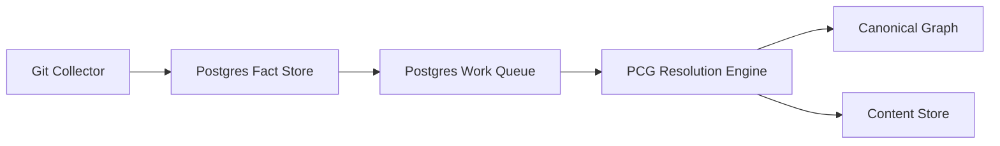

# PCG Phase 2 Facts And Resolution Engine Design

**Status:** Draft

**Date:** April 2, 2026

## Executive Summary

Phase 1 made the monorepo legible. Phase 2 makes the runtime architecture honest.

Today, the Git collector still owns too much of the final graph outcome. It parses,
commits graph state, and triggers workload/platform materialization in one tightly
coupled indexing path. That shape will not scale well as PCG adds more collectors
and more concurrent sources.

Phase 2 introduces a fact-first write path for Git:

- Git collection writes durable facts into Postgres.
- A Postgres-backed work queue coordinates downstream processing.
- A new Resolution Engine service consumes facts and becomes the primary owner of
  canonical graph projection.
- The Git path switches over from direct graph writes to facts-first projection.

The end state of this phase is a full Git switch-over, implemented in ordered
waves inside one Phase 2 PR so the system remains testable throughout.

## Problem Statement

The merged Phase 1 architecture leaves three intentional seams:

1. `facts/` is only a placeholder boundary.
2. `resolution-engine` is declared as a service role but not implemented.
3. The Git collector still writes graph state directly through the current
   indexing pipeline.

That means PCG is structurally clearer, but its primary write path is still:

`Git collector -> parsers -> graph writes -> workloads/platform projection`

This is workable for one source, but it couples:

- source collection
- parsing
- write orchestration
- canonical graph truth
- post-index resolution

As a result, future collectors such as AWS and Confluence would either:

- need to learn graph-write semantics themselves, or
- bolt onto an architecture that still treats the graph as the ingestion truth

Phase 2 corrects that by separating:

- **collection truth**: durable facts in Postgres
- **projection truth**: canonical graph state written by the Resolution Engine

## Goals

- Make `facts/` a real package with durable, typed fact contracts.
- Use the existing Postgres deployment as the fact store.
- Add a Postgres-backed outbox/work-items queue for resolution work.
- Implement a real `resolution-engine` service role.
- Switch the Git path to facts-first processing instead of direct graph writes.
- Preserve the current graph-backed query surfaces after projection.
- Keep the implementation testable in small waves while still achieving a full
  Git switch-over in this phase.

## Non-Goals

- Adding AWS or Confluence collectors in this phase.
- Replacing Neo4j in this phase.
- Replacing the content store in this phase.
- Rewriting the read/query layer in this phase.
- Splitting the repository in this phase.

## Design Principles

### Facts Are Durable Source Truth

Facts should represent source observations and normalized parse output, not
graph projection state. They must be replayable and attributable to a source
run/snapshot.

### Resolution Engine Owns Canonical Graph Writes

Collectors collect. The Resolution Engine decides canonical graph state and
writes it.

### Existing Postgres First

Phase 2 uses the current Postgres deployment with new fact and work tables.
This lowers operational risk and keeps the phase focused on architecture.

### Full Git Switch, Ordered Internally

The Phase 2 PR will switch Git to the new path, but the implementation will be
sequenced in waves so failures remain diagnosable.

## Runtime Architecture

## Service Responsibilities

### Git Collector

Owns:

- repo sync
- repository discovery
- file selection
- parse execution
- fact emission

Does not own:

- canonical graph writes
- workload/platform graph projection
- final relationship projection decisions

### PCG Resolution Engine

Owns:

- claiming work items
- loading facts
- fact-to-graph projection
- workload/platform projection
- progress/status publication
- retry and failure handling for fact projection

### PCG API

Continues to own:

- HTTP and MCP serving
- read/query layer access
- admin controls

## Fact Model

The first phase of facts should be sufficient to reconstruct the full current
Git graph path.

### Required Fact Families

- `RepositoryObserved`
- `FileObserved`
- `ImportObserved`
- `ParsedEntityObserved`
- `WorkloadInputObserved`
- `PlatformInputObserved`

### Required Shared Fields

Every fact record should include:

- `fact_id`
- `fact_type`
- `source_system`
- `source_run_id`
- `source_snapshot_id`
- `repository_id`
- `checkout_path`
- `relative_path` when applicable
- `payload`
- `observed_at`
- `ingested_at`
- `provenance`

### Initial Storage Shape

The design should prefer a small number of stable tables over one table per
fact type.

Recommended initial tables:

- `fact_runs`
- `fact_records`
- `fact_work_items`
- `fact_projection_runs`
- `fact_projection_failures`

## Work Queue Design

The work queue is an outbox/work-items table in the existing Postgres database.

Each work item should include:

- `work_item_id`
- `work_type`
- `repository_id`
- `source_run_id`
- `lease_owner`
- `lease_expires_at`
- `status`
- `attempt_count`
- `last_error`
- `created_at`
- `updated_at`

Required behavior:

- safe claiming by multiple workers
- retryable failures
- terminal failure state
- visibility into queue lag and stuck items

## Git Collector Switch-Over Seam

The narrowest real seam for Git fact emission is the repository snapshot
boundary, after parse and import pre-scan are complete but before graph commit
and finalization begin.

That seam currently exists around the repository snapshot created by the Git
collector/indexing pipeline. Phase 2 should intercept there and:

1. persist facts derived from the snapshot
2. enqueue resolution work
3. stop the direct graph-write path once parity is proven

## Resolution Engine Projection Scope

Phase 2 targets a full Git switch-over. The Resolution Engine must be capable
of projecting:

- repository nodes
- file nodes
- parsed entities
- inheritance relationships
- call relationships
- workload nodes and instances
- platform nodes
- existing workload/platform dependency surfaces

The implementation order can be staged, but the phase outcome is the full Git
path running through facts and resolution.

## Package Direction

### `facts/`

Target subpackages:

- `facts/models/`
- `facts/storage/`
- `facts/work_queue/`
- `facts/provenance/`
- `facts/emission/`

### `resolution/`

Add or expand:

- `resolution/orchestration/`
- `resolution/projection/`
- `resolution/runtime/`

### `app/`

Implement the real `resolution-engine` entrypoint behind the existing service
role contract.

## Migration Strategy

### Step 1: Introduce Facts Without Behavior Removal

Create fact models, storage contracts, queue contracts, and Resolution Engine
runtime scaffolding first.

### Step 2: Emit Git Facts At The Snapshot Boundary

Persist repository/file/import/entity/workload/platform input facts from the
collector flow.

### Step 3: Project Canonical Graph State From Facts

Resolution Engine consumes facts and writes canonical graph state in waves.

### Step 4: Remove The Direct Git Graph Path

Once parity checks pass, the Git collector no longer writes graph state
directly.

## Observability And Verification

Phase 2 must add visibility for:

- fact ingestion volume
- queued work volume and lag
- resolution duration
- projection success/failure rate
- parity drift between old and new outcomes during transition

Required verification categories:

- unit tests for fact models and storage
- queue/lease tests
- Git snapshot to facts tests
- Resolution Engine projection tests
- end-to-end Git indexing tests
- parity tests against existing workload/platform outcomes

## Risks

### Risk: Too Much Switch-Over At Once

Mitigation:

- implement in ordered waves inside the PR
- maintain targeted parity tests at each wave

### Risk: Facts Become A Dumping Ground

Mitigation:

- keep a small initial fact family set
- require provenance and stable ids on every fact

### Risk: Resolution Engine Recreates Collector Coupling

Mitigation:

- collector emits facts only
- Resolution Engine owns graph projection contracts

## Recommendation

Approve Phase 2 as a facts-first Git switch-over using the existing Postgres
deployment for both fact storage and work coordination. Implement it in one PR
with explicit internal waves so the branch reaches the desired end state
without losing debuggability.
