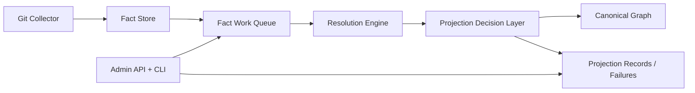

# PCG Phase 3 Resolution Maturity Design

**Status:** Draft

**Date:** April 3, 2026

## Executive Summary

Phase 2 made the facts-first pipeline real. Git now writes facts into Postgres,
the Resolution Engine projects canonical graph state, and staging can run the
full three-service shape:

- API
- Ingester
- Resolution Engine

That architecture is now honest, but it is still immature in two important
ways:

1. operators do not have durable, richly classified failure state for fact
   projection and replay; and
2. resolution outputs do not yet have a first-class provenance and confidence
   model that is consistent across facts, projection decisions, and downstream
   relationships.

Phase 3 matures the system on both fronts in one branch and one PR, implemented
in two ordered internal slices:

- **Phase 3A:** durable failure taxonomy, replay/backfill/admin controls, and
  richer operational visibility
- **Phase 3B:** provenance, evidence, and confidence scoring for resolution and
  projection outputs

The end state is a facts-first runtime that is easier to operate, easier to
trust, and easier to extend before we make backend decisions or add a second
collector.

## Problem Statement

The current facts-first pipeline is operationally useful, but it still has
important maturity gaps.

### Failure State Is Too Thin

Fact work items currently preserve only a small amount of terminal state. That
is enough to know a work item failed, but not enough to answer:

- which stage failed
- whether the failure is retryable
- what classification it belongs to
- whether the item should be replayed automatically, manually, or never
- what operators should do next

This makes on-call triage slower and forces too much interpretation from logs.

### Replay And Recovery Are Still Basic

Phase 2 added replay controls, but they are still oriented around basic queue
manipulation. We need richer inspection and recovery primitives that let an
operator answer:

- what failed and why
- what is safe to replay
- what should be dead-lettered permanently
- what needs backfill or administrative override

### Projection Truth Lacks A Mature Confidence Contract

Facts already encode source truth, and some relationship logic already uses
confidence concepts, but the Resolution Engine does not yet expose a unified
contract for:

- evidence collection
- projection rationale
- confidence scoring
- provenance lineage from fact input to projected graph output

Without that, it is harder to explain or challenge canonical graph decisions,
especially once multiple collectors arrive.

## Goals

- Add durable failure taxonomy and recovery metadata to fact work items.
- Make replay, dead-letter, and backfill flows operator-grade.
- Expose richer admin APIs and CLI controls for inspection and recovery.
- Add structured provenance, evidence, and confidence scoring to resolution.
- Make projected graph decisions explainable from source facts.
- Expand telemetry, logs, and documentation where needed to support the new
  maturity model.
- Keep all Phase 3 work on one branch and one PR, but implement it in ordered
  waves so it remains testable throughout.

## Non-Goals

- Adding a second collector in this phase.
- Replacing Neo4j or Postgres in this phase.
- Reworking the public read/query API shape in this phase.
- Changing the service topology again in this phase.
- Reintroducing backwards-compatibility shim layers that Phase 2 removed.

## Design Principles

### Failure State Must Be Durable, Not Just Observable

Metrics and logs are useful, but operators need queue records to preserve the
meaning of failure and recovery decisions. The database should answer what
happened even if a process dies.

### Recovery Must Be Explicit

Replay, dead-letter, and backfill should be deliberate actions with clear audit
trails. The system should distinguish automatic retries from manual operator
intervention.

### Confidence Must Be Explainable

A projected graph assertion should be traceable back to source facts and to a
resolution decision with a reasoned confidence level.

### Keep Facts As Source Truth

Phase 3 does not move source truth back into the graph. Facts remain the durable
input layer; provenance and confidence enrich projection decisions, not source
observation records.

## Runtime Architecture

## Phase 3A: Failure Taxonomy And Recovery Controls

### New Queue Maturity Requirements

Each fact work item should preserve durable metadata for:

- `failure_stage`
- `failure_class`
- `failure_code`
- `retry_disposition`
- `dead_lettered_at`
- `last_attempt_started_at`
- `last_attempt_finished_at`
- `next_retry_at`
- `operator_note` for manual override or replay rationale

### Failure Classification Model

The system should classify failures into a small stable taxonomy, such as:

- `input_invalid`
- `projection_bug`
- `dependency_unavailable`
- `resource_exhausted`
- `timeout`
- `unknown`

Each failure should also be marked as one of:

- `retryable`
- `non_retryable`
- `manual_review`

### Recovery Operations

Operators should be able to:

- inspect failed and dead-lettered work items with structured fields
- replay by repository, run, failure class, or work item id
- promote dead-lettered work back to queued status with an audit note
- mark an item terminal without replay
- request a backfill for a repository or source run

### Runtime Behavior

The Resolution Engine should:

- classify failures before persisting them
- update durable stage metadata on every attempt
- move items into dead-letter state only after explicit policy thresholds
- emit telemetry for retry age, dead-letter growth, and replay operations

## Phase 3B: Provenance, Evidence, And Confidence

### Projection Decision Model

Projection should produce structured decision records for important output
families, especially:

- repository projection
- file projection
- parsed entity projection
- relationship projection
- workload projection
- platform projection

Each decision should include:

- `decision_id`
- `decision_type`
- `repository_id`
- `source_run_id`
- `fact_ids`
- `evidence`
- `confidence_score`
- `confidence_reason`
- `provenance_summary`
- `projected_at`

### Evidence And Confidence Rules

Phase 3 should introduce a first-class contract for:

- direct fact evidence
- inferred evidence
- corroborating evidence
- conflicting evidence

Confidence should begin with a bounded, explainable score rather than a complex
probabilistic system. The important property is consistency and inspectability.

### Initial Confidence Targets

The first cut should cover:

- workload/platform materialization
- relationship projection where multiple fact signals contribute
- cross-source-ready interfaces, even though Git is still the only collector in
  this phase

## Data Model Changes

### Fact Work Queue

Extend the work queue row model and schema to preserve durable failure and
recovery state.

### Projection State

Add a small projection decision store for provenance and confidence records.
This can live in Postgres beside the fact store and queue.

Recommended initial tables:

- `fact_work_item_failures`
- `fact_replay_events`
- `projection_decisions`
- `projection_decision_evidence`

## Service Responsibilities

### Ingester

Still owns:

- collection
- parsing
- fact emission

Still does not own:

- final canonical graph decisions
- projection confidence
- recovery policy

### Resolution Engine

Now additionally owns:

- durable failure classification
- retry and dead-letter policy
- projection decision records
- provenance and confidence scoring

### API

Now additionally owns:

- operator inspection endpoints for failed/dead-lettered work
- replay and backfill controls
- decision inspection endpoints where useful

## Observability Expectations

Phase 3 should extend the existing telemetry with:

- failure counts by stage and classification
- dead-letter growth rate
- replay action counts and outcomes
- retry age histograms
- decision counts by confidence band
- operator action audit logs

The existing telemetry reference pages should be updated so an SRE can answer:

- what is failing
- what is retrying
- what is permanently dead-lettered
- which projection stages are least trustworthy
- whether confidence is drifting over time

## Testing Strategy

Phase 3 should rely on:

- unit tests for row models, classifiers, and decision scoring
- unit tests for runtime and admin control flows
- integration tests for replay, dead-letter, and backfill behavior
- integration tests for provenance and confidence records
- end-to-end validation on the test instance before merge

## Rollout Strategy

Phase 3 remains one branch and one PR, but should be implemented in this order:

1. durable failure taxonomy and queue schema
2. admin API and CLI recovery controls
3. replay/backfill telemetry and audit logging
4. projection decision store and provenance contracts
5. confidence scoring for workload/platform and relationship outputs
6. full validation and operator-doc refresh

## Success Criteria

Phase 3 is complete when:

- failed work items preserve durable, queryable failure metadata
- operators can inspect, replay, dead-letter, and backfill safely
- resolution writes structured projection decision records
- provenance and confidence are visible for important projected outputs
- telemetry and docs make the new behavior usable for on-call and tuning
- the full branch passes test-instance validation before merge
