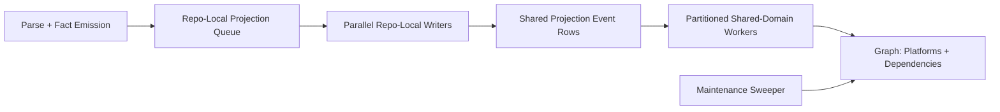

# Shared Graph Write Domain Design

**Status:** Draft

**Date:** April 9, 2026

## Executive Summary

PlatformContextGraph currently gets good indexing throughput from concurrent
commit workers, but production has now surfaced a real Neo4j deadlock:

- `Neo.TransientError.Transaction.DeadlockDetected`
- lock type `NODE_RELATIONSHIP_GROUP_DELETE`

The deadlock is not caused by read-only API or MCP usage. It is caused by
concurrent graph writers touching the same shared graph domains while
performing delete-and-rebuild projection.

The important architectural conclusion is:

- **parallelism is not the bug**
- **unpartitioned shared graph mutation is the bug**

PCG should keep commit-worker throughput for repo-local work, but it should stop
allowing unrelated repository projections to concurrently mutate shared
`Platform`, workload-dependency, and global maintenance state without a stable
coordination model.

This design introduces a write-domain architecture:

1. **repo-local projection stays parallel**
2. **shared-domain projection becomes explicitly partitioned**
3. **global cleanup is removed from the hot per-repo path**
4. **the same contract applies regardless of whether projection is triggered by
   the ingester inline path or the standalone resolution engine**

The design preserves performance where it is safe, improves reliability under
concurrency, and gives us a clean forward path toward more scalable projection
without forcing a rollback to serial indexing.

## Problem Statement

This is not evidence of graph corruption and not evidence that Neo4j cannot
support concurrent writes. It is evidence that PCG currently allows concurrent
transactions to mutate overlapping shared nodes and relationships without a
stable locking strategy.

- It is **not** caused by the API runtime serving read-only MCP or HTTP queries.
- It is **not** caused by multiple engineers asking read-only questions.
- It is **not** an argument that commit workers should be removed.

## Root Cause

The root cause is the interaction of three current behaviors:

### 1. The Ingester Is A Real Graph Writer In Facts-First Mode

In deployed split-service mode, the ingester runs as the Go binary
`/usr/local/bin/pcg-ingester` and still performs inline facts-first
projection for repository snapshots.

That means the ingester is not merely:

- cloning repositories
- parsing files
- writing facts to Postgres

It is also capable of projecting canonical graph state into Neo4j.

### 2. Commit Workers Run Concurrent Repo Projections

`PCG_COMMIT_WORKERS` allows the ingester to process multiple repository commits
in parallel. This is valuable and should be preserved.

However, in facts-first mode those workers do not only commit repo-local
repository/file/entity state. They also run the same downstream projection code
used by the Resolution Engine.

### 3. Some Projection Stages Mutate Shared Graph Domains

The current projection pipeline mixes two fundamentally different categories of
writes inside the same concurrent repo processing path:

- **repo-local writes**
  - repository subtree replacement
  - files
  - parsed entities
  - imports
  - calls
  - inheritance

- **shared-domain writes**
  - `RUNS_ON`
  - `PROVISIONS_PLATFORM`
  - workload dependency edges
  - repo dependency edges inferred from workload/runtime signal
  - orphan platform cleanup

The most problematic shared-domain behavior today is that per-repo workload and
platform finalization can:

- delete the whole `Repository` node and implicitly drop attached shared edges
- delete edges connected to shared `Platform` nodes
- recreate those edges
- run orphan cleanup on `Platform` nodes globally
- write infrastructure platform edges from more than one stage

This means two unrelated repo projections can legitimately touch the same
`Platform` node or dependency domain at the same time.

## Goals

- Preserve commit-worker performance for repo-local graph writes.
- Eliminate deadlocks caused by overlapping shared-node mutation.
- Keep current deployed workflows working during migration.
- Support both projection entrypoints:
  - ingester inline projection
  - standalone resolution-engine projection
- Make lock-sensitive graph stages observable and diagnosable.
- Improve reliability without falling back to globally serial projection.

## Non-Goals

- Removing commit workers.
- Replacing Neo4j.
- Reverting facts-first indexing.
- Rewriting the entire resolution system in one release.
- Changing the public API or MCP contracts beyond richer status/debug fields.

## Design Principles

### Parallelize By Safety Domain, Not By Convenience

Repo-local writes should stay parallel. Shared-domain writes should only run in
parallel when they are partitioned by a stable lock domain.

### Remove Global Maintenance From Hot Repo Transactions

Global cleanup tasks should not run opportunistically inside each repository
projection. That pattern is easy to write but hostile to concurrency.

### One Mutation Contract Across Runtime Roles

The ingester and the resolution engine should not have different graph mutation
safety models. They must use the same write-domain contract so concurrency is
predictable regardless of entrypoint.

### Keep Moving Toward Honest Runtime Ownership

The longer-term deployed split-service target remains:

- ingester owns collection, parsing, and durable fact emission
- resolution engine owns canonical graph projection

This design does not abandon that direction. It introduces a safe write-domain
model that works with the current inline projection reality and remains valid if
deployed split-service later converges on resolution-engine-only graph writes.

### Prefer Partitioning Over Global Serialization

The right answer is not "one writer forever." The right answer is to identify
which graph domains are independent and exploit that safely.

## Architectural Options Considered

### Option A: Keep Current Pipeline And Add Retries/Backoff

This is the smallest change and we should keep it as a resilience layer, but it
does not remove the shared lock hotspot and would treat recurring deadlocks as
steady-state behavior.

### Option B: Serialize All Final Graph Projection

This is operationally simple, but it throws away the throughput gains commit
workers were added to provide and creates an avoidable bottleneck.

### Option C: Partition Projection Into Repo-Local And Shared Write Domains

This preserves parallelism where writes are independent, isolates the true
hotspot, and aligns with Neo4j lock-domain realities. It is the recommended
approach.

## Write Domains

PCG projection should be split into explicit write domains.

### Domain 1: Repo-Local Projection

Safe to keep parallel under commit workers.

Includes:

- repository nodes
- directory/file hierarchy
- parsed entities
- imports
- call graph edges
- inheritance edges
- `Workload`
- `WorkloadInstance`
- `DEPLOYMENT_SOURCE`
- repo-local content writes

Contract:

- must preserve the canonical `Repository` node
- may only remove and rebuild repo-owned subtree state
- may not mutate shared `Platform` or cross-repo dependency domains
- may not implicitly drop shared edges through `DETACH DELETE` on `Repository`
  nodes

### Domain 2: Shared Platform Projection

Includes:

- `RUNS_ON`
- `PROVISIONS_PLATFORM`
- platform node attribute updates

Contract:

- writes must be partitioned by stable `platform_id`
- all mutations for the same `platform_id` must flow through the same partition
- stale platform-edge retracts are authoritative by repository plus generation
- orphan cleanup must not run inside per-repo projection

### Domain 3: Shared Dependency Projection

Includes:

- repo dependency edges inferred from runtime/workload evidence
- workload dependency edges

Contract:

- retract authority is owned by source repository plus generation
- upsert execution may be partitioned by a stable dependency key
- generation fencing must guarantee stale edges are removed when one repo's
  authoritative dependency set changes

### Domain 4: Global Maintenance

Includes:

- orphan platform cleanup
- stale global sweeps
- consistency repair tasks

Contract:

- must run outside the per-repo hot path
- should run as an explicit maintenance stage or scheduled sweeper

## Projection Pipeline

### Stage 1: Repo-Local Projection

Repo-local projection continues to run in parallel from commit workers.

Output:

- canonical repo-local graph state
- a bounded set of shared-projection intents or rows describing:
  - runtime platform attachments
  - infrastructure platform attachments
  - workload dependency candidates
  - repo dependency candidates

Stage 1 must also stop performing shared-domain cleanup. The existing
repository reset path must be narrowed so it removes repo-owned subtree state
without deleting shared relationships attached to the canonical `Repository`
node.

### Stage 2: Shared-Domain Projection

Shared projection should run through a partitioned executor.

Initial implementation requirements:

- configurable partition count
- deterministic partition mapping
- idempotent upsert/retract semantics
- no cross-partition mutation for one key
- durable partition leasing across processes
- crash-safe replay and rebalancing
- one authoritative owner for each shared domain

Infrastructure platform writes must have a single authoritative stage. The
current double-write pattern must be collapsed before or during this migration.

This gives us concurrency without allowing two transactions to mutate the same
shared node family at once.

### Stage 3: Maintenance Sweep

- run at end-of-run, or
- run periodically through a dedicated maintenance task
- never run for a domain while newer child work for that same domain is still
  in flight

## Runtime Responsibilities

### API

The API remains read-only for graph mutation purposes.

### Ingester

The ingester may continue parsing, emitting facts, and running repo-local
projection in parallel, but it should stop directly owning overlapping
shared-domain cleanup or shared-node mutation. In deployed split-service mode,
the preferred end state is still for the ingester to converge toward
facts-first collection and bounded repo-local work.

### Resolution Engine

The resolution engine should use the same domain split and remain the primary
owner of canonical graph projection in the target deployed architecture.

## Data Model And Contract Changes

### Shared Projection Intents

Add a durable or bounded in-memory contract for shared-domain mutation inputs.

Possible shape:

- `projection_scope`
- `projection_domain`
- `partition_key`
- `repository_id`
- `source_run_id`
- `generation_id`
- `parent_work_item_id`
- payload rows

Initial domains:

- `platform_runtime`
- `platform_infra`
- `repo_dependency`
- `workload_dependency`

In deployed split-service mode, this contract must be durable and
cross-process-safe. An in-memory-only queue is acceptable only for local
single-process development paths, not for the real ingester plus
resolution-engine topology.

The initial durable source of truth for shared-domain workers should be:

- fact store records for repository identity and generation fencing
- content store for runtime dependency content reads
- shared-domain intent rows for normalized mutation inputs

### Work Item Hierarchy And Completion Semantics

The current single `project-git-facts` work item contract is not sufficient once
shared-domain work becomes asynchronous. PCG needs:

- a parent repo-projection work item
- child shared-domain work items or domain-state records
- completion rules that prevent runs and repository coverage from reporting
  `completed` while shared-domain projection is still pending

Read/query surfaces must either:

- wait for all child domains to settle before reporting completion, or
- expose an explicit `shared_projection_pending` state so partial answers are
  visible instead of silent

Older child work for the same parent generation must be ignored or retracted
when a newer generation has already been accepted.

### Work Item Visibility

Add or surface:

- `lease_owner`
- stage name
- domain name
- generation id
- retry-after / next retry
- parent/child work item linkage

### Shared-Domain Input Contract

Shared-domain workers must not depend on workspace ownership or filesystem-only
fallbacks. Inputs required for dependency or platform projection must be
available from durable stores such as facts, content storage, or shared-domain
intent payloads.

## Rollout Plan

### Slice 1: Observability And Diagnostics

- surface `lease_owner` and stage information in admin/status
- tag shared-domain queries with clear stage identifiers
- add metrics for:
  - repo-local projection duration
  - shared-domain queue depth
  - shared-domain lock retries
  - deadlock count by domain
- verify where concurrent writers actually occur in facts-first mode so rollout
  measures the true hot path instead of assuming ProcessPool-based writes

### Slice 2: Remove Global Orphan Cleanup From Hot Path

- stop calling orphan platform delete during each repo projection
- move it to a dedicated maintenance pass

### Slice 3: Introduce Shared-Domain Partitioning

- emit shared projection intents from repo-local projection
- add partitioned shared-domain workers
- route platform and dependency writes through stable partition keys
- add durable partition claims and parent/child completion semantics

### Slice 4: Validate Mixed Runtime Entry

- confirm correctness when projection is initiated by:
  - ingester inline path
  - resolution-engine path
- prove both flows produce equivalent graph state
- prove repo status and coverage surfaces do not report complete while shared
  projection is pending

## Testing And Validation

- partition-key calculation
- domain-row builders
- maintenance sweep isolation
- retry classification and observability payloads
- project two repos concurrently against the same `Platform` id
- project two repos concurrently with overlapping dependency edges
- verify no deadlocks under repeated runs
- total indexing duration
- per-repo projection duration
- shared-domain queue latency
- throughput under `PCG_COMMIT_WORKERS=2` and higher
- no regression in repo-local throughput
- lower deadlock rate
- equal or better end-to-end throughput under realistic concurrency
- run with commit workers enabled
- simulate overlapping repo projections
- inspect active transactions and lock counts during shared-domain writes
- verify retries are rare and no longer represent the steady-state path

## Recommendation

Adopt the write-domain split in this order:

1. observability and stage visibility
2. remove global orphan cleanup from per-repo projection
3. introduce partitioned shared-domain projection for platform and dependency
   writes

This is the smallest architecture change that directly addresses the actual root
cause while preserving the performance gains commit workers were added to
provide.
