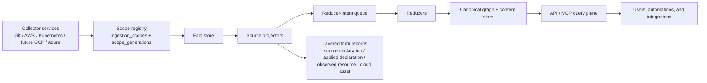

# Go Data Plane Rewrite PRD

**Status:** Locked for rewrite branch

**Date:** April 12, 2026

## Executive Summary

PlatformContextGraph is moving from a Python-shaped, repository-centered write path to a **schema-first Go data plane** that can support many collectors, many source systems, and many future integrations without becoming a procedural beast.

This rewrite is not a cosmetic refactor. It is the architectural reset that makes PCG fit for:

- code intelligence
- infrastructure intelligence
- cloud and Kubernetes intelligence
- ETL and data intelligence
- CI/CD and deployment intelligence
- MCP-first query and automation use cases

The target is a **single monorepo** with a **true microservice runtime architecture**:

- one repo
- multiple independently running services
- one contract set
- one release train for the rewrite phase
- no new collector feature work until the substrate is in place

The new data plane will be built in **Go** and defined by **versioned Protobuf contracts**. It will use:

- scope-first ingestion
- first-class `ingestion_scopes` and `scope_generations`
- authoritative snapshots with event acceleration
- source projectors
- reducer-intent queues
- reducers
- canonical-first query and MCP responses

This PRD locks down the target shape so implementation can proceed with less ambiguity and fewer cross-cutting guesses.

## Companion Documents

This PRD is the top-level design contract for the rewrite. It is paired with:

- [Rewrite Documentation Index](../plans/2026-04-12-go-data-plane-doc-set-index.md)
- [Service Boundaries And Ownership](../plans/2026-04-12-go-data-plane-service-boundaries-and-ownership.md)
- [Contract Freeze Plan](../plans/2026-04-12-go-data-plane-contract-freeze-plan.md)
- [Parallel Execution Plan](../plans/2026-04-12-go-data-plane-parallel-execution-plan.md)
- [Validation And Cutover Plan](../plans/2026-04-12-go-data-plane-validation-and-cutover-plan.md)
- [ADR Index](../../docs/adrs/index.md)

## Why This Rewrite Happens Now

PCG is about to become a multi-collector platform.

Git is already here. AWS is next. Kubernetes is coming. GCP, Azure, ETL systems, CI/CD systems, and other enterprise sources are not far behind.

The current Python write path and repository-first fact model were good enough for the first stage of growth, but they are not the right substrate for the next one. If we keep layering new collectors onto the current shape, we will hard-code a Git-shaped architecture into a platform that is supposed to become the organization’s central knowledge base.

This rewrite happens now because:

- the next collectors need a clean ingestion contract before they arrive
- the current write path has too many runtime null/type surprises for a long-running service plane
- full re-index behavior is too expensive to be the default freshness model
- shared graph mutation and cross-domain projection need explicit ownership
- the system must scale by collector and by scope, not by becoming one larger procedural job

## Goals

The rewrite must deliver all of the following:

- a schema-first Go data plane with explicit service contracts
- separate collector services for Git, AWS, and Kubernetes now, with GCP, Azure, and other collectors added later through the same contract
- scope-first ingestion rather than repository-first ingestion
- durable `ingestion_scopes` and `scope_generations`
- authoritative snapshot truth with event acceleration for freshness
- a source projector plus reducer-intent plus reducer model
- canonical-first query and MCP outputs
- operator-facing live status surfaces through CLI and API admin endpoints
- a consistent operator/admin status contract for every long-running Go service
- logical-first workloads with ETL/job subtypes
- a layered truth model that distinguishes source declaration, applied declaration, observed resource, and canonical cloud asset
- provider-native identity whenever the provider gives us a stable identifier
- strong priorities on accuracy, performance, stability, scalability, telemetry, tracing, and logging
- a documented resiliency and concurrency contract that distinguishes service-local channels and worker pools from durable cross-service queue boundaries
- end-to-end traversal maps that show how a bounded unit of data moves through collector, projector, reducer, and canonical write stages

For the current rewrite slice, the operator-status work is intentionally split
into two stages:

- implement `go/internal/status` as the storage-agnostic reader/report seam
  that both the CLI now and future HTTP/admin handlers can share
- implement the shared HTTP/admin adapter on that same seam
- mount that shared admin surface through the hosted runtime lifecycle

This split applies to every long-running Go service, not only one shared admin
tool. The platform rule is:

- every long-running service must expose the same operator story
- every service should be inspectable through a shared status/report contract
- every service should have a local CLI view, a reusable mounted HTTP/admin
  surface, and an API/admin view once richer transport wiring is mounted
- service-specific metrics are allowed, but the operator shape must stay
  consistent enough that an engineer can move from collector to projector to
  reducer without learning a different debugging model each time

## Non-Goals

This rewrite does not try to do everything at once.

- It does not move the read plane and MCP API rewrite into the first cut.
- It does not add new collector feature work before the new substrate lands.
- It does not split the project into many repos.
- It does not preserve the old Python data plane as the future write architecture.
- It does not require every future source system to be modeled as a Git repository.
- It does not make the canonical graph depend on event streams alone.

## Audience

This PRD is written for the people who will build, operate, validate, and consume PCG:

- platform engineers
- backend engineers
- data engineers and ETL owners
- DBAs
- cloud and Kubernetes operators
- security and governance stakeholders
- MCP and automation consumers
- future contributors who need a clear architecture contract before they code

## Current Pain Points

The current system is useful but stretched:

- the write path is still too procedural and repository-shaped
- Python runtime behavior still creates too many null and type surprises for a
  long-running data plane
- full re-index is too coarse to be the normal freshness mechanism
- shared mutation and cross-domain projection still leak through finalize paths
- new source systems would inherit Git-shaped assumptions if we keep extending
  the current substrate
- telemetry needs more source, scope, generation, and reducer visibility

## Design Principles

- Accuracy first: if PCG cannot prove a relationship or identity, it should
  say so explicitly.
- Performance through bounded work: scale by scope, partition, and service
  boundary instead of hiding slow paths.
- Stability under partial failure: collectors, scopes, generations, reducers,
  and query surfaces must keep operating through retries and stale data.
- Telemetry as a contract: tracing, logs, and metrics are required platform
  behavior, not optional debug tools.
- Documented traversal: every major data-plane slice must leave behind an
  end-to-end map of work unit, owner, boundary, retry semantics, and status
  signals.
- Canonical-first answers: the MCP and query plane should return resolved truth
  by default, with raw evidence only when asked.

## Monorepo And Microservice Stance

PCG should remain a **monorepo** and evolve into a **true microservice runtime
architecture** inside that monorepo.

That means one repository for contracts, services, docs, fixtures, and
deployment assets, with multiple Go services, a shared contract set, and one
coordinated release train while the rewrite is in progress. The runtime should
be microservice-shaped even though the Git boundary is not.

## Target Runtime Architecture

### Runtime Roles

| Runtime | Responsibility |
| --- | --- |
| Git collector | repository discovery, cloning, parsing, and source-scoped fact emission |
| AWS collector | account and shard-scoped cloud inventory, state, and observation emission |
| Kubernetes collector | cluster and workload-scoped inventory, workload, and topology emission |
| Future collectors | GCP, Azure, ETL, CI/CD, docs, and other source systems through the same contract |
| Source projector | materialize source-local truth for a scope generation |
| Reducer | update shared canonical truth for cross-source or cross-scope domains |
| API / MCP | read canonical truth first, with evidence and freshness on demand |

The operator-status report should not live behind a separate admin service or a
new transport surface. `go/internal/status` remains the shared reader/report
seam that the CLI renders now and the API/admin transport can mount later.

The same principle applies to every long-running Go runtime: collector,
projector, reducer, and future background services should present the same
operator/admin status shape even when the counters differ by role.

## Resiliency And Concurrency Model

The target platform uses two layers of concurrency on purpose.

Inside a service:

- use bounded worker pools and channels for in-process coordination
- size CPU-heavy work for available processors and service tuning
- keep I/O-heavy work bounded separately from CPU-heavy work

Across services or ownership boundaries:

- use durable queue records, leases, and idempotent writes
- never rely on channels for replayable platform behavior
- keep backlog age, retry state, and failure classification visible

This matters as AWS, Kubernetes, and ETL collectors arrive. A larger inventory
should increase bounded queue depth and worker activity, not force one giant
in-memory job.

## Scope-First Ingestion

Scope-first ingestion replaces repository-first ingestion as the durable model.

The primary durable unit is a **scope**, not a repository. A scope may be a Git
repository snapshot, an AWS shard, a Kubernetes slice, a Terraform state
object, a CloudFormation stack, or a future ETL or CI/CD unit of work.

Each scope has a generation. Each generation is the authoritative snapshot of
what the collector observed at a point in time.

### First-Class Scope Objects

The data plane must introduce durable `ingestion_scopes` and `scope_generations`.

`ingestion_scopes` should capture:

- `scope_id`
- `source_system`
- `scope_kind`
- `parent_scope_id`
- `collector_kind`
- `partition_key`
- `scope_metadata`

`scope_generations` should capture:

- `generation_id`
- `scope_id`
- `observed_at`
- `ingested_at`
- `status`
- `trigger_kind`
- `freshness_hint`

### Snapshot Truth With Event Acceleration

The authoritative truth model is snapshot-first.

- A generation is the truth boundary.
- Events can accelerate refresh and narrow the workset.
- Events do not replace generation truth.
- Deletes, retractions, and drift must be reconciled from the latest generation
  state, not orphaned event fragments.

This gives PCG deterministic replay, honest deletes, and bounded refreshes
without forcing a full rebuild for every update.

## Layered Truth Model

The infrastructure model must distinguish four layers:

1. `SourceDeclaration`: repo-authored Terraform, CloudFormation, Helm, Kustomize, Kubernetes YAML, or similar source truth
2. `AppliedDeclaration`: Terraform state, CloudFormation stack state, and other applied-but-not-live-or-sourced snapshots
3. `ObservedResource`: live cloud or cluster observations from provider APIs
4. `CloudAsset`: the canonical resolved asset that ties the other layers together

This layering lets PCG answer the questions operators actually ask about
declared, applied, observed, and canonical state.

## Identity Rules

PCG should use provider-native identifiers whenever they are stable and
portable, such as AWS ARN, Azure resource ID, GCP resource name, or a stable
Kubernetes identity.

If a provider-native identifier exists and is stable, it should anchor the
canonical identity. If not, PCG may synthesize a canonical identifier, but the
original source identity must remain visible for provenance and debugging.

`CloudAsset` identity must preserve the provider-native identifier when
available, the source system, the scope generation, and the evidence layer.

## Workload Model

Workloads are logical-first.

The platform must model:

- `Workload`
- `WorkloadInstance`

`Workload` is the logical thing the organization operates. `WorkloadInstance`
is the runtime or environment-specific realization of that logical workload.

The model must support services, APIs, ETL pipelines, jobs, schedulers, batch
processors, stream consumers, controllers, and serverless workloads. ETL and
job subtypes remain workload subtypes, not a separate universe.

## Source Projector, Reducer-Intent, And Reducer Model

The new write path is a three-stage contract:

1. `Source projector`: consumes `scope_generation`, materializes source-local
   truth, and emits durable reducer intents for shared domains
2. `Reducer-intent queue`: persists scope-generation-driven follow-up work and
   remains the authoritative trigger for cross-source or cross-scope recompute
3. `Reducer`: consumes durable intents, updates canonical shared truth, and
   owns domains such as workload identity, cloud asset resolution, deployment
   mapping, and data-lineage correlation

Durable reducer intents should be keyed by scope generation because that is the
truth boundary for deletes, retractions, and replay.

## Query And MCP Contract

The query and MCP planes must be **canonical-first**:

- default responses should return resolved canonical truth
- source-local and raw inspection modes should be explicit
- evidence, freshness, confidence, and provenance should be available when
  needed
- the system should explain why a result is partial, inferred, or unresolved

The user experience should be: give the best resolved answer, show why the
platform believes it, and expose raw source detail only when asked.

## Service Topology

PCG should run as separate services with clear runtime ownership:

- `api`
- `collector-git`
- `collector-aws`
- `collector-kubernetes`
- `resolution`
- `reducer`

The services live in one repo, but they do not share one giant runtime process.
The rewrite should keep the read plane stable while the data plane changes
underneath it.

## Why This Happens Before New Collectors

The rewrite must land before GCP, Azure, and the next wave of collectors
because the substrate is the hard part.

If PCG adds more collectors before the data plane is rebuilt, it will inherit
repository-shaped assumptions, full-reindex pressure, weak scope identity,
ambiguous truth boundaries, procedural finalize logic, and runtime type
fragility.

If the substrate is right, new collectors are just adapters to the same
platform contract. If it is wrong, each new collector becomes a new special
case.

## Operational Priorities

The implementation order is not negotiable:

1. Accuracy
2. Stability
3. Scalability
4. Performance
5. Telemetry, tracing, and logging

Telemetry must make it obvious what scope is being processed, what generation
is current, which stage failed, which reducer intent is pending, and which
canonical relationship was accepted or rejected. The rewrite must also produce
operator-readable status surfaces so engineers can answer live questions
without starting from raw metrics.

## Implementation Boundaries

This rewrite is a **data plane rewrite**, not a wholesale product rewrite.

Included:

- collectors
- scope and generation management
- fact storage
- source projection
- reducer scheduling and execution
- canonical graph writes
- telemetry for the new data plane

Excluded from the first cut:

- full MCP and HTTP read-plane rewrite
- new collector features beyond the substrate work
- repo splitting
- multiple incompatible write paths

## Definition Of Done

The rewrite is complete when collectors emit scope-based facts, scopes and
generations are durable, source-local projection and shared reduction are
separated, the layered truth model is queryable, canonical query and MCP
responses are resolved-first, telemetry is operable, and the platform is ready
for AWS, Kubernetes, and future collectors without another substrate rewrite.

## Summary

PCG is becoming a long-lived enterprise knowledge platform, not just a
repository indexer.

The architecture target is:

- one monorepo
- true microservices
- schema-first Go services
- scope-first ingestion
- authoritative snapshots
- source projectors
- reducer intents
- reducers
- layered truth
- canonical-first MCP and query answers

This rewrite is the foundation for everything that comes next.
