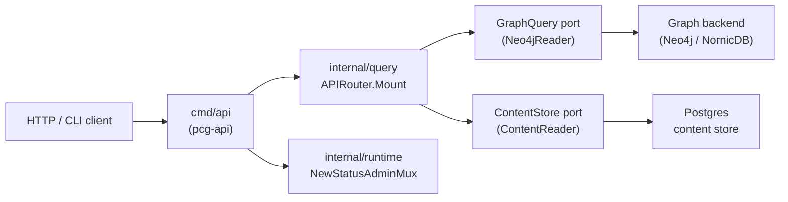
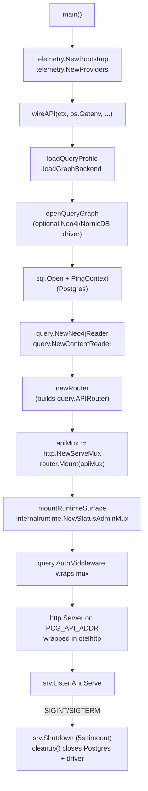

# cmd/api

## Purpose

`cmd/api` is the entry point for the `pcg-api` binary. It boots OTEL telemetry,
opens a Postgres connection and an optional graph driver, wires all query handlers
through `internal/query`, mounts the shared runtime admin surface, wraps the
combined mux with bearer-token authentication, and listens for HTTP traffic until
`SIGINT` or `SIGTERM`.

## Where this fits in the pipeline

## Internal flow

## Lifecycle / workflow

`main` initializes OTEL via `telemetry.NewBootstrap` and `telemetry.NewProviders`,
then calls `wireAPI`. Failure at any wiring step releases already-acquired
connections and exits; the `cleanup` closure returned by `wireAPI` closes Postgres
and the graph driver on normal shutdown.

`wireAPI` resolves `PCG_QUERY_PROFILE` and `PCG_GRAPH_BACKEND`, opens the graph
driver via `openQueryGraph` (skipped when `PCG_QUERY_PROFILE=local_lightweight`),
opens and pings Postgres, then calls `newRouter` to build the `query.APIRouter`
with all handler structs wired to the concrete `query.Neo4jReader` and
`query.ContentReader` adapters.

`mountRuntimeSurface` calls `internalruntime.NewStatusAdminMux` to compose
`/healthz`, `/readyz`, `/admin/status`, and `/metrics` alongside the API routes.
The combined mux is then wrapped with `query.AuthMiddleware`.

The HTTP server listens on `PCG_API_ADDR` (default `:8080`) with a
10 s read-header timeout, 60 s write timeout, and 120 s idle timeout. On
shutdown it waits up to 5 s for in-flight requests before exiting.

## Exported surface

`cmd/api` is a `package main` binary; it exports no Go identifiers. All handler
and contract types are owned by `internal/query`.

The direct process contract includes `pcg-api --version` and `pcg-api -v`.
Both flags print the build-time version through `printAPIVersionFlag`, which
wraps `buildinfo.PrintVersionFlag`, before telemetry, Postgres, or graph setup
begins.

Two compile-time interface checks in `wiring.go:23–24` assert that
`*query.Neo4jReader` satisfies `query.GraphQuery` and `*query.ContentReader`
satisfies `query.ContentStore`. These checks fail the build if either concrete
type drifts from the port it implements.

See `doc.go` for the full godoc contract.

## Dependencies

- `internal/query` — `APIRouter`, `RepositoryHandler`, `EntityHandler`,
  `CodeHandler`, `ContentHandler`, `InfraHandler`, `IaCHandler`, `ImpactHandler`,
  `EvidenceHandler`, `StatusHandler`, `CompareHandler`, `AdminHandler`,
  `Neo4jReader`, `ContentReader`, `AuthMiddleware`, `ParseQueryProfile`,
  `ParseGraphBackend`
- `internal/runtime` — `OpenNeo4jDriver`, `ResolveAPIKey`, `NewStatusAdminMux`,
  `NewStatusRequestHandler`
- `internal/recovery` — `NewHandler` for refinalize/replay routes
- `internal/status` — `Reader` port consumed by `internalruntime.NewStatusAdminMux`
- `internal/storage/postgres` — `NewStatusStore`, `NewRecoveryStore`,
  `NewStatusRequestStore`
- `internal/telemetry` — `NewBootstrap`, `NewProviders`, `EventAttr`,
  `NewLoggerWithWriter`

## Configuration

- `PCG_API_ADDR` — listen address, default `:8080`
- `PCG_POSTGRES_DSN` (or legacy `PCG_CONTENT_STORE_DSN`) — required
- `PCG_QUERY_PROFILE` — default `production`
- `PCG_GRAPH_BACKEND` — `neo4j` or `nornicdb`
- `PCG_DISABLE_NEO4J` — with the local-lightweight profile, skips the
  graph driver
- `DEFAULT_DATABASE` — graph database name, default `nornic`
- API key resolved via `runtime.ResolveAPIKey`; Bolt details via
  `runtime.OpenNeo4jDriver`

## Telemetry

- Bootstrap: `telemetry.NewBootstrap("platform-context-graph-api")` with service
  name `api`, logger component `api`.
- HTTP middleware: `otelhttp.NewHandler(mux, "pcg-api")` instruments every request
  with OTEL spans and read/write message events.
- Metrics: `/metrics` exposed via `internalruntime.WithPrometheusHandler`.
- Log events (via `telemetry.EventAttr`): `runtime.startup.failed`,
  `runtime.postgres.connected`, `runtime.neo4j.connected`,
  `runtime.server.listening`, `runtime.server.stopped`, `runtime.server.failed`,
  `runtime.shutdown.failed`.

## Operational notes

- If `/healthz` returns unhealthy, check that both Postgres (`PingContext`) and
  the graph driver were reachable at startup; wiring failures cause `os.Exit(1)`.
- High request latency: check `pcg_dp_neo4j_query_duration_seconds` and
  `pcg_dp_postgres_query_duration_seconds` at `/metrics` before scaling the API.
  Query latency is owned by `internal/query` handlers, not the transport layer.
- 5xx spikes: look at the `otelhttp` span error attributes and the structured
  log stream; per-handler errors surface as JSON error responses, not panics.
- `/admin/status` reports the live runtime stage and backlog from `internal/status`.
  A healthy API with empty or stale `admin/status` data means the ingester or
  reducer has not yet populated status rows.
- `PCG_DISABLE_NEO4J=true` with `PCG_QUERY_PROFILE=local_lightweight` skips graph
  driver initialization; the API then serves Postgres-only content queries.
- Graceful shutdown waits at most 5 s; in-flight graph or content reads that
  exceed this window are interrupted. Check write-timeout settings if clients
  report disconnects under load.

## Extension points

- Graph backend: implement `query.GraphQuery` and wire the new adapter in
  `openQueryGraph`. The rest of the binary does not branch on backend brand.
- Auth: replace `query.AuthMiddleware` with a different policy by swapping the
  middleware call in `wireAPI`. The token is resolved via
  `internalruntime.ResolveAPIKey`.
- Admin surface: `internalruntime.NewStatusAdminMux` accepts
  `internalruntime.WithPrometheusHandler` and other options; add new admin routes
  through `internal/runtime`, not directly in this binary.

## Gotchas / invariants

- Reads only. This binary does not write facts, enqueue projection work, or touch
  the reducer queue. Writes belong to `ingester`, `projector`, or `reducer`.
- Version probes are pre-startup checks. Keep `printAPIVersionFlag` at the top
  of `main` so `pcg-api --version` works without database credentials.
- `PCG_POSTGRES_DSN` is required; startup fails with an explicit error if both
  `PCG_POSTGRES_DSN` and the legacy `PCG_CONTENT_STORE_DSN` are empty
  (`wiring.go:58`).
- Invalid `PCG_QUERY_PROFILE` or `PCG_GRAPH_BACKEND` values fail at startup via
  `ParseQueryProfile` and `ParseGraphBackend`; there is no silent default for
  unrecognized values.
- `wireAPI` returns a cleanup closure. `PrometheusHandler` and all acquired
  connections are freed when the closure runs; partial wiring failures still
  free already-acquired connections (`main.go:40`).
- The API mux is wrapped with `AuthMiddleware` before it is handed to the
  HTTP server; do not add unprotected data routes after this wrap point.

## Related docs

- `docs/docs/deployment/service-runtimes.md` — API runtime lane and scaling notes
- `docs/docs/reference/http-api.md` — canonical HTTP API contract
- `docs/docs/reference/cli-reference.md` — `pcg api start` flags
- `docs/docs/deployment/docker-compose.md` — Compose service `platform-context-graph`
- `docs/docs/adrs/2026-04-22-nornicdb-graph-backend-candidate.md` — backend selection
