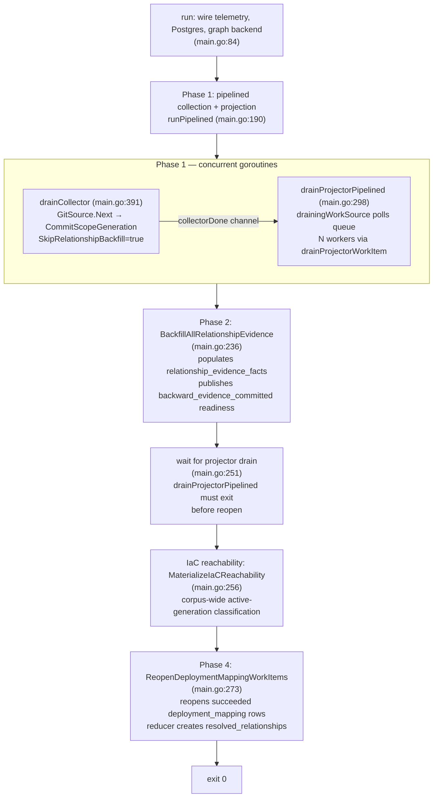

# bootstrap-index

`pcg-bootstrap-index` is the one-shot operator helper for seeding an empty or
recovered PCG environment. It runs the multi-pass facts-first pipeline: pipelined
collection with source-local projection, deferred relationship-evidence backfill,
IaC reachability materialization, and deployment-mapping reopen. It exits when
all phases complete; it is not a steady-state runtime.

## Purpose

The binary exists because the normal steady-state services (`pcg-ingester` and
`pcg-reducer`) are designed for incremental, continuous operation. Bootstrap
fills the gap for cold-start and recovery scenarios where an operator needs a
full facts-first pass over a known repository set before the incremental cycle
takes over. The same write contracts — `projector.CanonicalWriter`,
`postgres.IngestionStore`, the projector queue — apply here, so the output is
identical to what the ingester and reducer would eventually produce.

## Where this fits in the pipeline

```
sync -> discover -> parse -> emit facts -> enqueue projector work
  -> source-local projection (graph writes, content writes, reducer intents)
     -> backfill relationship evidence
     -> IaC reachability materialization
     -> reopen deployment_mapping for reducer second pass
```

`pcg-bootstrap-index` owns steps 1–7. After it exits, `pcg-reducer` drains the
reducer intents that were enqueued during source-local projection.

## Internal flow — the four phases

The orchestrator in `runPipelined` (`main.go:190`) drives four phases.



### Phase 1 — collection and first-pass reduction

`drainCollector` runs `collector.GitSource.Next` in a loop, committing each
scope generation via `committer.CommitScopeGeneration`. The committer is wired
with `SkipRelationshipBackfill=true`, which suppresses the per-commit backfill
path that would be quadratically expensive across all repos.

Concurrently, `drainProjectorPipelined` claims work from the Postgres projector
queue using `FOR UPDATE SKIP LOCKED`. `N` goroutines (default `min(NumCPU, 8)`,
overridden by `PCG_PROJECTION_WORKERS`) each call `drainProjectorWorkItem` in
a loop. Each work item: claim → `factStore.LoadFacts` → `runner.Project`
(canonical graph write + content write + reducer intent enqueue) → `workSink.Ack`.

The `drainingWorkSource` wrapper converts between two modes: while the
collector goroutine is running, an empty queue triggers a 500ms poll-wait and
retry; once `collectorDone` is closed, `maxEmptyPolls` (5) consecutive empty
claims trigger a clean exit via the `errProjectorDrained` sentinel.

`deployment_mapping` work items may project and succeed, or remain pending,
during this phase. Both outcomes are valid because `backward_evidence` is not
committed yet.

### Phase 2 — relationship-evidence backfill

After `drainCollector` returns (collector goroutine done, before projector
drains), `runPipelined` calls `cd.committer.BackfillAllRelationshipEvidence`.
This is defined on `postgres.IngestionStore` and satisfies
`bootstrapCommitter.BackfillAllRelationshipEvidence`. It populates
`relationship_evidence_facts` across all committed scope generations and
publishes `backward_evidence_committed` readiness rows in
`graph_projection_phase_state`. A failure here is fatal; the projector is
cancelled and errors are joined.

### Wait for projector drain

`runPipelined` blocks on `projectorErr := <-errc` (`main.go:251`) before
issuing the reopen call. This ordering invariant prevents `deployment_mapping`
items emitted after the reopen pass from missing reopening.

### IaC reachability materialization

`cd.committer.MaterializeIaCReachability` classifies active-generation IaC
usage corpus-wide and writes reachability rows to Postgres. Fatal on error.

### Phase 4 — deployment-mapping reopen

`cd.committer.ReopenDeploymentMappingWorkItems` reopens only the
`deployment_mapping` work items that already **succeeded** with the
cross-repo readiness gate closed. Items still pending or claimed at reopen
time will see the now-open gate when they run next and do not need reopening.
A small window exists where an in-flight item succeeds between Phase 2 and
Phase 4; those stragglers require manual admin replay or a future automated
straggler-replay mechanism.

After Phase 4 exits successfully, `pcg-reducer` can drain the
`deployment_mapping` and `resolved_relationships` reducer intents normally.

## Lifecycle

```
main -> run
  telemetry.NewBootstrap("bootstrap-index")
  telemetry.NewProviders
  telemetry.NewInstruments
  runtimecfg.ConfigureMemoryLimit -> telemetry.RecordGOMEMLIMIT
  openBootstrapDB (runtimecfg.OpenPostgres)
  applySchema (postgres.ApplyBootstrap — idempotent DDL)
  openBootstrapGraph (openBootstrapCanonicalWriter)
  buildBootstrapCollector (GitSource + IngestionStore)
  buildBootstrapProjector (projector.Runtime + queue deps)
  projectionWorkerCount (PCG_PROJECTION_WORKERS or min(NumCPU,8))
  runPipelined → phases 1–4
  exit 0 on success, exit 1 on any error
```

Signal handling: none. The binary is designed to run to completion; it does not
register `SIGINT`/`SIGTERM` handlers. Operator interruption kills the process
without cleanup.

## Exported surface

`package main` — no exported identifiers intended for import by other packages.
The public contract is the binary's exit code and its side effects on Postgres
and the graph backend. `pcg-bootstrap-index --version` and
`pcg-bootstrap-index -v` print the build-time version through
`printBootstrapIndexVersionFlag`, which wraps `buildinfo.PrintVersionFlag`,
before opening either store.

Key unexported interfaces and types used to make the binary testable via
dependency injection:

- `bootstrapCommitter` (`main.go:41`) — extends `collector.Committer` with
  `BackfillAllRelationshipEvidence`, `MaterializeIaCReachability`, and
  `ReopenDeploymentMappingWorkItems`
- `collectorDeps`, `projectorDeps`, `graphDeps` — wiring structs passed through
  `run` and `runPipelined`
- `drainingWorkSource` (`main.go:331`) — wraps `ProjectorWorkSource`
  to add drain-then-exit behavior
- `bootstrapNeo4jExecutor` (`wiring.go:231`) — `DriverWithContext`-based Bolt
  session executor for canonical writes
- `bootstrapNornicDBPhaseGroupExecutor` (`nornicdb_wiring.go:109`) — NornicDB
  phase-group chunking `Executor` wrapper

Function-type aliases (`openBootstrapDBFn`, `applyBootstrapFn`, `openGraphFn`,
`buildCollectorFn`, `buildProjectorFn`) are injected into `run` so tests can
replace any wiring layer without starting Postgres or a graph backend.

See `doc.go` for the package-level contract.

## Dependencies

Internal packages:

| Package | Role |
| --- | --- |
| `internal/collector` | `collector.GitSource`, `collector.Committer`, `collector.DiscoveryAdvisoryReport` |
| `internal/projector` | `projector.Runtime`, `projector.CanonicalWriter`, work source/sink/heartbeater interfaces |
| `internal/runtime` (alias `runtimecfg`) | `OpenPostgres`, `LoadGraphBackend`, `OpenNeo4jDriver`, `ConfigureMemoryLimit` |
| `internal/storage/postgres` | `postgres.IngestionStore`, `postgres.NewProjectorQueue`, `postgres.NewReducerQueue`, `postgres.NewFactStore`, `postgres.NewContentWriter`, `postgres.ApplyBootstrap`, `postgres.InstrumentedDB`, `postgres.NewGraphProjectionPhaseStateStore`, `postgres.NewGraphProjectionPhaseRepairQueueStore` |
| `internal/storage/cypher` (alias `sourcecypher`) | `sourcecypher.NewCanonicalNodeWriter`, `sourcecypher.InstrumentedExecutor`, `sourcecypher.RetryingExecutor`, `sourcecypher.TimeoutExecutor`, `sourcecypher.Statement`, phase-group constants |
| `internal/content` | `content.LoadWriterConfig` |
| `internal/telemetry` | `telemetry.NewBootstrap`, `telemetry.NewProviders`, `telemetry.NewInstruments`, span/phase/failure-class attributes |

The `projector.CanonicalWriter` interface is the write-side abstraction. The
concrete writer is `sourcecypher.NewCanonicalNodeWriter`, which sits in front of
`bootstrapNeo4jExecutor`. Both Neo4j and NornicDB run through the same writer;
backend differences are confined to the executor layer in `nornicdb_wiring.go`.

## Telemetry

`bootstrap-index` exports OTEL only. It does **not** mount a `/metrics` HTTP
endpoint.

| Signal | Name or key | Where |
| --- | --- | --- |
| Span | `telemetry.SpanCollectorObserve` | `main.go:408` — one collect + commit cycle |
| Span | `telemetry.SpanProjectorRun` | `main.go:657` — one claim + project + ack cycle |
| Metric | `pcg_dp_facts_emitted_total` | `instruments.FactsEmitted` (`main.go:438`) |
| Metric | `pcg_dp_facts_committed_total` | `instruments.FactsCommitted` (`main.go:481`) |
| Metric | `pcg_dp_collector_observe_duration_seconds` | `instruments.CollectorObserveDuration` (`main.go:483`) |
| Metric | `pcg_dp_queue_claim_duration_seconds` | `instruments.QueueClaimDuration`, `queue=projector` (`main.go:646`) |
| Metric | `pcg_dp_projector_run_duration_seconds` | `instruments.ProjectorRunDuration` (`main.go:797`) |
| Metric | `pcg_dp_projections_completed_total` | `instruments.ProjectionsCompleted` (`main.go:800`) |
| Metric | `pcg_dp_gomemlimit_bytes` | `telemetry.RecordGOMEMLIMIT` (`main.go:115`) |

Enable OTEL export by setting OTEL_EXPORTER_OTLP_ENDPOINT. When unset, a
noop exporter is used and only local structured logs flow.

Failure-class log keys emitted via `telemetry.FailureClassAttr`:

| Key | Phase |
| --- | --- |
| `commit_failure` | Phase 1 — per-scope commit |
| `backfill_deferred_failure` | Phase 2 — `BackfillAllRelationshipEvidence` |
| `iac_reachability_materialization_failure` | IaC materialization |
| `reopen_deployment_mapping_failure` | Phase 4 — `ReopenDeploymentMappingWorkItems` |
| `projection_failure` | Phase 1 — projection worker |
| `lease_heartbeat_failure` | Phase 1 — heartbeat goroutine |

## Configuration

| Variable | Default | Effect |
| --- | --- | --- |
| PCG_POSTGRES_DSN | required | Postgres connection string |
| PCG_GRAPH_BACKEND | `nornicdb` | Graph backend; `neo4j` or `nornicdb`; invalid value fails at startup |
| NEO4J_URI | required | Bolt URI |
| NEO4J_USERNAME | required | Bolt auth username |
| NEO4J_PASSWORD | required | Bolt auth password |
| DEFAULT_DATABASE | `nornic` | Bolt database name |
| `PCG_NEO4J_BATCH_SIZE` | backend default | Canonical node batch size |
| `PCG_PROJECTION_WORKERS` | `min(NumCPU, 8)` | Concurrent projection goroutines |
| `PCG_DISCOVERY_REPORT` | `""` | File path to write discovery advisory JSON; empty disables |
| `PCG_CANONICAL_WRITE_TIMEOUT` | `30s` (NornicDB) | Graph write transaction timeout |
| `PCG_NEO4J_PROFILE_GROUP_STATEMENTS` | `false` | Opt-in Neo4j grouped-write statement attempt logs for performance diagnostics |
| `PCG_NORNICDB_CANONICAL_GROUPED_WRITES` | `false` | Enable NornicDB grouped canonical writes; conformance gate required |
| `PCG_NORNICDB_PHASE_GROUP_STATEMENTS` | `500` | NornicDB phase group statement cap |
| `PCG_NORNICDB_FILE_BATCH_SIZE` | `100` | NornicDB file upsert row cap |
| `PCG_NORNICDB_ENTITY_BATCH_SIZE` | `100` | NornicDB entity upsert row cap |
| `PCG_NORNICDB_ENTITY_LABEL_BATCH_SIZES` | per-label defaults | Per-label batch size overrides (`Label=size,...`) |

Full NornicDB tuning reference: `docs/docs/reference/nornicdb-tuning.md`.

## Operational notes

- **One-shot only.** The binary exits after Phase 4. Running it repeatedly on
  an already-seeded environment re-indexes all repos and replays all
  deployment-mapping work items. Use the ingester's incremental path instead.
- **Version probes do not touch stores.** Keep `printBootstrapIndexVersionFlag`
  at the top of `main` so install checks can inspect the binary without a
  running graph or Postgres instance.
- **No admin surface.** `/healthz`, `/readyz`, `/metrics`, and `/admin/status`
  are not mounted. Monitor via OTEL traces and structured logs.
- **Projector lease heartbeat.** Long canonical graph writes can outlast the
  default projector lease. `startBootstrapProjectorHeartbeat` renews the lease
  at `leaseDuration/3`, capped at 1 minute.
- **NornicDB grouped writes.** `PCG_NORNICDB_CANONICAL_GROUPED_WRITES=false`
  by default. Enabling it without running the grouped-write safety probe test
  carries the same rollback-safety risks as the ingester path.
- **Discovery advisory reports.** Set `PCG_DISCOVERY_REPORT=<path>` to write a
  per-repo advisory JSON. Useful for diagnosing oversized repositories before
  committing to a full bootstrap run.

## Extension points

Adding a new post-collection pass (analogous to Phase 2 or Phase 4) requires:

1. Add the method to `bootstrapCommitter` (`main.go:41`).
2. Implement it on `postgres.IngestionStore` (or the relevant concrete type).
3. Add a call in `runPipelined` after the projector drain (`main.go:251`),
   following the existing fatal-error pattern.
4. Add a failure-class log key constant in `go/internal/telemetry/contract.go`.
5. Add a test in `main_test.go` proving the ordering invariant.

Any domain that consumes `resolved_relationships` must have a reopen or
re-trigger mechanism after Phase 4. See `CLAUDE.md` — "Facts-First Bootstrap
Ordering".

## Gotchas / invariants

- `SkipRelationshipBackfill=true` on the `postgres.IngestionStore` committer is
  not optional. Without it, every `CommitScopeGeneration` call would run a full
  relationship backfill, making the total cost quadratic across the repo set.
- Phase ordering is a correctness invariant, not a performance choice. Phase 2
  must run before the projector drains; Phase 4 must run after the projector
  drains. Swapping these creates E2E-only bugs (deployment-mapping items that
  succeed before relationship evidence exists produce incomplete graph truth).
- The straggler window between Phase 2 and Phase 4 is a known limitation. Items
  that succeed in that window are not automatically replayed. Operators must use
  `/admin/replay` or wait for the ingester's incremental refresh.
- `errProjectorDrained` is a sentinel value (`main.go:619`). It signals clean
  exit from `drainProjectorWorkItem` after the `PhaseProjection` drain loop
  exhausts the queue; it is not an error. Worker goroutines return on
  this value; they do not propagate it as an error.
- `drainingWorkSource.Claim` counts consecutive empty polls using `atomic.Int32`.
  The count resets to zero each time a work item is claimed successfully, so a
  burst of real work after a quiet period does not trigger spurious exit.

## Related docs

- [Service Runtimes — Bootstrap Index](../../../docs/docs/deployment/service-runtimes.md#bootstrap-index)
- [Docker Compose deployment](../../../docs/docs/deployment/docker-compose.md)
- [Architecture — Bootstrap Index](../../../docs/docs/architecture.md)
- [Local Testing](../../../docs/docs/reference/local-testing.md)
- [NornicDB tuning](../../../docs/docs/reference/nornicdb-tuning.md)
- [ADR: Bootstrap Relationship Backfill Quadratic Cost](../../../docs/docs/adrs/2026-04-18-bootstrap-relationship-backfill-quadratic-cost.md)
