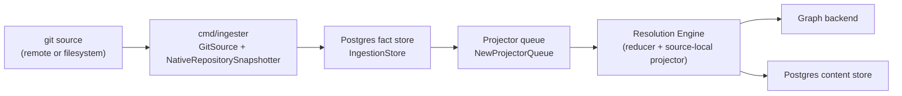
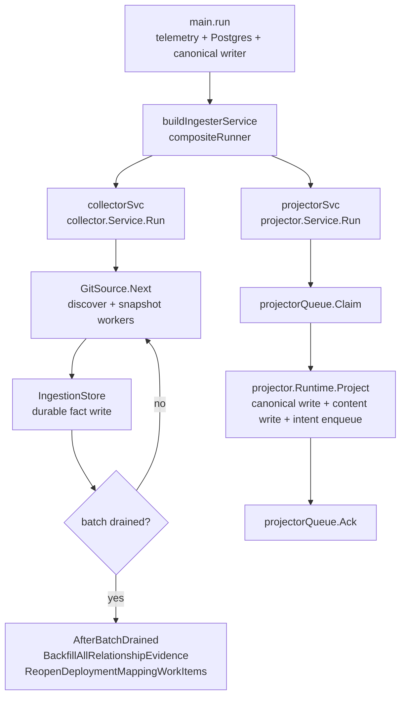

# cmd/ingester

## Purpose

`cmd/ingester` is the long-running binary (`pcg-ingester`) that owns
repository sync, parsing, fact emission, and source-local projection into the
configured graph backend. It runs as a `StatefulSet` in Kubernetes and is the
only runtime that mounts the shared workspace PVC. Cross-domain materialization
belongs to the reducer; HTTP reads belong to the API and MCP server; schema DDL
belongs to `pcg-bootstrap-data-plane`.

## Where this fits in the pipeline

## Internal flow

## Lifecycle / workflow

`main.run` bootstraps OTEL telemetry via `telemetry.NewBootstrap("ingester")`
and `telemetry.NewProviders`, opens Postgres through `runtimecfg.OpenPostgres`,
and builds the canonical graph writer (`sourcecypher.NewCanonicalNodeWriter`
backed by the adapter selected via `PCG_GRAPH_BACKEND`). It then calls
`buildIngesterService`, which returns a `compositeRunner` that runs
`collector.Service` and `projector.Service` concurrently. The first error from
either service cancels the other.

`signal.NotifyContext` on `SIGINT` and `SIGTERM` propagates cancellation through
`compositeRunner.Run`. `app.NewHostedWithStatusServer` mounts `/healthz`,
`/readyz`, `/metrics`, `/admin/status`, and `/admin/recovery` alongside the
composite runner.

After each full collector batch drain, `AfterBatchDrained` calls
`BackfillAllRelationshipEvidence` then `ReopenDeploymentMappingWorkItems`.
These two calls implement the Phase 1 → Phase 3 bootstrap ordering described in
`CLAUDE.md`: backfill populates `relationship_evidence_facts`; reopen
re-triggers `deployment_mapping` so the reducer can produce
`resolved_relationships`. A failure in either call exits the ingester to prevent
partial backfill state.

The projector service runs in the same process and drains the projector queue
filled by the collector. Worker count defaults to `min(NumCPU, 8)`; on
`local_authoritative` + NornicDB it defaults to 1 to prevent write contention.

## Exported surface

`cmd/ingester` is a `main` package. There is no exported Go API. The contract
is the process interface: environment variables, signal handling, direct
`pcg-ingester --version` / `pcg-ingester -v` probes, and the admin HTTP surface
listed above. Version probes run through `buildinfo.PrintVersionFlag` before
telemetry, Postgres, or graph setup begins.

## Environment variables

| Variable | Default | Purpose |
| --- | --- | --- |
| PCG_POSTGRES_DSN | required | Postgres connection string |
| PCG_GRAPH_BACKEND | nornicdb | neo4j or nornicdb |
| NEO4J_URI | required | Bolt URI |
| NEO4J_USERNAME | required | Bolt auth username |
| NEO4J_PASSWORD | required | Bolt auth password |
| PCG_SNAPSHOT_WORKERS | min(NumCPU,8) | Concurrent snapshot goroutines |
| PCG_PARSE_WORKERS | min(NumCPU,8) | Concurrent file-parse workers per snapshot |
| PCG_LARGE_REPO_FILE_THRESHOLD | 1000 | File-count threshold for large-repo semaphore |
| PCG_LARGE_REPO_MAX_CONCURRENT | 2 | Max concurrent large-repo snapshots |
| PCG_PROJECTOR_WORKERS | min(NumCPU,8) | Projector worker count |
| PCG_LARGE_GEN_THRESHOLD | 10000 | Fact-count threshold for large-generation semaphore |
| PCG_LARGE_GEN_MAX_CONCURRENT | 2 | Max concurrent large-generation projections |
| PCG_CANONICAL_WRITE_TIMEOUT | 30s | Graph write timeout |
| PCG_NEO4J_PROFILE_GROUP_STATEMENTS | false | Opt-in Neo4j grouped-write statement attempt logs for performance diagnostics |
| PCG_NORNICDB_CANONICAL_GROUPED_WRITES | false | Enable NornicDB grouped writes (conformance gated) |
| PCG_NORNICDB_PHASE_GROUP_STATEMENTS | 500 | NornicDB phase group statement cap |
| PCG_NORNICDB_ENTITY_BATCH_SIZE | 100 | Entity upsert row cap |
| PCG_QUERY_PROFILE | — | local_lightweight or local_authoritative |
| PCG_DISABLE_NEO4J | — | Force local-lightweight writer when true |
| SCIP_INDEXER | false | Enable external SCIP indexers |
| SCIP_LANGUAGES | python,typescript,go,rust,java | Languages eligible for SCIP indexing |
| PCG_PROJECTOR_RETRY_ONCE_SCOPE_GENERATION | — | Fault-injection: scope generation ID for one-shot retry |

Per-label NornicDB tuning knobs (PCG_NORNICDB_ENTITY_LABEL_BATCH_SIZES,
PCG_NORNICDB_ENTITY_LABEL_PHASE_GROUP_STATEMENTS, and the file/function/struct
batch overrides) are documented in `docs/docs/reference/nornicdb-tuning.md`.

## Dependencies

- `internal/collector` — `collector.Service`, `GitSource`,
  `NativeRepositorySelector`, `NativeRepositorySnapshotter`
- `internal/projector` — `projector.Service`, `projector.Runtime`,
  `projector.CanonicalWriter`, `projector.RetryInjector`
- `internal/storage/postgres` — `IngestionStore`, `NewProjectorQueue`,
  `NewReducerQueue`, `NewFactStore`, `NewContentWriter`, queue observers
- `internal/storage/cypher` — `sourcecypher.NewCanonicalNodeWriter`
- `internal/runtime` — `OpenPostgres`, `LoadGraphBackend`, `OpenNeo4jDriver`,
  `ConfigureMemoryLimit`, `LoadRetryPolicyConfig`
- `internal/app` — `app.NewHostedWithStatusServer`, `app.Runner`
- `internal/telemetry` — bootstrap, providers, instruments
- `internal/recovery` — `recovery.NewHandler` for the `/admin/recovery` route

## Telemetry

The ingester inherits collector and projector telemetry. Key signals:

- `pcg_dp_repo_snapshot_duration_seconds` — per-repo snapshot time; elevated
  values point to large or slow-to-parse repositories
- `pcg_dp_repos_snapshotted_total{status="failed"}` — snapshot errors
- `pcg_dp_facts_emitted_total` vs `pcg_dp_facts_committed_total` — a growing
  gap signals `IngestionStore` write pressure
- `pcg_dp_large_repo_semaphore_wait_seconds` — contention for the large-repo
  semaphore; raise PCG_LARGE_REPO_MAX_CONCURRENT cautiously with memory in view
- `pcg_dp_projections_completed_total{status="failed"}` — projector failures;
  check `failure_class` in structured logs
- `pcg_dp_projector_stage_duration_seconds{stage="canonical_write"}` — graph
  write bottleneck
- Compose metrics endpoint: `http://localhost:19465/metrics`

## Operational notes

- The ingester is the only runtime that should hold the workspace PVC in
  Kubernetes. Do not attach the volume to other workloads.
- Version probes are pre-startup checks. Keep `buildinfo.PrintVersionFlag` at
  the top of `main` so container images can report their build without
  requiring database credentials.
- Align PCG_SNAPSHOT_WORKERS with CPU requests to avoid CPU throttling under
  concurrent parsing load.
- If the projector queue age (`pcg_dp_queue_oldest_age_seconds{queue="projector"}`)
  rises while `pcg_dp_repos_snapshotted_total` grows, the projector cannot drain
  as fast as the collector fills. Check projector worker count and graph write
  latency before raising snapshot workers.
- The `local_lightweight` profile (PCG_QUERY_PROFILE=local_lightweight or
  PCG_DISABLE_NEO4J=true) skips canonical graph writes entirely; useful for
  laptop code-search workflows where the graph backend is not running.
- The recovery route (`/admin/recovery`) mounts only when
  `NewRecoveryHandler` resolves the API key from the environment. A
  missing route means the key is absent, not that recovery is broken.

## Extension points

- Add a new graph backend by adding a `wiring_<backend>_*.go` file following
  the NornicDB pattern and handling the new PCG_GRAPH_BACKEND value in
  `openIngesterCanonicalWriter`. The `compositeRunner` and projector wiring do
  not change.
- PCG_PROJECTOR_RETRY_ONCE_SCOPE_GENERATION wires `NewRetryOnceInjector`
  for bounded fault-injection testing; do not use in production.

## Gotchas / invariants

- `compositeRunner` cancels both services on the first error. A projector
  shutdown logged alongside a collector shutdown does not mean both failed
  independently; check which runner returned the first non-nil error.
- `IngestionStore.SkipRelationshipBackfill = true` suppresses per-commit
  backfill; `AfterBatchDrained` handles backfill after each full drain instead
  (`wiring.go:195-222`).
- NornicDB grouped writes remain disabled by default. Enabling
  PCG_NORNICDB_CANONICAL_GROUPED_WRITES=true requires the fixed rollback binary
  and a full conformance pass before production use.
- PCG_PROJECTOR_WORKERS defaults to 1 when PCG_QUERY_PROFILE=local_authoritative
  and PCG_GRAPH_BACKEND=nornicdb to prevent concurrent write contention on the
  laptop profile (`wiring.go:287-292`).

## Related docs

- `docs/docs/architecture.md` — ingester ownership and pipeline
- `docs/docs/deployment/service-runtimes.md` — StatefulSet shape, metrics port, env vars
- `docs/docs/reference/local-testing.md` — local verification gates
- `docs/docs/reference/telemetry/index.md` — metric and span reference
- `docs/docs/reference/nornicdb-tuning.md` — NornicDB knobs
- `go/internal/collector/README.md` — collector pipeline detail
- `go/internal/projector/README.md` — projector pipeline detail
