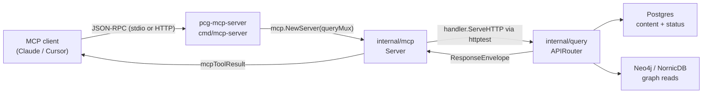
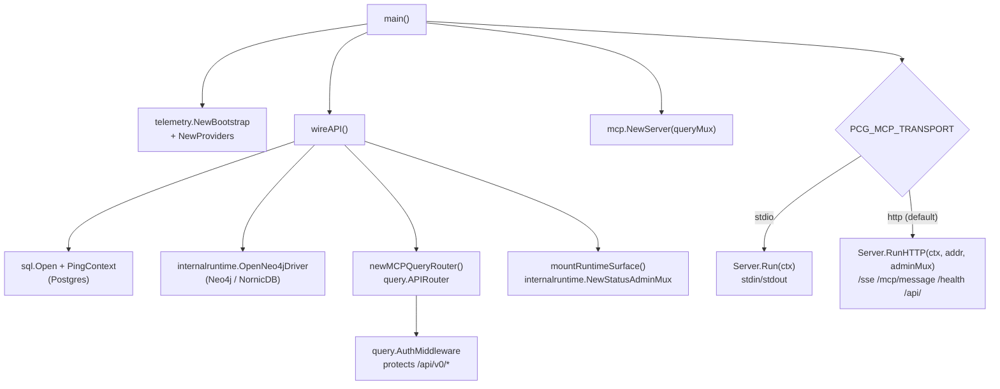

# cmd/mcp-server

`pcg-mcp-server` boots the PCG MCP tool transport over stdio or HTTP. It wires
the same query layer used by `pcg-api` and dispatches MCP tool calls through
`internal/mcp`. In HTTP mode it composes the shared runtime admin surface
alongside the MCP-specific transport endpoints.

## Where this fits in the pipeline

## Internal flow

## Lifecycle

1. `main` calls `telemetry.NewBootstrap("mcp-server")` and initialises OTEL
   providers. On failure it logs with `telemetry.EventAttr` and exits 1.
2. `wireAPI` opens Postgres via `sql.Open("pgx", pgDSN)` and calls
   `PingContext`. If `PCG_QUERY_PROFILE` is not `ProfileLocalLightweight` and
   `PCG_DISABLE_NEO4J` is not `true`, it also dials Neo4j via
   `internalruntime.OpenNeo4jDriver`.
3. `newMCPQueryRouter` wires all ten `query` handlers
   (`RepositoryHandler`, `EntityHandler`, `CodeHandler`, `ContentHandler`,
   `InfraHandler`, `IaCHandler`, `ImpactHandler`, `EvidenceHandler`,
   `StatusHandler`, `CompareHandler`) into a `query.APIRouter` and mounts it.
4. The mounted handler is wrapped by `query.AuthMiddleware`.
5. `mountRuntimeSurface` creates a shared admin mux via
   `internalruntime.NewStatusAdminMux` exposing `/healthz`, `/readyz`,
   `/metrics`, and `/admin/status`.
6. `mcp.NewServer` is called with the authed query handler.
7. Transport selection reads `PCG_MCP_TRANSPORT`:
   - `stdio` — `Server.Run` reads newline-delimited JSON-RPC from stdin;
     no HTTP listener starts.
   - `http` — `Server.RunHTTP` listens on `PCG_MCP_ADDR` (default `:8080`).
8. Shutdown is driven by `signal.NotifyContext` on `SIGINT`/`SIGTERM`.
   Telemetry providers shut down on a fresh `context.Background()` so
   in-flight traces are not cut short.

## Exported surface

This package is a binary entry point; it exports no Go identifiers.
The compile-time interface assertions confirm that `query.Neo4jReader`
satisfies `query.GraphQuery` and `query.ContentReader` satisfies
`query.ContentStore` (`wiring.go:22-23`).

## Configuration

| Variable | Default | Notes |
|---|---|---|
| `PCG_MCP_TRANSPORT` | `http` | `http` or `stdio` |
| `PCG_MCP_ADDR` | `:8080` | HTTP listen address |
| `PCG_POSTGRES_DSN` | — | falls back to `PCG_CONTENT_STORE_DSN` |
| `PCG_GRAPH_BACKEND` | — | parsed by `query.ParseGraphBackend`; defaults to NornicDB |
| `PCG_QUERY_PROFILE` | `production` | `loadQueryProfile` defaults to `query.ProfileProduction` |
| `PCG_DISABLE_NEO4J` | — | `true` skips Neo4j dial |
| `DEFAULT_DATABASE` | `neo4j` | Neo4j database name |

## Telemetry

`telemetry.NewBootstrap("mcp-server")` names the service. Lifecycle events use
`telemetry.EventAttr` with keys `runtime.startup.failed`,
`runtime.shutdown.failed`, `runtime.postgres.connected`, and
`runtime.neo4j.connected`. The admin mux emits the `pcg_runtime_info` gauge.
Per-request metrics and spans come from the `internal/query` handlers that
`internal/mcp` dispatches into — this binary does not emit its own metrics
or spans beyond the startup/connection events.

## Operational notes

- Validation errors (bad API key, bad profile, bad backend) are returned before
  any datastore connection. `wireAPI` calls `loadQueryProfile`,
  `loadGraphBackend`, and `internalruntime.ResolveAPIKey` before opening any
  connection (`wiring.go:32-41`).
- `stdio` mode does not start an HTTP listener. The admin surface (`/healthz`,
  `/readyz`, `/metrics`) is not available in stdio mode.
- The query API mounted under `/api/` is protected by `query.AuthMiddleware`,
  not by the MCP transport auth.
- `loadGraphBackend` with an empty `PCG_GRAPH_BACKEND` defaults to
  `query.GraphBackendNornicDB`.

## Extension points

- Add a new query handler: add it to `newMCPQueryRouter` in `wiring.go` and
  define the matching tool in `internal/mcp/dispatch.go`.
- Add a new transport mode: add a case to the `switch transport` in `main.go`
  and implement a corresponding `Server` method in `internal/mcp/server.go`.

## Gotchas / invariants

- `wireAPI` requires `PCG_POSTGRES_DSN` or `PCG_CONTENT_STORE_DSN` to be
  non-empty; it returns an error before the Neo4j dial if either is missing
  (`wiring.go:55-59`).
- `IaCHandler.Reachability` must be non-nil; `newMCPQueryRouter` always
  sets it to `NewPostgresIaCReachabilityStore` (`wiring.go:146`).

## Related docs

- `docs/docs/deployment/service-runtimes.md` — MCP server runtime lane
- `docs/docs/guides/mcp-guide.md` — client setup and usage
- `docs/docs/deployment/docker-compose.md` — Compose topology
- `go/internal/mcp/README.md` — tool dispatch and MCP protocol implementation
- `go/internal/query/` — HTTP handlers that back every MCP tool call
