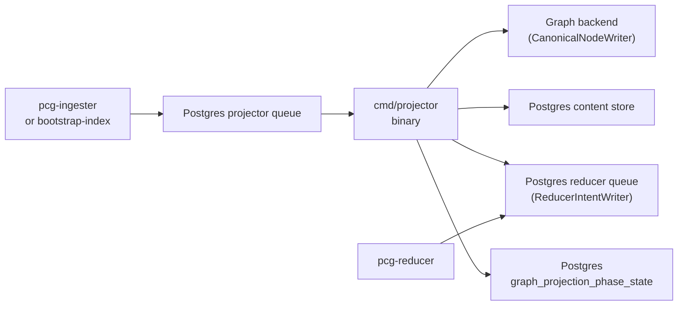
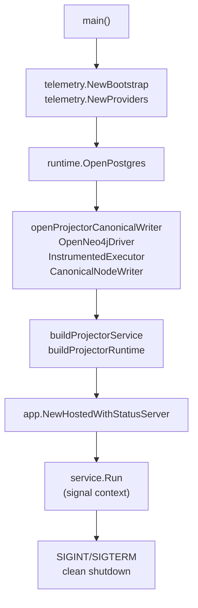

# Projector Binary

## Purpose

`cmd/projector` is the local verification runtime for source-local projection.
It claims projector queue items from Postgres, runs `projector.Runtime` to
write canonical graph nodes and content store rows, and enqueues reducer intents
for shared-domain follow-up. In the full deployed stack this work runs inside
`pcg-ingester`; this binary exists for focused local verification and Compose
debugging.

## Where this fits in the pipeline

## Internal flow

## Lifecycle / workflow

`main` bootstraps OTEL telemetry via `telemetry.NewBootstrap("projector")` and
`telemetry.NewProviders`, then calls `run`. Inside `run`, Postgres is opened
via `runtimecfg.OpenPostgres` and the canonical graph writer is opened via
`openProjectorCanonicalWriter` — this creates a Neo4j session executor wrapped
in `sourcecypher.InstrumentedExecutor` and returns a
`sourcecypher.CanonicalNodeWriter`. `buildProjectorService` wires a
`postgres.ProjectorQueue` as `WorkSource` and `WorkSink`, a
`postgres.FactStore` for fact loading, and `buildProjectorRuntime` for
projection execution. The assembled `projector.Service` is hosted through
`app.NewHostedWithStatusServer` which mounts `/healthz`, `/readyz`, `/metrics`,
and `/admin/status`. A signal-notified context (`SIGINT`/`SIGTERM`) triggers
clean shutdown with a per-ack timeout on in-flight work.

## Exported surface

This package defines `main` only; no exported types or functions. All projection
logic lives in `internal/projector`. Wiring lives in `runtime_wiring.go`.

See `doc.go` for the package comment.

## Dependencies

- `internal/projector` — `projector.Service`, `projector.Runtime`,
  `projector.CanonicalWriter`, `projector.ReducerIntentWriter`; the projection
  engine this binary drives
- `internal/app` — `app.NewHostedWithStatusServer`; hosts the service with the
  shared admin surface
- `internal/runtime` — `runtimecfg.OpenPostgres`, `runtimecfg.OpenNeo4jDriver`,
  `runtimecfg.LoadRetryPolicyConfig`; standard config and connection helpers
- `internal/storage/cypher` — `sourcecypher.InstrumentedExecutor`,
  `sourcecypher.CanonicalNodeWriter`; backend-neutral graph write surface
- `internal/storage/postgres` — `postgres.ProjectorQueue`, `postgres.FactStore`,
  `postgres.NewContentWriter`, `postgres.NewGraphProjectionPhaseStateStore`,
  `postgres.NewGraphProjectionPhaseRepairQueueStore`, `postgres.NewReducerQueue`;
  Postgres-backed implementations of every projector port
- `internal/content` — `content.LoadWriterConfig`; content writer batch-size
  config
- `internal/telemetry` — `telemetry.NewBootstrap`, `telemetry.NewProviders`,
  `telemetry.NewInstruments`; OTEL bootstrap
- `internal/status` — `statuspkg.WithRetryPolicies`, `statuspkg.DefaultRetryPolicies`;
  retry policy wiring for the admin status reader

## Telemetry

OTEL setup uses `telemetry.NewBootstrap("projector")` and `telemetry.NewProviders`.
The Prometheus exporter is always active; OTLP export activates when the
OTEL endpoint env var is set. The canonical writer is wrapped with
`sourcecypher.InstrumentedExecutor` to emit `pcg_dp_neo4j_query_duration_seconds`
spans per Cypher statement. The shared admin surface exposes `/metrics` alongside
`pcg_runtime_*` gauges. Logger scope and component are both `projector`.

All projection-specific metrics and spans (e.g. `pcg_dp_projector_run_duration_seconds`,
`telemetry.SpanProjectorRun`) are emitted by `internal/projector`; see that
package's telemetry section.

## Operational notes

- Run with `go run ./cmd/projector` from `go/` for local verification. Set the
  Postgres DSN via the standard Postgres env contract and the Neo4j vars before
  starting.
- `/admin/status` reports live stage, backlog, and failure state through the
  shared admin contract. Check this before restarting the binary.
- `PCG_NEO4J_BATCH_SIZE` controls how many Cypher statements the canonical node
  writer groups per write round. The default (0) defers to the writer's built-in
  default. Raising this without watching `pcg_dp_canonical_write_duration_seconds`
  can hit Neo4j transaction size limits.
- The projector lease duration for queue claims is one minute
  (`postgres.NewProjectorQueue(database, "projector", time.Minute)`). If
  canonical writes take longer than that without a heartbeat, the work item may
  be re-claimed by another worker. Wire `projector.Service.Heartbeater` and a
  heartbeat interval to prevent this for large repositories.
- Shutdown is signal-driven. In-flight acks use a 5-second timeout via
  `projectorAckContext` in `internal/projector/service.go`; claims in progress
  at shutdown are logged as `shutdown_canceled` and left for re-claim, not
  re-queued by this binary.

## Extension points

- `buildProjectorRuntime` in `runtime_wiring.go` is the single wiring point for
  substituting the canonical writer, content writer, intent writer, phase
  publisher, or repair queue. Add new implementations behind the relevant
  `internal/projector` interface rather than changing the `projector.Runtime`
  struct.
- Retry policy is loaded via `runtimecfg.LoadRetryPolicyConfig(getenv, "PROJECTOR")`
  and threaded through `postgres.ProjectorQueue`; change queue retry behavior
  there, not in the binary's main loop.

## Gotchas / invariants

- Claims go to the `projector` queue; intents go to the `reducer` queue via a
  separate `postgres.NewReducerQueue` handle. The two queue handles have the
  same one-minute lease duration, set in `buildProjectorService`.
- `PCG_PROJECTOR_RETRY_ONCE_SCOPE_GENERATION` is a fault-injection env var, not
  a production retry knob. Leaving it set causes one forced failure per matching
  scope-generation key and should not appear in any non-test deployment.
- The binary does not start the resolution engine or ingester. It only drains
  existing projector queue items and writes graph/content output. Empty queues
  produce no errors; the binary polls indefinitely.

## Related docs

- `docs/docs/deployment/service-runtimes.md` — local verification runtime lanes
- `docs/docs/reference/local-testing.md` — verification gates and test commands
- `go/internal/projector/README.md` — projection logic, telemetry, and invariants
- `go/internal/storage/cypher/README.md` — canonical node writer and executor
  contract
