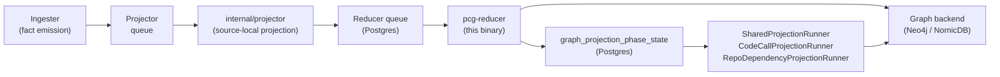
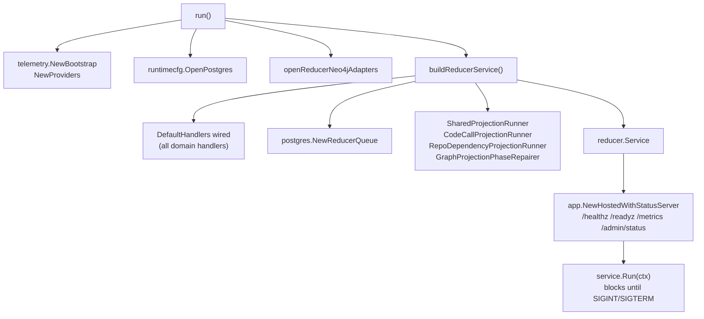

# cmd/reducer

`cmd/reducer` builds the `pcg-reducer` binary — the long-running
`resolution-engine` runtime that drains the reducer fact-work queue,
executes domain handlers, materializes cross-domain truth, and writes
shared edges into the configured graph backend. The deployed service
identity is `resolution-engine`.

## Where this fits in the pipeline

## Internal flow

## Startup sequence

1. `telemetry.NewBootstrap("reducer")` + `telemetry.NewProviders` — OTEL
   logger, tracer, meter, Prometheus handler.
2. `runtimecfg.OpenPostgres` — Postgres connection from PCG_POSTGRES_DSN.
3. `postgres.NewQueueObserverStore` + `telemetry.RegisterObservableGauges`
   — queue-depth observable gauges.
4. `openReducerNeo4jAdapters` — opens graph-backend driver; backend is
   chosen by PCG_GRAPH_BACKEND (default `nornicdb`). Invalid values fail
   at startup.
5. `buildReducerService` — loads all config, wires `DefaultHandlers`,
   `SharedProjectionRunner`, `CodeCallProjectionRunner`,
   `RepoDependencyProjectionRunner`, `GraphProjectionPhaseRepairer`, and
   the `postgres.NewReducerQueue`.
6. `app.NewHostedWithStatusServer` — mounts the shared admin surface.
7. `signal.NotifyContext` for `os.Interrupt` / `syscall.SIGTERM`.
8. `service.Run(ctx)` — blocks until the context is canceled; hosted
   runtime drains in-flight work before returning.

## Configuration reference

All env vars parsed in `config.go` and `neo4j_wiring.go`.

### Queue and retry

| Variable | Default | Purpose |
| --- | --- | --- |
| `PCG_REDUCER_RETRY_DELAY` | `30s` | Delay before a failed intent becomes re-claimable |
| `PCG_REDUCER_MAX_ATTEMPTS` | `5` | Terminal failure threshold |
| `PCG_REDUCER_WORKERS` | `min(NumCPU,8)` NornicDB / `min(NumCPU,4)` Neo4j | Concurrent intent workers |
| `PCG_REDUCER_BATCH_CLAIM_SIZE` | `workers` NornicDB / `workers×4 (max 64)` Neo4j | Items per claim batch |
| `PCG_REDUCER_CLAIM_DOMAIN` | `""` (all domains) | Restrict claims to one `Domain` |

### Claim gating

| Variable | Purpose |
| --- | --- |
| `PCG_QUERY_PROFILE` | With PCG_GRAPH_BACKEND=nornicdb, `local-authoritative` enables the projector drain gate |
| `PCG_REDUCER_EXPECTED_SOURCE_LOCAL_PROJECTORS` | Semantic-entity claims wait until this many source-local projectors have published |
| `PCG_REDUCER_SEMANTIC_ENTITY_CLAIM_LIMIT` | Cap on concurrent semantic-entity claims (default `1` on NornicDB) |

### Shared projection

Parsed by `LoadSharedProjectionConfig` in `internal/reducer`.

| Variable | Default | Purpose |
| --- | --- | --- |
| PCG_SHARED_PROJECTION_PARTITION_COUNT | `8` | Partitions per domain |
| PCG_SHARED_PROJECTION_BATCH_LIMIT | `100` | Intents per batch |
| PCG_SHARED_PROJECTION_POLL_INTERVAL | `500ms` | Base poll interval |
| PCG_SHARED_PROJECTION_LEASE_TTL | `60s` | Partition lease TTL |
| PCG_SHARED_PROJECTION_WORKERS | `min(NumCPU,4)` | Concurrent partition workers |

### Code-call projection

| Variable | Default |
| --- | --- |
| `PCG_CODE_CALL_PROJECTION_POLL_INTERVAL` | `500ms` |
| `PCG_CODE_CALL_PROJECTION_LEASE_TTL` | `60s` |
| `PCG_CODE_CALL_PROJECTION_BATCH_LIMIT` | `100` |
| `PCG_CODE_CALL_PROJECTION_ACCEPTANCE_SCAN_LIMIT` | `250000` |
| `PCG_CODE_CALL_PROJECTION_LEASE_OWNER` | `code-call-projection-runner` |

### Repo-dependency projection

| Variable | Default |
| --- | --- |
| `PCG_REPO_DEPENDENCY_PROJECTION_POLL_INTERVAL` | `500ms` |
| `PCG_REPO_DEPENDENCY_PROJECTION_LEASE_TTL` | `60s` |
| `PCG_REPO_DEPENDENCY_PROJECTION_BATCH_LIMIT` | `100` |

### Edge writers

| Variable | Default | Purpose |
| --- | --- | --- |
| `PCG_CODE_CALL_EDGE_BATCH_SIZE` | `1000` | Code-call edge rows per graph write |
| `PCG_CODE_CALL_EDGE_GROUP_BATCH_SIZE` | `1` | Code-call grouped-write batch |
| `PCG_INHERITANCE_EDGE_GROUP_BATCH_SIZE` | `1` | Inheritance grouped-write batch |
| `PCG_SQL_RELATIONSHIP_EDGE_GROUP_BATCH_SIZE` | `1` | SQL relationship grouped-write batch |

### Repair runner

| Variable | Default |
| --- | --- |
| `PCG_GRAPH_PROJECTION_REPAIR_POLL_INTERVAL` | `1s` |
| `PCG_GRAPH_PROJECTION_REPAIR_BATCH_LIMIT` | `100` |
| `PCG_GRAPH_PROJECTION_REPAIR_RETRY_DELAY` | `1m` |

### NornicDB knobs (narrow seam)

| Variable | Purpose |
| --- | --- |
| `PCG_CANONICAL_WRITE_TIMEOUT` | Per-write timeout for NornicDB canonical writes (default `30s`) |
| `PCG_NORNICDB_CANONICAL_GROUPED_WRITES` | Enable NornicDB semantic grouped writes for conformance testing |
| `PCG_NORNICDB_SEMANTIC_ENTITY_LABEL_BATCH_SIZES` | Override label batch sizes for NornicDB semantic entity writes |

## Exported surface

`buildReducerService` (unexported) returns a `reducer.Service` value. The
binary itself exports nothing; all domain logic is owned by
`internal/reducer`. Wiring-level adapters in `neo4j_wiring.go` expose
unexported executor adapters (`reducerNeo4jExecutor`,
`reducerCypherExecutor`) used only inside this package.

## Dependencies

- `internal/reducer` — `Service`, `DefaultHandlers`, all domain handler
  types, `SharedProjectionRunner`, `CodeCallProjectionRunner`,
  `RepoDependencyProjectionRunner`, `GraphProjectionPhaseRepairer`
- `internal/storage/postgres` — `NewReducerQueue`, `InstrumentedDB`,
  `NewSharedIntentStore`, `NewGraphProjectionPhaseStateStore`,
  `NewGraphProjectionPhaseRepairQueueStore`, all fact/relationship stores
- `internal/storage/cypher` — `InstrumentedExecutor`, `NewEdgeWriter`
- `internal/runtime` — `OpenPostgres`, `LoadGraphBackend`, retry policy
- `internal/query` — `GraphQuery` port, `ParseQueryProfile`
- `internal/app` — `NewHostedWithStatusServer`
- `internal/telemetry` — bootstrap, providers, instruments

Graph writes flow through `storage/cypher.EdgeWriter` and
`storage/cypher.InstrumentedExecutor`, never through a raw driver.

The graph backend is selected via PCG_GRAPH_BACKEND (default `nornicdb`).
Invalid values fail at startup. The Postgres DSN is configured via
PCG_POSTGRES_DSN.

## Telemetry

- Logger scope: `reducer`, component `reducer`.
- Tracer: `providers.TracerProvider.Tracer(telemetry.DefaultSignalName)`.
- Postgres instrumentation: `postgres.InstrumentedDB{StoreName: "reducer"}`.
- Graph instrumentation: `sourcecypher.InstrumentedExecutor`.
- Queue depth: `postgres.NewQueueObserverStore` → `telemetry.RegisterObservableGauges`.
- Admin surface: `/healthz`, `/readyz`, `/metrics`, `/admin/status` via
  `app.NewHostedWithStatusServer`.

## Operational notes

- Scale the `resolution-engine` Deployment when queue age rises and workers
  remain busy. Do not scale it to fix Postgres saturation — fix database
  pressure first.
- In Kubernetes, size the Postgres connection pool to accommodate
  `PCG_REDUCER_WORKERS × replica_count` concurrent connections.
- On NornicDB, raise worker counts only with queue and graph-write
  telemetry in view; long graph writes make lease contention the
  bottleneck before CPU.
- Worker leases renew at `LeaseDuration / 2`; a retry delay shorter than
  the lease TTL causes claims to churn.
- The projector drain gate (PCG_QUERY_PROFILE=local-authoritative +
  PCG_GRAPH_BACKEND=nornicdb) delays semantic-entity claims until
  source-local projectors have finished.

## Gotchas / invariants

- Invalid PCG_GRAPH_BACKEND values fail at startup via
  `runtimecfg.LoadGraphBackend`.
- PCG_NORNICDB_CANONICAL_GROUPED_WRITES=true is only for conformance
  validation; grouped canonical writes on NornicDB are not promoted to
  production default.
- Handler code must not branch on graph backend type directly; backend
  differences belong in `storage/cypher` narrow seams only.
- Handlers depend on `graph_projection_phase_state` rows published by the
  projector; missing phase publications cause edge domains to block.

## Related docs

- [Service runtimes — Resolution Engine](../../../docs/docs/deployment/service-runtimes.md#resolution-engine)
- [NornicDB tuning](../../../docs/docs/reference/nornicdb-tuning.md)
- [Telemetry overview](../../../docs/docs/reference/telemetry/index.md)
- `go/internal/reducer/README.md`
