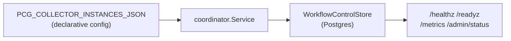
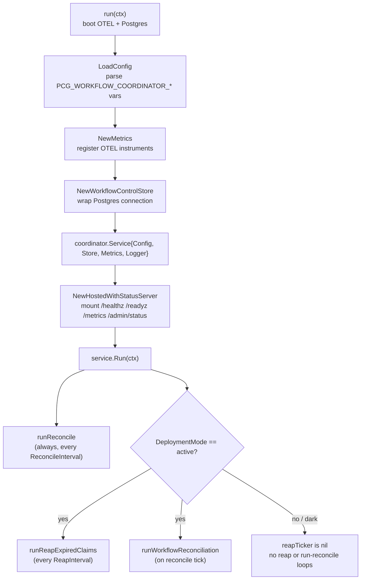

# workflow-coordinator

## Purpose

`pcg-workflow-coordinator` reconciles the declarative set of collector
instances against the durable store and, in active mode, reaps expired
work-item claims and recomputes workflow-run state. It exposes the shared
admin/status contract during its dark rollout so operators can validate the
control plane before active mode is enabled. Trigger normalization and permanent
claim ownership are not part of this binary today; the truth they will
eventually publish is still owned by other components.

## Where this fits in the pipeline

The binary does not touch the canonical graph backend and does not call the
reducer or projector queues directly. Its only durable surface is Postgres via
`NewWorkflowControlStore`.

## Internal flow

## Lifecycle

1. `run` calls `NewBootstrap("workflow-coordinator")` and `NewProviders` to
   bring up OTEL tracing, metrics, and the Prometheus handler.
2. `OpenPostgres(parent, os.Getenv)` opens the Postgres connection using
   the standard Postgres environment variables.
3. `LoadConfig(os.Getenv)` parses all PCG_WORKFLOW_COORDINATOR_* and
   PCG_COLLECTOR_INSTANCES_JSON env vars and validates the resulting `Config`.
4. `NewMetrics` registers OTEL instruments against the
   `pcg_dp_workflow_coordinator_` prefix.
5. `NewWorkflowControlStore` wraps the connection as the `Store`
   implementation.
6. `coordinator.Service` is wired with all four dependencies and handed to
   `NewHostedWithStatusServer`, which mounts the admin surface.
7. `NotifyContext` installs SIGINT/SIGTERM shutdown; `Service.Run` blocks
   until the context is cancelled.

## Configuration

All variables are parsed by `LoadConfig`. See `internal/coordinator/config.go`
for the full list. Key env vars:

- PCG_WORKFLOW_COORDINATOR_DEPLOYMENT_MODE — `dark` (default) or `active`
- PCG_WORKFLOW_COORDINATOR_CLAIMS_ENABLED — must be `true` for active mode;
  default `false`; also accepted as PCG_WORKFLOW_COORDINATOR_ENABLE_CLAIMS
- PCG_WORKFLOW_COORDINATOR_RECONCILE_INTERVAL — collector-instance reconcile
  cadence; default `30s`
- PCG_WORKFLOW_COORDINATOR_REAP_INTERVAL — expired-claim reap cadence
  (active mode only); default `20s`
- PCG_WORKFLOW_COORDINATOR_CLAIM_LEASE_TTL — claim lease TTL; default `60s`
- PCG_WORKFLOW_COORDINATOR_HEARTBEAT_INTERVAL — must be strictly less than
  the lease TTL; default `20s`
- PCG_WORKFLOW_COORDINATOR_EXPIRED_CLAIM_LIMIT — max claims reaped per pass;
  default `100`
- PCG_WORKFLOW_COORDINATOR_EXPIRED_CLAIM_REQUEUE_DELAY — visibility delay
  after reap; default `5s`
- PCG_COLLECTOR_INSTANCES_JSON — JSON array of collector instance objects

Compose exposes the optional metrics port `19469`. Helm keeps deployment mode
`dark` and claims disabled in this branch.

## Exported surface

This binary is a thin wiring layer. Its own identifiers are `main` and `run`
in `main.go`. All coordinator behavior lives in `internal/coordinator` and
`internal/workflow`.

The direct process contract includes `pcg-workflow-coordinator --version` and
`pcg-workflow-coordinator -v`. Both flags print the build-time version through
`buildinfo.PrintVersionFlag` before telemetry or Postgres setup begins.

## Dependencies

- `internal/coordinator` — `Service`, `LoadConfig`, `NewMetrics`, `Store`;
  the coordinator loop and config parsing
- `internal/workflow` — type contracts consumed by `coordinator.Service`
- `internal/storage/postgres` — `NewWorkflowControlStore`, `NewStatusStore`;
  Postgres-backed store implementations
- `internal/app` — `NewHostedWithStatusServer`; hosts the service with the
  shared admin surface
- `internal/runtime` — `OpenPostgres`, `WithPrometheusHandler`; Postgres
  connection and Prometheus handler helpers
- `internal/telemetry` — `NewBootstrap`, `NewProviders`, `NewLogger`;
  OTEL bootstrap

## Telemetry

- OTEL setup: `NewBootstrap("workflow-coordinator")` + `NewProviders`
- Logger scope and component: `workflow-coordinator`
- Domain metrics from `NewMetrics` (see `internal/coordinator/README.md` for
  the full metric list)
- Admin surface: `/healthz`, `/readyz`, `/metrics`, `/admin/status` mounted by
  `NewHostedWithStatusServer`

## Operational notes

- Deployment mode `dark` is the default. The reconcile loop runs; the reap and
  run-reconciliation loops do not. Use the admin surface to confirm the binary
  is live and reconciling before enabling active mode.
- Version probes are pre-startup checks. Keep `buildinfo.PrintVersionFlag` at
  the top of `main` so deployment checks do not need database credentials.
- To enable active mode, set PCG_WORKFLOW_COORDINATOR_DEPLOYMENT_MODE=active,
  PCG_WORKFLOW_COORDINATOR_CLAIMS_ENABLED=true, and supply at least one
  enabled claim-capable collector instance in PCG_COLLECTOR_INSTANCES_JSON.
  `Config.Validate` rejects active mode without these conditions.
- The binary does not reconcile canonical graph truth. It is a control plane on
  top of `pcg-reducer` and `pcg-ingester`.
- Shutdown is signal-driven (SIGINT or SIGTERM). `NewHostedWithStatusServer`
  drains the hosted service cleanly before exit.
- `pcg_dp_workflow_coordinator_collector_instance_drift` rising in Prometheus
  or structured log warnings mean the desired and durable collector-instance
  sets disagree.

## Extension points

- `Store` — the binary wires `NewWorkflowControlStore`; any type implementing
  `coordinator.Store` can be substituted in tests or future backends.
- `Metrics` — `NewMetrics` is the production implementation; a recording stub
  works for unit testing.

## Gotchas / invariants

- Active mode without claims enabled and at least one enabled claim-capable
  collector instance fails `Config.Validate` at startup.
- Heartbeat interval must be strictly less than claim lease TTL; violated
  configurations exit with a validation error.
- The coordinator does not normalize triggers, schedule workflow runs, or
  permanently own claims today.

## Related docs

- [Service runtimes — Workflow Coordinator](../../../docs/docs/deployment/service-runtimes.md#workflow-coordinator)
- [Helm deployment](../../../docs/docs/deployment/helm.md)
- [Docker Compose deployment](../../../docs/docs/deployment/docker-compose.md)
- `internal/coordinator/README.md`
- `internal/workflow/README.md`
