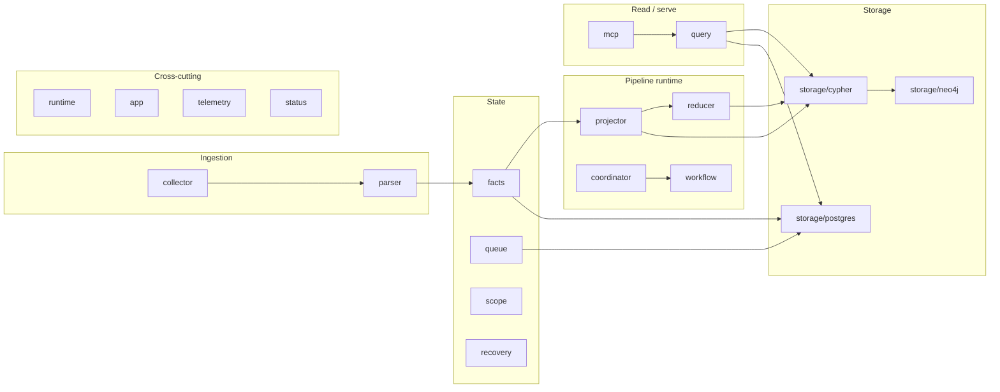

# Internal Packages

Internal packages own PCG runtime behavior behind the command binaries. Keep
package boundaries narrow and document the contract at the package or exported
identifier where another package depends on it.

This directory is a navigation root, not a Go package. Each child has its own
`README.md` (architectural lens), `AGENTS.md` (LLM-assistant guidance), and
`doc.go` (godoc contract). Start there.

## High-level layout

## Where to start by intent

| If you want to ... | Start in |
| --- | --- |
| Understand how a repo becomes graph nodes | `collector/`, `parser/`, `projector/` |
| Diagnose a stuck queue | `queue/`, `recovery/`, `status/` |
| Add a new HTTP endpoint | `query/`, then `cmd/api/` |
| Add a new MCP tool | `mcp/`, then `cmd/mcp-server/` |
| Add a new IaC extractor | `relationships/`, then `correlation/rules/` |
| Add a new metric or span | `telemetry/` (then thread through callers) |
| Tune NornicDB compatibility | `storage/cypher/`, `storage/neo4j/`, plus the relevant ADR |
| Reason about correlation truth | `correlation/`, `correlation/engine/`, `correlation/admission/` |

## Per-package documentation convention

Every Go package directory under `go/internal/` carries three files:

- `doc.go` — the godoc contract (`go doc ./internal/<pkg>` prints it).
- `README.md` — architectural and operational lens for human readers,
  including pipeline-position and internal-flow mermaid diagrams.
- `AGENTS.md` — guidance for LLM assistants editing the package: what to
  read first, invariants with file:line cites, common changes, failure
  modes, anti-patterns, and what NOT to change without an ADR.

Container directories without Go source (this directory, `storage/`,
`terraformschema/schemas/`) keep `README.md` only.

## Dependencies

This directory has no Go source of its own; package-level dependencies are
documented in each child `README.md` and `doc.go`.

## Telemetry

The OTEL contract for every internal package lives in `internal/telemetry`.
Packages that do not emit their own metrics or spans inherit it through the
callers that do. See `go/internal/telemetry/README.md` for the full metric,
span, and log-key catalog.

## Related docs

- `docs/docs/architecture.md`
- `docs/docs/reference/telemetry/index.md`
- `docs/docs/deployment/service-runtimes.md`
