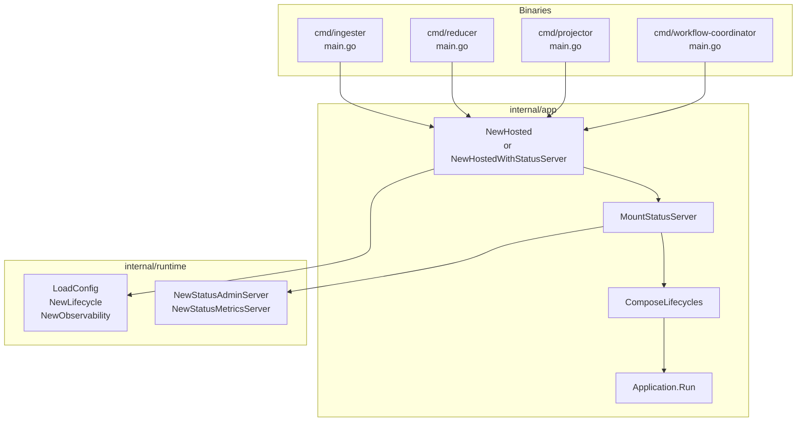
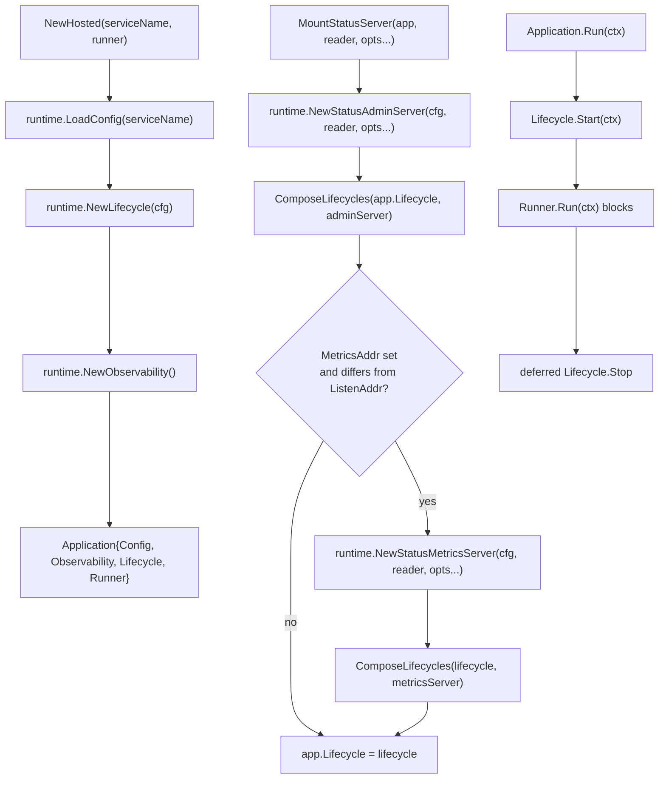

# App

## Purpose

`app` is the thin shell every PCG hosted binary uses to load runtime config,
build lifecycle hooks, and run a `Runner`. It keeps `cmd/*/main.go` short and
uniform across the ingester, reducer, projector, and workflow-coordinator
binaries. Backing config, admin handlers, and metrics endpoints live in
`internal/runtime` and are composed in here, not redefined.

## Where this fits in the pipeline

`Application.Run` is the only public entry point after construction. The
binary's main calls `NewHostedWithStatusServer` (or `NewHosted` +
`MountStatusServer`), then passes the `Application` to service.Run(ctx).

## Internal flow

`ComposeLifecycles` in `lifecycle.go:7` rolls back any successfully started
parts when a later Start call fails, so partial-start resource leaks are
prevented.

## Lifecycle / workflow

`NewHosted` creates an `Application` with a user-supplied `Runner`. When the
runner is the default (runtime.ContextRunner), the binary blocks until the
context is canceled and is otherwise side-effect-free.

`MountStatusServer` composes the admin HTTP server (bound to the address from
runtime.Config.ListenAddr) and, when the metrics address differs, a second
HTTP server (bound to runtime.Config.MetricsAddr) into the application's
`Lifecycle` chain via `ComposeLifecycles`. Both servers are started in order
and stopped in reverse.

`Application.Run` enforces that both `Lifecycle` and `Runner` are non-nil.
If either is nil, it returns an error before calling Start.

## Exported surface

- `Application` — holds `Config runtime.Config`, `Observability
  runtime.Observability`, `Lifecycle Lifecycle`, and `Runner Runner`; call
  `Application.Run(ctx)` to start
- `Lifecycle` — interface: `Start(context.Context) error`,
  `Stop(context.Context) error`
- `Runner` — interface: `Run(context.Context) error`
- `New(serviceName)` — constructs an `Application` with `runtime.ContextRunner`
  as the runner; for binaries with no independent long-running body
- `NewHosted(serviceName, runner)` — constructs an `Application` with the
  supplied `Runner`; calls `runtime.LoadConfig` and `runtime.NewLifecycle`
- `NewHostedWithStatusServer(serviceName, runner, reader, opts...)` —
  combines `NewHosted` and `MountStatusServer` in one constructor; the
  canonical entry point for most binaries
- `ComposeLifecycles(lifecycles ...Lifecycle)` — combines lifecycle hooks into
  one ordered chain; Start rolls back already-started parts on first error;
  Stop runs in reverse order; nil entries are silently dropped
- `MountStatusServer(app, reader, opts...)` — adds
  runtime.NewStatusAdminServer (and optionally runtime.NewStatusMetricsServer)
  to the `Application` lifecycle; returns a new `Application` with the
  updated `Lifecycle`

## Dependencies

| Package | Used for |
| --- | --- |
| `internal/runtime` | `Config`, `Observability`, `NewLifecycle`, `NewStatusAdminServer`, `NewStatusMetricsServer`, `StatusAdminOption` |
| `internal/status` | `statuspkg.Reader` consumed by the status admin surface |

## Telemetry

No metrics, traces, or structured logs are emitted from this package.
Telemetry is owned by the runtime and status servers that this package
composes into the `Application` lifecycle. OTEL Prometheus output reaches
`/metrics` only when the caller passes `runtimecfg.WithPrometheusHandler`
as a `StatusAdminOption`.

## Operational notes

- When `MountStatusServer` is not called (e.g. `New` or `NewHosted` alone),
  the binary has no `/healthz`, `/readyz`, or `/metrics` endpoints. Kubernetes
  liveness/readiness probes will not work. Use `NewHostedWithStatusServer` for
  all long-running services.
- A separate metrics port is only opened when PCG_METRICS_ADDR is set and
  differs from PCG_LISTEN_ADDR. If they are identical (or the metrics
  address is empty), metrics are served on the same HTTP server as the admin
  port.

## Extension points

- `Lifecycle` interface — any struct implementing Start / Stop can be
  composed in via `ComposeLifecycles`; this is how runtime.HTTPServer
  instances are added to the chain
- `Runner` interface — substitute a custom runner in `NewHosted` without
  changing the application shell; useful for tests that need a controlled
  Run body

## Gotchas / invariants

- `Application.Run` requires both `Lifecycle` and `Runner`; either being nil
  is a startup error (`app.go:56–62`).
- `ComposeLifecycles` rolls back already-started parts on first error
  (`lifecycle.go:32–40`), so a failed Start on the second lifecycle does
  not leave the first lifecycle running.
- `MountStatusServer` only adds a separate metrics listener when
  runtime.Config.MetricsAddr is set and differs from runtime.Config.ListenAddr
  (`status_server.go:19`).
- Stop is called via `defer` in `Application.Run` even when `Runner.Run`
  returns an error; cleanup always runs (`app.go:67`).
- `NewHostedWithStatusServer` is not equivalent to `New` + mounting later —
  it calls `NewHosted` first (which validates config and builds lifecycle)
  before attaching the status server.

## Related docs

- `docs/docs/deployment/service-runtimes.md`
- `go/internal/runtime/README.md`
- `docs/docs/reference/local-testing.md`
