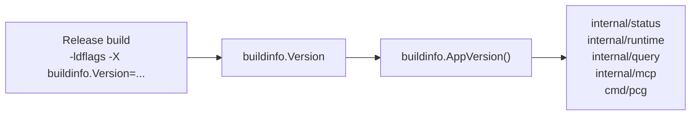

# Buildinfo

## Purpose

`buildinfo` is the single source for the application version string reported
by the API, MCP server, ingester, reducer, CLI root command, and admin
surfaces. All version-bearing code paths call `AppVersion()` from here rather
than keeping local version constants.

## Where this fits

## Ownership boundary

Owns `Version` and `AppVersion`. Nothing else in the codebase may declare its
own version constant. Setting `Version` to anything other than the default
`"dev"` is done exclusively via `-ldflags` at build time.

## Exported surface

- `Version` — package-level `var` defaulting to `"dev"`. Overridden at build
  time via `-ldflags "-X .../buildinfo.Version=<value>"`.
- `AppVersion() string` — trims whitespace from `Version` and returns `"dev"`
  when the result is empty.

See `doc.go` for the godoc contract.

## Dependencies

Standard library only (`strings`). No internal packages.

## Telemetry

None directly. Callers embed `AppVersion()` in their own structured log fields,
metric label sets, and status response payloads.

## Gotchas / invariants

- `Version` must only ever be written via `-ldflags`. Reassigning it in code
  causes the value to diverge from the build artifact and confuses operator
  dashboards.
- An empty or whitespace-only `-ldflags` override collapses to `"dev"`
  (`buildinfo.go:12`). Treat `"dev"` as a non-release source build in
  dashboards and alerts.
- The `ldflags` path is `-X github.com/platformcontext/platform-context-graph/go/internal/buildinfo.Version=<value>`.
  An incorrect module path prefix silently leaves `Version` at `"dev"`.

## Related docs

- `docs/docs/reference/local-testing.md` — build commands
- Dockerfile — release builds inject the version value via `--build-arg`
  passed to `-ldflags`
