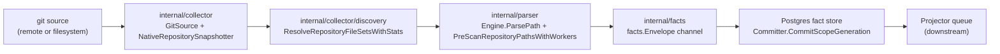
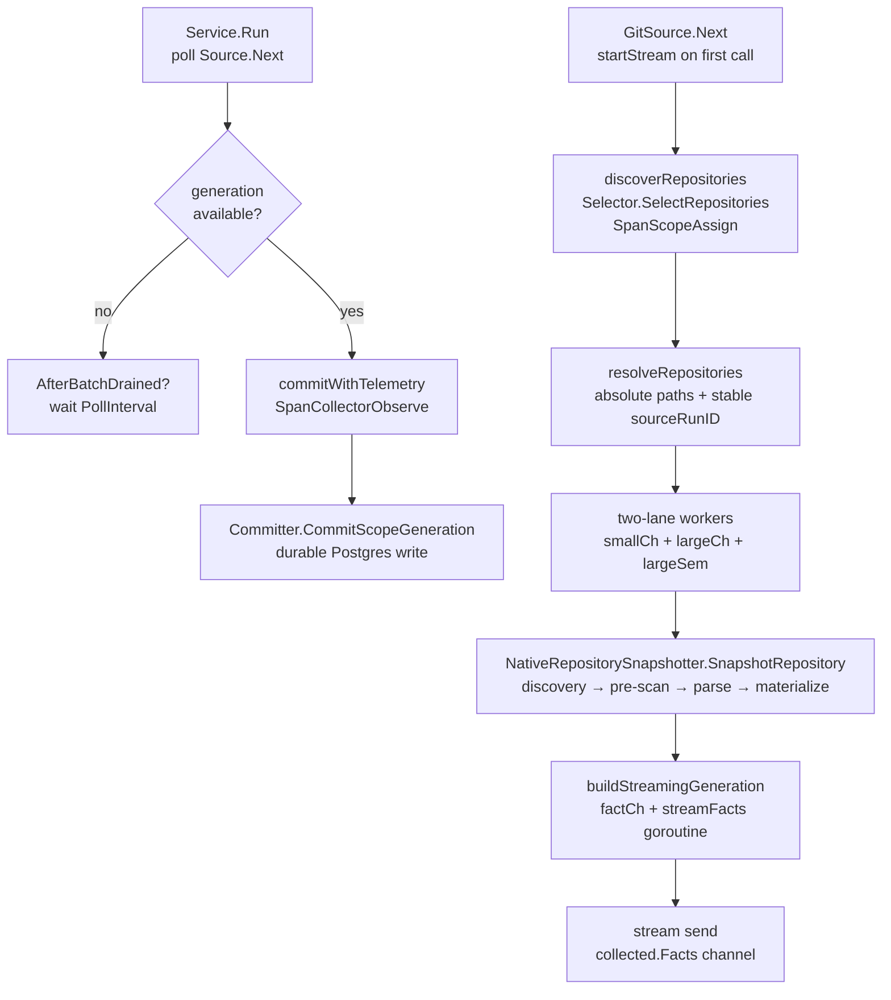

# Collector

## Purpose

`internal/collector` owns git collection, repository discovery, snapshot
capture, and parser input shaping for PCG indexing runs. It turns source
repositories into the inputs required by fact emission: cloned snapshots,
discovery reports, file selections, and entity metadata. It does not make graph
projection or query-time truth decisions — those belong to the projector,
reducer, storage, and query packages.

## Where this fits in the pipeline

## Internal flow

## Lifecycle / workflow

`Service.Run` is the poll-and-dispatch loop. It calls `Source.Next` to receive
one `CollectedGeneration` at a time. When no generation is ready, it calls
`AfterBatchDrained` if at least one generation was committed since the last
drain, then waits `PollInterval` (1 second in `cmd/ingester`). On receipt of a
generation it calls `Committer.CommitScopeGeneration` with the `facts.Envelope`
channel and records `CollectorObserveDuration`, `FactsEmitted`,
`GenerationFactCount`, and `FactsCommitted`.

`GitSource.Next` manages a per-batch streaming lifecycle. On the first call per
batch it launches `startStream`, which:

1. Calls `Selector.SelectRepositories` to discover the current repository list
   (span: `SpanScopeAssign`).
2. Resolves all paths to absolute form and computes a stable `sourceRunID` via
   `facts.StableID`.
3. Classifies repositories into `smallCh` and `largeCh` by file count via
   `isLargeRepository` (skips `.git`, `node_modules`, `vendor`, `.venv`,
   `__pycache__`).
4. Launches `s.SnapshotWorkers` goroutines (default 8). Workers prefer small
   repos; large repos acquire a `largeSem` semaphore (capacity
   `LargeRepoMaxConcurrent`) before snapshotting so at most N large parses run
   concurrently.
5. A coordinator goroutine closes `s.stream` when all workers finish.

Subsequent `Next` calls read one generation from `s.stream`. When the stream
channel closes, `Next` returns `ok=false` and resets for the next discovery
cycle.

`NativeRepositorySnapshotter.SnapshotRepository` runs four sequential stages
per repository:

1. **Discovery** — `resolveNativeSnapshotFileSet` calls
   `discovery.ResolveRepositoryFileSetsWithStats` with repo-local overrides from
   `.pcg/discovery.json` and `.pcg/vendor-roots.json` applied first.
2. **Pre-scan** — `engine.PreScanRepositoryPathsWithWorkers` builds the import
   map concurrently.
3. **Parse** — `buildParsedRepositoryFiles` parses each file through the
   `parser.Engine` worker pool; each parsed file becomes a `map[string]any` entry
   in `snapshot.FileData`.
4. **Materialize** — `shape.Materialize` turns parsed files into
   `ContentFileMeta` records and `ContentEntitySnapshot` rows. Body strings are
   released after materialization; `streamFacts` re-reads them from disk at emit
   time so snapshot memory is `O(single_file)`.

`buildStreamingGeneration` launches a background goroutine that streams
`facts.Envelope` values through a buffered channel (`factStreamBuffer = 500`).

## Exported surface

- `Service` — poll-and-dispatch loop; wire `Source`, `Committer`,
  `PollInterval`, and optionally `AfterBatchDrained`, `Tracer`,
  `Instruments`, `Logger`
- `Source` — interface: `Next(context.Context) (CollectedGeneration, bool, error)`
- `Committer` — interface: `CommitScopeGeneration(ctx, scope, generation, <-chan facts.Envelope) error`
- `CollectedGeneration` — `Scope`, `Generation`, `Facts` channel, `FactCount`,
  optional `DiscoveryAdvisory`
- `GitSource` — implements `Source`; fields include `Selector`,
  `Snapshotter`, `SnapshotWorkers`, `LargeRepoThreshold`,
  `LargeRepoMaxConcurrent`, `StreamBuffer`
- `NativeRepositorySnapshotter` — implements `RepositorySnapshotter`; fields
  include `Engine`, `Registry`, `DiscoveryOptions`, `SCIP`, `ParseWorkers`
- `RepositorySelector` — interface: `SelectRepositories(context.Context) (SelectionBatch, error)`
- `RepositorySnapshotter` — interface: `SnapshotRepository(context.Context, SelectedRepository) (RepositorySnapshot, error)`
- `SelectionBatch` — `ObservedAt` + `[]SelectedRepository`
- `SelectedRepository` — `RepoPath`, `RemoteURL`, `IsDependency`, `DisplayName`,
  `Language`, `FileTargets`
- `RepositorySnapshot` — `RepoPath`, `RemoteURL`, `FileCount`, `ImportsMap`,
  `FileData`, `ContentFileMetas`, `ContentEntities`, `DiscoveryAdvisory`
- `ContentFileSnapshot`, `ContentFileMeta`, `ContentEntitySnapshot` — portable
  file and entity records; `ContentFileMeta` carries no body string
- `RepoSyncConfig` — all env-driven sync configuration; populated by
  `LoadRepoSyncConfig`
- `LoadRepoSyncConfig(component, getenv)` — parses the repo-sync env contract
- `LoadDiscoveryOptionsFromEnv(getenv)` — parses `PCG_DISCOVERY_IGNORED_PATH_GLOBS`
  and `PCG_DISCOVERY_PRESERVED_PATH_GLOBS`
- `LoadSnapshotSCIPConfig(getenv)` — parses the SCIP env contract
- `SnapshotSCIPConfig` — `Enabled`, `Languages`, `Indexer`, `Parser`
- `DiscoveryAdvisoryReport` — operator-facing JSON summary of discovery and
  materialization shape per snapshot run
- `ClaimedService` — wraps `Service` with a `ClaimControlStore` for
  workflow-coordinator-gated collection
- `FactsFromSlice` — test helper: builds a `CollectedGeneration` from a
  pre-built `[]facts.Envelope` slice

## Dependencies

- `internal/collector/discovery` — `ResolveRepositoryFileSetsWithStats`,
  `Options`, `RepoFileSet`, `DiscoveryStats`
- `internal/parser` — `Engine`, `Registry`, `Options`, `DefaultEngine`,
  `DefaultRegistry`, `SCIPIndexer`, `SCIPIndexParser`, `SCIPParseResult`
- `internal/facts` — `facts.Envelope`, `facts.StableID`
- `internal/scope` — `scope.IngestionScope`, `scope.ScopeGeneration`
- `internal/content/shape` — `shape.Materialize`, `shape.Input`
- `internal/repositoryidentity` — `MetadataFor`
- `internal/telemetry` — spans, metrics, structured logging

## Telemetry

- Spans: `SpanCollectorObserve` (`collector.observe`) wraps each commit cycle;
  `SpanCollectorStream` (`collector.stream`) wraps the full stream lifecycle;
  `SpanScopeAssign` (`scope.assign`) wraps repository discovery;
  `SpanFactEmit` (`fact.emit`) wraps per-repo snapshotting
- Metrics: `pcg_dp_collector_observe_duration_seconds`,
  `pcg_dp_scope_assign_duration_seconds`, `pcg_dp_fact_emit_duration_seconds`,
  `pcg_dp_repo_snapshot_duration_seconds`, `pcg_dp_file_parse_duration_seconds`,
  `pcg_dp_repos_snapshotted_total` (labeled `status=succeeded/failed`),
  `pcg_dp_facts_emitted_total`, `pcg_dp_facts_committed_total`,
  `pcg_dp_fact_batches_committed_total`, `pcg_dp_generation_fact_count`,
  `pcg_dp_discovery_files_skipped_total` (labeled `skip_reason`),
  `pcg_dp_large_repo_classifications_total` (labeled `repo_size_tier`),
  `pcg_dp_large_repo_semaphore_wait_seconds`
- Log events: `collector stream started`, `collector snapshot stage completed`
  (stages: `discovery`, `pre_scan`, `parse`, `materialize`), `collector snapshot
  completed`, `collector commit succeeded / failed`, `collector stream completed /
  failed`, `large repository queued`, `large repo semaphore acquired / released`

## Operational notes

- `PCG_SNAPSHOT_WORKERS` (default `min(NumCPU,8)`) controls concurrent
  per-repo snapshotting. Raising this value beyond CPU capacity increases
  context-switching without reducing wall time.
- `PCG_LARGE_REPO_FILE_THRESHOLD` (default `1000`) classifies repositories for
  the large-repo semaphore. The classification is a fast pre-scan that exits
  early once the threshold is exceeded.
- Repo-local `.pcg/discovery.json` and `.pcg/vendor-roots.json` override default
  discovery options before the operator-level `PCG_DISCOVERY_IGNORED_PATH_GLOBS`
  overlay is applied.
- Two-phase streaming: `ContentFileMeta` carries no body; `streamFacts`
  re-reads file bodies from disk at emit time. The OS page cache keeps re-reads
  fast. Do not change this design to in-memory bodies without accounting for
  `O(repo_size)` memory growth on large repositories.

## Extension points

- `RepositorySelector` — replace `NativeRepositorySelector` with any
  implementation to change how repositories are discovered
- `RepositorySnapshotter` — replace `NativeRepositorySnapshotter` with any
  implementation to change how repositories are snapshotted
- `Source` / `Committer` — both are interfaces; test implementations substitute
  recording or controlled-error variants
- `SnapshotSCIPConfig.Indexer` and `.Parser` — injectable seams for testing SCIP
  paths without external binaries

## Gotchas / invariants

- `GitSource.startStream` performs synchronous discovery before launching
  snapshot workers. A slow `Selector.SelectRepositories` (e.g. slow GitHub API
  response) blocks the entire stream start.
- Large-repo semaphore is acquired inside the worker select loop, not inside
  `processRepo`. This means a worker never blocks waiting for the semaphore while
  small repos are available (`git_source.go:419-431`).
- `streamErr` is written by the coordinator goroutine and read by `Next` only
  after the stream channel closes. The happens-before guarantee is that
  `close(s.stream)` happens-before the receive in `Next` that returns
  `ok=false`.
- Absolute paths: `resolveRepositories` calls `filepath.Abs` on every selected
  repo path before building the `sourceRunID` hash. Do not pass relative paths
  to `NativeRepositorySnapshotter.SnapshotRepository` — it calls
  `filepath.Abs` again but the fact IDs would differ.

## Related docs

- `docs/docs/architecture.md` — collector ownership
- `docs/docs/deployment/service-runtimes.md` — concurrency tuning env vars
- `docs/docs/reference/local-testing.md` — local verification gates
- `docs/docs/reference/telemetry/index.md` — metric and span reference
- `go/internal/collector/discovery/README.md` — file enumeration detail
- `go/internal/parser/README.md` — language adapter and registry detail
