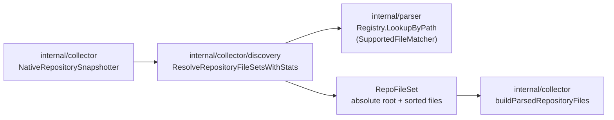
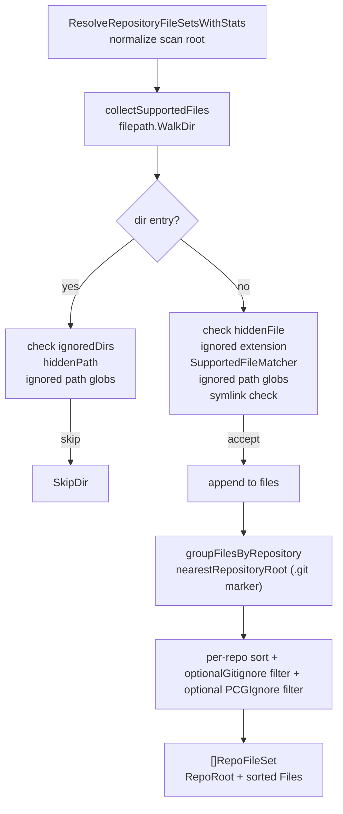

# Collector Discovery

## Purpose

`collector/discovery` resolves the parser-supported files inside a checked-out
repository into stable per-repo file sets. Each `RepoFileSet` carries an
absolute `RepoRoot` and a sorted slice of absolute file paths, so callers do
not have to re-resolve relative paths against the snapshot root. The git
collector calls discovery once per snapshot to decide which files to feed the
parser registry.

## Where this fits in the pipeline

## Internal flow

## Lifecycle / workflow

`ResolveRepositoryFileSetsWithStats` normalizes the scan root (absolute path
plus `filepath.EvalSymlinks`), then calls `collectSupportedFiles` which walks
the directory tree. For each directory entry the walker:

1. Prunes ignored directories (`IgnoredDirs`, `.hidden` when `IgnoreHidden=true`,
   and `IgnoredPathGlobs` subtree rules).
2. Skips hidden files when `IgnoreHidden=true` unless the path matches a
   `PreservedHiddenPrefixes` entry.
3. Skips files whose extension matches `IgnoredExtensions`.
4. Calls `SupportedFileMatcher` — the caller-supplied predicate backed by
   `parser.Registry.LookupByPath`. Files no parser claims are silently dropped.
5. Applies `IgnoredPathGlobs` file-level rules (operator and repo-local).
6. Skips symlinks that resolve outside the scan root via `isExternalSymlink`.

After collection, `groupFilesByRepository` walks parent directories up from
each file looking for a `.git` marker (directory, regular file, or symlink).
Results are cached per-directory so repeated lookups are constant time. Files
without a `.git` ancestor are grouped under the scan root.

Per repo, files are sorted with `sort.Strings`, then optionally filtered by
`.gitignore` rules (`HonorGitignore=true`) and `.pcgignore` rules
(`HonorPCGIgnore=true`). The filtered sorted slice is placed in
`RepoFileSet.Files`.

## Exported surface

- `Options` — discovery inputs: `IgnoredDirs`, `IgnoredExtensions`,
  `IgnoreHidden`, `PreservedHiddenPrefixes`, `HonorGitignore`, `HonorPCGIgnore`,
  `IgnoredPathGlobs`, `PreservedPathGlobs`
- `PathGlobRule` — `Pattern` + `Reason` string for operator-facing skip
  reporting
- `RepoFileSet` — `RepoRoot` (absolute) + `Files` (absolute, sorted)
- `DiscoveryStats` — per-run counters: `DirsSkippedByName`,
  `FilesSkippedByExtension`, `FilesSkippedByContent`, `DirsSkippedByUser`,
  `FilesSkippedByUser`, `FilesSkippedHidden`, `FilesSkippedGitignore`,
  `FilesSkippedPCGIgnore`; aggregated via `TotalDirsSkipped()` and
  `TotalFilesSkipped()`
- `SupportedFileMatcher` — `func(path string) bool`; the parser registry
  supplies this so discovery skips files no parser claims
- `ResolveRepositoryFileSets(root, SupportedFileMatcher, Options) ([]RepoFileSet, error)`
  — entry point for callers that do not need statistics
- `ResolveRepositoryFileSetsWithStats(root, SupportedFileMatcher, Options) (DiscoveryStats, []RepoFileSet, error)`
  — entry point used by the collector snapshotter; returned stats are
  surfaced via the discovery advisory report and `pcg index --discovery-report`

## Dependencies

- Standard library `io/fs`, `path/filepath`, `os`
- `internal/collector` consumes `RepoFileSet` outputs
- `internal/parser` supplies `SupportedFileMatcher` via
  `parser.Registry.LookupByPath`

## Telemetry

Discovery does not emit metrics or spans of its own. Counters surface through
the returned `DiscoveryStats` and are recorded by the collector snapshotter
via the `telemetry.DiscoveryFilesSkipped` instrument (metric:
`pcg_dp_discovery_files_skipped_total`, labeled `skip_reason`). The advisory
report built from `DiscoveryStats` is available via
`pcg index --discovery-report`.

## Operational notes

- `RepoRoot` and all `Files` paths are absolute. Downstream stages that need
  repo-root-relative paths must rebase using `filepath.Rel(RepoRoot, file)`.
- `Files` is sorted with `sort.Strings`. Downstream stages can rely on stable
  ordering across snapshot runs for the same repository state.
- Gitignore handling is intentionally conservative: when a `.gitignore` rule is
  ambiguous, discovery includes the file. Downstream parsers reject what they
  cannot handle.
- `.pcgignore` filtering is applied after `.gitignore` filtering when both are
  enabled.
- Repo-local overrides live in `.pcg/discovery.json` and `.pcg/vendor-roots.json`
  in the collector, not in this package. Discovery applies `IgnoredPathGlobs`
  and `PreservedPathGlobs` from `Options` regardless of their origin.
- Per-operator overlays (PCG_DISCOVERY_IGNORED_PATH_GLOBS,
  PCG_DISCOVERY_PRESERVED_PATH_GLOBS) are loaded by the collector's
  discovery env loader and merged into `Options` before the discovery call.

## Extension points

- `SupportedFileMatcher` — replace with any predicate to change which files
  discovery accepts. The registry-backed matcher is the production default.
- `Options.IgnoredPathGlobs` and `Options.PreservedPathGlobs` — the primary
  operator-facing extensibility seam for excluding or preserving repo subtrees.

## Gotchas / invariants

- `nearestRepositoryRoot` walks up the directory tree for every file and caches
  results. Files in deeply nested repos with many siblings produce `O(depth)`
  stat calls on first encounter; repeated encounters hit the cache.
- `isExternalSymlink` skips symlinks that resolve outside `scanRoot`. This
  prevents accidental traversal of system paths through symlinked directories
  inside a repo.
- `HonorGitignore` and `HonorPCGIgnore` are applied after `sort.Strings`. The
  sort is stable; filter operations do not re-sort. The caller receives an
  already-sorted slice.
- If `SupportedFileMatcher` is `nil`, `ResolveRepositoryFileSetsWithStats`
  returns an error immediately. This is a programmer error, not an operational
  condition.

## Related docs

- `docs/docs/reference/local-testing.md`
- `docs/docs/architecture.md` — collector pipeline section
- `go/internal/collector/README.md` — how discovery fits in the snapshot flow
- `go/internal/parser/README.md` — how `SupportedFileMatcher` is built from
  the parser registry
