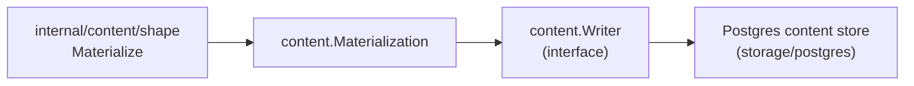

# Content

## Purpose

`content` defines the source-local content write contract used by the projector
and any future write path that persists file bodies and entity rows to Postgres.
It owns the `Writer` port, the value types that flow through that port, the
canonical content-entity identifier, and the runtime tunable for batch width.
The Postgres storage adapter lives in `internal/storage/postgres` and implements
`Writer`; this package has no Postgres dependency.

## Where this fits in the pipeline

The projector calls `content.Writer.Write` with a `Materialization` built by
`internal/content/shape`. The concrete writer (`storage/postgres`) upserts
`content_files` and `content_entities` rows.

## Ownership boundary

This package owns:

- `Writer` — the narrow per-scope-generation write interface
- `Materialization`, `Record`, `EntityRecord`, `Result` — value types
- `CanonicalEntityID` — stable entity hash
- `WriterConfig`, `LoadWriterConfig` — batch-width tunable
- `MemoryWriter` — in-process test double

This package does not own the Postgres schema, SQL, or connection pool.
Those live in `internal/storage/postgres`.

## Exported surface

See `doc.go` for the godoc contract.

Write contract:

- `Writer` — `Write(context.Context, Materialization) (Result, error)`. The
  single interface other packages depend on; implemented by the Postgres content
  adapter.
- `Materialization` — payload for one scope generation: `RepoID`, `ScopeID`,
  `GenerationID`, `SourceSystem`, `Records []Record`, `Entities []EntityRecord`.
  `ScopeGenerationKey()` returns the durable `"scopeID:generationID"` boundary.
- `Record` — one file write candidate: `Path`, `Body`, `Digest`, `Deleted`,
  `Metadata map[string]string`.
- `EntityRecord` — one entity write candidate; carries `EntityID`, `Path`,
  `EntityType`, `EntityName`, line/byte range, `Language`, `ArtifactType`,
  `TemplateDialect`, `IACRelevant`, `SourceCache`, `Metadata`, `Deleted`.
- `Result` — write summary: `ScopeID`, `GenerationID`, `RecordCount`,
  `EntityCount`, `DeletedCount`.
- `MemoryWriter` — accumulates cloned `Materialization` values in `Writes` for
  unit tests and adapters.

Identity:

- `CanonicalEntityID(repoID, relativePath, entityType, entityName string, lineNumber int) string`
  — hashes the five-field key with BLAKE2s and returns `"content-entity:e_<12-hex>"`.

Config:

- `WriterConfig` / `LoadWriterConfig` — reads `ContentEntityBatchSizeEnv`
  (`PCG_CONTENT_ENTITY_BATCH_SIZE`) from the environment; rejects non-positive
  values and values above `MaxContentEntityBatchSize` (4000).

## Dependencies

- `golang.org/x/crypto/blake2s` for `CanonicalEntityID`. No internal-package
  imports; this package is a leaf in the dependency graph.

## Telemetry

None directly. Postgres writer adapters in `internal/storage/postgres` add the
duration histograms and batch-size counters required by the observability
contract.

## Gotchas / invariants

- `CanonicalEntityID` lower-cases `entityType` and trims whitespace from every
  input before hashing. Callers that pre-trim or pre-lower differently will
  produce divergent IDs.
- `Clone` methods (`Record.Clone`, `EntityRecord.Clone`, `Materialization.Clone`)
  must be called before retaining inputs across async boundaries. `MemoryWriter`
  always stores a clone, not the raw input.
- `LoadWriterConfig` returns an error when `ContentEntityBatchSizeEnv` is set to
  a non-positive integer or a value above `MaxContentEntityBatchSize` (4000).
  A zero value from the env means "use the adapter default."
- Test files (`postgres_writer_test.go`, `writer_test.go`,
  `writer_config_test.go`) are in `package content_test` — external test
  package. Do not move them to `package content` without re-checking export
  visibility.

## Related docs

- `go/internal/content/shape/README.md` — shaping layer that builds `Materialization`
- `docs/docs/architecture.md` — pipeline and Postgres content store role
- `docs/docs/reference/local-testing.md`
